# Experiment: Cellular Microscopy-Blood Cells

With the High Power RoachScope we can get a closer look at the cells that
compose us.

Time  45 Minutes

Difficulty  Beginner

#### What will you learn?

You will learn how to prepare samples for high powered magnification of cells.
You will use a lancet to safely draw blood from your fingertip in order to
view blood cells under the RoachScope. You will also draw hemolymph from a
cockroach to view. With these observations and introductory materials you will
come to a better understanding of how the circulatory system and your blood
works!

##### Prerequisite Labs

  * [Getting Started with the Roachscope](https://backyardbrains.com/experiments/RoachScopeHighPower)

##### Equipment

[RoachScope](/products/RoachScope)

[Glass Slides](http://www.amazon.com/Blank-Microscope-Slides-Square-
Cover/dp/B002OS6D9I)

[Slide Covers](http://www.amazon.com/Blank-Microscope-Slides-Square-
Cover/dp/B002OS6D9I)

[Toothpick](http://www.amazon.com/Farberware-5080422-Classic-
Toothpicks-300-Count/dp/B005D6G7U8/ref=sr_1_6?ie=UTF8&qid=1397592626&sr=8-6&keywords=toothpick)

[Lancets](http://www.amazon.com/BD-Ultra-Fine-33-Gauge-
Lancets/dp/B0000DD8VM/ref=sr_1_1?ie=UTF8&qid=1399907387&sr=8-1&keywords=lancets)

[Syringe/Hypodermic Needle]()

* * *

## Background

Have you ever heard of something being referred to as a "life blood?" Well
that's because blood is responsible for keeping nearly all of our body's cells
alive and growing! Our blood is made up of four main components: white blood
cells, red blood cells, platelets, and plasma - each of which serve specific
purposes. Before getting into the blood science, however, it is helpful to
learn a bit about circulatory systems! Then, let's take this opportunity to
learn a bit about the Cockroach too!

Humans have a closed circulatory system which delivers oxygen, nutrients,
hormones, and other essentials throughout our body. As its name suggests, a
"closed" system means that all of our blood flows through arteries, veins, and
capillaries. This means that our blood isn't just sloshing around inside of
us, instead, our heart is forcefully pumping blood throughout our blood
vessels. When you suffer from broken blood vessels, such as a cut or scrape,
this is called a hemorrhage. An important ability of our body's blood is its
ability to clot, or to create a blockage that stops the blood from
hemorrhaging, giving the body time to regenerate cells and heal the injury.
You may also hear the circulatory system referred to as the cardiovascular
system. The cardiovascular system is just a more focused term, referring
primarily to the heart (cardio) and blood vessels (vascular).

Now, to the blood! Remember, our blood is made up of four components: red and
white blood cells, platelets, and plasma.

[
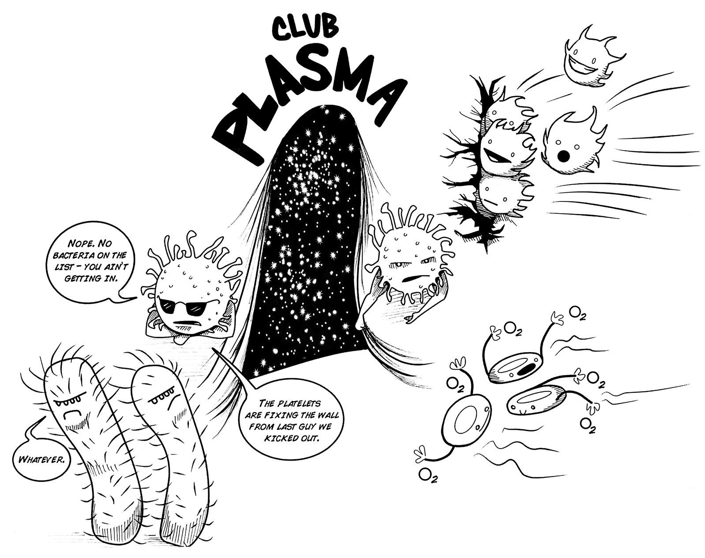](https://backyardbrains.com/experiments/img/plasmaclub.jpg)

**Red blood cells** are responsible for keeping us alive! Our heart pumps our
blood, our lungs oxygenate the red blood cells, and the red blood cells
transfer the oxygen to cell tissues through a process called cellular
respiration. Oxygen is important to us because it allows our cells to
metabolize (transform) nutrients into energy that can fuel our body's movement
and growth.

**White blood cells** are our body's defense system. They are our second line
of defense against illness (the first being the external barriers like skin),
destroying "pathogens" (disease causing material) that can damage us or make
us sick. There are a variety of types of white blood cells in our body which
specialize in targeting different kinds of pathogens. With different
specializations comes different approaches to dispatching the pathogens. White
blood cells can "eat" pathogens (they engulf the pathogen and then use enzymes
to break it down), release antibodies to destroy them, or release antitoxins
to combat the effects of certain pathogens.

**Platelets** are responsible for our blood's ability to clot. Platelets are
tiny cells, about one fifth the diameter of a red blood cell. When you
hemorrhage, they begin sticking together at the site of the damage until they
have created a physical blockade, or a plug, preventing further blood from
escaping. Then, once the damage has been healed up by the body, the clot is
absorbed back into the body.

**Plasma** is the fluid that allows for the movement of cells throughout your
circulatory system. It is mostly water, but also consists of proteins, sugars,
electrolytes, and other essentials. Plasma makes up for a little more than 50%
of your blood, making it the most plentiful component of your blood.

With our other experiments we have learned that cockroaches have a similar
nervous system to humans, but does this hold true with the circulatory system?
Unfortunately, for those of us who like to bask in the magnificence of cross-
species similarities in nature, the cockroach, like all insects, does not have
a circulatory system like ours. Instead, they have an open circulatory system,
with body cavities full of hemolymph (the insect version of blood). You'll be
happy to hear that cockroaches do have a heart and, relatively speaking again,
it is even bigger than our own! The cockroach heart uses 13 chambers, compared
to our four, to pump blood throughout the cockroach's body. Another important
difference is that their hemolymph (blood) serves different functions, most
notably, it is not responsible for carrying oxygen like ours is. Instead of
oxygenating blood with their lungs and then dispersing it throughout the body
like ours, cockroaches "breathe through their skin;" in fact, they don't even
have lungs! Instead, they have a system of tubes, called tracheae, that
deliver oxygen throughout the body. The tracheae are oxygenated through
special pores on the cockroach's skin. This is what allows us to anesthetize
cockroaches for the SpikerBox and RoboRoach experiments in ice water - since
they don't breath like we do, they can't drown by being submerged in water
(they can, however, die if they are completely submerged and are unable to
reoxygenate through their skin over an extended period of time). Hemolymph
also is important for the cockroach's immune system because of cells called
hemocytes. Like white blood cells, hemocytes are responsible for protecting
the roach from pathogens.

For this experiment we will be sampling human and cockroach blood for viewing
under the high powered attachment to the Roachscope.

**Please note:** these preps require the use of needles that are classified as
"sharps" by the FDA (finger lancets and hypodermic needle syringes). These can
be purchased over the counter at most pharmacies. These needles are _SHARP_
and you should exercise extreme care when working with them - never leave them
sitting around without ther protective cover on. When you are ready to dispose
of them, follow [proper sharps disposal
protocol](http://www.fda.gov/MedicalDevices/ProductsandMedicalProcedures/HomeHealthandConsumer/ConsumerProducts/Sharps/ucm263240.htm

). You may also be able to take your sharps in to a local clinic and ask if
they can be disposed of there.

## Procedures

### Prep 1: Human Blood

  1. Begin by preparing your RoachScope for high powered magnification like you did in the [Getting Started with the RoachScope experiment](https://backyardbrains.com/experiments/roachscopehighpower)! 
  2. Prepare your glass slide and slide cover by cleaning them with glass cleaning solution and a special glass cleaning cloth. If you have a camera or wear glasses, you can use the glass cleaning cloth that came with those. Otherwise, you can order special, disposable cleaning paper online - [here is an inexpensive option](http://www.amazon.com/OMAX-Sheets-Microscope-Camera-Cleaning/dp/B00A84NJ1U/ref=sr_1_3?ie=UTF8&qid=1399309334&sr=8-3&keywords=microscope+cleaning+kit)! 
  3. Thoroughly scrub the skin of one fingertip with a cotton swab and rubbing alcohol. 
  4. Open a lancet to expose the sharp point (about 3 mm long). Quickly puncture the cleaned fingertip, put the lancet down, and gently squeeze the finger until a small drop of blood forms on the fingertip. 

[
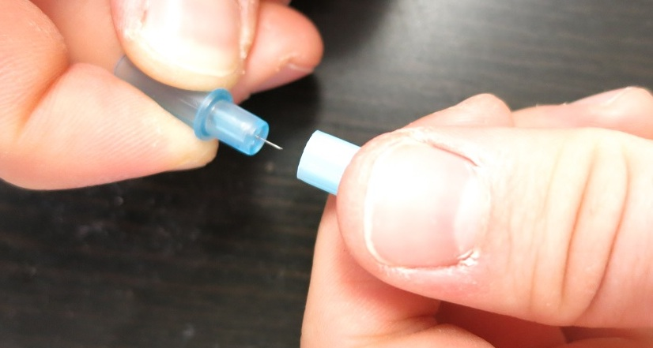](https://backyardbrains.com/experiments/img/blood1_1.jpg)

[
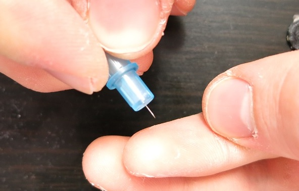](https://backyardbrains.com/experiments/img/blood2_1.jpg)

[
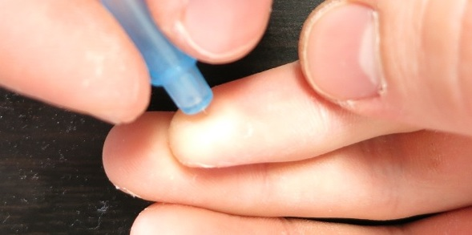](https://backyardbrains.com/experiments/img/blood3_1.jpg)

[
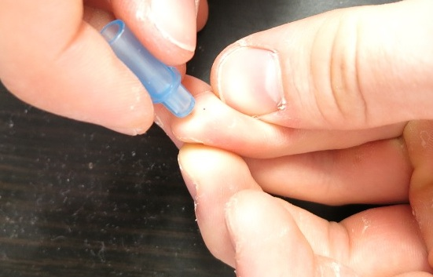](https://backyardbrains.com/experiments/img/blood4_1.jpg)

[
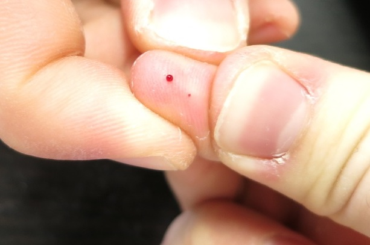](https://backyardbrains.com/experiments/img/blood5_1.jpg)

  5. Place the drop of blood from the finger into the middle of the glass slide and then wipe the fingertip to clean excess blood. (Bleeding should not be a problem, but if it persists, apply pressure with a cotton ball or paper towel until it stops). 

[
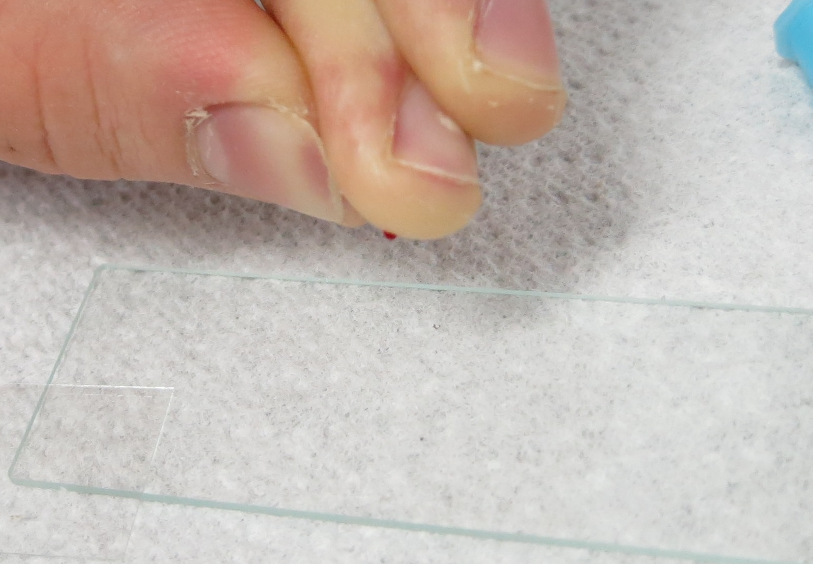](https://backyardbrains.com/experiments/img/blood6.jpg)

[
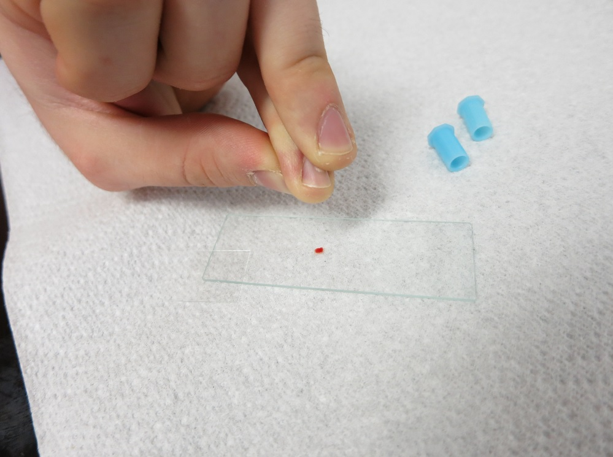](https://backyardbrains.com/experiments/img/blood7.jpg)

  6. Before the droplet begins to dry on the slide, place a coverslip on one edge so that it touches the blood droplet at an acute angle (blood drop inside the sharp angle of cover slip to slide). Smoothly, with a single motion, move the edge of the coverslip away from the blood drop, across the surface of the slide to smear the blood out until it stops flowing (usually the smear is less than one inch long). A sharper angle will produce a thinner smear (this is desirable). Then quickly allow the coverslip to fall flat and stick to the blood smear surface. After it falls, don't move it around, but you might want to tamp the surface slightly with a finger to help remove bubbles. If the smear looks bright red (rather than light pink), there is too much blood, and you will have to start over with a clean slide. Only a very thin smear of blood is needed. 

[
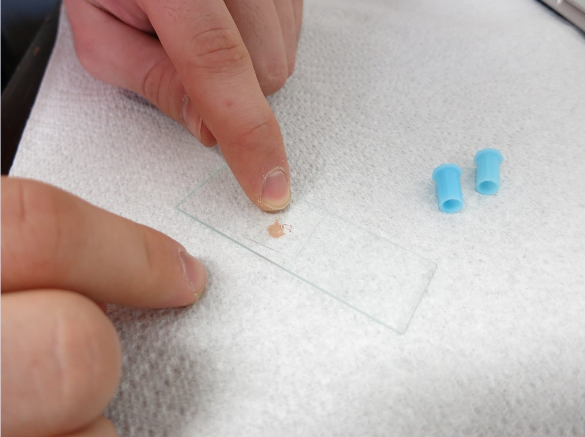](https://backyardbrains.com/experiments/img/blood8.jpg)

  7. Put the covered blood smear on the microscope stage with the cover slip toward the objective lens and focus until blood cells are visible. 

[
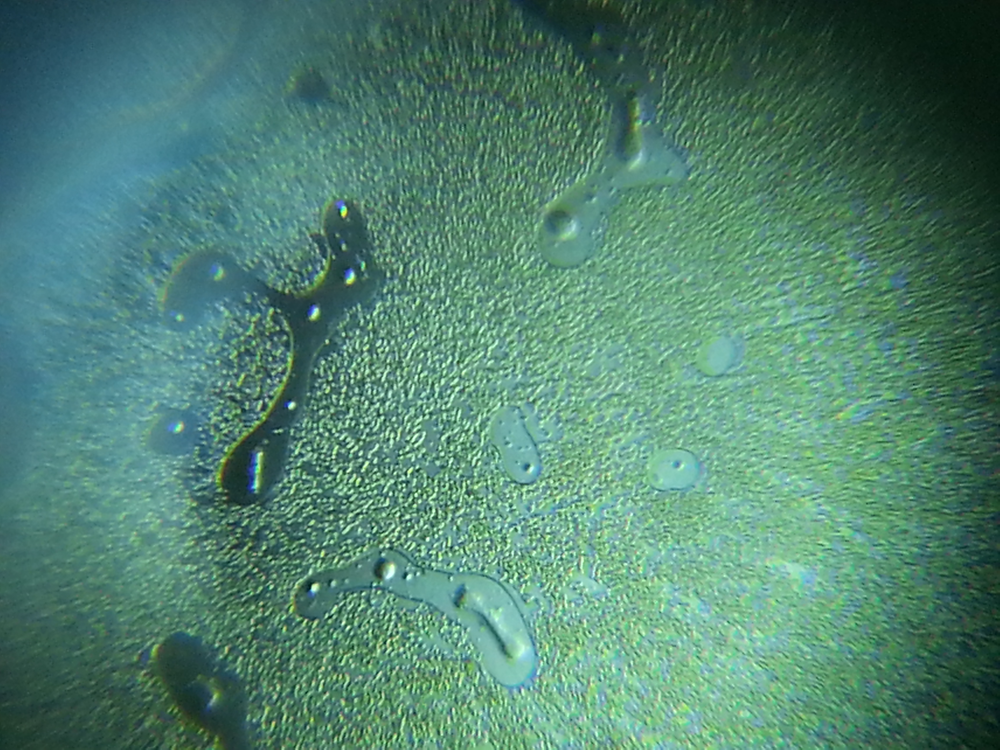](https://backyardbrains.com/experiments/img/bloodcells.jpg)

Red blood cells are by far the most numerous, and are about 0.007mm in
diameter. White blood cells are slightly larger, but are much harder to see
and require a cell stain or oblique illumination (achieved by adjusting the
angle of the light beneath the slide). There is usually only about one white
blood cell for every 1,000 red blood cells. If your smear is freshly prepared,
the cells should be free-floating in plasma under the cover slip and all of
the blood cells will still be alive. To see how the cells travel through the
plasma, take a toothpick and lightly press down against the edge of the
coverslip while you are still viewing the slide under magnification. The force
of the toothpick depression should make the cells flow through the plasma!

### Prep 2: Cockroach Hemolymph

  1. Begin by anesthetizing a cockroach in ice water. Leave it in the ice water until you are ready to perform the procedure. 
  2. Prepare your RoachScope and a clean microscope slide. 
  3. Take the protective ends off of your hypodermic insulin syringes. 
  4. Draw some water up into the syringe. It doesn't have to be a lot, just enough to be visible in the chamber, then press down on the plunger to force it out. **This step is necessary! This helps to just slightly water down the Cockroach blood sample, making it easier to see individual elements** 
  5. _Please note before performing this step: you won't be able to draw much of the Cockroach's hemolymph into the chamber - the sample will be small and will be mostly contained in the tip of the needle._ Insert the needle into the cockroach's ventral abdomen (it's belly) in between the plates of its carapace and then pull up on the plunger just enough that the chamber fills with a bit of air. 

[
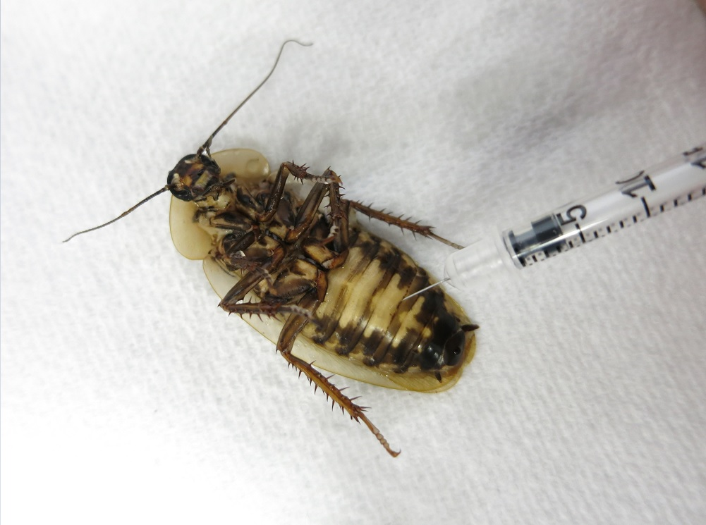](https://backyardbrains.com/experiments/img/hemolymph1.jpg)

[
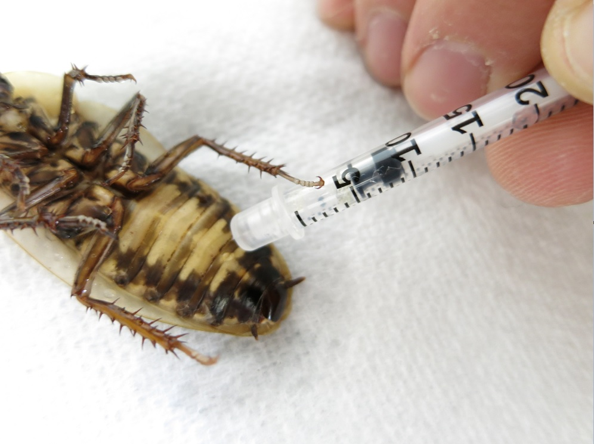](https://backyardbrains.com/experiments/img/hemolymph2.jpg)

  6. Pull the needle out of the cockroach and place it back on ice water. The Roach's work here is done; it will be ready to go back into your breeder colony with just another few minutes on ice! 
  7. Hovering just above the glass slide with your needle, press the plunger of the needle until all the air is forced out of the chamber. Start pressing even harder here and you should see a small bubble of liquid begin to form up and hang from the tip of the needle. Touch this bubble to the glass slide and pull the needle away once the drop is on the slide. **IMMEDIATELY** put the protective cover back on the needle. 

[
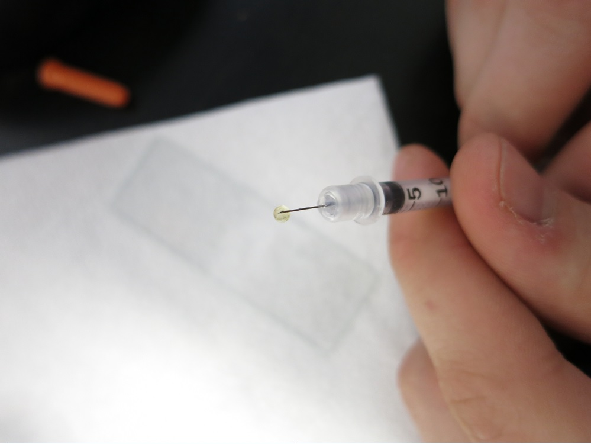](https://backyardbrains.com/experiments/img/hemolymph3.jpg)

  8. Before the droplet begins to dry on the slide, place a coverslip on one edge so that it touches the droplet at an acute angle. Smoothly, with a single motion, move the edge of the coverslip away from the blood drop, across the surface of the slide to smear the hemolymph out until it stops flowing (usually the smear is less than one inch long). A sharper angle will produce a thinner smear (this is desirable). Then quickly allow the coverslip to fall flat and stick to the hemolymph smear surface. 

[
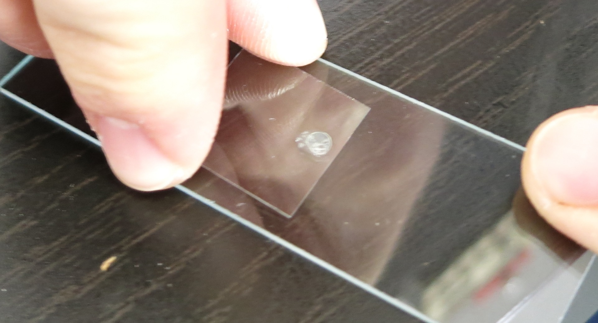](https://backyardbrains.com/experiments/img/hemolymph4.jpg)

  9. Put the covered hemolymph smear on the microscope stage with the cover slip toward the objective lens and focus until cells are visible. 

[
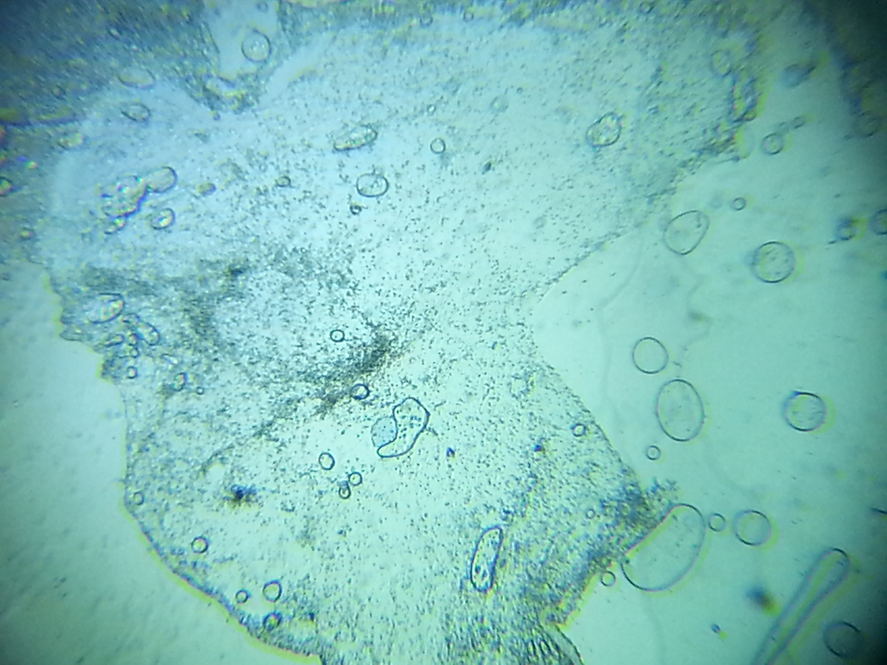](https://backyardbrains.com/experiments/img/hemolymph.jpg)

Since hemolymph doesn't have blood cells like we do, what do you suspect you
are seeing? The largest cells in hemolymph are the hemocytes, the insect
version of white blood cells, but these are difficult to pick out from the
crowd. Hemolymph is not very cellular - the non-uniform particles you are
seeing floating around are bits of protein, wastes, and other "junk". How does
this compare to mammalian blood? What bodily functions are being performed by
the hemolymph that are performed differently by mammals?

Take advantage of your new experience and create your own experiments or new
observational preps! Email us your findings at
[info@backyardbrains.com](mailto:info@backyardbrains.com) and we just might
ask your permission to include it on the website!

Also, a big thank you to Dr. Charlie Taylor of our Education team for his work
in helping develop these preps and write ups!

#### Twitter

#### Recent Posts

  * [ It's The Backyard Brains 10-Year Anniversary!](http://blog.backyardbrains.com/?p=4906)
  * [ Cincinnati Neuroscience Outreach by BYB Alumna](http://blog.backyardbrains.com/?p=4870)
  * [ First Place at Science Fair for Student using BYB Gear](http://blog.backyardbrains.com/?p=4861)

#### BYB Information

  * [Spike Counter](/About/SpikeCounter)
  * [Contact](/About/Contact)
  * [FAQ](/About/FAQ)
  * [Our Finances](/About/Finance)
  * [Privacy Policy](/About/Privacy)

* * *

Copyright © 2009-2017 [ Backyard Brains](http://backyardbrains.com) | Protected under the Creative Common License 