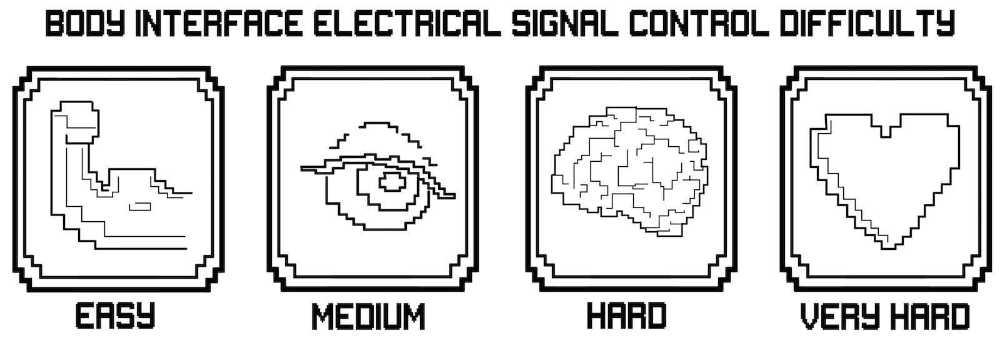
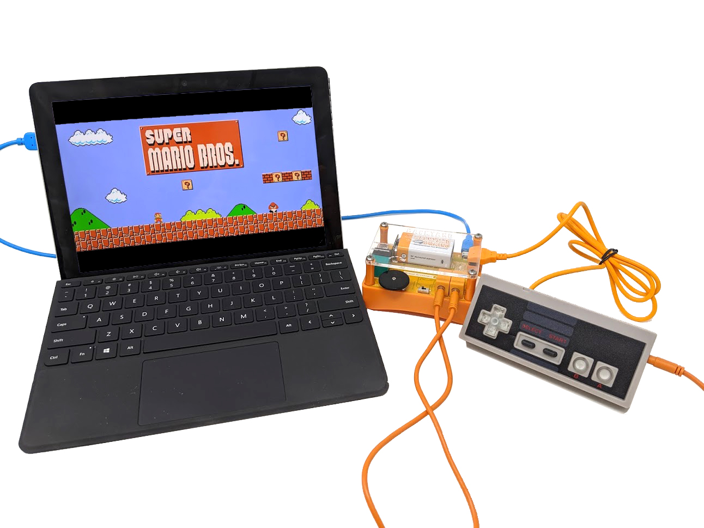
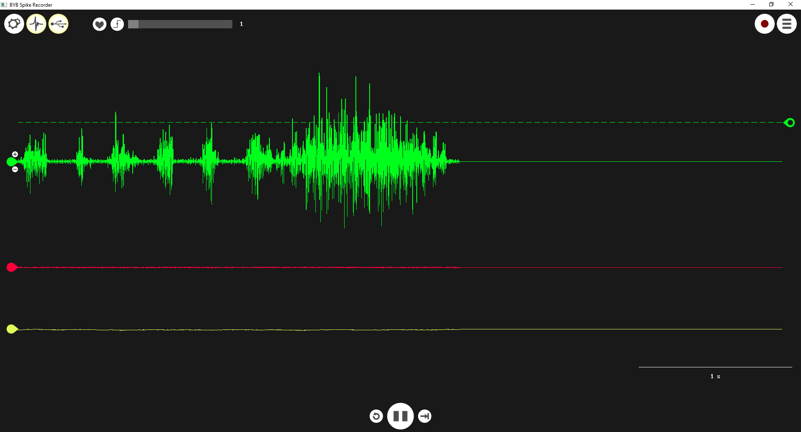
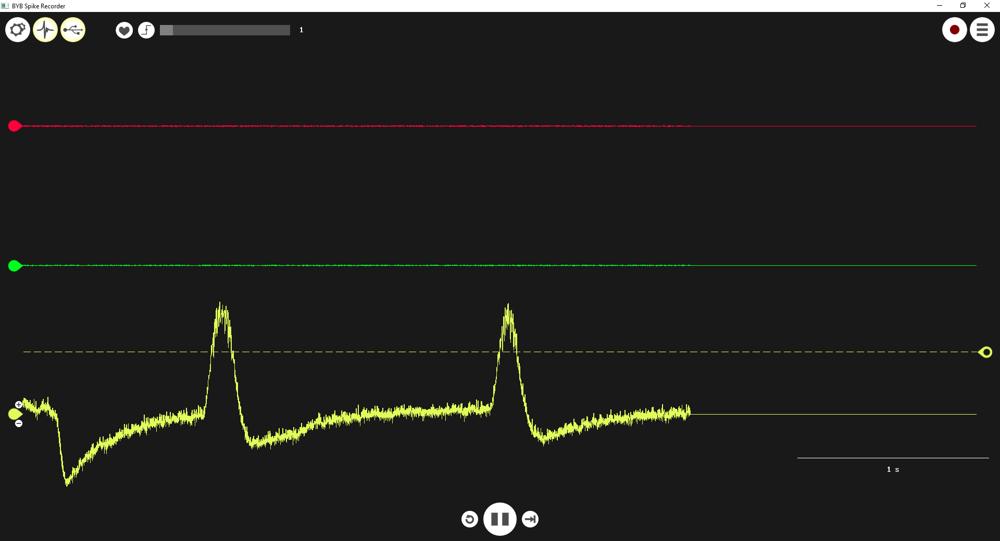
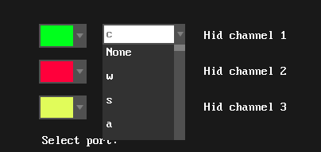
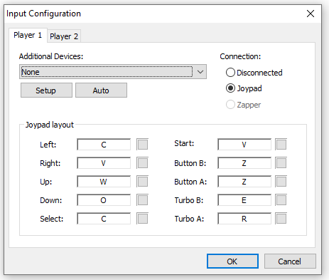

# Experiment: Control Games with your Brain

Video games are a preferred form of entertainment for many. For those who love
interactive stories, challenges, or competitive environments, video games
offer an endless supply of virtual worlds to explore. But, not everyone has
the ability to use a gamecontroller, mouse, or keyboard. With the power of
neuroscience, we will demonstrate a new, novel control scheme which will allow
anyone to play games with muscle contractions and eye blinks! For some, this
is a powerful accessiblity option, for others, it is a novel and exciting way
to play your favorite games.

Time  0.5 hours

Difficulty  Beginner

#### What will you learn?

In this experiment, we will use the Muscle SpikerBox Pro and Game Controller
to create a Brain-Machine Interface and control video games with electrical
signals from your nervous system.

##### Prerequisite Labs

  * [Experiment: Control Machines with Your Brain](https://backyardbrains.com/experiments/muscleSpikerShield) \- This will introduce you to the concept of digitizing body signals for control applications.
  * [Experiment: Eye Potentials (EOG)](https://backyardbrains.com/experiments/EOG) \- This will introduce to the voltage changes you can measure when the eye blinks and moves.

##### Equipment

[Muscle SpikerBox Pro](https://backyardbrains.com/products/MuscleSpikerBoxPro)

[Game Controller](https://backyardbrains.com/products/GameController)

* * *

## Background

When people think "Brain-Machine Interface," often their first thought is
**CYBORG ARM!!** Cyborg arms are cool, and you may have already experimented
with, or built your own, with our previous experiments where we learned how to
control
[claws](https://backyardbrains.com/experiments/MuscleSpikerShield_GripperHand),
[prosthetic hands](https://backyardbrains.com/experiments/diyneuroprosthetic),
and even [other
humans](https://backyardbrains.com/experiments/humanhumaninterface). But,
brain-machine interfaces do not necessarily need to be so complex. A very
effective, but very simple, interface can be created by capturing electrical
signals from our nervous system which we have voluntary control over (muscles
and eyes in particular) and using those signals to trigger actions in computer
software! These simple interfaces have the opportunity to make computer use
accessible to those who can not physical use traditional controllers,
mouse/keyboard, or other mechanical interfaces.

Just like any good game, we can't progress without a hero, a villain, and a
plot... Which nows lead us to a pair of Italian plumbers, with a questionable
apetite for... mushrooms... who battle a turtle Monarch that has kidnapped
their princess... (Video games get a bit weird when you explain them!)

To support Mario on his quest for connecting to a real body, we will control
Mario using electrical signals from the body. The question becomes: which
biosignal to choose? In non-invasive human electrophysiology, we have four
signals we can use: 1) muscles (EMG), 2) the eyes (EOG), 3) the brain (EEG),
and and the heart (EKG).

The easiest to use in interfacing is muscle EMG, as by definition, skeletal
muscles compose the "voluntary movement system" as [we have
shown](https://backyardbrains.com/experiments/muscleSpikerShield) in our
previous projects. Many of our muscles are large and reside directly under the
skin, making their signals easy to record. The second easiest electrical
signal to control is the electrical activity evoked by blinking of the eye,
which we will do here to control Mario. Using blinks to control devices can be
interesting, as blinking happens constantly without you thinking about it
(involuntary control), but you can also decide when to blink (voluntary
control).

The brain (EEG) signal can [be used to control
things](http://www.pnas.org/content/101/51/17849), but is more difficult and
complicated given that the signal is famously weak and noisy. Also, being the
collective electrical activity of large populations of neurons (tens of
billions), the signal is, paradoxically, rather slow for video game
interfaces. We keep trying though. Stay tuned, we currently have a demo
controlling a [pure tone
pitch](https://www.youtube.com/watch?v=uarpHx8JsEQ&feature=youtu.be) and an
[electronic music circuit](http://blog.backyardbrains.com/2017/03/brainding-
project-commences-with-first-working-prototype/), but both these EEG control
algorithms do not read brain state fast enough to reliably control Mario
jumping.

The final signal, the heart EKG, is not an ideal signal for control
applications, as it is not "really" under your voluntary control. You can
indirectly control your heart rate by doing
[exercise](https://backyardbrains.com/experiments/heartrate) (increase your
heart rate), holding your breath/exposing your face to [cold
water](https://backyardbrains.com/experiments/Sympathetic_Nervous_System)
(lowering your heart), or breathing rapidly to [decrease your carbon
dioxide](https://en.wikipedia.org/wiki/Hyperventilation) blood level (increase
your heart rate), but these responses are not fast enough for video game
interfaces where Mario needs to jump at precisely timed moments with sub-
second precision.

With these considerations in mind, we will use eyeblink EOG and forearm muscle
EMG to control Mario jumping in Super Mario Brothers.

#### Downloads

> Before you begin, make sure you have the [Backyard Brains Spike
> Recorder](https://backyardbrains.com/products/spikerecorder) installed on
> your computer. The Backyard Brains Spike Recorder program allows you to
> visualize data on your computer when doing experiments and needs to talk to
> our hardware for our Game Controller to give us control over buttons in the
> game.
>
> To get Super Mario Brothers on your computer, we recommend purchasing a
> digital computer copy of any 2d-Side Scrolling Super Mario Brothers Game, or
> using an emulator like [JNES](http://www.jabosoft.com/categories/1) and a
> ROM for Mario (We don't consider it piracy if you own a physical copy of the
> game!)
>
> Alternatively, you can use this [free online flash player version of Super
> Mario](https://www.gameshaha.net/super-mario-bros/) (which features re-
> programmable inputs!)
>
> [Spike Recorder Computer
> Software](https://backyardbrains.com/products/spikerecorder)

## Experimental Procedure

  1. Plug your Muscle SpikerBox Pro in to your computer or laptop using the USB connection. Plug the Game Controller in to the Muscle SpikerBox Pro. 
  2. Open up SpikeRecorder and connect to your Muscle Pro with the USB icon. 

  3. Open up the settings and make sure the 2nd recording channel is visible by selecting a color for it (red in this example!) 
  4. Hook yourself up! Left forearm to the 1st recording channel, right to the 2nd recording channel. 
  5. For your eyes, place an electrode above and below your favorite eye, and an electrode behind your ear. Clip the red alligator clips to the electrodes by your eye and black to the one behind your ear. The orange cable for the eyeblink recording plugs into the right side of the game controller itself! 

  6. Set your thresholds - click the "threshold icon" (looks like a spike!) and Flex hard and drag the tear-drop marker on the right side of the screen up to set a vertical threshold for the green signal. This means the device will trigger actions whenever your signal meets or exceeds that threhold. 
  7. Do the same for the second muscle channel (red.) 

  8. For your eye-blink, set a threshold that triggers with the peak of your eye blink signals. 

  9. Set your keybinds. In the SpikeRecorder settings, you can change what keyboard keys you want to be trigger by the controller when you flex or blink. 

Make sure these keys correspond to the right controls in your game! For this
example, you can see how we set up the keybindings in the JNES emulator to
allow us to run Mario Right/Left by flexing (keys C and V) and the jump by
blinking (key Z).

  10. Now... Rescue princess peach! 

## Discussion

Having set up and played your first game, what challenges do you see? With
this set up, we are pretty limited in the complexity of games that we can play
- and we certainly won't be winning games of Fortnite like this. Could you
imagine a device which takes in more inputs and gives you greater control over
a more complex game? Also, what other games can you come up with that are easy
to control with this scheme?

## Questions to Consider

The holy grail of interfaces is controlling video games with your brain,
making Mario jump with changes in your EEG. Why do you think this is much
harder to do?