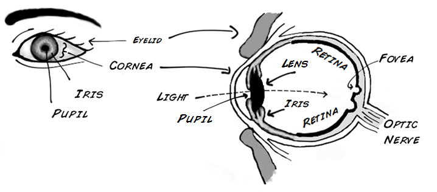
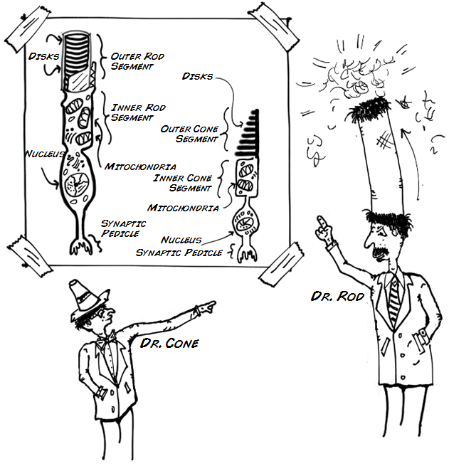
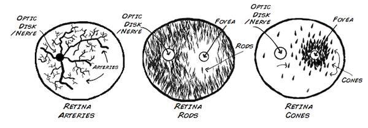
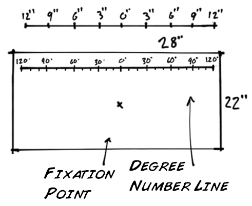
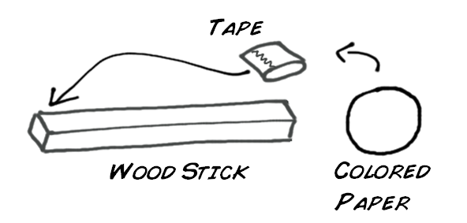
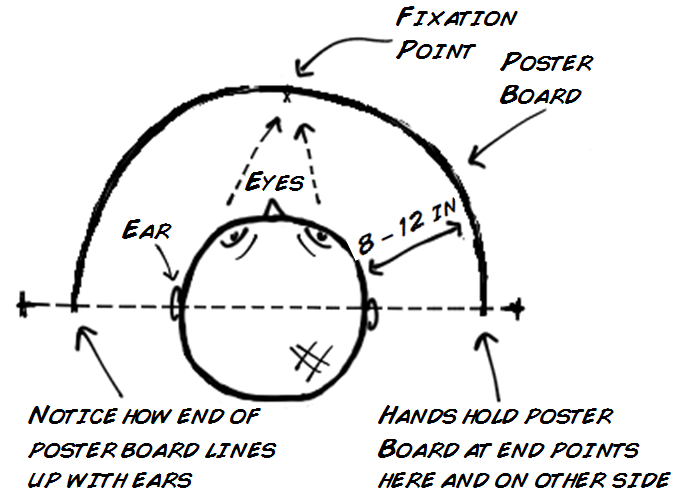
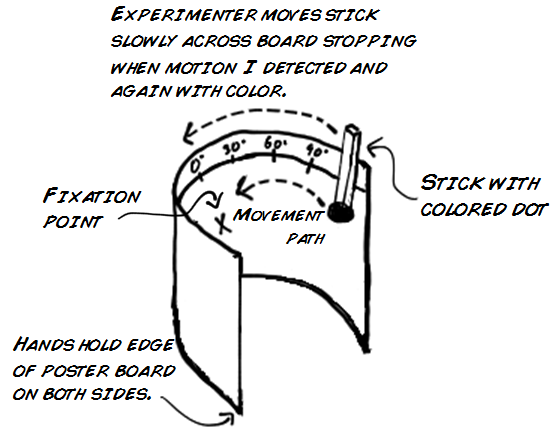

# Experiment: How Your Eye Detects Color and Motion

Everyday your eyes and brain work together to create vision. But how does this
all really happen? What role does your brain and eyes play in the creation of
perceiving everything around you?. How does your visual system render color
and how is motion captured? Follow along in this lesson plan and find out the
answer to some of these questions and many more.

Time  1 hour

Difficulty  Intermediate

#### What will you learn?

In this lesson you will learn how your visual system interacts with your
brain. The experiment will show you how your visual system detects and
interprets motion/color.

##### Prerequisite Labs

  * None 

##### Equipment

[You build everything yourself from household materials.]()

* * *

## Background

Light is the key to vision. The photons emitted from a light source bounce off
of objects and eventually hit you in the eye! When a photon reaches your eye
it passes through the transparent cornea and then through the lens which
refracts and focuses the light onto your retina, where the light is
selectively detected and absorbed by special photoreceptor cells: the rods and
cones. After these photoreceptors transform the light into an electrical
signal, nerves carry the signal into your brain, where some very complicated
and awesome things occur, but we will discuss those in a later experiment.

Where does vision really start? The best answer would be with the
photoreceptors that line your retina, the rods and cones! The retina, making
up the back portion of each eye, is layered with approximately 90 million rods
and 4.5 million cone! They get their names largely from the shape of their
structure, not their discoverers (there is no Dr. Rod and Dr. Cone). However,
Dr. Osterberg in 1935 first counted 120 million rods and 6 million cones, but
in 1990 the number was updated with advances in microscopic computer imaging.

Your rods and cones work well together, and this is good for you. Both have
diverse skills, functions, and placement in the retina. Rods are great at
sensing movement, especially in dim light situations. Unfortunately, they do
not sense color or focus well. Luckily, your cones have high color acuity and
focus very well, especially in bright conditions. Most of your cones are
centered around or in the fovea, which is a small dimple on the center of the
retina. When you focus your eyes, for example reading or performing a science
experiment, light entering your eye is being centered mainly on your fovea.
The fovea consists of roughly thirty thousand specialized cones that are
slightly smaller than other cones. There are also different subtypes of cones:
each tuned to better absorb a different portion of the visible light spectrum:
short wavelength (blue), middle (green), and long (red).

Below are pictures of your retina as if you were standing in front and facing
it. Notice that each picture depicts a different part of your retina. They are
divided in three pictures for ease of viewing, but in reality all three would
overlap. Can you tell which retina is pictured below? Is it your left or right
retina, how can you tell?

The optic disk/nerve has no rods nor cones as it is packed full of nerves
traveling to the brain. The arteries supply fresh blood and nutrients to the
eye. The Fovea has no rods, but it is full of cones.

How do your rods and cones transform light into electrical signals? They use
special proteins called [opsins](http://en.wikipedia.org/wiki/Opsin), which
turn the photons absorbed by the Rods and Cones into specific electrochemical
signals that are then sent to the optic nerve and eventually the brain. This
process is called
[Phototransduction](http://en.wikipedia.org/wiki/Visual_phototransduction) and
human vision has four essential types of opsin: one for rods and three for the
cones. In your photoreceptors (your rods and cones), opsins are coupled with
vitamin A (found in carrots). Vitamin A acts as a light absorbing molecule;
after absorbing light its molecular structure changes and it separates from
the opsin. As this separating occurs, an electrical signal is generated by the
opsin in a very complex biochemical process known as the visual cycle.

Now that you have a foundation in eye anatomy/physiology, you are going to
conduct an experiment with a friend of yours. This experiment will showcase
the different specialties of your photoreceptors as well as their placement
along your retina.

## Materials

#### For this experiment you need:

  1. White Poster board, standard size (28 inches X 22 inches) 
  2. Meter stick (yard stick, 3 foot stick) or 12 inch ruler 
  3. Sharpie pen 
  4. Foot long piece of balsa wood or wood stick 
  5. Tape 
  6. Small coin (nickel size) construction paper cutouts (at least 3 different colors) 

## Procedure

#### Making the Posterboard

  1. Begin by using a pen and ruler to mark the center of the poster board 0 degrees, and do this near the top. Now use the pen to make a small X in the center below the 0 mark, this is your fixation point. 
  2. Draw a line from the 0 degree mark going left and right to the end of the poster board. 
  3. Next, using a ruler, mark 10 degrees then 20 degrees all the way to 120 degrees. Do this both left and right of the 0 degree mark. Make sure you are using a standard poster board (28 inches X 22 inches). That way every 10 degrees = 1 inch, as pictured below.

#### Making the Sticks

  1. Cut out coin (Nickel) sized circles from construction paper, and you want at least 3 colors. 
  2. Use tape and attach one circle to the end of one stick, and do this for all three.

Now that you have materials ready, your group is good to go. One member will
act as the subject and hold the poster board and the other one will record the
data. You will carry out the experiment two times so that each member plays
each role. Below is that chart that you will use for recording:

#### Experiment Steps

  1. The test subject holds the poster board in front of them while bending it around their face, so that the ends meet their ears and rests about a foot away from their face. Your eyes should be level with the fixation point as well. 

  2. The test subject now focuses on the black dot in front of them. 
  3. The experimenter (you) chooses one of the sticks, and you do not tell the test subject what color you chose. Starting at 120 degrees, slowly move the stick towards the 0 degrees center. Stop when the subject notices the stick. Make a mental note of the angle and continue moving the stick until the subject tells you what color they see. Write down both results. 

  4. Repeat for the other left or right side, but make sure you use a different color stick. 
  5. Switch roles and complete the experiment again. Remember the subject should never know what color stick you are using. 

## Questions to Consider

  1. Why should the stick motion be detected long before the color is detected? 
  2. Why do we generally believe that we see color throughout visual field and not just in a small focused area, if in fact we only see color in our central visual field?

#### Twitter

#### Recent Posts

  * [ It's The Backyard Brains 10-Year Anniversary!](http://blog.backyardbrains.com/?p=4906)
  * [ Cincinnati Neuroscience Outreach by BYB Alumna](http://blog.backyardbrains.com/?p=4870)
  * [ First Place at Science Fair for Student using BYB Gear](http://blog.backyardbrains.com/?p=4861)

#### BYB Information

  * [Spike Counter](/About/SpikeCounter)
  * [Contact](/About/Contact)
  * [FAQ](/About/FAQ)
  * [Our Finances](/About/Finance)
  * [Privacy Policy](/About/Privacy)

* * *

Copyright © 2009-2017 [ Backyard Brains](http://backyardbrains.com) | Protected under the Creative Common License 