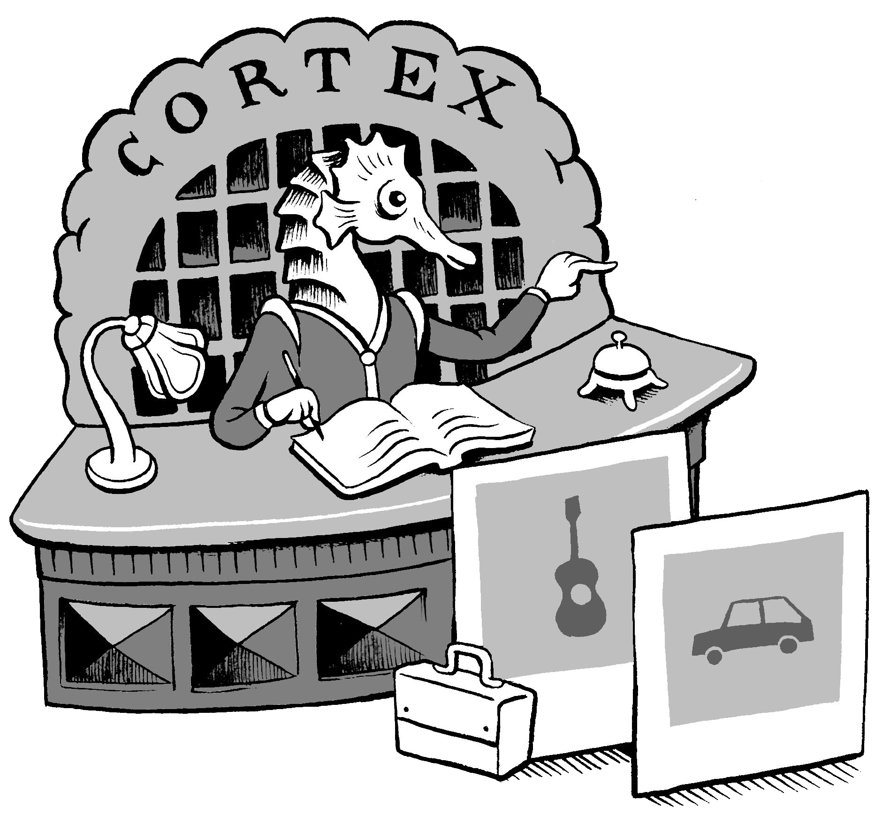
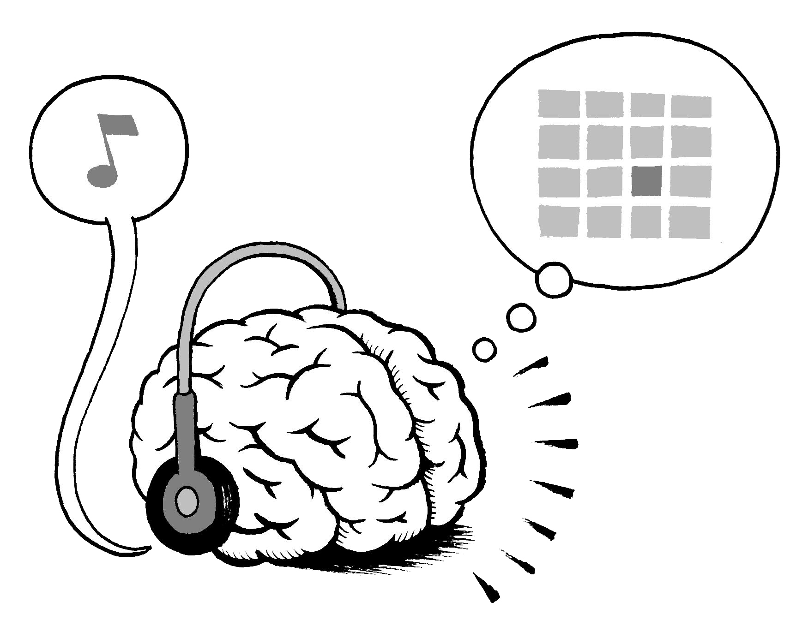
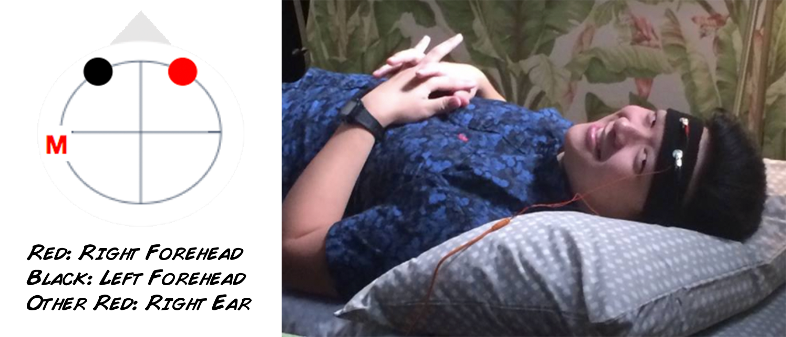

# Experiment: Targeted Memory Reactivation

It can be so hard to remember things! Facts, names, where you placed your
keys. We could all use some help. But could EEG come to the rescue? Maybe! It
turns out that memory, like muscles in our body, can be strengthened and
enhanced. But instead of practicing with flashcards, there might be an
interesting way to hack our memory... while we sleep. This experiment was
prepared by Joud Mar'i, an undergrad from Mount Holyoke College, during our
Summer Fellowship Program.

Time  2 Hours

Difficulty  Advanced

#### What will you learn?

You will learn how to identify different phases of sleep by recording from a
subject's brain while observing EEG signals, and you will learn about memory
consolidation, or the transfer of memories from short to long-term storage.

##### Prerequisite Labs

None

##### Equipment

[Heart and Brain
SpikerBox](https://backyardbrains.com/products/heartAndBrainSpikerBox)

Laptop

[SpikeRecorder](https://backyardbrains.com/products/spikerecorder)

* * *

## Background

Our short-term newly acquired memories get stabilized into long-term ones
through the process of memory consolidation. As our memories are not static,
constant memory storage update is needed. This depends on the "memory
reactivation" of previously learned things... quizzing yourself over and over
before a big exam often helps you remember!

The hippocampus is a seahorse shaped brain structure that helps with the
storing of information from short-term memories to long-term memories. We call
this memory consolidation. Much like a hotel assigning guests to their rooms,
studies have shown that "episodic" memories... meaning memories of times,
places, emotions: the _who, what, when, where, why_ memories are stored into
cortex via the hippocampus. These memories can be retrieved again if enough
associated cues are activated for "recall".

Sleep has an interesting architecture, and is important for memory
consolidation... so be sure to get some sleep before your finals! Our typical
sleep cycle can be 8 to 9 hours long, and is divided mainly into two stages:
NREM/early night sleep, and REM/late night sleep. Our brain is still active
during all stages of sleep and engages in cognitive activity, so we never
really lose consciousness completely! When it comes to memory consolidation,
each sleep stage is responsible for a certain type of memory.

Sleep-dependent preferential consolidation is crucial for stabilizing our
episodic memories, and this seems to happen specifically during Slow Wave
Sleep or stage N3 of NREM sleep. It helps strengthen the paired association
tasks like verbal list learning, or spatial recall. Other types of memory like
procedural and emotional can be consolidated in both REM and NREM sleep.

It has been recently shown that such consolidation can be artificially
enhanced using the method of **Targeted Memory Reactivation** (TMR). This
technique can affect the selectivity of memory storage using sound cues
associated with learning. It reactivates relevant neural representations
utilized in learning, that are reflected by certain hippocampal firing
patterns.

This project aims to further explore and create a DIY version of the research
conducted by James W.Antony, Ken Norman, and Ken Paller from Princeton and
Northwestern Universities on this matter. Is it that we remember better or
forget less?

## DIY Neuroscience Episode of Experiment

> [How Sound Can Hack Your Memory While You
> Sleep](https://www.facebook.com/DIYNeuro/videos/234975840406258/)
>
> All you might need to improve your memory is a pair of headphones and a
> comfortable sofa.
>
> Posted by [DIY Neuroscience](https://www.facebook.com/DIYNeuro/) on Monday,
> March 26, 2018

## Materials

For this experiment you will need:

  * [Backyard Brains Heart and Brain SpikerBox](https://backyardbrains.com/products/heartAndBrainSpikerBox)
  * Laptop, phone or tablet for seeing EEGs
  * iPad/ Any Apple device for the memory game
  * [Backyard Brains Spike Recorder](https://backyardbrains.com/products/spikerecorder)
  * Xcode
  * A sleepy subject

## Procedure

Download the software app for Xcode, and install on your iPad: [Available
Here](https://github.com/BackyardBrains/Projects/tree/master/Sleep%20and%20Memory).
We are hoping to release this as an app one day.... Instructions for
installing and running the app can be found in [This
Document](https://docs.google.com/document/d/17ZqScaqQpJggKxGstVt43BhiDLVuuwdlMeZWWjB-
Xck/edit?usp=sharing).

Prep your Subject: Place an electrode patch on the mastoid bone behind the ear
of the subject. Place the headband with its two electrodes centered on the
frontal lobe/forehead of the subject. Place a good amount of gel on each of
the two headband electrodes (the electrode patch already comes with gel).
Connect the electrode cable with its 3 alligator clips as follows:

* Red: Place one of the red alligator clips at the headband electrode furthest from the patch behind the ear.
* Red: Place the other red alligator clip at the electrode patch behind the ear.
* Black: Place the black alligator clip at the headband electrode in-between the two red clips. 

Connect the electrode cable to the Heart and Brain SpikerBox, then connect the
Heart and Brain SpikerBox to your laptop via the USB cable. Load up
SpikeRecorder (on laptops click connect to the USB icon) then turn on the FFT
Button. Start recording the subject's EEG signal.

## Sleep Phase

As the subject starts their 90 minute nap/sleep, you need to detect when they
go into deep sleep/slow wave sleep. You will know once you start spotting
Delta waves in the EEG signal. Delta waves are 0.5 - 4 Hz, and have high
amplitudes around 75 microvolt. They are big, long, tall, and stretched
out/slow which is where this sleep stage gets its name.

When you detect Slow Wave Sleep, wait a few minutes and cue your subject with
the sound! Quietly bring the iPad to the bed. Follow the instructions to get
the app to cue sounds while the subject sleeps. Note you will only be
providing cues for some of the memory tasks, that way after the subject wakes
you can see if the cued vs uncued pictures/locations had better recall - You
can change these variables later

When the subject wakes up, end the recording and save the EEG session. It's
good to ask the person if they heard, saw or felt anything while asleep. If
they answer yes... then they probably weren't in SWS. You can still run the
experiment, but make note of this.

## Post Sleep Phase

After the subject wakes up, they will perform the post-sleep test on the app
(1round), exactly the same as the pre-sleep no feedback test. All data for the
post sleep stage will be taken from here as well.

Once refreshed, have them take the test on the App again. Did their score
improve? You can export the data from the app to run in your favorite analysis
software package of choice.

## Science Fair Project Ideas

  * What would happen if we did multiple cycles of cueing during slow wave sleep? Does the intervals between them matter? 
  * What would happen if we cued the sounds during other stages of sleep? 
  * What would happen if we changed the cueing percentage to 0%, 25%, 75%, or 100%? 
  * How can we use TMR for real life applications? 
  * Does running the experiment during the night yield better results? Will having subjects perform this study before sleeping normally at night give different results than napping in the middle of the day? 
  * How much does surrounding environmental factors affect the performance of the subject like: light, temperature, space, outside noise, etc. 

## References

_Antony, J. W., E. W. Gobel, JK O'Hare, P. J. Reber, and K. A. Paller. 2012.
Cued memory reactivation during sleep influences skill learning. Vol. 15._

_Oudiette, D., J. W. Antony, J. D. Creery, and K. A. Paller. 2013. The role of
memory reactivation during wakefulness and sleep in determining which memories
endure. Vol. 33._

_Oudiette, Delphine, James W. Antony, and Ken A. Paller. 2014. Spotlight: Fear
not: Manipulating sleep might help you forget. Trends in Cognitive Sciences 18
: 3-4._

_Rudoy, John D., Joel L. Voss, Carmen E. Westerberg, and Ken A. Paller. 2009.
Strengthening individual memories by reactivating them during sleep.
Science(5956): 1079._