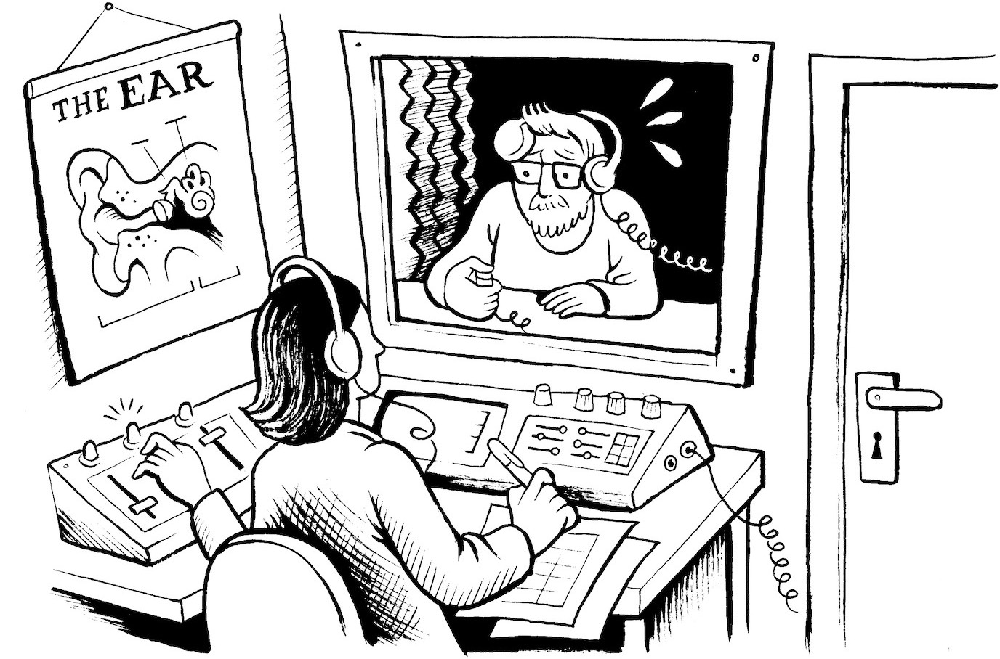
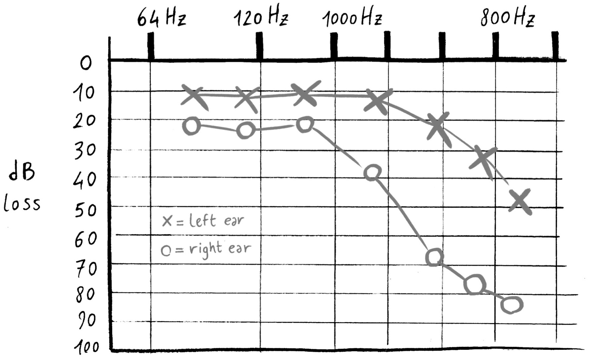
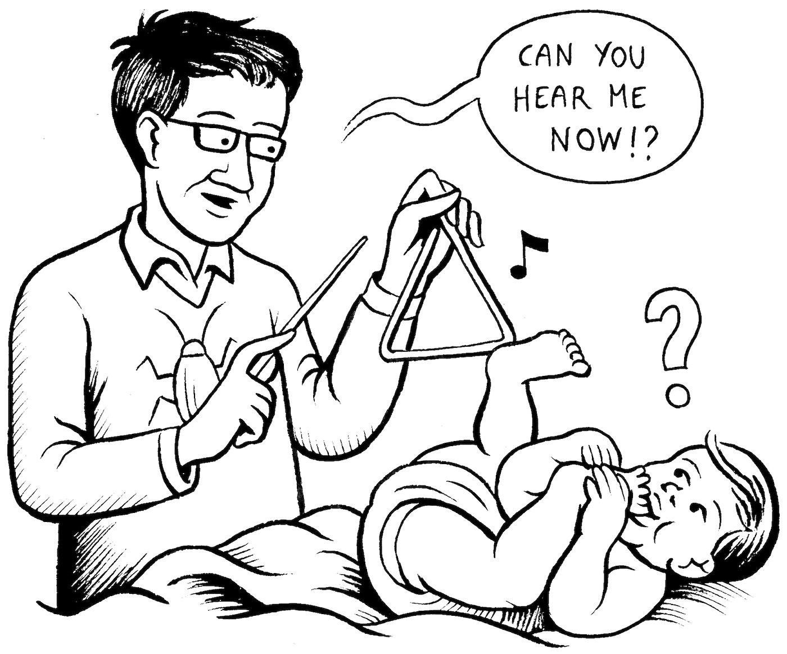
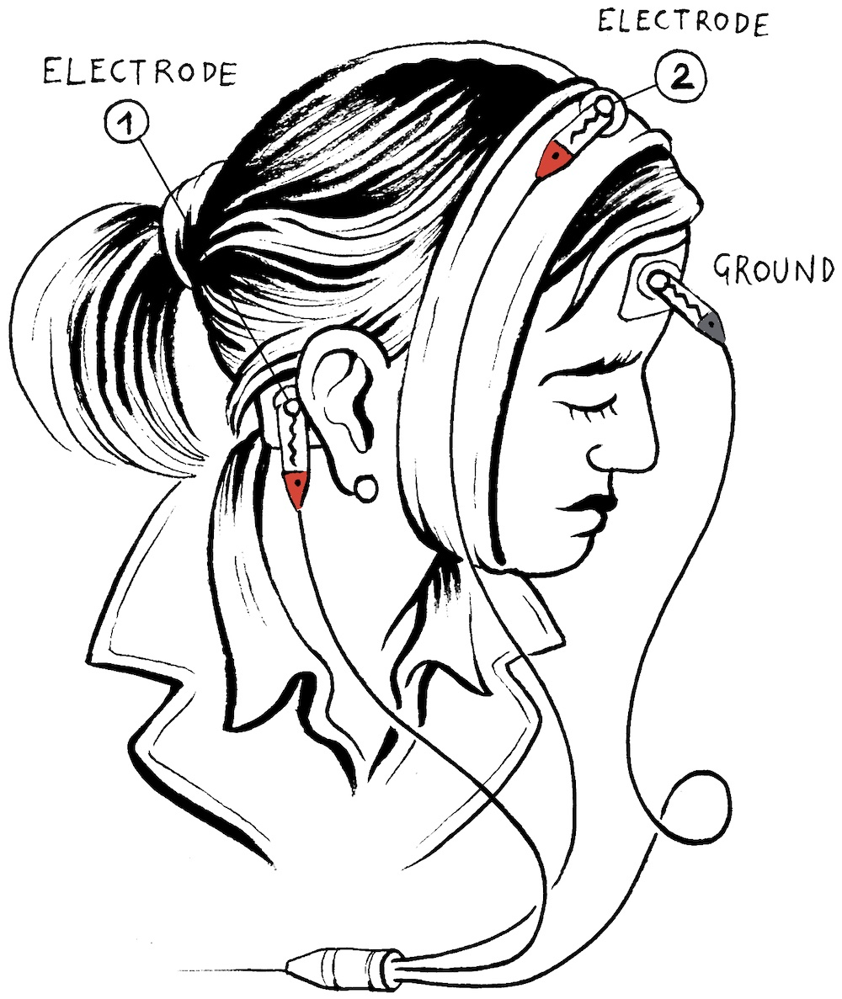
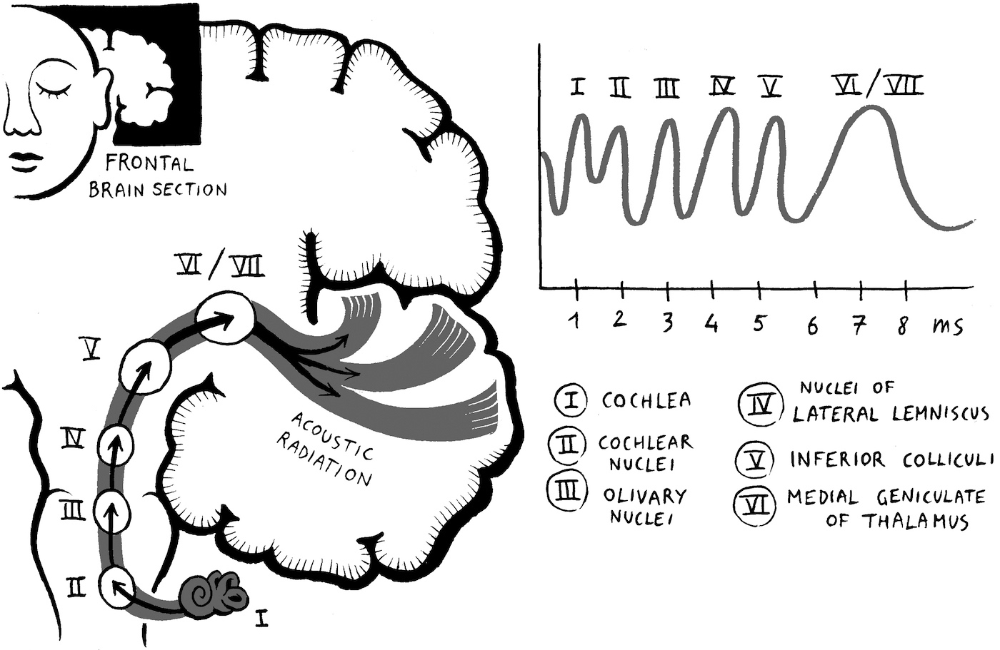
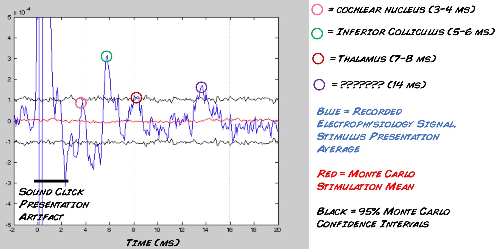

# Experiment: The Auditory Brainstem Response

By listening to many and many clicks, and recording the electrical response of
your brain, we can observe the auditory system in action!

Time  2 hours

Difficulty  Advanced

#### What will you learn?

In this experiment, we will learn about auditory neuroanatomy and record the
electrical responses from your own ear, brainstem, and cerebral cortex.

##### Prerequisite Labs

  * [Experiment: EEG - Recording from the human brain](https://backyardbrains.com/experiments/eeg) \- This will introduce you to the concept of recording from large neural populations (you only need to read)
  * [Experiment: The P300 Surprise Signal](https://backyardbrains.com/experiments/p300) \- This will introduce you to concept of averaging potentials (also only need to read)

##### Equipment

[Muscle SpikerBox Pro](https://backyardbrains.com/products/musclespikerboxpro)

[EEG headband](https://backyardbrains.com/products/EEGheadband)

[electrode gel](https://backyardbrains.com/products/emgelectrodegel)

* * *

## Background

_

* Contrary to intuition, we will use the[Muscle SpikerBox Pro](https://backyardbrains.com/products/musclespikerboxpro) for this experiment rather than the [Heart and Brain SpikerBox](https://backyardbrains.com/products/heartAndBrainSpikerBox). We are measuring the auditory system, which is very fast, and we are measuring nerve responses that occur within 2-15 ms after the click. We need the high frequency filters that the Heart and Brain SpikerBox is not designed for. Also the Muscle SpikerBox could alternatively be called the "High Frequency Non-invasive Human Neuromotorphysiology SpikerBox" but our marketing team killed that name.
_

Some of us are familiar with audiologists and auditory exams if you have
experienced hearing issues. You go to a clinic, you enter a small closet of a
room covered with acoustic foam, an audiologist puts "tarmac ground control"
style headphones on your ears, and you hold a trigger button in your hand. The
audiologist closes the door to the closet room, and across a window, you see
him or her begin to operate a console of electronics that looks like it was
designed using 60s style aesthetics. The audiologist instructs you across the
headphones to push the button in your hand whenever you hear a tone.

You then hear a variety of tones of different frequencies at various volumes,
with and without noise. You are also asked to repeat words and letters the
audiologist says with and without background noise. When you are done, you get
a handout that looks like this that you then take to your
otorhinolaryngologist.

As you can see above in the hypothetical example, the right ear has some
moderate loss up to 1000 Hz, and more profound loss above these frequencies.
The left ear follows the same pattern but is not as severe (mild).

These auditory tests are relatively simple to do and generally inexpensive as
medical tests go, but they have one disadvantage - they require you to
understand how to follow instructions and be engaged and active. And there are
two populations common in hospitals, the incapacitated and the newborn, that
have difficulty responding to verbal human instruction. What if there was an
auditory test that didn't need your attention? What if there was a test that
allowed you to check a baby's hearing without the need for a precocious baby
having to touch a response button or saying "Yes, my kind audiologist, I
confirm I definitively hear the sound, there is no doubt in my confidence in
my perception" or "No, I am probing the limits of my conscious attention, and
I cannot say with any certainty that I hear any sound."

Yes, such a test exists, and it is called the

which stands for the "[Acoustic Brainstem
Response](https://en.wikipedia.org/wiki/Auditory_brainstem_response)" and
works whether or not you are paying attention! Great for babies. The ABR
measures the averaged potential to the presentation of about 2000 clicks. One
electrode goes on the mastoid process behind the ear (or on the earlobe), the
second electrode on [encephalography
point](https://en.wikipedia.org/wiki/10%E2%80%9320_system_\(EEG\)) Cz on the
top of your head between your ears, and the ground on Fz in the middle of your
forehead.

When you have a successful recording and average the response to the 2000
click presentations, you can see the various peaks and valleys in the evoked
potential that correspond to different parts of the auditory anatomy. For
example, there is a wave around ~1 ms that consists in the cochlear response,
called peak I. There is a wave ~3 ms that corresponds to the [lateral olivary
nucleus](https://en.wikipedia.org/wiki/Superior_olivary_complex#Lateral_superior_olive_\(LSO\))
of the brainstem called peak III. There is a wave at 5 ms that corresponds to
the [inferior colliculus](https://en.wikipedia.org/wiki/Inferior_colliculus)
(part of the midbrain) that is named, unsurprisingly, peak V, and so on.
Around 14 ms there may be a peak that is
[cortical](https://en.wikipedia.org/wiki/Auditory_cortex).

Oh the wonders of electrophysiology that we can map out the structures of
neuroanatomy invasively and relatively simply. All these peaks correspond to
different parts of your auditory pathways. The amplitude of the peaks is an
indicator of how well you can hear, and it doesn't require that you pay
attention. You can measure this in your friends. You can measure this on your
kids. Is your left ear different from your right ear? Now let's do the
experiment!

#### Downloads

> Before you begin, make sure you have the [Backyard Brains Spike
> Recorder](https://backyardbrains.com/products/spikerecorder) installed on
> your computer. The Backyard Brains Spike Recorder program allows you to
> visualize data on your computer when doing experiments. You will also need
> to download "Audacity" to play the sound files in repetitive mode. For now,
> you need a copy of Matlab to do the analysis (you can download a free 30 day
> trial).
>
> [Spike Recorder Computer
> Software](https://backyardbrains.com/products/spikerecorder)
>
> [Arduino Code for
> SpikeRecorder](https://raw.githubusercontent.com/BackyardBrains/SpikerShield/master/Muscle/Arduino%20Code/SpikeRecorder/SpikeRecorderSpikerShield_V1_1.ino)
>
> [Audacity](https://www.audacityteam.org/)
>
> [Click Sound File - 9 minutes of 4 Hz
> clicks](https://backyardbrains.com/experiments/files/9_minutes_of_clicks.mp3)
>
> [Matlab Trial
> Download](https://www.mathworks.com/campaigns/products/trials.highResolutionDisplay.html)
>
> [Matlab Script for Doing ABR
> Analysis](https://backyardbrains.com/experiments/files/ABR_analysisV2.zip)

## Video

## Experimental Procedure

  1. Place the electrodes. One goes on the mastoid process behind the ear you want to test. It is the bony projection that you can easily feel. This may be confusing, as in our [previous EEG](https://backyardbrains.com/experiments/eeg) experiments, this location was the ground location, and in this experiment, it is the signal location. As we have [stated before](https://backyardbrains.com/experiments/referencing) there is no such thing as a perfect ground in electrophysiology, and where you place your ground depends on the signal you are trying to measure. Since we are measuring the auditory system, it makes sense that our signal electrode goes as close to the cochlea as possible. The second electrode goes on the Cz and is directly on top of your head between your ears. We are going to use our [EEG headband](https://backyardbrains.com/products/EEGheadband) for the Cz location. Slide the headband under the chin and over your head so that the electrode is located directly at the top of your head in between your two ears. You will need to apply some [conductive gel](https://backyardbrains.com/products/emgelectrodegel) to the space in between the electrode and the top of your head. The last electrode, the ground electrode, is nothing more than an electrode patch you put in the middle of your forehead, called Fz. 
  2. Download the sound file above, open in Audacity, and put it on repeat play. You can also open it in any other audio program. 
  3. Put an audio splitter in your computer output port. Plug headphones into one port and a male-male audio cable in the other port (our [Backyard Brains audio cable](https://backyardbrains.com/products/laptopcable), for example). 
  4. Put headphones in the ear you are testing. Adjust the volume so the sound is loud but not uncomfortable. 
  5. Put the other end of the audio cable into channel two of your Muscle SpikerBox Pro. 
  6. Plug the orange electrode cable into channel one of your Muscle SpikerBox Pro. The red alligator clips attach to the electrode on your ear mastoid and the electrode on top of your head (point Cz). The black alligator clip goes onto the electrode on your forehead (point Fz). 
  7. Connect to the Muscle SpikerBox Pro to your computer using the USB cable and open our [SpikeRecorder Software](https://backyardbrains.com/products/spikerecorder). Turn the Muscle SpikerPro on, and a USB icon will appear in the upper left screen. Click the USB icon, and also go into settings and assign a color to the second channel. You should now see two channels on the main screen: 1) the recording from your ear on channel 1, 2) and the auditory clicks on channel 2. 
  8. Begin recording. Since we need about 2000 click presentations, and the sound above occurs at 4 Hz, you will need to listen for 500 seconds, or 8 minutes and 20 seconds. Don't move your head, don't do anything. We often just [read a book](https://en.wikipedia.org/wiki/The_Road) with minimal body movement. 
  9. Done! Now disconnect everything and open Matlab. 
  10. In Matlab, click the button "import data" and select the .wav file of your recording. 
  11. Now type the line ABR_analysisV2 
  12. A figure should be generated that looks like the one below. The big deflections from 0 - ~1.5 ms after stimulus presentation are artifacts from the sound stimulus on the second channel bleeding through on the first channel. After that, the moving blue line is your ABR, or the electrophysiological response to the sound stimulus. Any peak and valley surpassing the black lines is surpassing the 95% confidence intervals, providing evidence that perhaps we are observing a real response. The red line is a statistically generated noise average. 

## Troubleshooting

    1. You may find this signal hard to record in some individuals. You can increase the click presentation to 4000 clicks (16 minutes and 40 seconds). 
    2. In some of us with hearing damage, the signal will not be easy to record (which is why the signal is medically useful - it can be used in newborn auditory screening). 
    3. For a reference you can download [this recording](files/Oct-4-Flo-4000-clicks.wav) which was a presentation of 4000 clicks we did with BYBer Florencia at the Backyard Brains Office. 
    4. If the signal looks "upside down" you can flip it by uncommenting the line "%Hearing = 0 - Hearing" in the code. This will flip the signal. It has to due with which signal electrode was on the mastoid process and which signal electrode was on point Cz on the top of the head. 

## Discussion

    1. Though our protocol is much more garagy, this is a legitimate test used in hospitals. What do you think are the differences between our equipment and protocol and that which a hospital uses? What do you think are the differences between FDA-certified medical devices and our simpler science instruments used for investigation. 
    2. Making Backyard Brains versions of clinical neurophysiology tools is new to us. Do you have a request or a suggestion? E-mail us to [let us know!](mailto:tim@backyardbrains.com)! 

## Questions to Consider

    1. Do your think your left ear and right ear are different? Test them. 
    2. Oh fortune, how you mock us, we know hearing declines with age. You can test the same volume on someone in their teenage years, someone in their 20s, someone in their 30s, someone in their 40s, and so on. 
    3. You can create your own sound files with noise added, and see what you find. As the noise increases, the ABR response should diminish.