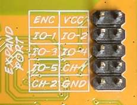
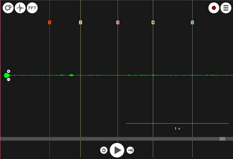

# Expansion Port

This document describes the hardware I/O interface to the Human SpikerBox and Neuron SpikerBox Pro. Both SpikerBoxes have the ability to accept external event signals, external analog signals, and provide the recorded signal as an analog output.

## Pinout

The SpikerBox Pros expose 8 expansions pins: 

ENC: Mode Selection   
VCC: 5V 500mA Output   
I/O-1:  Digital Input   
I/O-2:  Digital Input   
I/O-3:  Digital Input   
I/O-4:  Digital Input/Analog Input   
I/O-5:  Digital Input/Analog Input   
CH-1: Raw Output   
CH-2: Raw Output   
GND: Ground   

## Mode Selection
In order to provide multiple uses for the limited number of I/O pins, an I/O Mode schema has been developed to allow the pins to take on various roles.  A description of these modes are described in Table 1 below:

|MODE |Mode Select Voltage (Pin 7) |Description|
|---|---|---|
|MODE 0|0 - 0.5V|5x digital inputs|
|MODE 1|0.5 - 1V|3x digital inputs, 2x analog inputs|
|MODE 2|1 - 1.5V|Reserved|
|MODE 3|1.5 - 2V|Reserved|
|MODE 4|2 - 2.5V|Reserved|
|MODE 5|2.5 - 3V|Reserved|
|MODE 6|3 - 3.3V|Reserved|

In order to select mode of operation user needs to apply voltage on ENC according to second column in Table 1. Since ENC Pin has internal pull-down resistor default state of both SpikerBox Pros is MODE 0.  
This can be done by placing a resistor between the VCC pin and the ENC pin.  The pull down resistor is 20k ohm. 

When SpikerBox Pro detects voltage change on ENC pin it will wait 1.5 seconds for voltage to stabilize and then it will measure voltage and change operation mode accordingly. 

### Mode 0: 5x Digital Event Markers (Default)

Mode 0 sets pins IOs 1, 2, 3, 4, and 5 to a digital input mode. Using these IO pins, the user can generate events via the SpikerBox Pro that will be sent via USB interface to software on host computer.  This allows for external events (mechanical switches, etc.)  Each time SpikerBox Pro observes a rising edge of input signal (logic level high for at least 200ms, max 9V input), an event will appear on the SpikeRecorder Software.  

There are unique event numbers associated with each pin and are assigned as follows:

|Hardware Pin|Software Representation|
|---|---|
|IO 1|Event 1|
|IO 2|Event 2|
|IO 3|Event 3|
|IO 4|Event 4|
|IO 5|Event 5|

### Mode 1: 2x Analog Inputs

If you have need for more than two analog inputs you can put device in MODE 1 and enable two additional analog inputs on pins IO 4 and IO 5.  These inputs will have high input impedance and operating voltage range 0 to 3.3V (Vcc) and float at 1.65V. Signal applied to these inputs will be digitized and sent to software on Host computer along with signal from SpikerBox Pros standard inputs.  In this mode, sample rate will be 5k per channel for all 4 analog inputs.

IO 1, 2 and 3 will remain in digital input mode and can be used to generate events in a same way as in MODE 0.  

