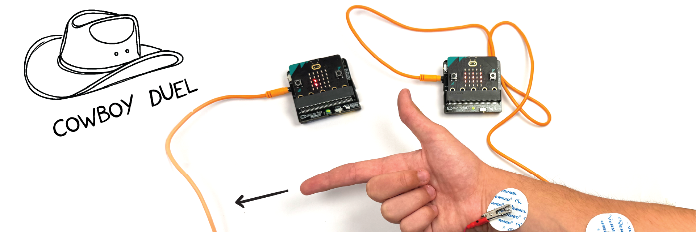

# Cowboy Duel #

|     |       |
|--------------|--------------
| Inventor     | Petar Barlov            
| micro:bit IDE     | Python Editor
| Best Location     | Classroom

## Project Overview
As a kid, I always enjoyed cowboy movies; they were thrilling. I even got to play some high-quality cowboy games (“Red Dead
Redemption”, for example). My favorite moment was always the standoff when two cowboys dueled at high noon.

One thing that disappointed me is, when I talk to others about it,
nobody in Serbia seems to know anything about cowboys at all. So, I decided to make a project based on cowboys and show them what they have been missing.

## Design and functionality
Now, the question is how does “Cowboy Duel” work? Here is the order of
operation:
1. Ready system- Before the game starts, both players confirm
they are ready. They do so by pressing the golden
logo on the micro:bit. The LED display will show a checkmark when
pressed properly.
2. Beginning phase- After both players confirm they are ready, the
display will show a dot and the beginning phase starts. Suspenseful
music will start playing and all you need to do is focus and wait for
the sound signal.
3. Sound signal- After a certain amount of time (between 5 and 20
seconds) a sound signal will play and the display will show “X”, which is a
sign to shoot.
4. Action phase- After the sound signal, players point
the gun at the other player and press the trigger as hard as possible;
so that the proper motion would occur. The player that “shoots” first will
see a “W” on their display (winner), and others will see an “L” (loser).
“Cowboy Duel” went through a major design change. At first, it was meant
to be just a micro:bit held in one hand, and the other hand would be finger guns. This could be much more fun, so I added a 3D-printed gun with a micro:bit on top.

## Code
(Image for on start, on logo pressed, radio)

This represents the ready system. First, it sets all variables to 0 and the radio
group (server) to 5. It also has a variable “Random” which is a timer for the
beginning phase. When the logo is pressed, it sets the “Ready” variable to 1
(or to 0 if it’s already 1) and sends values “Ready” and “Random” to the
other player. When a player receives the variables, it equalizes the
“Random” value and it checks whether the other player is ready, and it
begins the game with the “Start” variable.

(Forever block)

This represents the beginning phase. Firstly, it checks whether the “Start”
the variable is “activated” (equal to 1), it displays a dot and starts playing the
suspense melody. Then, it waits the “Random” amount of time and plays the sound signal. After that, it activates the “Signal” variable and
deactivates the “Start” and “Ready” variables.

(on Radio and another forever block )
- Finally, this represents the action phase. First of all, it reads the digital
EMG signal and sets the “Key” variable to it. I found the digital read command to be a bit more effective than analog read. This is because digital read only shows 0 (when no motion is present) and
1 (when some motion is present), while analog needs more
optimization. Whoever activates “Key” first, sets their “Signal” to 0, gets the “W” screen, and sets the others' screens to “L”.
