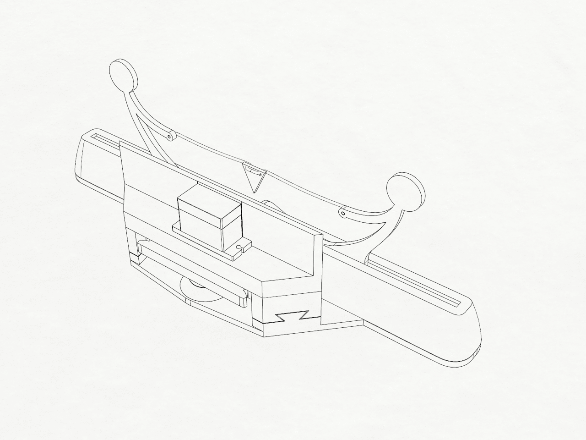

# EMG Game Console
---
sidebar_position: 6
sidebar_label: EMG Game Console
description: Fully Body gaming like never before
---
![Cover Image  path/to/your/image.png)

|                    |                                                             |
| ------------------ | ----------------------------------------------------------- |
| **Inventors**      | Aleksa Zdravković, Jovana Mrđa, Vukašin Berner, Vuk Velemir |
| **micro:bit IDE**  | Python Editor                                               |
| **Additional IDE** | Arduino IDE                                                 |
| **Best Location**  | Makerspace                                                  |

## Project Overview

The "EMG Game Console" is a platform for creating retro games that you can play with your muscles _(and maybe even your eyes)_. We’ve created an example game, but feel free to come up with your own ideas and extensions! 🕹️

In our Tug of War game, neuro:bit devices measure EMG signals from the forearm muscles of two players, simulating a tug of war game both on a screen and on a physical model.

Electrodes on your forearm measure EMG signals, essentially interrupting the brain’s message to your muscles when you contract them, and send this data to the neuro:bit.

The neuro:bit then uses math ✨ to calculate the position of a flag on the tug of war rope and filters out any janky movement.

## Materials Needed

- 2 x neuro:bits
- 2 x micro:bits
- 1 x SG90 servo motor kit with horns and screws
- 1 x Seeed Wio Terminal
- 1 x microSD card _(1GB is sufficient)_
- 1 x 3D printed parts
- 1 x A piece of string
- 1 x Grove cable
- 4 x AA batteries
- 2 x BYB muscle cables
- 6 x gel electrodes
- 1 x USB C cable
- 1 x micro USB cable
- 1 x Power bank / external USB power supply
- 1 x Arduino IDE v2
- ∞ x Enthusiasm 😄

## 3D Printing

Before connecting the electronics, we should slice and start printing the files. If you don't have a 3D printer _(bummer)_, you can still play the game on the Wio Terminal. If you don’t have the Wio Terminal, you can still create the physical extension _(or do both if you have both)_.

1. 3D print all parts located in the `TugOfWarGame` folder of the attached ZIP file. Apply supports as needed.

![Tug Of War Game Plate Image path/to/your/image.png)

2. _If you don’t have the Wio Terminal:_ 3D print all parts in the `GameConsole` folder. Note that some files need to be printed twice, and you need to apply supports.

![Game Console Plate Image path/to/your/image.png)

3. Thoroughly clean the parts from the supports after printing.

## Connections

1. Plug the two micro:bits into their slots on the neuro:bit boards _(facing away from the neuro:bit)_. Insert two AA batteries into each neuro:bit.

2. Cut the red _(power)_ wire of the Grove cable. We want to power the Wio Terminal externally.

![Grove Cable Image path/to/your/image.png)

3. Plug one side of the cable into one of the neuro:bit's "digital" Grove ports _(the one with the SCL and SDA - i2c pins)_. This micro:bit is now the "right one".

![Microbit Grove Image path/to/your/image.png)

4. Plug the other side of the cable into the matching i2c Grove port on the Wio Terminal _(the left one when the screen is up)_.

![Wio Terminal Grove Image path/to/your/image.png)

5. Insert the microSD card into your computer and transfer the files from the `Assets/bmp` folder of the attachment.

![Illustrations Image Illustration.png)

6. Insert the microSD card into the Wio Terminal's slot beside the power switch _(pins toward the screen/facing up)_.

## Console Assembly

1. Attach the neuro:bit holders to the stand's flat side, with the openings facing outward.

2. Slide the plates into the grooves in the neuro:bit holders and the stand to lock them in place.

3. Insert the switches, ensuring the higher side is toward the neuro:bit sign and they are in the OFF position.

![Switches Image path/to/your/image.png)

4. Insert both neuro:bits into their holders _(the right one goes to the right one)_ with the ports facing outward. Angle them slightly and push them in. This might take a few tries, so do it one by one, paying attention not to move the switches.

![Neurobit Holder Image path/to/your/image.png)

5. Snap the Wio Terminal into the display holder.

![Display Holder Image path/to/your/image.png)

6. Position the display holder so that the blue button is in the top left corner and slide it onto the stand.

![Sliding onto the Stand Image path/to/your/image.png)

## Tug of War Extension Assembly

1. Follow the pictures to assemble the tug of war part.

2. Rotate the gear in the tug of war part and snap the white servo motor horn in place _(a screwdriver might be helpful)_.

3. Connect the servo motor’s cable to the right neuro:bit, ensuring the letters on the micro:bit port _(BlackRedYellow)_ match the colors on the cable.

![Servo Connection Image   path)

4. Flash the temporary code using the micro:bit Python Editor from the file servo_calibration.py to the right neuro:bit. This will center the servo to 90°.

5. Put the servo in its slot orienting it so it lines up with the horn, carefully centering the gear as well.

5. Secure the servo motor in place with screws. Press upwards on the gear to ensure the horn is tight on the servo.

6. Cut a piece of string a little over 10 cm.

7. Thread one end of the string through the hole in the stickman’s hand and tie a knot. Thread the other end of the string through both holes in the flag and then through the hole in the other stickman’s hand, tying it in a knot.

8. Position the flag so that its bottom points to a mark on the tug of war part.

9. Done, now the angle of the servo should be proportional to the position of the flag!

## Software

1. Go to the [micro:bit Python Editor](https://python.microbit.org) _(use Chrome for easier device connection rather than transferring the HEX file)_.

2. Open the `left_microbit.py` file in the lower right corner.

3. Flash the left micro:bit by plugging it in using a micro USB cable and connecting to it in the lower left corner of the editor. Click on "Send to micro:bit" after connecting.

4. Open a fresh [micro:bit Python Editor](https://python.microbit.org) instance in a new tab and close the previous one.

5. Open the `right_microbit.py` file, as before.

6. Flash the right micro:bit by repeating the procedure.

7. Open the `wio_terminal.ino` file in Arduino IDE.

8. Connect the Wio Terminal to your computer using a USB C cable _(you can disconnect the micro:bits)_.

9. Follow the [Wio Terminal guide](https://wiki.seeedstudio.com/Wio-Terminal-Getting-Started) to set up your IDE for programming it.

10. Flash the code to the Wio Terminal, and voila, you’re good to go! 🚀

## Operation

Once everything is assembled and coded, both players should follow these steps:

1. Place one gel electrode on the back of your hand _(any bony part without muscle interference will do, like your elbow)_. Bend your ring and pinkie fingers while you search for the muscle that contracts on your forearm with the other hand. Place two electrodes on that muscle.

![Tug of War Image path/to/your/image.png)

2. Connect the black cable clip to the electrode on the back of your hand and the two red cable clips to the other two electrodes.

![Tug of War Image path/to/your/image.png)

3. Connect the orange cables to the neuro:bits, with the left player _(red cable)_ connecting to the left one and the right player _(green cable)_ connecting to the right one.

![Tug of War Image path/to/your/image.png)

4. Plug the USB C cable into the Wio Terminal and the other end into a power bank.

![Tug of War Image path/to/your/image.png)

5. Turn on the switches on both neuro:bits.

![Tug of War Image path/to/your/image.png)

6. When the display turns on, press the blue button to select the game.

![Tug of War Image path/to/your/image.png)

7. Press the black button on the bottom of the micro:bit and then squeeze your muscle as hard as you can until the red tick mark appears on the micro:bit.

![Tug of War Image path/to/your/image.png)

8. Now you can play by squeezing your wrists - the stronger you squeeze, the more the flag will move in your direction. Enjoy the game that NEVER ENDS. 🤗

![Tug of War Image path/to/your/image.png)

## Credits

The 3D modeling and printing were done by Alex Hatch _(based on Jovana's incredible sketches)_, and the project was overseen by Chethan Magnan. We thank them from the bottom of our hearts for being such open and helpful people.

//Add in Stefana's pics + Code

