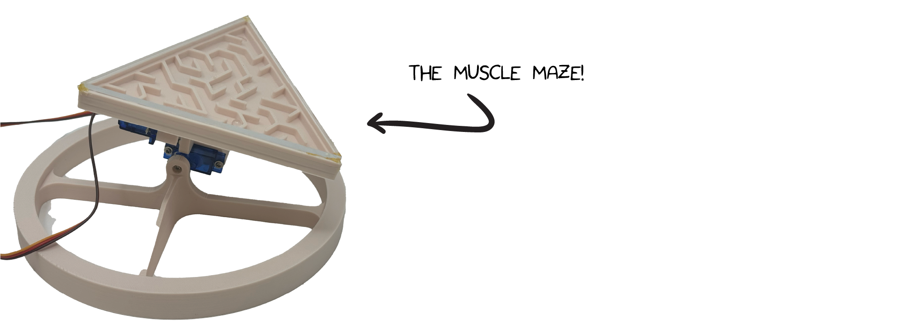
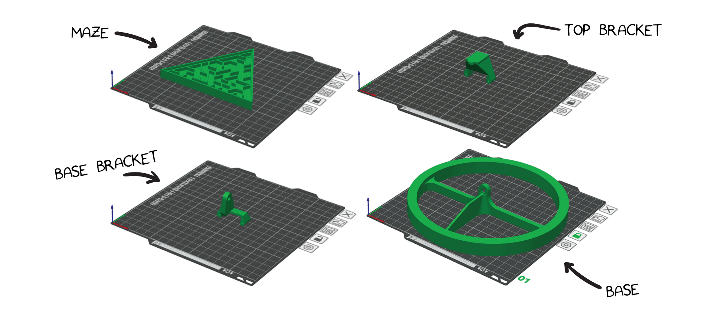
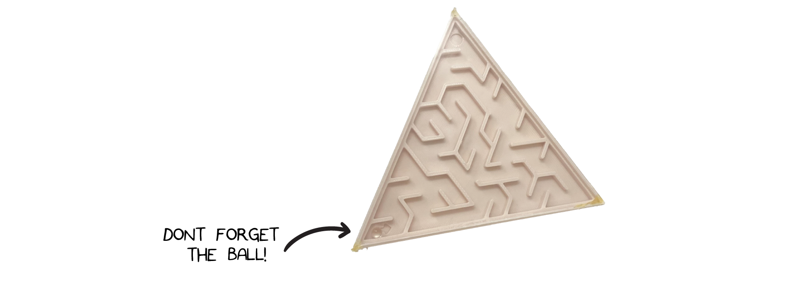
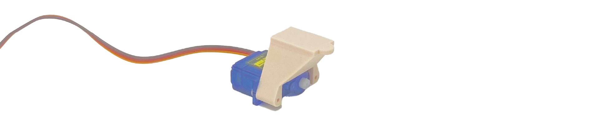
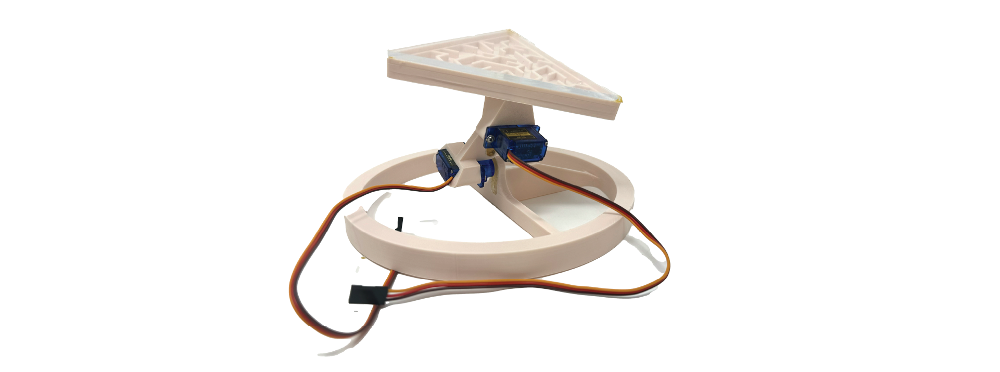

# Muscle Maze #


|     |       |
|--------------|--------------
| Inventor     | Teruaki Kimishima             
| micro:bit IDE     | Python Editor
| Best Location     | Makerspace   

## Project Overview ##
Welcome to Muscle Maze!! This project uses two neuro:bit with a micro:bit to control Maze using both arm muscles. 

## Materials Needed  ##

To assemble the Muscle Maze, you will need to have the following items.

1. 3D-Printer + Filiment
2. Small sheet of acylic
3. Laser Cutter or sharp blade. 
4. 2× CFsunbird 9g micro servo with screws
5. Tiny ball (small bead or bering) 
6. 2x [neuro:bit kits](../../) with micro:bit, electrodes, and cables.

### Parts ###

You will make a few parts.  Below are the 4 3d printed parts we will need:



You can donload the STL files and print them on your 3D printer.

1. [Body](./MazeBody.stl)
2. [Top Bracket](./TopBracket.stl)
3. [Center Bracket](./CenterBracket.stl)
4. [Base](./Base.stl)

You also need to laser cut the following parts (or you can cut out the triangle cover from acylic using a blade):

1. [Maze Cover](AcrylicCut.rd) 

The .rd file extension is associated with various file types depending on the context in which it is used. One common use is for laser cutting.

## Assembling the Maze ##
1. Place Ball inside the maze, then seal with  Maze Cover with hot glue 

2. Glue plastic arm that comes with the servo to the pocket of Base

3. Glue the other plastic arm to the pocket of Center Bracket

4. Join one of the servos to the Top Bracket using the servo screws provided, as shown below 

5. Join the other servo to the Center Bracket using two screws, as shown below 

6. Assemble the parts from Steps 2 and 5 above using a small servo screw.

7. Assemble the parts from Steps 3 and 6, using small screw.

8. Now pull it all together by combining the assmbly from step 1 with step 7.  You can these 2 parts with a hot glue gun. 


## Preparing Microbit ##
Refer to "Connecting Muscles to Read an EMG Signal" from our [Getting Started with neuro:bit Block Programming](../../Block) page to learn how to record an EMG signal from the arm. You will need two neuro:bits, one connected to each the left and right arm.

Connect the two servo motors from Muscle Maze to each neuro:bit. See the [The neuro:bit](../../) Hardware Overview page for more information on how to connect servos.

## Programing the micro:bit for the Muscle Maze ##

To program the micro:bit, you can choose from two options: Muscle Maze - "Beginner" and Muscle Maze - "Advanced."

The first option is good for general use cases. The second option is more complex but is more flexible with individual differences in EMG signals.

Below is a quick overview of Muscle Maze - "Beginner" coding.

```py title="Muscle Maze - "Beginner""
val = 0
stop = True
key = True
threshold = 50
bound = 10
original_angle = 70
zero_angle = 70
seconds = 100000
pins.servo_write_pin(AnalogPin.P8, zero_angle)
# Main Program
while key:
    val = pins.analog_read_pin(AnalogPin.P0)
    # Controll continue/pause of servo using buttom B
    if input.button_is_pressed(Button.B):
        basic.pause(500)
        if stop: # Continue
            basic.show_icon(IconNames.DIAMOND)
            stop = False
        else: # Pause
            basic.show_icon(IconNames.HEART)
            stop = True
    if not (stop):
        if int(val) >= threshold:
            if zero_angle < original_angle + bound:
                basic.pause(150)
                zero_angle = zero_angle + 1
                pins.servo_write_pin(AnalogPin.P8, zero_angle)
        elif int(val) < threshold:
            if zero_angle > original_angle - bound:
                basic.pause(150)
                zero_angle = zero_angle - 1
                pins.servo_write_pin(AnalogPin.P8, zero_angle)
    if input.button_is_pressed(Button.A):
        key = False
basic.pause(1000)
# Reset the position to original angle
if zero_angle != original_angle:
    if zero_angle < original_angle:
        while zero_angle < original_angle:
            basic.pause(100)
            zero_angle = zero_angle + 1
            pins.servo_write_pin(AnalogPin.P8, zero_angle)
    else:
        while zero_angle > original_angle:
            basic.pause(100)
            zero_angle = zero_angle - 1
            pins.servo_write_pin(AnalogPin.P8, zero_angle)
# Done!!
basic.show_icon(IconNames.GHOST)
```
To modify Muscle Maze - "Beginner" into Muscle Maze - "Advanced", all you have to do is add a few lines of code between lines 9 and 10.

```py title="Muscle Maze - "Advanced"
# Advaned option: Threshold controll (Bandpass filter)
basic.pause(3000)
while seconds > 0:
    val = pins.analog_read_pin(AnalogPin.P0)
    if threshold < int(val) and int(val) < 50 and int(val) > 10:
        threshold = int(val)
    seconds += 0 - 1
basic.show_icon(IconNames.HAPPY)
```

While the advanced option runs more smoothly, the Beginner code is easier to follow for educational purposes.

If you would like to, you can aslo download codes for the Muscle Maze program from below:

1. [Muscle Maze - "Beginner"](./microbit-Muscle-Maze-general.hex)

2. [Muscle Maze - "Advanced"](./microbit-Muscle-Maze-individual.hex)
   
Install either version of Muscle Maze program on your local computer. Then, drag and drop the installed file into the project you have created. This will allow you to see the entire code in the project.

Connect the Microbit to your computer, then click "download." After this, you should now have the program inside the Microbit.

## Operation ##

1. Turn on both neuro:bits
2. (Advance Mode Only) Relax both of your arms and wait 3s for a smiley face to appear on micro:bit.   
3. Contract your muscles to tilt the maze in 2 directions.
4. Get the ball into the small hole at the end of the maze!

Pressing the "B" Button on the micro:bit will pause the maze game from moving.
  
## Credits ##

The triangle maze model was first developed by John Lazarevic. Alex Hatch designed the updated base for easier assembly and stability.  Teruaki Kimishima developed the Muscle Maze program and oversaw the project.
