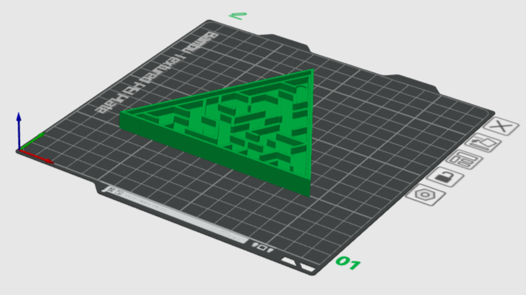

# Muscle Maze #

## Overview ##
Welcome to Muscle Maze!! This project uses two Neuro:Bit with a Micro:Bit to control Maze using both arm muscles. 

## Check Parts ##
To assemble the Muscle Maze, you will need to have the following items.
You can install stl files for (1)~(4) if you wish.

[(1). Body](./MazeBody.stl)

[(2). Top Bracket](./TopBracket.stl)

[(3). Center Bracket](./CenterBracket.stl)

[(4). Base](./Base.stl)

[(5). Maze Cover](AcrylicCut.rd)

(6). 2× CFsunbird 9g micro servo

(7). 2× Accessories

(8). Ball

## Assembling ##
1. Place (8).Ball inside (1). Body, then ceil with (5).Maze Cover with hot glue 

2. Glue plastic from (7).Accessories to the pocket of (4).Base

3. Glue plastic from (7).Accessories to the pocket of (3).Center Bracket

4. Joint (6).Servo and (2).Top Bracket using two middle screws from (7).Accessories, as shown below 

5. Joint (6).Servo and (3).Center Bracket(with a plastic part inside the pocket) using two middle screws from (7).Accessories, as shown below 

6. Grab assembled parts from step2 and step5, attatch using small screw from (7).Accessories 

7. Grab assembled parts from step3 and step6, attatch using small screw from (7).Accessories 

8. Grab assembled parts from step1 and step7, attach with hot glue 

## Preparing Microbit ##
Refer to "Connecting Muscles to Read an EMG Signal" from our [Getting Started with Neuro:Bit Block Programming](../../Block) page to learn how to record an EMG signal from the arm. You will need to have two Microbit/Neurobit, each connected to the left and right arm.
After the EMG recording connect two servo motors from Muscle Maze to Neurobit. If you don't know how where to connect the servo motor on Neurobit, please refer to  "Hardware Overview" from our [The Neuro:Bit](../../src) page.

## Installing the program to Microbit ##
There are two versions you can install for the Muscle Maze program

1. [Muscle Maze -general](./microbit-Muscle-Maze-general.hex)

2. [Muscle Maze -individual](./microbit-Muscle-Maze-indiviudal.hex)

While the first option is a good use for general cases, usually, we recommend installing the second option since this is more flexible with individual differences in EMG signal. However, if used for education purposes, we recommend starting from Muscle Maze -general since this involves less complexity.

Refer to "Software Setup" from our [Getting Started with Neuro:Bit Block Programming](../../Block) page to learn how to create new projects for Microbit.

After successful project creation, install either Muscle Maze -general or Muscle Maze -individual on your local computer. Then, drag and drop the installed file to the project you have created. This will allow you to see the entire code on the project.

Connect Microbit to your computer, then click "download". After this, you should now have the program inside the Microbit.

## Instruction ##
At this point, you should have,

-One Fully assembled Muscle Maze

-Two Microbit connected to Neurobit
  
-Two Microbit with the installed program
  
-Six electrodes are placed on your arm (Three on the left and Three on the right)
  
-Two EMG cables are connected to each electrode and Neurobit
  
-Two Servos (From Muscle Maze) connected to each Neurobit

Now moving on to instruction

1. Turn on both Neurobit
2. Within 3 seconds, relax both of your arms and wait for a smiley face to appear on Microbit 
  (skip this process if you have a general version of the program installed)
3. Press Button "B" on Microbit to continue/pause the tilting
4. Extract or Contract Muscle to decide the direction of tilting
5. Once you are done press Button "A" on both Microbit

