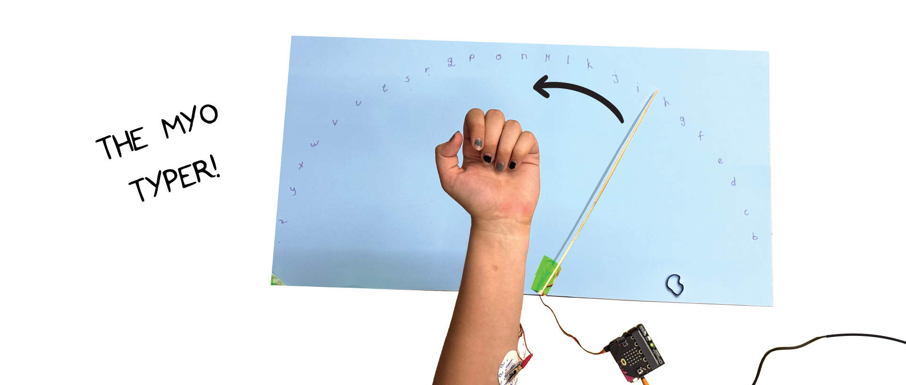

# The MyoTyper #

|     |       |
|--------------|--------------
| Inventor     | Lana Novicic
| micro:bit IDE     | Block Code
| Best Location     | Classroom   

## Project Overview ##

Myotyper is a keyboard that uses emg technology. Write only by flexing your muscles! It
could be hooked up to your leg so you could write without using your arms.
material
- one neuro:bit kit (with micro:bit, elecrodes and cables)
- servo motor
- a piece of wood or hard cardboard
- tape
- big piece of paper, pen
- clock hand
assembling
1. Choose something you will use a clock hand. It could be a straw, part of a three
branch or you can 3D print it! (just make sure it&#39;s lightweight).
2. Take a sheet of wood or cardboard and measure and draw a square the size of a
servo motor. When that&#39;s done, take a pair of scissors and simply cut the hole. Adjust
the hole so that the servo motor fits tightly.
3. Turn the servo motor so that the wires coming out of the motor are oriented towards
the end of the wood piece. Glue the motor to the wood.
4. Glue the clock hand to the servo hat so that it&#39;s aligned with the larger servo motor
arm. When it&#39;s dried press the servo hat onto the motor.
5. Grab a big piece of paper and measure the middle on one side. Take the wood with
the motor and place it like in the picture. Make sure the motor is centred on the paper
and the clock hand is facing right, parallel with the edge of the paper. Once its
positioned, tape the wood to the papar.
6. Write the code and come back when you&#39;re done. Flex your muscle to move the
clock hand and simultaneously write the letters as you move it.
writing the code
1. Set threshold to 450. Make a variable (here: a) that will count the number of times the
threshold was passed. By setting the variable time to millis we marked the beginning
of a time frame. You can also add a play sound block and set it to beep every 2
seconds, to know when to move.
2. Add the while loop and set it like in the code. This allows us to make a time period of
2 seconds that will keep repeating forever. Set the emg to analog read pin 0 (reading
emg from electrodes). the variable a is set to change by 1 only when the emg has
passed the threshold, but previous emg hasn’t.
3. Next, tell the program to move the clock hand to the starting point “on start”. Then
make a list and set it to an array of letters in order that you want them to be. make
sure you leave the first spot empty (or add some sign).
4. Now we have to assign a role to a different number of muscle contractions. If the
muscle is contracted once the clock hand will move by 6 degrees. We add the
variable _1click that will increase by 6 every time the clock hand moves.

5. If the muscle is contracted twice the clock hand will move to the beginning. The
variable _2click will equal the number of movements (var _1click / 6). Now we just
find the letter that has the same value in the array and add it to the variable letter.
6. Lastly we set that if the variable a remains 0 within the timeframe the micro:bit will
display the word we wrote.

operating
- Plug the motor cable into the neuro:bit (pin 8). Stick the electrodes to your arm or leg
and connect them using the orange cable, which should be plugged in the pin 0.
Download the code onto the micro:bit and start it.
- Relax your arm and squeeze your muscle after every beep to change the letter.
When you reach the letter you want to select squeeze twice. After each letter is
selected the clock hand will automatically go back to the beginning.
- To write out the word just relax your hand and wait a few seconds and the word
should appear on the micro:bit.
tips
- It takes a bit of time to get used to it but the beat helps in catching the rhythm
- You can also change/adjust the number of muscle contractions for different functions
however you like
- change the threshold until it works for you
  
## Credits ##

The triangle maze model was first developed by John Lazarevic. Alex Hatch designed the updated base for easier assembly and stability. Teruaki Kimishima developed the Muscle Maze program and oversaw the project.
