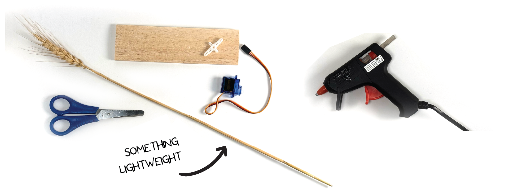
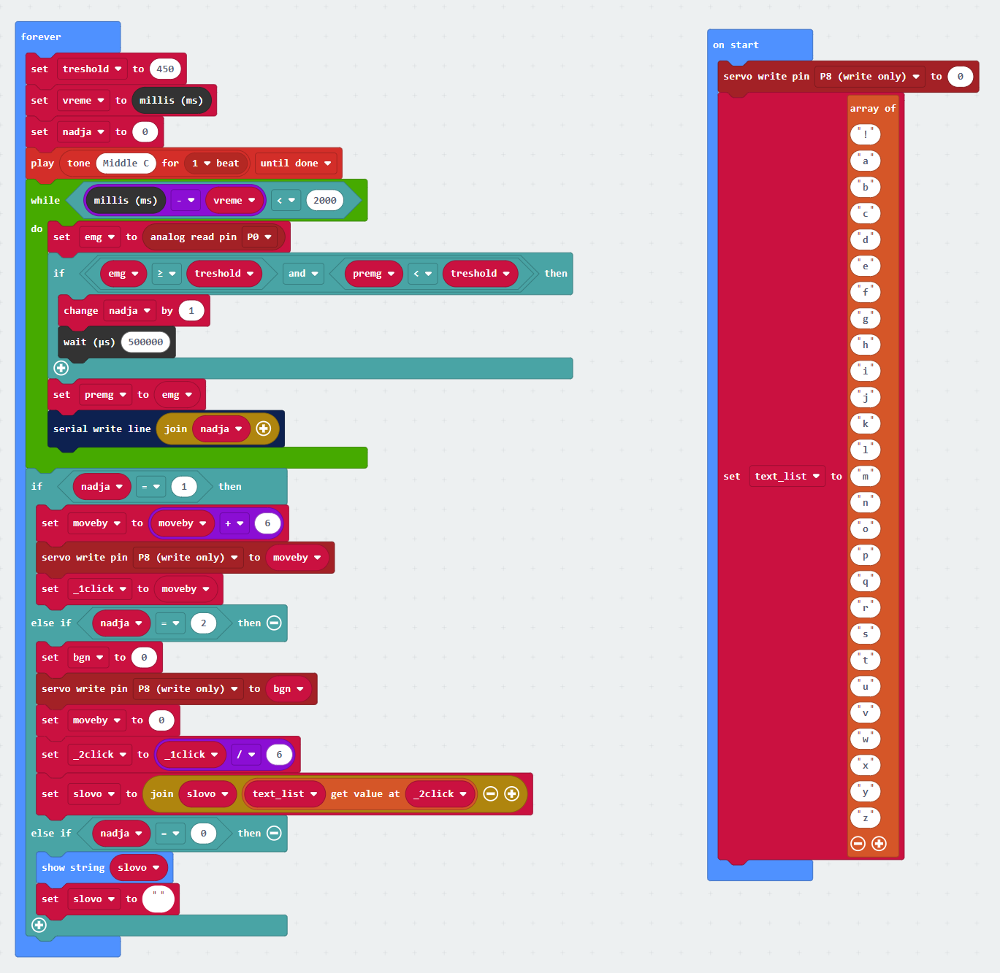

# The MyoTyper #


|     |       |
|--------------|--------------
| Inventor     | Lana Novicic
| micro:bit IDE     | Block Code
| Best Location     | Classroom   
## Project Overview ##
Myotyper is a keyboard that uses EMG technology. Write only by flexing your muscles! It
could be hooked up to your leg so you could write without using your arms.

## Materials
- 1x neuro:bit kit (with micro:bit, electrodes, and cables)
- 1x servo motor
- 1x a piece of wood or hard cardboard
- 1x Roll of tape
- 1x big piece of paper
- 1x pen
- 1x clock hand ( thin dowel to fit on servo )
  
## Assembly
1. Choose something you will use a clock hand. It could be a straw, part of a three
branch or you can 3D print it! (just make sure it&#39;s lightweight).
2. Take a sheet of wood or cardboard and measure and draw a square the size of a
servo motor. When that's done, take a pair of scissors and cut the hole. Adjust
the hole so that the servo motor fits tightly.
3. Turn the servo motor so that the wires coming out of the motor are oriented towards
the end of the wood piece. Glue the motor to the wood.
4. Glue the clock hand to the servo hat to align it with the larger servo motor
arm. When it's dried press the servo hat onto the motor.
5. Grab a big piece of paper and measure the middle on one side. Take the wood with
the motor and place it like in the picture. Make sure the motor is centered on the paper
and the clock hand is facing right, parallel to the edge of the paper. Once it is
positioned, tape the wood to the paper.
6. Write the code and come back when you're done. Flex your muscles to move the
clock hand and simultaneously write the letters as you move it.
writing the code

## Coding 
1. Set the threshold to 450. Make a variable (here: a) that will count the times the
threshold was passed. By setting the variable time to millis we marked the beginning
of a time frame. You can also add a play sound block and set it to beep every 2
seconds, to know when to move.
2. Add the while loop and set it like in the code. This allows us to make a time period of
2 seconds that will keep repeating forever. Set the emg to analog read pin 0 (reading
emg from electrodes). the variable a is set to change by 1 only when the EMG has
passed the threshold, but the previous EMG hasn’t.
3. Next, tell the program to move the clock hand to the starting point “on start”. Then make a list and set it to an array of letters. Make
sure you leave the first spot empty (or add some sign).
4. Now we have to assign a role to a different number of muscle contractions. If the
muscle is contracted once the clock hand will move by 6 degrees. We add the
variable _1click that will increase by 6 every time the clock hand moves.
5. If the muscle is contracted twice the clock hand will move to the beginning. The
variable _2click will equal the number of movements (var _1click / 6). Now we just
find the letter that has the same value in the array and add it to the variable letter.
6. Lastly we set that if the variable a remains 0 within the timeframe the micro:bit will
display the words we wrote.

Below is the completed code in micro:bit makecode python.


```
slovo = ""
_2click = 0
bgn = 0
_1click = 0
moveby = 0
premg = 0
emg = 0
nadja = 0
vreme = 0
treshold = 0
pins.servo_write_pin(AnalogPin.P8, 0)
text_list = ["!",
    "a",
    "b",
    "c",
    "d",
    "e",
    "f",
    "g",
    "h",
    "i",
    "j",
    "k",
    "l",
    "m",
    "n",
    "o",
    "p",
    "q",
    "r",
    "s",
    "t",
    "u",
    "v",
    "w",
    "x",
    "y",
    "z"]

def on_forever():
    global treshold, vreme, nadja, emg, premg, moveby, _1click, bgn, _2click, slovo
    treshold = 450
    vreme = control.millis()
    nadja = 0
    music.play(music.tone_playable(262, music.beat(BeatFraction.WHOLE)),
        music.PlaybackMode.UNTIL_DONE)
    while control.millis() - vreme < 2000:
        emg = pins.analog_read_pin(AnalogPin.P0)
        if emg >= treshold and premg < treshold:
            nadja += 1
            control.wait_micros(500000)
        premg = emg
        serial.write_line("" + str(nadja))
    if nadja == 1:
        moveby = moveby + 6
        pins.servo_write_pin(AnalogPin.P8, moveby)
        _1click = moveby
    elif nadja == 2:
        bgn = 0
        pins.servo_write_pin(AnalogPin.P8, bgn)
        moveby = 0
        _2click = _1click / 6
        slovo = "" + slovo + text_list[_2click]
    elif nadja == 0:
        basic.show_string(slovo)
        slovo = ""
basic.forever(on_forever)
```

## Operating
- Plug the motor cable into the neuro:bit (pin 8). Stick the electrodes to your arm or leg
and connect them using the orange cable, which should be plugged into pin 0.
Download the code onto the micro: bit and start it.
- Relax your arm and squeeze your muscles after every beep to change the letter.
When you reach the letter you want to select squeeze twice. After each letter is
selected the clock hand will automatically go back to the beginning.
- To write out the word just relax your hand and wait a few seconds and the word
should appear on the micro:bit.

### Tips
- It takes a bit of time to get used to it but the beat helps in catching the rhythm
- You can also change/adjust the number of muscle contractions for different functions
however you like
- change the threshold until it works for you
