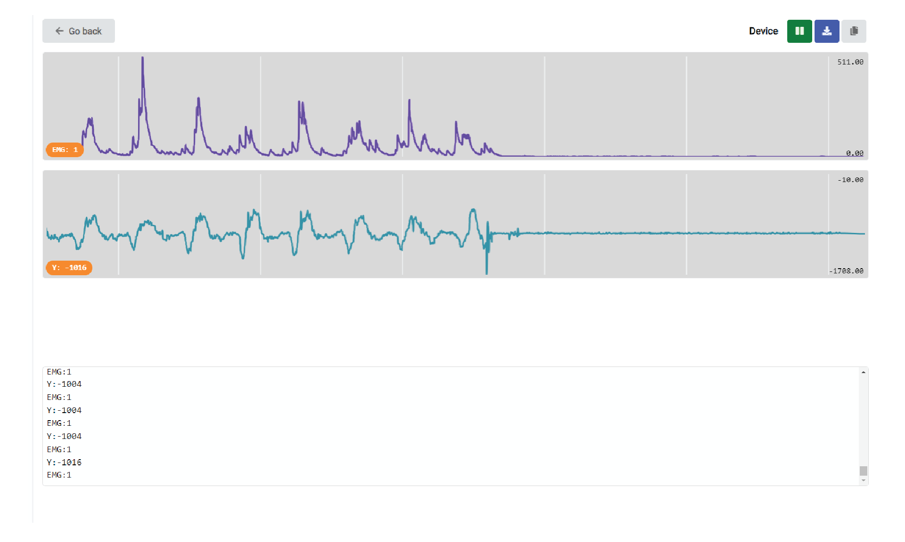

# neuro:baton - Conduct Music with Your Mind and Body

|     |       |
|--------------|--------------
| Inventor     | Sofia Andrikou           
| Micro:Bit IDE     | Block Code
| Best Location     | Classroom 

Welcome to the world of NeuroBaton, where you become the maestro of your own symphony! In this documentation, we'll guide you through the exciting journey of building and programming your conductor baton, harnessing the power of your movements and EMG signals to orchestrate beautiful melodies. Let's dive in and unleash your inner conductor!

# Materials Needed

For this project, you will need some cardboard, paper, pen, tape, and a 3D printer.  You also need a micro:bit and neuro:bit. 

# Build Instructions

## Step 1: Gather Your Materials
Grab a cardboard sheet and use the provided template to cut out the shape of the base of your NeuroBaton. 

## Step 2: Cut out 

Print out a PDF of our [baton outline](./nc_baton_trace.pdf) and trace it on the cardboard (include the dotted lines).

Then cut ir out with scissors.

## Step 3: Fold and Decorate the Baton Holder

Fold up the cardboard to firt snuggly around the micro:bit.  Then add some tape to the top to hold it in place, and give it some character. 

## Step 4: Final Assembly of your neuro:baton

You can download the [STL File for 3D priting your own baton here](./batonTest1.stl).  Print the baton and place the baton tip on top of the base.

 You can choose to secure it firmly with glue or tape, or leave it loose for a more dynamic feel. 
 
Let your creativity flow as you decorate it with colors, patterns, or anything that reflects your musical personality!  

Once youre ready, let it rest while we delve into the exciting world of music creation!

# Programming Your Baton

With Microbit's intuitive interface, the possibilities for musical exploration are endless. Let's explore how you can program your baton's brain to create and control captivating melodies.

## 1. Select Your Music
Choose between Music, Melody, or Synthesize to kickstart your composition journey.

You have the freedom to craft a DJ board melody:

compose a piano-based piece:

or explore the ethereal sounds of sine waveforms:

Additionally, Microbit provides a library of pre-made musical compositions for your convenience.

## 2. Define Your Controls

To master your Neurobaton and become a skilled conductor, you need to empower it with some control options. Decide how you want to interact with your music. Whether it's through buttons, LED displays, or the magic of EMG signals, the choice is yours!

In this example, we’ll use the strength of our muscles to control the music's tempo, and use vertical movements to adjust the volume.

Here's how it works:

### Muscle Power for Tempo: 
We'll use an EMG (electromyogram) connected to your hand muscles, as detailed in the Human SpikerBox documentation under EMG. 
When you flex your muscles, it sends a signal to the EMG variable, allowing you to control the tempo of the music.

### Motion for Volume:
The microbit has an accelerometer, which is a sensor that detects movement and orientation. We'll utilize the vertical (up and down) motion of your Neurobaton to control the volume. Move it up to increase the volume and down to decrease it.

By combining these two inputs, you'll have dynamic control over your musical performance, making you a true maestro with the Neurobaton!

Here's how you allign your MEG and y axis inputs to your microbit:

And here we can we see the EMG and Y variables. Remember that it is always important to check how the signals appear in time for validation.

Another cool feature you can add is the ability to stop all the music by turning your Neurobaton upside down, just like signaling your orchestra to pause. Similar to how we use the y-axis for volume control, we can use the z-axis for this stop function (by cheking when the z valus are positive).

The control possibilities are endless—this is just one suggestion to get you started.

## 3. Conduct Your Orchestra
Feel the thrill of conducting with your body as you control the tempo and volume of your music. With NeuroBaton, every movement becomes a symphonic gesture.

## 4. Add Personal Touches
Customize your experience by incorporating features like DJ board melodies, piano-based compositions, or even experimental sine waveform sounds. Let your imagination soar!

# Putting It All Together
The code below encapsulates the essence of NeuroBaton, mapping EMG signals and accelerometer data to tempo and volume control. With a flick of your wrist, you can pause the music or reignite the symphony, just like a conductor commanding an orchestra. Don't panic, move your NeuroBaton facing up again and the music will restart!

## Embracing EMG Technology
With EMG sensors, your NeuroBaton becomes an extension of your musical expression. By simply moving your hand, you can dictate the tempo and add dynamic flair to your performance.

## Tempo Control
Flex your muscles to speed up the tempo and infuse your music with vibrant energy. Whether you're holding the baton or using your free hand, the power of EMG is at your fingertips.

## Volume Adjustment
Tilt your NeuroBaton up or down to control the volume, creating crescendos and diminuendos with graceful movements.

## Complete Code Example: Customize and Expand Your Neurobaton

The following code brings together everything we've discussed. Feel free to experiment, modify it, and add more features and controls to make it your own.

# Unleash Your Creativity

## Beyond the Baton
Explore innovative ideas like using EKG signals to synchronize your heartbeat with drumbeats, turning your body into the ultimate percussion instrument.

## 1. Heartbeat Drumming Experience
Utilize EKG (Electrocardiogram) signals to synchronize your heartbeat with rhythmic drumbeats, turning your NeuroBaton into a heart-powered percussion instrument.

## 2. Dance Choreography Integration
Combine the art of dance with music by mapping specific dance moves to trigger different musical elements. Imagine choreographing a routine where each step or gesture influences the melody, rhythm, or even lighting effects for a multimedia performance.

## 3. Gesture-Based Composition
Create a library of hand gestures or body movements, each assigned to a musical note, chord, or sound effect. By interpreting these gestures in real-time, you can compose music on the fly, turning any space into a symphonic playground.

## 4. Interactive Storytelling
Transform your NeuroBaton into a narrative device, where each movement advances the storyline through sound effects, voiceovers, or musical cues. Invite participants to engage in immersive storytelling experiences, where their actions shape the unfolding narrative.

## 5. Collaborative Jam Sessions
Connect multiple NeuroBaton devices wirelessly to facilitate collaborative jam sessions among friends, family, or even strangers. Each participant can control different musical layers or instruments, fostering creativity, teamwork, and spontaneous musical exploration.

## Collaborate and Inspire
Share your creations with fellow music enthusiasts, collaborate on projects, and inspire others to embark on their own musical journeys with NeuroBaton.

# Conclusion
Congratulations on embarking on this exhilarating musical adventure with NeuroBaton! With the power of technology and the artistry of your movements, the world of music is yours to conduct. Let the symphony begin!

