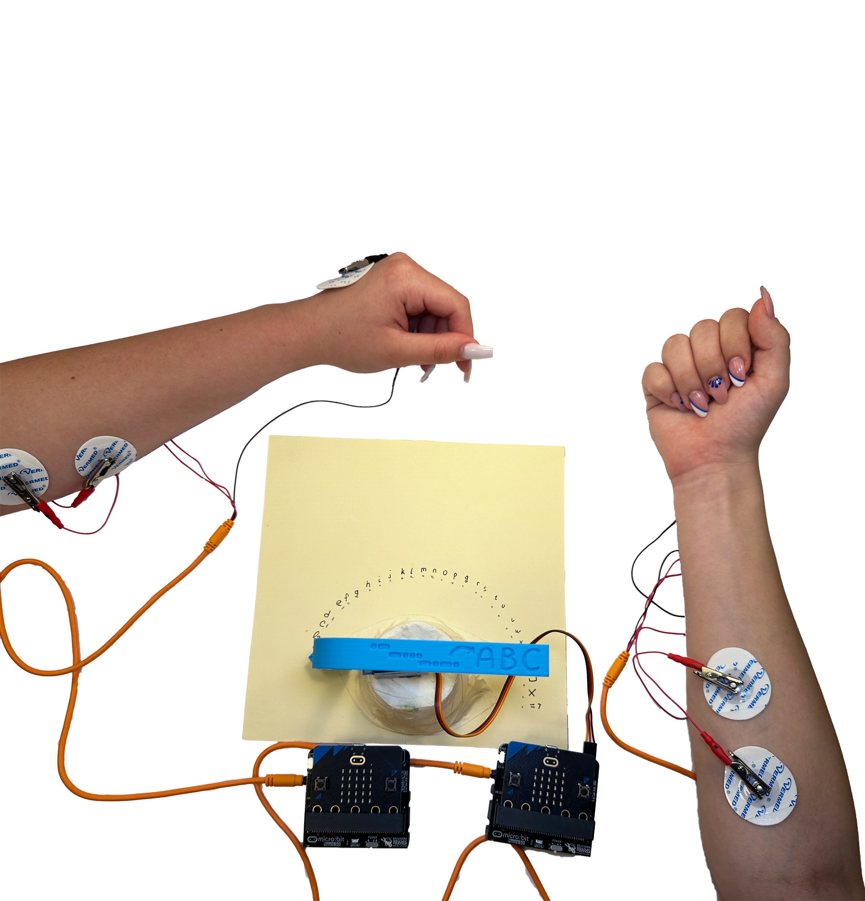
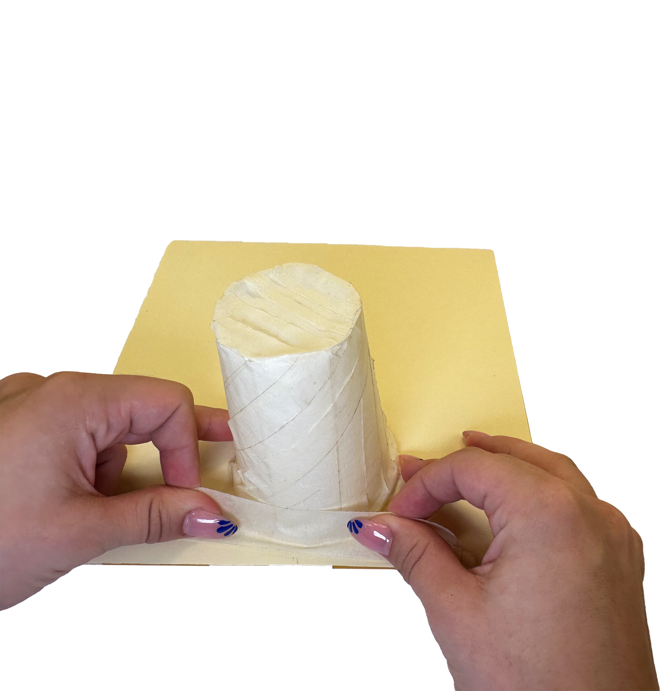

#  Neuro:Talk #


|     |       |
|--------------|--------------
| Inventor     | 	Masha Kosanovic and Nadja
| micro:bit IDE     | MakeCode
| Best Used    | Classroom 

## Project Overview
**Welcome to Neuro:Talk, Your Gateway to Expressive Communication Through ASL!**

These instructions will guide you through the process of building and programming your Neuro:Talk device, which takes Electromyography (EMG) signals from American Sign Language (ASL) gestures, converts them into Morse code, and displays the output via tones, an LED display, and a rotating pointer on a servo and cup. Let's dive in and explore this unique method of communication!

## Materials needed
- 1x micro:bit and neuro:bit
- 1x Servo motor
- 1x EMG Signal Cable
- 3x Electrodes
- 1x Cup (for the rotating pointer)
- An assortment of Wires and connectors
- 1x Cardboard, tape, and scissors for housing
- 1 stick or 3D printed part of attaching to the servo

(Stick and glue gun not shown)

## Programming your Neuro:Talk Device
Now that your device is assembled, it's time to program it to decode ASL gestures into Morse code and display it.
This code is siplt into two parts, sending and recieving. This first chunk is sending ( it looks long, but most of that is due to the arrays for alphabet and morse code ).

The program calibrates hand movies for dots and dashes, converts these into letters, and then controls a servo to select the letters chosen. This information is communicated from micro:bit to micro:bit via the radio command.

```
def on_received_string(receivedString):
    if receivedString == "yes":
        basic.show_string(receivedString)
        pins.servo_write_pin(AnalogPin.P8, 180 - (24 + 1) * 6)
        basic.pause(500)
        pins.servo_write_pin(AnalogPin.P8, 180 - (4 + 1) * 6)
        basic.pause(500)
        pins.servo_write_pin(AnalogPin.P8, 180 - (18 + 1) * 6)
    elif receivedString == "no":
        basic.show_string(receivedString)
        pins.servo_write_pin(AnalogPin.P8, 180 - (13 + 1) * 6)
        basic.pause(500)
        pins.servo_write_pin(AnalogPin.P8, 180 - (14 + 1) * 6)
    basic.pause(500)
    pins.servo_write_pin(AnalogPin.P8, 180)
radio.on_received_string(on_received_string)

sentence = ""
temp = 0
i = 0
getMaxSignal = 0
word = ""
radio.set_group(90)
index = 0
pins.servo_write_pin(AnalogPin.P8, 180)
basic.pause(2000)
morse_code_list = ["10",
    "0111",
    "0101",
    "011",
    "1",
    "1101",
    "001",
    "1111",
    "11",
    "1000",
    "010",
    "1011",
    "00",
    "01",
    "000",
    "1001",
    "0010",
    "101",
    "111",
    "0",
    "110",
    "1110",
    "100",
    "0110",
    "0100",
    "0011",
    "0000",
    "0001",
    "1100"]
alphabet_list = ["a",
    "b",
    "c",
    "d",
    "e",
    "f",
    "g",
    "h",
    "i",
    "j",
    "k",
    "l",
    "m",
    "n",
    "o",
    "p",
    "q",
    "r",
    "s",
    "t",
    "u",
    "v",
    "w",
    "x",
    "y",
    "z",
    "space",
    "delete",
    "send"]
sending = True
basic.pause(100)
while sending:
    word = ""
    for index2 in range(4):
        lista: List[number] = []
        basic.show_icon(IconNames.HEART)
        basic.clear_screen()
        for index22 in range(10):
            getMaxSignal = neurobit.get_max_signal(100)
            lista.append(getMaxSignal)
        for index23 in range(len(lista)):
            i = 0
            for index24 in range(len(lista) - 1):
                if lista[i] < lista[1 + i]:
                    temp = lista[i]
                    lista[i] = lista[1 + i]
                    lista[1 + i] = temp
                i = i + 1
        if lista[0] < 100:
            basic.show_leds("""
                . . . . .
                . # . # .
                . . . . .
                . # . # .
                . . # . .
                """)
        elif lista[len(lista) - 1] < lista[0] * 0.1:
            word = "" + word + "1"
            basic.show_leds("""
                . . . . .
                . . . . .
                . . # . .
                . . . . .
                . . . . .
                """)
        elif lista[len(lista) - 1] > lista[0] * 0.1:
            word = "" + word + "0"
            basic.show_leds("""
                . . . . .
                . . . . .
                . # # # .
                . . . . .
                . . . . .
                """)
        basic.pause(200)
    position = 0
    while position <= len(morse_code_list) - 1:
        if morse_code_list[position] == word:
            if morse_code_list[position] == "0000":
                basic.show_icon(IconNames.SMALL_DIAMOND)
                sentence = "" + sentence + " "
                pins.servo_write_pin(AnalogPin.P8, 180 - (position + 1) * 6)
                break
            if morse_code_list[position] == "1100":
                basic.show_icon(IconNames.YES)
                pins.servo_write_pin(AnalogPin.P8, 180 - (position + 1) * 6)
                basic.show_string(sentence)
                radio.send_string(sentence)
                sending = False
                break
            if morse_code_list[position] == "0001":
                basic.show_icon(IconNames.NO)
                sentence = sentence.substr(0, len(morse_code_list))
                pins.servo_write_pin(AnalogPin.P8, 180 - (position + 1) * 6)
                break
            basic.show_string("" + (alphabet_list[position]))
            sentence = "" + sentence + alphabet_list[position]
            pins.servo_write_pin(AnalogPin.P8, 180 - (position + 1) * 6)
        position += 1
```

This is the code for recieving
```
def on_received_string(receivedString):
    global lista, counter, i, set_treshold, time_interval, end_time, getMaxSignal
    start_time = 0
    basic.show_string("" + (receivedString))
    lista = []
    counter = 0
    i = 0
    set_treshold = 100
    time_interval = 500
    end_time = start_time + time_interval
    basic.show_icon(IconNames.HAPPY)
    for index in range(5):
        getMaxSignal = neurobit.get_max_signal(600)
        lista.append(getMaxSignal)
    index2 = 0
    while index2 <= len(lista) - 1:
        if lista[index2] > 300:
            counter += 1
        index2 += 1
    basic.show_number(counter)
    if counter >= 2:
        basic.show_icon(IconNames.YES)
        radio.send_string("yes")
    elif counter == 1:
        basic.show_icon(IconNames.NO)
        radio.send_string("no")
radio.on_received_string(on_received_string)

getMaxSignal = 0
end_time = 0
time_interval = 0
set_treshold = 0
i = 0
counter = 0
lista: List[number] = []
radio.set_group(90)
threshold = 0

def on_forever():
    pass
basic.forever(on_forever)

```

## Build Instructions

### Build the Rotating Pointer Mechanism
For visual feedback, we'll use a servo motor to rotate a pointer attached to a cup.

1. Start by grabbing the cup and tape

2. Tape the cup for improved grip, this will matter when we attach the servo

3. Tape the cup onto the piece of paper

4. Now grab the stick, in this case it's a 3D printed part. Apply glue from a glue gun to where the servo hat will connect

5. Attach the servo to the stick. The servo should then be connected to the micro:bit


7. Apply glue from the glue gun onto the tape cup and then place the servo onto the tape cup

8.  Add a 0, letters, and a space matching your letter array. This is best done by running the code and having the servo move through the array


## Using Neuro:Talk
Now that your device is ready, it's time to use it!

- Turn on the device and start performing ASL gestures.
- The EMG sensors will detect your muscle contractions, convert them into Morse code, and display the output via tones, the LED display, and the rotating pointer.

### Practice Makes Perfect
As you practice using the Neuro:Talk, you'll become more adept at controlling the output, ensuring that your ASL gestures are accurately represented.


## Customizing Your Neuro:Talk Device
You can further enhance your device with additional features:

### Multiple Output Modes
- **Visual Mode:** Use the LED display for quiet environments.
- **Auditory Mode:** Use the buzzer for audible communication.
- **Kinetic Mode:** Use the rotating pointer for a more tactile feedback option.

### Advanced EMG Mapping
- Explore more complex ASL gestures and map them to longer Morse code sequences.
- Integrate additional sensors for more nuanced control and feedback.

## Conclusion
Congratulations on building and programming your Neuro:Talk device! By translating ASL gestures into Morse code, you've created a unique bridge between physical expression and digital communication. Keep exploring, customizing, and sharing your innovations with the world!
