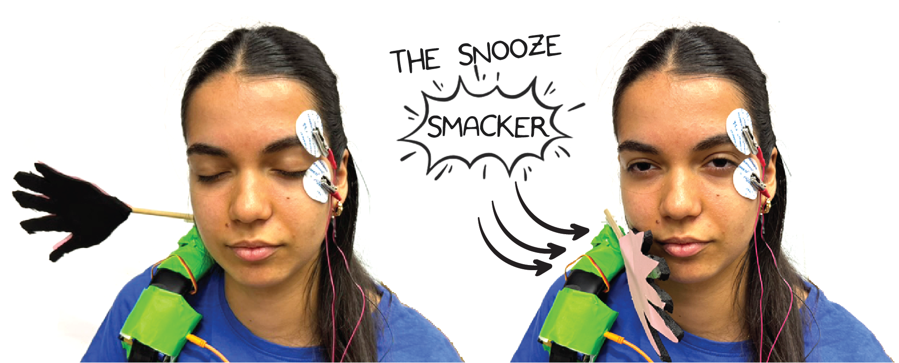

# The Snooze Smacker #

|     |       |
|--------------|--------------
| Inventor     | Ana Markovic and Milica Ivankovic           
| micro:bit IDE     | Block Code 
| Best Location     | Classroom

## Project Overview ##
Description: The Snooze Smacker is a small device designed to prevent dozing off by delivering
a gentle slap when it detects that your eyes have closed for more than five seconds. It uses a
micro:bit programmed to detect eye closure and activate a hand to wake you up.

Functionality: The device is ideal for people who struggle with staying awake during long
meetings, lectures, or late-night study sessions. Its quirky and humorous approach combines
with practical functionality to make it both a conversation starter and a productivity booster.
Additionally, it provides an element of fun and excitement to the task of staying alert.

Purpose: The device addresses the issue of drowsiness at inconvenient times, which can lead to
missed information, reduced productivity, and dangerous situations like falling asleep while
driving. By ensuring wakefulness and alertness, it helps improve focus, learning efficiency, and
overall safety.

## Materials Needed  ##

To assemble the Muscle Maze, you will need to have the following items.

- 1x neuro:bit and micro:bit with electrodes and orange cable
- 1x stick
- 1x old over-the-ear headphones for cutting up
- 1x roll of duct tape
- 1x foam sheet and piece of paper for making a hand

## Development Process
1. Programming the Micro:bit: A micro:bit was used as the brain of the device, programmed to
detect EMG and EOG signals. When a change in these signals is detected for longer than 5
seconds, a hand slaps the user.
2. Building the Mechanical Hand: A small hand using lightweight materials was constructed and
attached to a servo motor, controlled by the micro:bit. The micro:bit sends a signal to the servo
motor to trigger the hand to slap when longer eye closure is detected.
3. Assembly and Testing: Components were carefully assembled, ensuring secure attachment
and proper alignment. Multiple iterations and adjustments were made to fine-tune the device&#39;s
sensitivity and the force of the slap for effectiveness without causing pain.

The result is a unique, functional, and entertaining gadget that helps keep users awake and
attentive whenever drowsiness threatens to take over.
