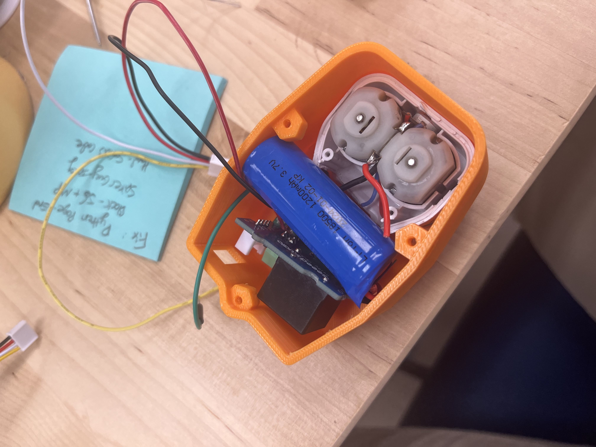
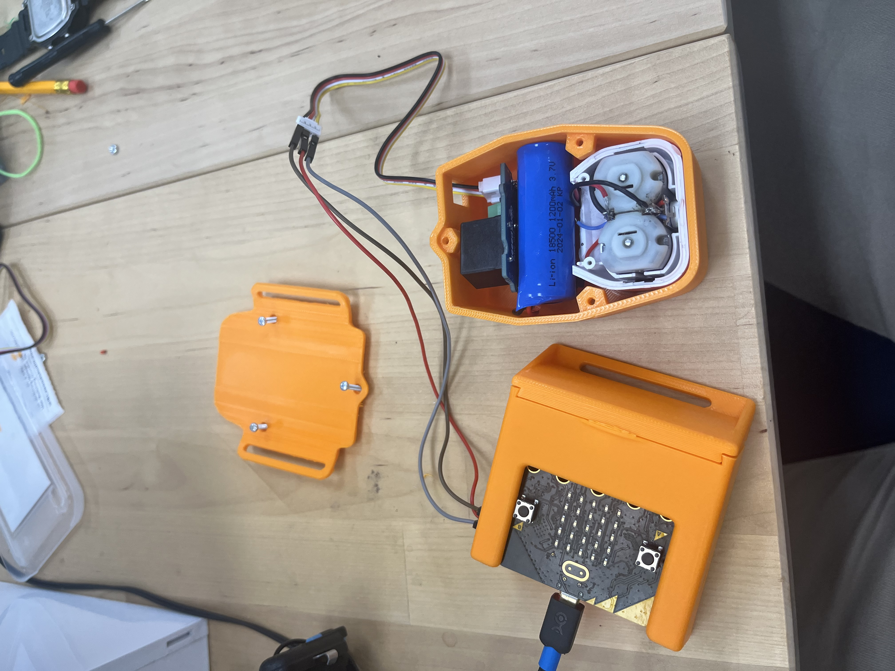
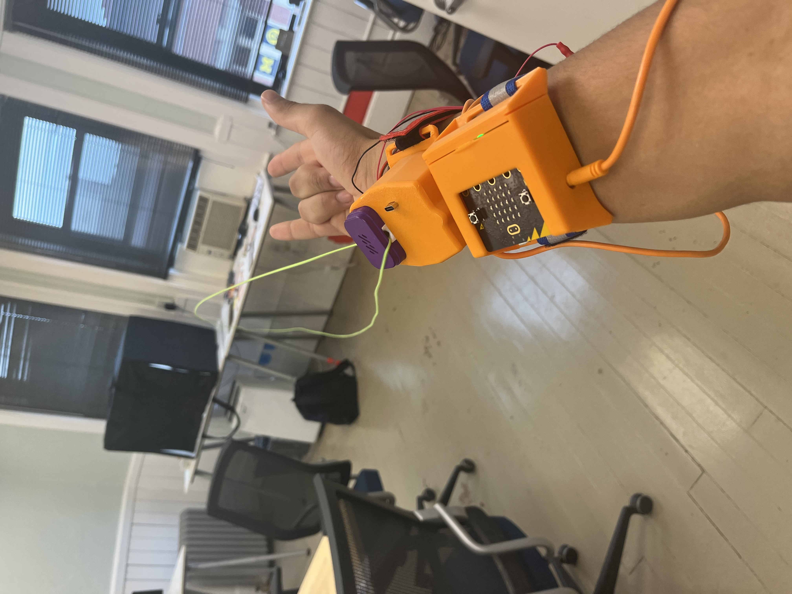

# Spiker-Man String Slinger # 


*"Spiker-Man, Spiker-Man, does whatever a Spiker-Man can"*

Make your very own string-slinging device that shares startling similarities to a certain Marvel / Sony superhero!


# Materials Needed #
Step 1. Pick which materials you'd like to use  
Step 2. Order them from Amazon, Seeed Studio, or your distributor of choice  
- Loop Lasso / two wheels close to each other, [we used this one](https://looplasso.com/products/looplassov3-bbundle)  
- A loop of string with no knots
- Micro:Bit and Neuro:Bit
- EMG Signal Cable
- 3 Electrodes
- A relay; we used [this one from Grove / Seeed Studio] (https://www.seeedstudio.com/Grove-Relay.html) but any one-way electromechanical switch will do. 

**Optional**
- 3D printer / a case to hold both the Neuro:Bit and Micro:Bit
- Soldering iron, solder, protective gear
- Arm Bands
- Three small screws or bolts
- Hand saw for dissecting the loop lasso

# Software #
Step 3. Write Code for digital pins and connect your arm to the Neuro:Bit via EMG  
Step 4. Graph these results via the code line " serial.write_value("x", EMG) "  
Step 5. Pick threshold based on serial output from EMG  
Step 6. Add an if-else statement that controls whether you're digitally writing a 1 or 0.   
Step 7. Connect the output of EMG > Threshold to pin8 as a digital write. 1 means the motors are on; 0 means the motors are off.  

This project is fairly simple from a software perspective: you'll pair the input from an EMG to a signal output. To make this work, we'll re-use code from the EMG lecture and pair it to a DigitalWrite command in an if-else statement. 

```py title="Spiker-Man Controller"
threshold = 0
EMG = 0

def on_forever():
    global threshold, EMG
    threshold = 200
    EMG = pins.analog_read_pin(AnalogPin.P0)
    serial.write_value("x", EMG) #Can be commented out, used for confirming EMG works
    if EMG >= threshold:
        pins.digital_write_pin(DigitalPin.P8, 1) #Sling out string
    else:
        pins.digital_write_pin(DigitalPin.P8, 0)
basic.forever(on_forever)
```
# Hardware - Electronic #

Step 8. Build a small sample project by connecting the relay to both the 3V output and the resistor -> LED -> Ground  
Step 9. Test that the EMG responds properly by noting the flashes  

This is where things get a bit more advanced. We'll first do a simple project to test that the code and relay work, and then get into the full project. 

I would recommend attaching pin 8 ( the same Y pin we've used in the past for the servo-based projects ), to a relay, and the relay should connect 3v to a resistor and LED, which then connects to ground. If your device works, the LED should turn on when you flex and turn off when your hand is relaxed.

Step 10. Review how the components of a switch work  
Step 11. Pick the best parts for the job ( in our case, the relay rather than the transistor or mechanical switch )  

But I'm getting ahead of myself, how does a relay work? In a nutshell, it's an electromechanical switch. A mechanical switch, like a simple Single Pole Single Throw (SPST) switch, works great for connecting two wires but requires manual input. A transistor, in a very broad and simple manner, is an electrical switch that connects a collector and emitter wire via a base, which can be controlled by whether the base pin is high ( 1 ) or low ( 0 ) in digital electronics terminology. The relay functions as a bit of a mix - it's very reliable and is an actual switching motion ( you can hear the click as a small switch moves back and forth to bridge a wire ), but is much faster and can be controlled electronically. 

Step 12. Perform Loop lasso surgery by opening up the casing with a saw  
Step 13. Desolder the physical switch  
Step 14. Use a jumper wire to tap between the ground pad and the red motor wire on the loop lasso  
Step 15. Confirm the motor and circuit works, as when you tap these wires you should hear the motors whirr  
Step 16. Solder a wire from the motor to the positive end of the relay  
Step 17. Solder a wire from the ground pad on the board to the negative end of the relay  

What I've done for my parts is to cut open the loop lasso, remove the physical switch, and solder a wire from the motors, into the relay, and then back into the ground. This means that when our code sends out a 1 to pin 8, the wires are shorted together and the motors receive current. When our code sends a zero, the relay disconnects the pins and the motors receive no current as the circuit is open.

# Hardware - Mechanical #

Step 18. Print out the STL files or design your own for printing  

We have a fantastic in-house designer / inventor / general-knows-how-to-do-it guy here at Backyard Brains, and he designed the case I'm using in the pictures above. You can find the STL files here as the following:
1. [The Micro:Bit's Case](./MicrobitCase.stl)  
2. [The Micro:Bit's lid](./MicrobitLid.stil)  
3. [The String Slinger's case](./StringCase.stl)  
4. [The String Slinger's lid](./StringLid.stl)  

Step 19. Assemble the 3D prints, the string slinging component, the Micro:Bit and Neuro:Bit combination, and the wires  

Putting the pieces into their 3D-printed cases will look like this:



# Demos #

Step 20. Mess around with your newly created Spiker-Man string slinger!  

