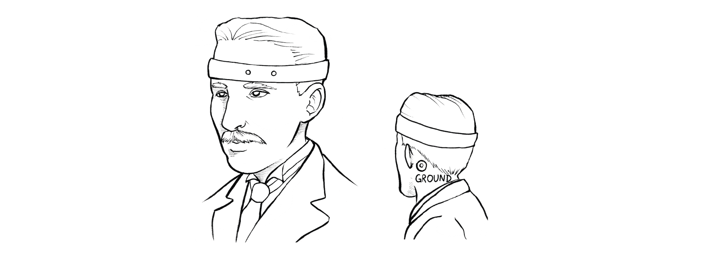

# Getting Started with Neuro:Bit Python Programming #

## Overview ##

Python is a programming language that can be used with the Neuro:Bit to easily develop Brain Machine Interfaces.  It is a powerful language, easy to learn, and a great way to get started with Neuro:Bit.

## Software Set-up ## 

Coding your project in Python gives you a choice of editors.  The first is to use the [Microsoft MakeCode](https://makecode.microbit.org/) editor that can toggle between Block Code and Python.  This is great for learning Python as you can switch back and forth between your Block Code and Python.  Changes to one development language will sync to the other.  You will also be able to visually see your data inside the editor in realtime. This functiopnality comes at a slight code: it does not support a full implementation of Python.  So if you want to import other Python libraries, you should head to the [BBC micro:bit Python Editor](https://python.microbit.org/v/3/ideas).  This has less features, but gives you more flexibility.  

Creating a project here will open with the micro:bit library already imported and the "forever" loop in place. 


```py title="Hello Heart!"
from microbit import *

# Code in a 'while True:' loop repeats forever
while True:
  display.show Image.HEART)
  sleep (1000)
  display.scroll('Hello')
```

## Read EOG Signal into a Variable ##

We can start by deleting the code inside the loop and adding our own. In this example, we will place two recording electrodes over the eye and will attempt to record an Electrooculogram (EOG).  An EOG is a measurement of the electrical activity of the eye.  You can place the two recording electrodes around the eye, and the black ground lead behind the ear.



We will create a variable to store information in your code so you can easily access it.  Since the EOG signal is sent to Pin0 on the micro:bit, we can read in a sample using the following code.  

```py title="The Most Basic Python BMI Code"
from microbit import *

# Code in a 'while True:' loop repeats forever
while True:
  EOG =  pin0.read_analog() 
```
Calling the "read_analog()" method will take a sample of the EOG signal each time.  Congrats!  That's it!  The variable *EOG* now is reading in the EOG signal on each loop! 

## See the EOG Signal ##

A good way to start using EOG is to see what the signal looks like.  To do this, we will send the data from the Micro:Bit to the host computer.  Add a command that send the EOG data to the computer over the serial port:


```py title="Basic Python Code"
from microbit import *
import log
log.set_labels('EOG')
# Code in a 'while True:' loop repeats forever
while True:
    EOG =  pin0.read_analog()
    log.add({'EOG':EOG})
```

Once the program is downloaded and is running, you can go back to the MakeCode editor, and click on "Show Data". This will plot the EOG variable you are sending over the serial port in real time. The log data can also be accessed later from the micro:bit's storage. Navigate to the Micro:bit drive, open the "log" folder, and then access the stored data files. The log feature will automatically save your EOG data for later analysis.