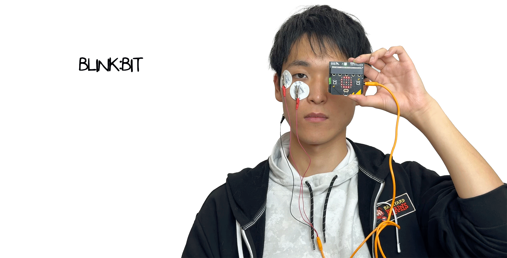
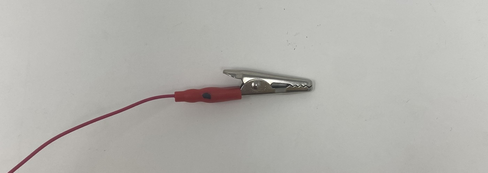
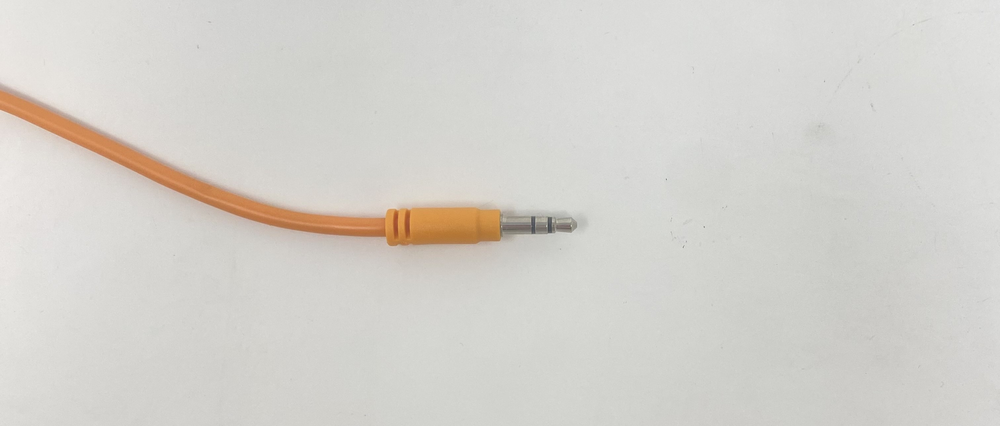
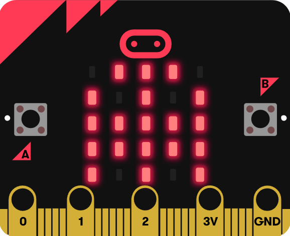
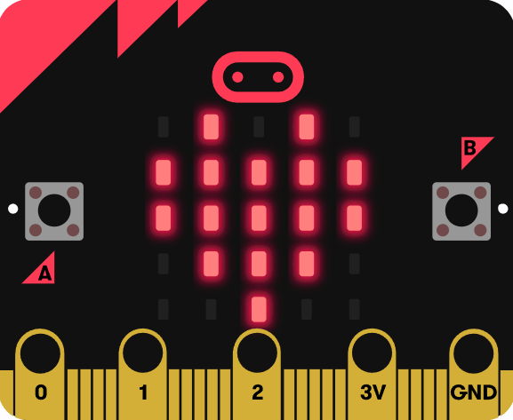
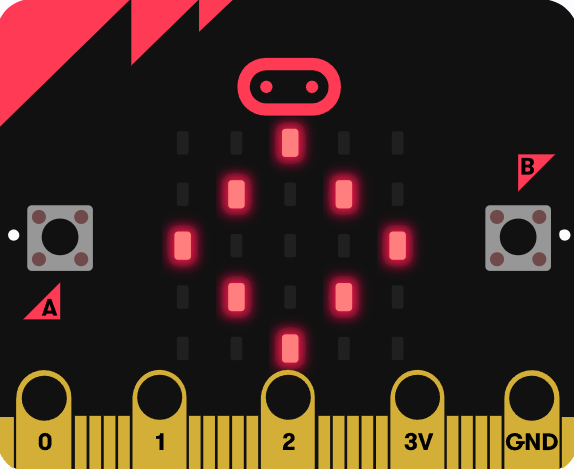
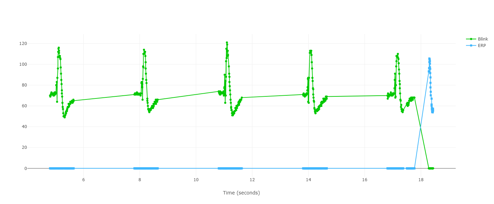

import ReactPlayer from 'react-player';

# Blink:Bit #


|     |       |
|--------------|--------------
| Inventor     | Teruaki Kimishima             
| micro:bit IDE     | Python Editor
| Best Location     | Makerspace 

# Overview #
Welcome to Project Blink:Bit! Here, you can experiment with real-time eye blink detection. This project utilizes a pair of micro:bit and Spiker:bit devices, leveraging muscle movements around your eyes and EOG (Electrooculography) filtering to detect blinks.

# Video #
<ReactPlayer playing controls url='/video/nb_eyeblink.mp4' />

## Materials ##
To get started with this project, you will need the following materials:

1. micro:bit
2. Spiker:bit

## Know where to place electrodes ##
Proper placement of the electrodes is crucial for accurate detection. Follow these steps to correctly position them:

1. First Electrode: Place the first electrode on the outer canthus.
2. Second Electrode: Position the second electrode just below the eye.
3. Third Electrode (Ground): Place the last electrode behind the ear, on the bony area. This electrode serves as the "Ground" and is essential for reducing noise in the signal.

Make sure all electrodes are placed on the **same side** of the face and as **close as possible** to the eyes (except for ground electrode) for optimal performance.

## Connecting right cables to right place ##
Placing the Red Alligator Clips:
- Red Clip with Black Dot:
  Look for the red alligator clip with a black dot.
  Attach this clip to the electrode placed below the eye.
- Red Clip without Black Dot:
  The second red alligator clip, which does not have a black dot, should be attached to the electrode on the outer canthus of the eye.
  
Placing the Black Alligator Clips:
- The black alligator clips are to be connected to the "Ground" electrode, which is located behind the ear.





If you don't see a black dot, don't worry. You can place the red clips randomly and the black clip behind the ear. We'll guide you on how to verify the correct placement later.

## Additional Tip (optional) ##
If you're unsure about the clips or can't find the black dot, you can also use a device to check the electrical connectivity, such as a Digital Multimeter (DMM). Follow these steps to identify the clips:
- Positive Cable: Attach the positive cable (usually red) to one of the red alligator clips.
- Negative Cable: Connect the negative cable (usually black) to the audio jack port on the device.

Checking Connectivity:
- Edge of Audio Jack: If the DMM beeps when the positive cable is connected to the edge of the audio jack, this is the black-dotted red alligator clip (inverting input voltage). Therefore, it should be placed below the eye.
- Middle of Audio Jack: If the DMM beeps when the positive cable is connected to the middle of the audio jack, this is the non-black-dotted red alligator clip (non-inverting input voltage). Therefore, it should be placed on the outer canthus of the eye.
  
Using these methods will ensure that your alligator clips are correctly placed, leading to accurate eye blink detection.




## Prepare Preprocessing ##
1. Setup:  
- Take out your micro:bit.
- Insert it into the Spiker:bit.
- Connect the cable to the Spiker:bit.

2. Using the Online Python Editor:
We will use the online Python editor provided by micro:bit. You can access it directly from [here](https://python.microbit.org/v/3).

3. Install the Program:
Ensure that the power of the Spiker:bit is **turned off**. This is important to prevent potential issue
- Refer the code below
- Connect your micro:bit to your computer via USB.
- Click on the download

```py title="EOG-Preprocessing"
from microbit import *
import log
import random

trials = 0 
size = 90 #Size of an array/number of points
set_trials = 5 #Modify set_trials to change number of blink tirals
preprocessing = True
processing = False
T = [0.0] * 90
T_tmp = []
log.set_labels('Blink','ERP')
real_time_recording = False
T_avg = 0


#Preprocessing function
@run_every(s=random.randint(3,5)) 
def preprocessing_function():
    global preprocessing, trials
    if preprocessing:
        trials += 1
        count = 0
        display.show(Image.HEART)
        while count < size:
            val = pin0.read_analog()
            T[count] += val
            log.add({'Blink': val})
            count += 1
            sleep(5)
    
#Preprocessing
while trials < set_trials:
    display.show(Image.GHOST)

#Stop preprocessng
preprocessing = False

#Pause the program for 0.5sec
sleep(500)

#ERP calculation
for i in range(len(T)):
    T[i] = T[i] / set_trials

#ERP bounding
max_index = T.index(max(T))
min_index = T.index(min(T))
upper_bound = T[max_index] * 0.85
lower_bound = T[min_index] * 1.15
start = 0
end = len(T)
padding = 5
if max_index - padding > 0:
    start = max_index - padding
if min_index + padding < end:
    end = min_index + padding
T = T[start:end]

#ERP plot
for i in range(len(T)):
    log.add({'ERP':T[i]})

#T_avg caluculation
size = len(T)
T_avg = sum(T) / size

display.show(Image.DIAMOND)
```

4. Post-Installation:
After a successful installation, within 3 seconds, unplug the USB connector from the micro:bit.
If you turned off the Spiker:bit earlier, there should be no LED lights displayed on the micro:bit screen.
Ensure that the Spiker:bit switch (on the back) is in **ECG mode**.

## Begin Preprocessing ##
Now that your program is installed, it is time for preprocessing!

**PLEASE READ ALL INSTRUCTIONS BEFORE YOU BEGIN.**

1. Turn on the Spiker:bit:

2. LED appears on the Spiker:bit device:
- Ghost LED:
Soon after powering on, you will see a GHOST LED appear on your screen.



- Heart LED:
Within a few seconds (default is 3 to 5 seconds), the LED will change to a HEART. Once you see the HEART, **pease blink as usual**.



- Diamond LED:
Continue blinking as usual until the DIAMOND LED appears on the screen.



CAUTION:
This process is crucial for accurate data acquisition later on. Therefore, while the program is running, please ensure that:
- Your head remains fixed.
- Your eyes stay focused on the center of the screen at all times.

## Check Preprocessed Data ##
As explained previously, if you were not able to figure out the correct placement for the red alligator clips, this is where to check!

1. Connect Spiker:bit to Your Computer:
After the preprocessing, **turn off** the power of the Spiker:bit.
Using a USB cable, connect the Spiker:bit to your local computer.

2. Open File Explorer:
Open the file explorer on your computer.
You should see a new drive named "MICRObit".

3. Navigate to MICRObit Drive:
Navigate to the MICRObit drive.
You should see an HTML file named "MY_DATA".

4. Open Visual Preview:
Double-click the "MY_DATA" file to open it.
Click on "Open Visual Preview".

5. Compare Data:
Compare the displayed data with the figure below. Does the shape of the green line look similar? If so, you're in good shape!
If not, flip your red alligator clips and try again.



Troubleshooting:
If this is still not working, please check:
- Your electrode placement (closer to eyes).
- Alligator clips placement.
- Spiker:bit switch (ensure it's in ECG mode).

Try again after making these adjustments.


## Prepare Real-Time Blink Aquisition ##
Great job for getting this so far! Now that you have your preprocessed data ready, it's time to move on to real-time blink acquisition.

BENEATH the program for preprocessing, paste the code below.

```py title="EOG-Real_Time"
# Define the open eye image
open_eye = Image("09990:"
                 "90009:"
                 "90909:"
                 "90009:"
                 "09990")

# Define the closed eye image
closed_eye = Image("00000:"
                   "00000:"
                   "99999:"
                   "00000:"
                   "00000")

#Pause the program for three seconds
sleep(3000)

#Begin processing
S = [0.0] * size
S_avg = 0

NCC_list = [2.0] * 3
real_time_recording = True
processing = True

@run_every(ms=1)
def processing_function():
    global processing,size,upper_bound,lower_bound
    if processing:
        val = pin0.read_analog()
        top = 0
        bottom_T = 0
        bottom_S = 0
        pass_upper_bound = False
        pass_lower_bound = False
        run_NCC = False
        S.pop(0)
        S.append(val)
        S_avg = sum(S)/size
        NCC = 0
        for i in range(size):
            if S[i] > upper_bound:
                pass_upper_bound = True
            if S[i] < lower_bound:
                pass_lower_bound = True
            if pass_upper_bound and pass_lower_bound:
                run_NCC = True
                break
        if run_NCC:
            for i in range(size):
                top += (T[i] - T_avg) * (S[i] - S_avg)
                bottom_T += (T[i] - T_avg) ** 2
                bottom_S += (S[i] - S_avg) ** 2
            NCC = top / ((bottom_T ** 0.5) * (bottom_S ** 0.5))
        NCC_list.pop(0)
        NCC_list.append(NCC)
        if NCC > 0.5:
            if NCC_list[0] < NCC_list[1] and NCC_list[1] > NCC_list[2]:
                display.show(closed_eye)
                sleep(100)


while real_time_recording:
    display.show(open_eye)
    if button_a.get_presses():
        break

display.show(Image.DIAMOND)
```
Now you should have a complete program that includes everything you need to run the entire process, from preprocessing to real-time blink acquisition.

## Begin Real-Time Blink Aquisition ##
Turn on the Spiker:bit
Before running the real-time acquisition, you must go through the preprocessing step each time. Once preprocessing is complete, an OPEN EYE will appear on micro:bit screen, indicating that the system is ready to test your blinks. 

If everything is functioning correctly, a CLOSED EYE should briefly appear on the screen whenever a blink is detected. 

## Tips for improvement ##
As the results of this project can vary due to numerous influencing factors, here are some tips to help improve the accuracy of your blink detection. In other words, if you are seeing the SAD FACE too often or not at all, try the following adjustments:

- Adjust NCC (Normalized Cross Correlation) Threshold
  
  At the end of the code, you should see a line like this:
  ```py title="NCC"
  if NCC > 0.5:
   ```
  In general, if you increase the threshold, detection will become harder, reducing false positives (e.g., seeing a SAD FACE when you shouldn’t). Conversely, if you lower the threshold, detection becomes easier, reducing false negatives (not seeing a SAD FACE when you should).
  
  **Why this?:** Normalized Cross Correlation (NCC) is commonly used as a strategy for image template matching. When two data are very similar, the NCC value is close to 1 (perfect correlation), and when they are very different, the NCC value is close to -1 (inverse correlation). In our project, we used NCC to compare the closeness of preprocessed blink data with real-time data. 
  
- Change the Number of Blinks in the Preprocessing Stage
  
   By default, you blink five times before beginning real-time data acquisition. You can change this number by modifying the following line:
  ```py title="set trials"
  set_trials = 5 #Modify set_trials to change number of blink tirals
  ```
  Generally, more data is better, but to save the time it takes to process, I recommend to keep this number below 10.
  
  **Why this?:** As explained previously, preprocessing data is critical for this project. Therefore, having adjustments typically improves preprocessing accuracy. How this works is very simple. Every time you blink, the data is recorded. After you have blinked for all trials, the micro:bit
will sum all the "raw" blink data and then average it out. This way, we have a higher chance of ignoring "bad" blinks. Therefore, the more "raw" blinks we have, the better chance we can ignore those.

Remember, perfect real-time data processing is challenging. Even with adjustments, some errors are inevitable due to the precise nature of eye movements. It’s important to make adjustments one at a time, as too many changes at once may degrade the performance rather than improve it.

