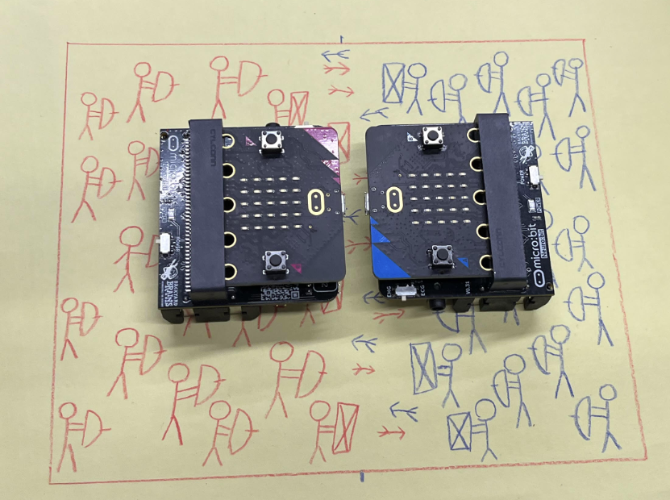
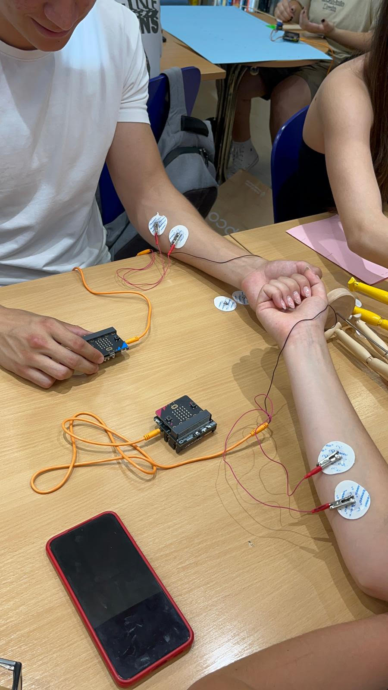

# The War Game


|     |       |
|--------------|--------------
| Inventor     | Todor Šolajić and Mila Urošević            
| micro:bit IDE     | Block Code 
| Best Location     | Classroom

## Project Overview
Are you tired of the powerful red army always winning over your troops? Well, fear no more,
because we have a solution for you! The War Game is a fun 2-player game which tests your
logical skills and makes the time fly by.

With one grip of your hand you can choose which move you want to make, but be careful!
Each move makes you vulnerable in a different way and gives the opponent a chance to
make a move in their favour. So choose wisely and most importantly have fun!
We used two Spiker:bit kits with micro:bit, electrodes and cables combined with some
programming skills to bring this idea to life.


## Materials needed
- 2x Spiker:bit and micro:bit, including two emg cables
- Cosmetics for making your armies this can be:
      Action figures
      Paper with red and blue stick figures
      3D printed casings in red and blue

## Coding
At first we needed to make the game accessible to everybody, which is why we needed to
create a separate code that automatically measures the strength each player needs to use
to make each move. This is important because the strength needed differs from person to
person and it also depends on the placement of electrolytes. We achieved this with the
following code:

We also needed to make sure the players made their moves at the same time for the game
to work, which is why added the sound effects and time intervals:

A big part of the game is the communication between the two micro:bits. We wanted them to
register which moves the players chose, but also to react to the other player’s decision and
react based on that. With this communication we were able to program the micro:bits to
automatically count and display the amount of arrows each player has, as well as count their
lives and display the outcome in the end
```
def on_received_string(receivedString):
    global life, DONE
    if receivedString == "shoot":
        if not (sentString == "shield"):
            life = life - 1
            basic.show_leds("""
                . # . # .
                . # . # .
                . . . . .
                . # # # .
                # . . . #
                """)
    elif receivedString == "reload":
        if sentString == "shoot":
            basic.show_leds("""
                . # . # .
                . # . # .
                . . . . .
                # . . . #
                . # # # .
                """)
    elif receivedString == "shield":
        pass
    elif receivedString == "LOSE":
        DONE = True
        basic.show_string("YOU WIN")
    elif receivedString == "BAD":
        if sentString == "shoot":
            basic.show_leds("""
                . # . # .
                . # . # .
                . . . . .
                # . . . #
                . # # # .
                """)
radio.on_received_string(on_received_string)

index = 0
maxsignal = 0
y_position = 0
x_position = 0
DONE = False
sentString = ""
threshold_1 = 0
threshold = 0
val = 0
life = 0
basic.pause(3000)
life = 3
numShiled = 2
allowShiled = 2
ammo = 5
StartTime = control.millis()
music.play(music.tone_playable(262, music.beat(BeatFraction.HALF)),
    music.PlaybackMode.UNTIL_DONE)
while control.millis() - StartTime < 3000:
    val = pins.analog_read_pin(AnalogPin.P0)
    threshold = max(threshold, val)
basic.pause(1000)
StartTime = control.millis()
music.play(music.tone_playable(262, music.beat(BeatFraction.HALF)),
    music.PlaybackMode.UNTIL_DONE)
while control.millis() - StartTime < 3000:
    val = pins.analog_read_pin(AnalogPin.P0)
    threshold_1 = max(threshold_1, val)

def on_every_interval():
    global x_position, y_position, StartTime, maxsignal, val, ammo, sentString, numShiled, index, DONE
    if not (DONE):
        radio.set_group(1)
        x_position = 0
        y_position = 0
        # threshold = 100
        # threshold_1 = 500
        if life > 0:
            music.play(music.tone_playable(262, music.beat(BeatFraction.WHOLE)),
                music.PlaybackMode.UNTIL_DONE)
            StartTime = control.millis()
            maxsignal = 0
            while control.millis() - StartTime < 1000:
                val = pins.analog_read_pin(AnalogPin.P0)
                if val > maxsignal:
                    maxsignal = val
            if maxsignal >= threshold_1:
                if ammo > 0:
                    ammo = ammo - 1
                    sentString = "shoot"
                    numShiled = 0
                    radio.send_string("shoot")
                    basic.show_leds("""
                        . . # . .
                        . # # # .
                        . . # . .
                        . . # . .
                        . # . # .
                        """)
                    basic.clear_screen()
                else:
                    radio.send_string("BAD")
            elif maxsignal < threshold * 0.7:
                ammo = ammo + 1
                numShiled = 0
                sentString = "reload"
                radio.send_string("reload")
                basic.show_leds("""
                    . . . . #
                    . # . # #
                    # # # . #
                    . # . . #
                    . . . . #
                    """)
                basic.clear_screen()
            else:
                if numShiled < allowShiled:
                    sentString = "shield"
                    numShiled = numShiled + 1
                    radio.send_string("shield")
                    basic.show_leds("""
                        # . . . #
                        . # . # .
                        . . # . .
                        . # . # .
                        # . . . #
                        """)
                    basic.clear_screen()
                else:
                    radio.send_string("BAD")
            if ammo < 0:
                ammo = 0
            if ammo > 10:
                ammo = 10
            index = 0
            while index <= ammo - 1:
                if index > 4:
                    x_position = index % 5
                    y_position = 3
                else:
                    x_position = index
                    y_position = 4
                led.plot(x_position, y_position)
                index += 1
        else:
            radio.send_string("LOSE")
            DONE = True
            basic.show_string("YOU LOSE")
loops.every_interval(9000, on_every_interval)

```

