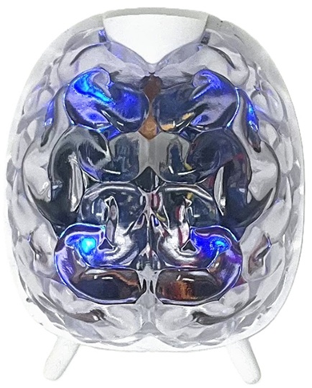

# SpikerBot #

The SpikerBot is a neurorobot - a robot controlled by a computer model of a biological brain. These models simulate real biological mechanisms, including neuronal spikes and synaptic inhibition, enabling users to explore how the brain processes sensations and controls actions. Designed for education and research, the SpikerBot provides a hands-on way to develop, test, and refine neural models, bridging neuroscience and robotics in a practical, accessible manner.

Equipped with a camera to see, a distance sensor to sense touch, a speaker and lights to communicate, and motors to move, the SpikerBot brings neuroscience concepts to life. It connects via Wi-Fi to the SpikerBot app, where users can design and run neural networks that control the robot's behavior in real time.

## Getting Started ##

[PDF instructions](./sbot_intro.pdf)

### Quick Start ###

1. Turn the SpikerBot on using the power switch underneath the robot.
2. Connect your device to the SpikerBot's Wi-Fi network (the network name is written on the robot).
3. Wait for the robot’s lights to change from blue to green, indicating its Wi-Fi is connected and ready to use.
4. Open the SpikerBot app and press play to start controlling the robot with your neural networks.

## Technical Specifications ##

|||
|---|---|
|Step time |	100ms|
|Power supply |	4xAA batteries|
|Battery life |	4 hrs|
|Control Buttons | On/Off|

## Troubleshooting ##

No Response from Robot: Check that it’s turned on and charged.
Wi-Fi Connection Issues: Ensure you’re connected to the correct robot’s WiFi network, the robot’s LEDs should change from blue to green when the WiFi connection is established.
Movement Problems: Check wheels and tires, re-seat if necessary.
Camera Recognition Issues: Adjust lighting, use a clearer color sample and check the camera view to see what the robot “sees”.

If the SpikerBot still doesn't move send us an email at hello@backyardbrains.com or give us a call at  +1 (855) GET-SPIKES (855-438-7745) 