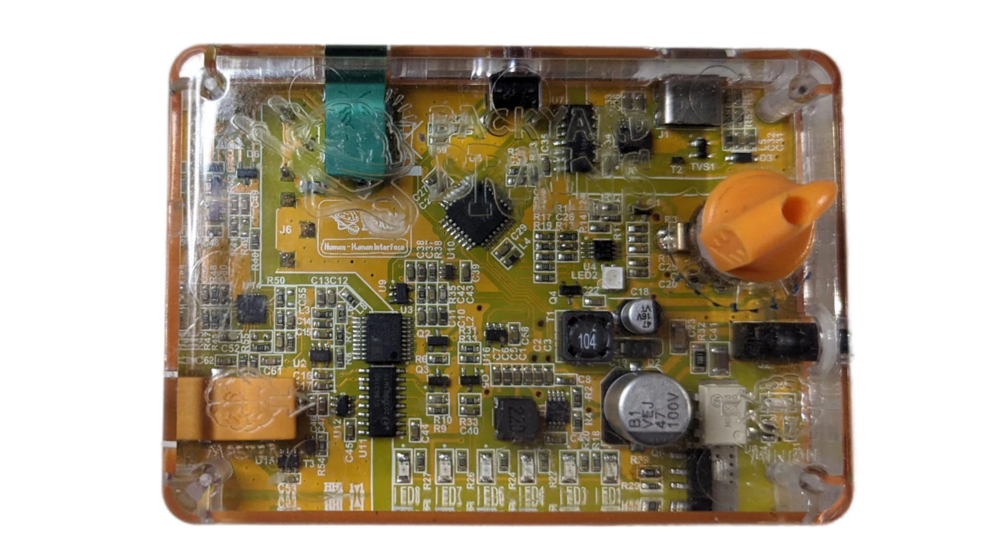

# Human-Human Interface (HHI) User Manual (v3.0 -  2025)

## Overview

**Connecting with other people takes on a whole new meaning with our Human-Human Interface (HHI)!**

The HHI is an educational tool designed to demonstrate the principles of neurophysiology and bioelectric communication. By capturing electrical signals generated by one person's muscles (the "Master") and transmitting them to another person's muscles (the "Minion"), the HHI effectively allows one person to control the movements of another's arm. This fascinating device bridges the gap between theoretical neuroscience concepts and real-world applications, making it an ideal resource for educators seeking to inspire students in the field of neuroscience.

## What's New in Version 3.0

The HHI 3.0 introduces new features that expand its educational potential:

- **Wireless Connectivity:** Configure the device via Bluetooth Low Energy (BLE) to connect over a network, enabling remote control capabilities.
- **Multiple Operating Modes:** Three operational modes allow for customizable experiments:
  - **Mode 0:** Traditional HHI operation without the need for an app or internet connection.
  - **Mode 1 & 2:** Remote control and remote minion modes, allowing for control over the internet or within the same room.
  - **Mode 3:** Custom stimulation protocols with adjustable parameters for advanced experiments.
- **Enhanced Educational Applications:** The new modes enable exploration of additional neuroscience experiments, including remote neural control and custom stimulation protocols.

## Kit Contents

- **1 x Human-Human Interface (HHI) Device**
- **1 x 9V Battery**
- **1 x EMG Input Cable (Orange)**
- **1 x Stimulation Output Cable (Black)**
- **50 x Electrode Patches** for EMG recording and stimulation
- **User Manual**

## Device Layout

*Figure: HHI interface showing key components.*

- **Power/Intensity Knob:** Turns the device on/off and adjusts the stimulation intensity.
- **Sensitivity Button:** Adjusts the EMG signal threshold required to trigger stimulation.
- **LED Indicators:**
  - **Power LED:** Indicates device status and battery level.
  - **Stimulation LED:** Indicates when stimulation is being delivered.
- **USB-C Port:** For connecting to the SpikeRecorder app and configuring device settings.
- **EMG Input Jack (Orange):** Connects to the Master for EMG signal input.
- **Stimulation Output Jack (Black):** Connects to the Minion for muscle stimulation.

## Specifications

### General

- **Power Supply:** 1 x 9V battery
- **Battery Life:** Approximately 8 hours of continuous use
- **Communication:** USB-C and Bluetooth Low Energy (BLE)
- **Electrical Safety:** Type BF (Body Floating), compliant with IEC60601-1 standards

### Recording (EMG Input)

- **Sampling Rate:** 10 kHz
- **Frequency Range:** 20 Hz – 2 kHz
- **Input Filtering:** Adjustable in custom modes via the SpikeRecorder app

### Stimulation Output

- **Output Voltage:** Up to 95 V
- **Stimulation Current:** Adjustable from 0 to 30 mA
- **Stimulation Type:** Monophasic compensated (Mode 0), Biphasic in custom modes
- **Pulse Frequency:** Fixed at 50 Hz (Mode 0), adjustable in custom modes
- **Pulse Width:** 250 µs (Mode 0), adjustable in custom modes
- **Safety Features:** Automatic shutoff after continuous stimulation to prevent overexposure

## Operating Modes

### Mode 0: Traditional HHI Operation (Default)

- **Functionality:** Classic HHI experience where the Master controls the Minion's arm movement through muscle signals.
- **Setup:** Requires only the HHI device, no app or internet connection needed.
- **Adjustments:**
  - **Sensitivity Button:** Modifies the EMG threshold.
  - **Intensity Knob:** Adjusts stimulation strength.
- **LED Indicators:**
  - **Power LED:** Solid green when powered on.
  - **Stimulation LED:** Yellow when stimulation is delivered.

### Mode 1: Remote Controller

- **Functionality:** The Master can remotely control the Minion's device over a network connection.
- **Setup:** 
  - Use the SpikeRecorder app to configure Wi-Fi settings and connect devices.
  - Requires both devices to be connected to the internet.
- **Adjustments:**
  - **Sensitivity Button:** Adjusts EMG threshold for triggering remote stimulation.
- **LED Indicators:**
  - **Power LED:** Blinks yellow while connecting, solid yellow when connected.

### Mode 2: Remote Minion

- **Functionality:** The Minion receives stimulation commands from a remote Master.
- **Setup:** Similar to Mode 1, configure via the SpikeRecorder app.
- **Adjustments:**
  - **Intensity Knob:** Sets the maximum stimulation amplitude.
- **LED Indicators:**
  - **Power LED:** Blinks blue while connecting, solid blue when connected.
  - **Stimulation LED:** Yellow when receiving stimulation.

### Mode 3: Custom Stimulation Protocol

- **Functionality:** Advanced mode for custom experiments, allowing precise control over stimulation parameters.
- **Setup:** Configure using the SpikeRecorder app via BLE or USB connection.
- **Adjustments:**
  - **Input Filtering:** Customize filters to record different biological signals.
  - **Stimulation Parameters:** Adjust frequency, pulse width, amplitude, and trigger conditions.
  - **Trigger Options:** EMG threshold, button press, or software-controlled triggers.
- **LED Indicators:**
  - **Power LED:** Solid orange when in custom mode.
  - **Stimulation LED:** Yellow when stimulation is active.

## Safety and Precautions

**Important:** Read all safety information before operating the HHI.

- **Medical Conditions:** Do not use the HHI if you have a pacemaker, implanted electronic device, metallic implants, epilepsy, heart disease, or are pregnant.
- **Electrode Placement:** Never place electrodes on the head, neck, across the chest, or on sensitive areas. Only place electrodes on the recommended areas (forearms).
- **Skin Care:** Clean skin before applying electrodes. Do not place electrodes on broken or irritated skin.
- **Device Handling:** Do not use near water or in high-humidity environments. Avoid dropping or subjecting the device to strong impacts.
- **Supervision:** Adult supervision is required for high school users and younger participants.
- **Allergic Reactions:** Discontinue use if skin irritation occurs.
- **Vasovagal Response:** If a participant feels faint or dizzy, stop the experiment and have them rest.

## Setting Up the HHI

### 1. Inserting the Battery

- Locate the battery compartment on the bottom of the device.
- Insert a 9V battery, ensuring proper polarity.

### 2. Connecting the Master (EMG Recording)

- **Electrode Placement (Master):**
  - Place two electrode patches on the inside of the forearm, about two finger widths apart.
  - Place a third electrode on the back of the hand (ground reference).
- **Cable Connection:**
  - Connect the orange EMG input cable to the orange jack labeled "Master."
  - Attach the two red alligator clips to the electrodes on the forearm.
  - Attach the black alligator clip to the electrode on the back of the hand.

### 3. Initial Device Activation

- Turn the Power/Intensity knob clockwise until you hear a click—the device is now on.
- The Power LED should illuminate, indicating the device is powered.

### 4. Observing EMG Signals

- When the Master flexes their forearm muscles, the LED bar on the device will light up from green to red, indicating the strength of the EMG signal.
- Use the Sensitivity Button to adjust the threshold required to trigger stimulation (more presses increase the difficulty).

### 5. Connecting the Minion (Stimulation Output)

- **Electrode Placement (Minion):**
  - Place two electrode patches on the Minion's forearm. A common placement is on the top of the forearm, about three finger widths below the elbow.
- **Cable Connection:**
  - Connect the black stimulation output cable to the black jack labeled "Minion."
  - Attach the alligator clips to the electrodes on the Minion's forearm (color does not affect functionality).

### 6. Adjusting Stimulation Intensity

- With the device on and both participants connected, have the Master flex their muscles to light up the red LEDs.
- Slowly turn the Power/Intensity knob clockwise to increase stimulation intensity.
- **Important:** Increase intensity gradually. The Minion should feel the stimulation but not experience discomfort.

## Operating the HHI

### Adjusting Sensitivity (Master)

- Use the Sensitivity Button to set the EMG signal threshold:
  - Pressing the button cycles through sensitivity levels.
  - A higher threshold requires stronger muscle contractions to trigger stimulation.

### Adjusting Stimulation Intensity (Minion)

- Turn the Power/Intensity knob to control stimulation strength:
  - Clockwise increases intensity.
  - Counterclockwise decreases intensity.
- **Note:** Always start at the lowest intensity and increase gradually.

### LED Indicators

- **Power LED:**
  - **Green:** Device is on and functioning normally.
  - **Blinking Red:** Low battery warning.
  - **Solid Red:** Battery needs replacement; stimulation is disabled until the battery is replaced.
  - **Yellow/Blue/Orange:** Indicates current operating mode.
- **Stimulation LED:**
  - **Yellow:** Stimulation is being delivered to the Minion.

## Advanced Features with SpikeRecorder App

### Connecting via Bluetooth Low Energy (BLE)

- **Download SpikeRecorder:** Available for Windows, macOS, iOS, and Android.
- **BLE Connection:**
  - Enable Bluetooth on your device.
  - Open SpikeRecorder and connect to the HHI.
- **Configuration:**
  - Set up Wi-Fi for remote modes.
  - Customize stimulation parameters in Mode 3.

### Remote Operation (Modes 1 & 2)

- **Mode 1 (Remote Controller):**
  - Configure the HHI to send EMG signals over the internet to a Minion's device.
- **Mode 2 (Remote Minion):**
  - Set up the HHI to receive remote stimulation commands from a Master.
- **Security:**
  - Use unique channel IDs and passwords to ensure secure connections.

### Custom Stimulation Protocols (Mode 3)

- **Adjustable Parameters:**
  - Input filtering for different signals.
  - Stimulation frequency, pulse width, and amplitude.
  - Trigger conditions (EMG threshold, button press, or app control).
- **Applications:**
  - Advanced neuroscience experiments.
  - Exploring bioelectric phenomena beyond muscle stimulation.

## Maintenance and Storage

- **Cleaning:**
  - Wipe the device with a soft, dry cloth.
  - Do not use harsh chemicals or immerse in liquids.
- **Battery Care:**
  - Remove the battery if the device will not be used for an extended period.
  - Replace the battery when the Power LED indicates low power.
- **Storage:**
  - Keep the device in a cool, dry place.
  - Avoid extreme temperatures and humidity.
- **Electrodes:**
  - Electrodes are intended for single-use.
  - Discard after use to maintain hygiene and signal quality.

## Troubleshooting

### Power Issues

- **Device Won't Turn On:**
  - Ensure the battery is installed correctly.
  - Replace the battery with a new 9V battery.
- **Power LED Blinking Red:**
  - Battery is low; replace it to resume operation.

### EMG Signal Issues

- **LED Bar Not Responding:**
  - Check electrode connections on the Master.
  - Ensure the orange cable is securely connected.
  - Adjust the Sensitivity Button settings.
- **Continuous Full LED Bar:**
  - Reduce electrical noise by moving away from electronic devices.
  - Check for proper grounding (black electrode on the back of the hand).

### Stimulation Issues

- **No Stimulation Felt by Minion:**
  - Increase the stimulation intensity gradually.
  - Check electrode placement and connections on the Minion.
- **Stimulation Felt but No Movement:**
  - Adjust electrode placement for better muscle response.
  - Increase intensity cautiously.
- **Device Not Responding in Remote Modes:**
  - Ensure both devices are connected to the internet.
  - Verify matching channel IDs and passwords.
  - Check Wi-Fi settings in the SpikeRecorder app.

## Warranty and Support

### Warranty

The HHI comes with a **1-year limited warranty** covering defects in materials and workmanship under normal use. The warranty does not cover:

- Damage due to misuse or neglect
- Unauthorized modifications or repairs
- Cosmetic damage not affecting functionality

### Customer Support

For technical support, troubleshooting assistance, or to make a warranty claim, please contact us:

- **Email:** [support@backyardbrains.com](mailto:support@backyardbrains.com)
- **Website:** [www.backyardbrains.com/support](https://www.backyardbrains.com/support)

Our dedicated team is ready to help you make the most of your HHI experience.

## Educational Applications

The HHI opens up a range of possibilities for classroom demonstrations and experiments:

- **Neurophysiology Demonstrations:** Illustrate how electrical signals control muscle movements.
- **Remote Neuroscience Labs:** Conduct experiments across classrooms or even internationally using remote modes.
- **Custom Experiments:** Explore bioelectric signals in plants, muscle conduction velocity, and more with custom stimulation protocols.

**Inspire the next generation of neuroscientists with hands-on, interactive learning experiences using the HHI!**

---

**Note to Educators:** Always ensure that all participants understand the procedures and safety precautions before commencing experiments. The HHI is a powerful tool for learning but must be used responsibly to ensure a safe and educational experience for everyone involved.

---

**Safety Symbols Used:**

- **Type BF Applied Part:** Indicates the device is safe for external use on the body.
- **Refer to Manual:** Alerts the user to consult the manual for important information.
- **Direct Current (DC):** The device uses DC power from a battery.

---

By fostering an interactive and engaging environment, the HHI bridges the gap between theoretical concepts and tangible experiences, enhancing the educational journey in the neurosciences.