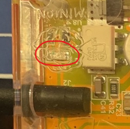

# Human-Human Interface #

## Technical Specifications ##

|||
|---|---|
|Sampling Rate |10k|
|Frequency Range |20Hz – 2kHz|
|Power supply |9V battery|
|Battery life |8 hr|
|Communication |USB 2.0|
|Electrical safety |Type BF|
|Certification 	|IEC60601-1|
|Output voltage |95V|
|Stimulation current |0 - 30mA|
|Stimulation type |Biphasic|

[Here is the technical schematic](https://backyardbrains.com/products/files/HHI2_Schematics_V1.01.pdf)

## Experiments ##

[How to take someone's free will?](https://backyardbrains.com/experiments/humanhumaninterface)\
[Eavesdrop on electrical activity of your bigger muscles.](https://backyardbrains.com/experiments/\muscleSpikerbox)\
[Take a peek into the smaller muscles’ action potentials.](https://backyardbrains.com/experiments/muscleactionpotential)\
[Why do our muscles get tired or even fail after exercise?](https://backyardbrains.com/experiments/fatigue)\
[Measure the rate of your muscle fatigue.](https://backyardbrains.com/experiments/rateoffatigue)

## Troubleshooting ##

Check out the [General Troubleshooting steps](../../index.md#troubleshooting)

When connecting to SpikeRecorder via USB, don't use the "select port" menu, instead just wait up to 30 seconds, and the board will connect automaitcaly.

If you're able to read EMG, but the "minion" doesn't feel any stimulation:

Let's try slowly increasing the intensity by using the dial on the board.

The stimulation will only happen while LED5(Picture below) is on, if it is on for too long(4-5seconds), it will turn off automatically, if this happens, turn the box off and on again. 

We can also test the stimulation signal independently of the EMG signal (and not use up muscle patch electrodes in the process).
Plug in the orange cable, clip all 3 alligator clips together, turn the box on, disconnect one of the red clips and you should see LED5 turn on.