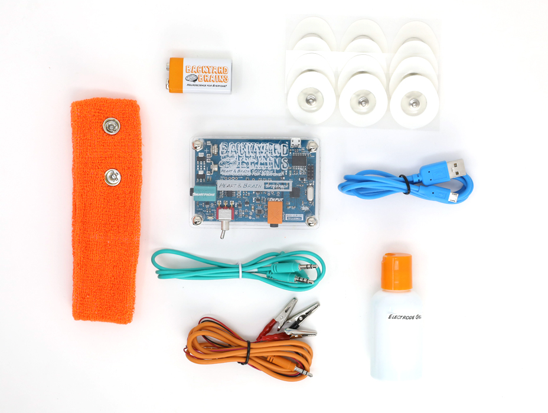

# The Heart and Brain SpikerBox #

With our Heart and Brain SpikerBox, you can view and record the action potentials of your heart (EKG) and the slow rhythms of your brain (EEG) 

## Getting Started ##

Decide which experiment you want to do and gather all the required materials for it.

Below are some basic setup steps for recording ECG and EEG, for more advanced aplications, check out [our experiment pages](#experiments)

For the EKG experiment, it works best to place two patch electrodes on the inner wrists and one patch electrode as a ground on the back of the hand.

### EKG ###

Plug in the orange electrode cable to the corresponding orange jack at the front of the box.  
For EKG, the two red leads attach to the electrodes inside the wrists, and the black on the  back of the hand.  
For EEG, the two red leads attach to the clips on the headband, and the black ground behind the ear.  

### EEG ###

For EEG, place the headband with the metal electrodes on the top back of your head (over the visual cortex). The flat metal part should be making contact with your head, with a dab of electrode gel to increase contact.  
Place a patch electrode on the bony part behind your ear as a ground.  

### Recording ###

Power the Heart & Brain SpikerBox on with a 9V battery, and turn on the red switch at the front of the SpikerBox.   
If you are using a smartphone or tablet, plug the green smartphone cable into the green output jack to connect the Heart & Brain SpikerBox.  
If recording on a computer, plug the blue USB cable into the metal port on the back of the board to connect.  
Open [SpikeRecorder](../../Software/SpikeRecorder/) on your device.

## Technical Specifications ##

|||
|---|---|
|Sampling Rate|10k (1ch)|
|Frequency range|0.6Hz - 108Hz|
|Gain |3840x|
|Output|microUSB, Headphones/Smartphone|
|Inputs|1x [Orange Cable](https://backyardbrains.com/products/muscleElectrodeCable)|

[Download Schematic PDF](https://backyardbrains.com/products/files/HBSB_V2.pdf)

The [firmware](https://github.com/BackyardBrains/Heart-and-Brain-SpikerBox) on the H&B SpikerBox can be modified and uploaded through the [Arduino IDE software](https://www.arduino.cc/en/software)

## Experiments ##

[Measure Heart Action Potential](https://backyardbrains.com/experiments/heartrate)

[Record your Brain's EEG](https://backyardbrains.com/experiments/eeg)

[Detect the P300 Surprise Signal of the Brain](https://backyardbrains.com/experiments/p300)

[Learn about the Fight or Flight Sympathetic Nervous System Response](https://backyardbrains.com/experiments/Sympathetic_Nervous_System)

[Understanding the Electricity of the Eye](https://backyardbrains.com/experiments/eog)

## Troubleshooting ##

Check out the [General Troubleshooting steps](../../index.md)

Upload [This firmware](https://github.com/BackyardBrains/Heart-and-Brain-SpikerBox/blob/master/V0_62/Heart-and-Brain-SpikerBox/Heart-and-Brain-SpikerBox.ino)
Using the Arduino IDE software.