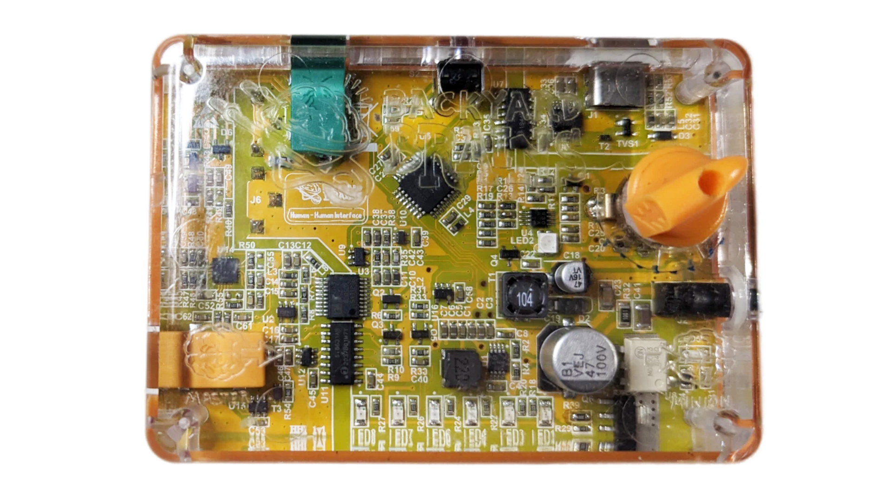
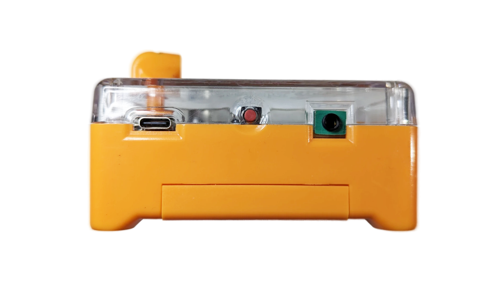
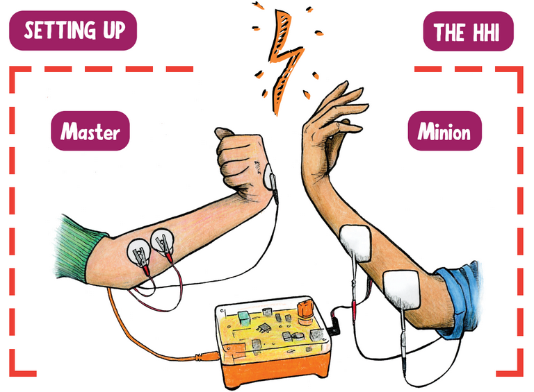
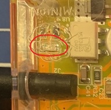

# Human-Human Interface #

The Human-Human Interface (HHI) facilitates the transmission of electrical signals from one person's brain to another person's muscles, allowing control over their movements. By reading electrical signals from the brain and sending them to command another person's muscles. It includes everything needed for both "Master" (signal sender) and "Minion" (signal receiver) roles, as well as making EMG recordings for analisys, when connected to our [Spike Recorder App](../../Software/SpikeRecorder/)

## Getting started ##

[PDF instructions](./HHI_Insert.pdf)

### Seting up ###

Master:

Insert the battery following the indicator on
the inside of the battery comparment.

Place two Master electrode pads on your lower inner forearm and a third pad on the back of your hand. Take the orange cable and connect its two red clips to the pads on your forearm.

Connect the remining black clip to the electrode on the back of your hand, to act as the ground. 
Connect the orange cable into the orange jack on the HHI device, labeled “Master”. 

Locate the Power/Intensity Knob on top of the HHI device. 
Turn the knob clockwise until you hear a click, indicating the device is turned on. 

Now, when you flex your muscles, you should see the LED bar located on the front of the HHI device light up from green to red.

The button on the back of the HHI device is for adjusting thresholds and sensitivity of the LED bar. The more you toggle and increase this setting from green to red, the more difficult it becomes for the signal to cross the threshold and stimulate the Minion.

Minion:

First, make sure the device is turned off and
that the Master is connected.

Plug the black cable into the black jack (labeled “Minion”), opposite of the orange jack/cable. 
Place two Minion electrodes on the inner forearm near the elbow of the Minion as see in the above photo. Connect the black plug to the lower electrode (nearest to the elbow) and the red plug to the upper electrode (nearest to your hand). 

Now, turn on the device but leave the intensity low. The input user (the Master) should flex, making sure to light up the red LED to reach the threshold. Slowly turn up the intensity by turning the knob until the Minion’s arm moves. If you have trouble, try extending your forearm out at 90
degrees, but be sure to keep it relaxed. The amount of movement is based on the stimulation current (controlled by turning the Power/Intensity Know) and the threshold (set with the button on the back of the HHI device). 
If a user is not comfortable with the stimulation, do not increase the intensity. If stimulation is felt but movement is not achieved, try rearranging electrode placements.

### Sensitivity Button ###

The red button on the back of the HHI device can be pressed to control the level of muscle activity necessary to light up the red LEDs on the LED bar and stimulate the Minion

The default sensitivity setting is the first yellow LED on the LED bar, and each button press moves the LED one step to the right, before going back to the green, the easiest setting. 
This difficulty adjustment allows for weaker EMG signals from muscles to be picked up by the HHI device, i.e., flexing your forearm versus moving one finger.

### Battery Replacement ###

The Power LED also indicates battery level. When the LED is green, the battery is still in working condition and is ready to be used.  
When the LED is solid red the battery should be replaced, and the stimulation is disabled until a new battery is inserted.   
The HHI device is NOT recommended for use with a rechargeable battery. ONLY use a 9V, non-rechargeable battery with the device.

### Intensity Dial ###

The knob located on the right side of the HHI acts as both the ON/OFF switch and intensity control. The knob is in the OFF position when it is pointed toward the upper right of the HHI (see diagram). An audible click occurs when you turn the knob clockwise, indicating you are turning ON the device, and the power LED will turn green.  
The same knob controls stimulation intensity. To increase the strength of stimulation sent to the Minion, turn the knob clockwise following the arrow direction printed around the knob.  
DO NOT make this adjustment in large incrementsbefore testing the strength of stimulation using the EMG input from the Master.  
To decrease strength of stimulation, turn the knob counterclockwise towards the OFF position.

## Technical Specifications ##

|||
|---|---|
|Sampling Rate |10k|
|Frequency Range |20Hz – 2kHz|
|Power supply |9V battery|
|Battery life |8 hr|
|Communication |USB 2.0|
|Electrical safety |Type BF|
|Certification 	|IEC60601-1|
|Output voltage |95V|
|Stimulation current |0 - 30mA|
|Stimulation type |Biphasic|

[Here is the technical schematic](https://backyardbrains.com/products/files/HHI2_Schematics_V1.01.pdf)

## Experiments ##

[How to take someone's free will?](https://backyardbrains.com/experiments/humanhumaninterface)\
[Eavesdrop on electrical activity of your bigger muscles.](https://backyardbrains.com/experiments/\muscleSpikerbox)\
[Take a peek into the smaller muscles’ action potentials.](https://backyardbrains.com/experiments/muscleactionpotential)\
[Why do our muscles get tired or even fail after exercise?](https://backyardbrains.com/experiments/fatigue)\
[Measure the rate of your muscle fatigue.](https://backyardbrains.com/experiments/rateoffatigue)

## Troubleshooting ##

Check out the [General Troubleshooting steps](../../index.md)

When connecting to SpikeRecorder via USB, don't use the "select port" menu, instead just wait up to 30 seconds, and the board will connect automaitcaly.

If you're able to read EMG, but the "minion" doesn't feel any stimulation:

Let's try slowly increasing the intensity by using the dial on the board.

The stimulation will only happen while LED5(Picture below) is on, if it is on for too long(4-5seconds), it will turn off automatically, if this happens, turn the box off and on again. 

We can also test the stimulation signal independently of the EMG signal (and not use up muscle patch electrodes in the process).
Plug in the orange cable, clip all 3 alligator clips together, turn the box on, disconnect one of the red clips and you should see LED5 turn on.