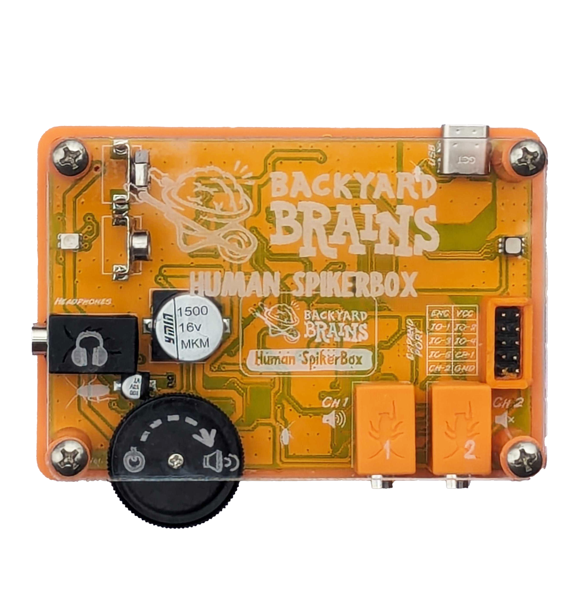

# Human SpikerBox #

## Getting Started ##

Decide which experiment you want to do and gather all the required materials for it.

Below are some basic setup steps for recording EMG/EEG/ECG, for more advanced aplications, check out [our experiment pages](#experiments)
### EMG ###

Place two patch electrodes on each end of the muscle you want to record, then clip a red lead from the orange cable onto each one. The photo shows a forearm EMG setup.

Place another electrode on the back of your hand and clip the orange cable’s black lead onto it.  
Plug the orange electrode cable into a channel on the SpikerBox. There are two channels, the first one (left) is connected to audio output.

### EEG ###

Place the headband with the metal electrodes around the top of your head. The flat metal buttons should make contact with your head, with a dab of electrode gel on them to increase connection. The area under your jaw should hold the band in place. The buttons should be over the Pz and P4 regions as shown.

Place a patch electrode on the bony part behind your ear as a ground.  
Clip the two red leads of the orange cable onto each metal button on the headband. Clip the black lead onto the ground electrode behind your ear.   
This is a preparation for the P300 experiment (see below). For other EEG experiments, see the BYB website experiments page.  
Plug the orange cable into one of the channels on the SpikerBox.  

### ECG/EKG ###

Place patch electrodes onto each of your inner wrists.   
Place another on the back of your hand as a ground.  
Clip the two red leads from the orange cable onto your wrist electrodes, and the black one onto the ground electrode.  
For other electrode placement options, reference the BYB website experiments page.  
Plug the orange cable into a channel on the SpikerBox.  

### Recording ###
Place a 9v battery into the Human SpikerBox.  
Power it on using the volume knob switch. This can of course also adjust speaker volume.  
Connect the Lightning to USB-C cable to the device and to your iPhone, sold separately, or use the included standard USB-C cable for other devices.  
Open SpikeRecorder and wait for the device to connect.  
If you are on iOS, set the filters to whichever experiment you are doing.  

## Technical Specifications ##

|||
|---|---|
|Sampling Rate|10k (2ch)|
|Frequency range|0.15-2000Hz|
|Gain when software bandpass filter high end is set above 70Hz|850x|
|Gain when software bandpass filter high end is set below 70Hz|3250x|
|Output|USB-C, Headphones/Smartphone, 2 Analog out pins|
|Inputs|2x [Orange Cables](https://backyardbrains.com/products/muscleElectrodeCable), 5x Digital Ins or 3x Digital Ins/2x Analog Ins|
|CMRR |>140dB|
|Input impedance differential mode|10Gohm|
|Input impedance common mode|5Gohm|

:::warning
Connecting to iOS devices with a lightning port requires our USB-C to Lightning cable which is sold seperately
:::

While it's possible to connect using our Green Smartphone cable, only the data from channel 1 will be transfered. Low frequency signals like EEG, EOG and ECG will be mostly or entirely filtered out by the phone or laptop when connecting using this method

## Experiments ##

[What are agonist and antagonist muscle pairs?](https://backyardbrains.com/experiments/musclespikerboxpro)

How does your [Patellar Reflex](https://backyardbrains.com/experiments/Musclekneejerk) compare to your [Reaction Time](https://backyardbrains.com/experiments/MusclReactionTime)?

[Can you find a single motor unit?](https://backyardbrains.com/experiments/MuscleSingleunit)

[How can you learn about muscle recruitment by eating candy?](https://backyardbrains.com/experiments/Musclechewing)

## Addon Devices ##

[The expansion port](../../Engineering/ExpansionPort) on the board can be used to expand the functionality, and can be used with a few addon devices:

[The Reaction Timer](./ReactionTimer/index.md)

[The Reflex Hammer](./ReflexHammer/index.md)

[The Game Controller](./GameController/index.md)

## Troubleshooting ##

Check out the [General Troubleshooting steps](../../index.md#troubleshooting)
