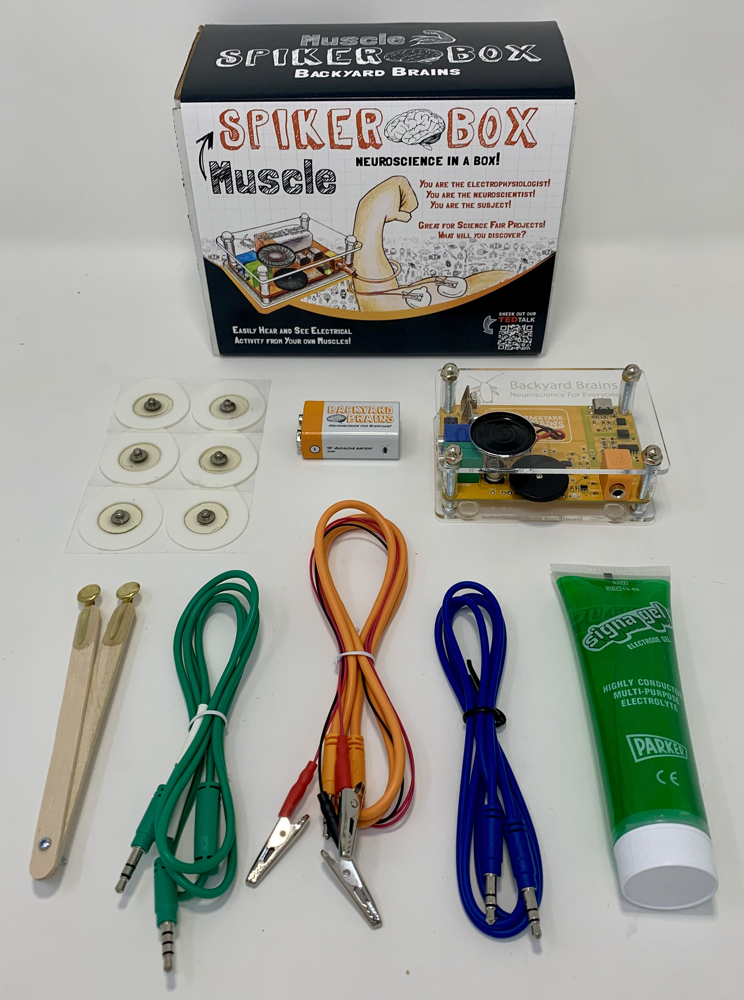

# Muscle SpikerBox #

## Technical Specifications ##

|||
|---|---|
|Frequency range | 300Hz-1300Hz|
|Gain|880x|
|Output|Green Smartphone Cable, Blue Laptop Cable|
|Inputs|1x [Orange Cable](https://backyardbrains.com/products/muscleElectrodeCable)|

## Experiments ##
[Getting Started with Electromyograms (EMGs)](https://backyardbrains.com/experiments/emgspikerbox)\
[Muscle Contraction and Fatigue](https://backyardbrains.com/experiments/fatigue)\
[Muscle Action Potentials](https://backyardbrains.com/experiments/muscleActionPotential)\
[Modeling Muscle Fatigue](https://backyardbrains.com/experiments/rateoffatigue)\
[Muscle Recruitment During Chewing (Candy + Neuroscience)](https://backyardbrains.com/experiments/Musclechewing)
