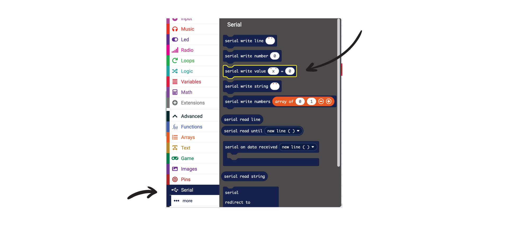
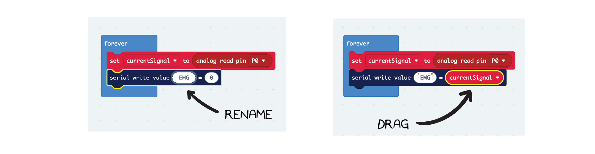
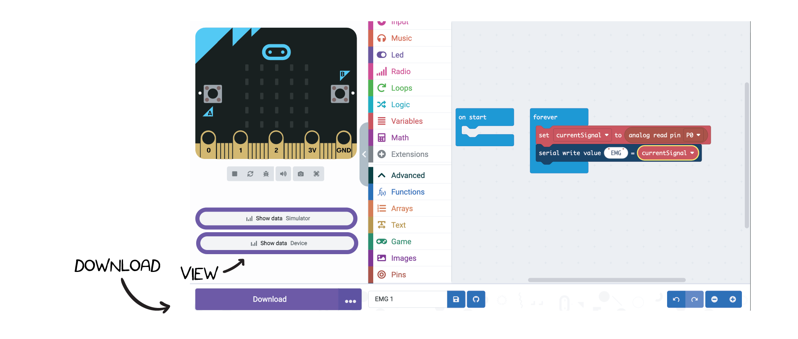

# Getting Started with Neuro:Bit Block Programming #

## Overview ##

In this example, we will read in the EMG signal from the Neuro:Bit and display it on the Micro:Bit.  You will need a Neuro:Bit with a Micro:Bit connected to the front slot, some large motor electrodes, and a USB and electrode cable.

## Software Setup ##
We will use the [Make Code editor](https://makecode.microbit.org/) developed by Microsoft for Micro:Bit to program our Brain Machine Interfaces.  Navigate to the Make Code website and click on the "New Project" button.

Give your project a name and click "Create".  This will let you into the code editor.  You will see the Micro:Bit, code block palette, and a workspace.  You can add blocks to the project by dragging them from the center section to the workspace on the right.

## Read EMG Signal into a Block Variable ##
We will start by adding a variable. Variables store information in your code so you can easily access it in other places. We will need to create a variable to hold the values coming in from the EMG Signal. Navigate to the Variables section, click "Make a Variable," and call it "currentSignal."

To use our variable in the project, drag the "set" variable block into the "forever" block.  This is the main block where we will develop our project.   

By default, the variable gets set to 0.  However, we want to set this to the value in the EMG signal.  To do this, we will need to add a "read analog" block (way down in the "pin" section) 

The analog pin for the EMG electrode is P0, so setting the variable to a read from P0 will give us the latest EMG signal.  To do this, drag the "read analog" block and place it over the "0". 

Great.  This now reads: "Set our variable *currentSignal* to the latest EMG Signal values".

## Connecting Muscles to Read an EMG Signal ##

Place 2 Large Motor Electrodes over the particular muscle you are recording from.  We tend to use the forearm as it is an easy movement to make while testing and performing your BMI. 

Place the electrode stickers *along* the muscle you want to read and connect the 2 red alligator leads.  You can place the black ground clip on a sticker behind your hand. This is good spot as we do not expect to see a lot of muscle activity on the hand.  This keeps the recordings quiet.

## Read an EMG Signal ##

A good way to start using EMG is to see what the signal looks like.  To do this, we will send the data from the Micro:Bit to the host computer.   Find the Serial tab and drag the "Write Value" block into the "forever" block.  

Change the name of the name to 'EMG', and drag our variable "currentSignal" to the right of the block.  This will send the value of the variable "currentSignal" to the host computer.

That is it for the coding!  We can now download the file by pressing the Download button.  

Once the program is downloaded, you can click on "Show Data".  This will plot the variables we are sending over serial in realtime!

Note that here the EMG signal moves from a value of around 0 to a value around 1000 when flexed. (See values on the right side of the graph).  This range will become important as you start to use this signal within your project.  

From here, you can use standard Micro:Bit code to make the EMG signal do something more interesting.  You can make the Micro:Bit play a sound when the signal is above a certain threshold, or you can make the Micro:Bit move a motor when the signal is below a certain threshold.  The possibilities are endless!  

# Sample Projects #
  
To get you started, we have provided some sample projects.  You can download these and try them out.  You can also modify them to see how they work.  We will be regularly updating the projects to include new features and make them more interesting.  You can find the projects in the [Projects](../projects) section. 
