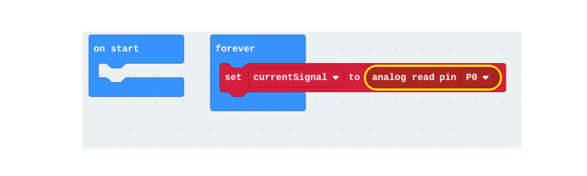

# Programming Neuro:Bit using Block #

## Block Variables ##
Variables store information in your code so you can easily access it.   We will need to create a variabele to hold the values coming in from the EMG Signal.  Navigate to the Variables section and make a variable called "currentSignal".

Drag a "Read Analog" block to the workspace and set the variable to "currentSignal".  The pin for the electrode is P0.   The "forver" block will allow the code continue to read in the latest signals from the electrode while the code is running.

