# Hand Neuroprosthetic #

# Background #
In previous experiments, we've learned how we can record the the electrical signals our brain sends to our muscles, and we have also learned how we can capture those electrical signals and use them to control musical sounds, robotic claws, and even other people! These are all examples of neuroprosthetics. Neuroprosthetics are assistive devices, which are used to help people who have suffered from neurological illness or physical injury. They can also be used to create new and exciting control systems to enhance human ability!

In this experiment, you will create your very own Cyborg Hand which you will then control with the electrical systems in your nervous system. But, don't stop there! These same principals can be applied to countless other projects. In fact, this is the exact way many very advanced neuroprosthetics work! What will you discover?

# Instructions
Begin by assembling your materials at your work station. Plug in your hot glue gun to get it warming up, but it will be a few minutes before you need to use it.

1.Pick out your favorite colored straws and cut them with your scissors until you have at least 25 short segments (approx the width of a fingernail). For our example, we are using two colors to identify the fingers stimulated by the Ulnar and Median nerves. If you would also like to include this anatomical element in your model, pick out two colors and cut at least 10 of one color (for the pinky and ring finger pulleys), and 15 of the other color (for thumb, index, and middle finger pulleys)

2.Ready your short straw segments, your hand, and your hotglue gun. Begin to apply dabs of hot glue to your digits (don't cover the holes)!
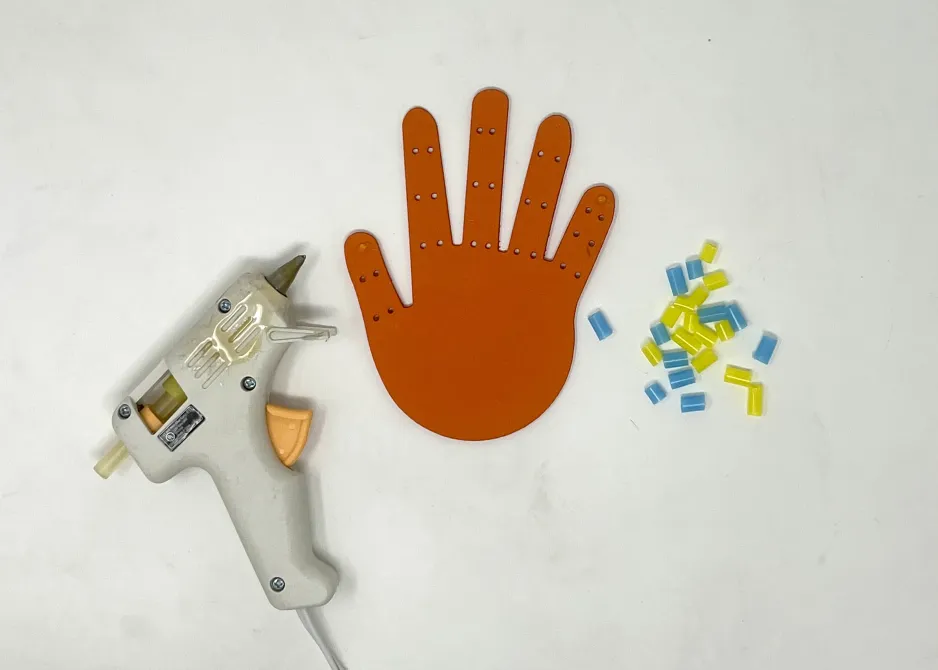
3.With every dab of hot glue, stick on one of your colored straw segments. As you can see in our picture, we are using the yellow straws on the pinky and ring finger, and red straws for the thumb, pointer, and middle fingers. You can do this too, or, if your creativity is speaking to you, pattern the colors however you'd like (Infinity Gauntlet Colors are also approved.)
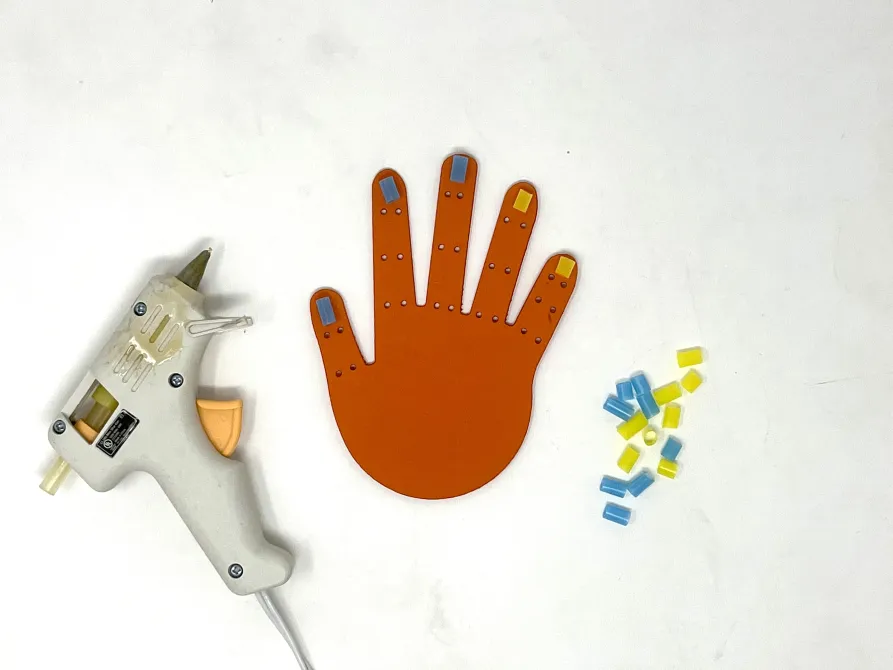
4.Continue until you have straws glued to the digits of every finger (pulleys), and straws glue to the base of the hand (tendon sheath). Once the glue dries, pick off any of the hot glue "spiderwebs" and make sure that all the finger joints still bend and the fist can close.
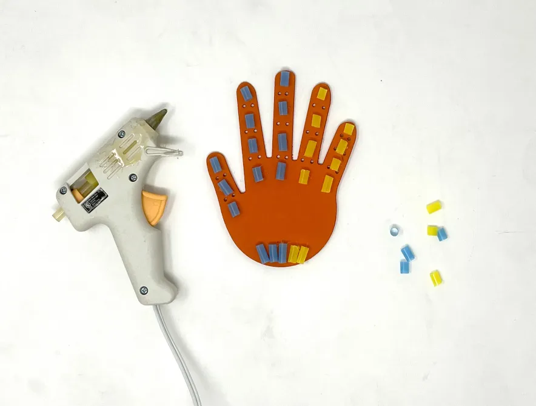
5.Take your long string and fold it in half. Then, like in the shape of an S sandwiched flat, fold it in thirds. Then, with three cuts, one at each bend in the thread, you can cut the entire length of thread into 6 equally long pieces.
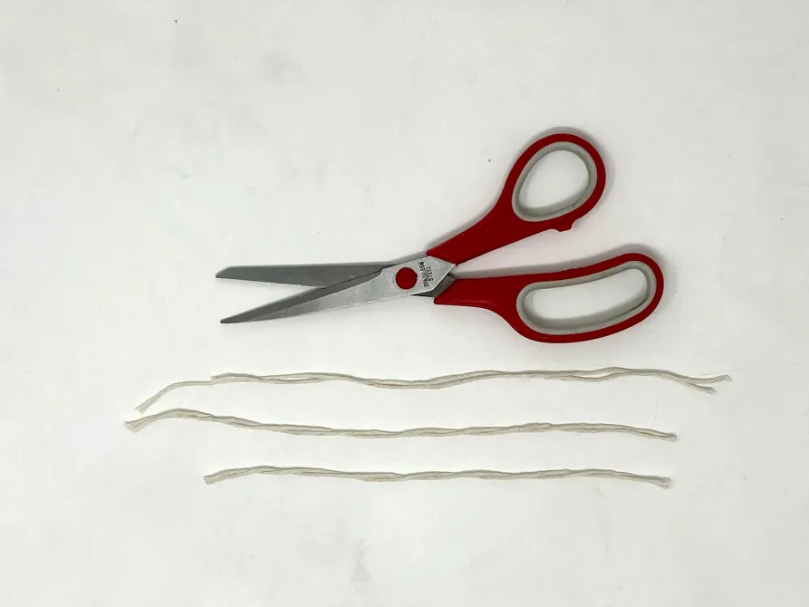
6.Thread one of the lengths of string from the bottom of the hand up through the finger pulleys. Once you have pulled the thread out the tip of the finger, use your hotglue gun to fill **ONLY** that final straw segment with glue - locking the thread in place. Give the glue a minute to dry, then give a tug on the string from the bottom of the hand. The finger should curl in!
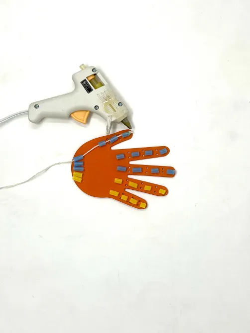
7.Follow the above instruction for the rest of the fingers on your hand. You should have 1 length of thread left over at the end.
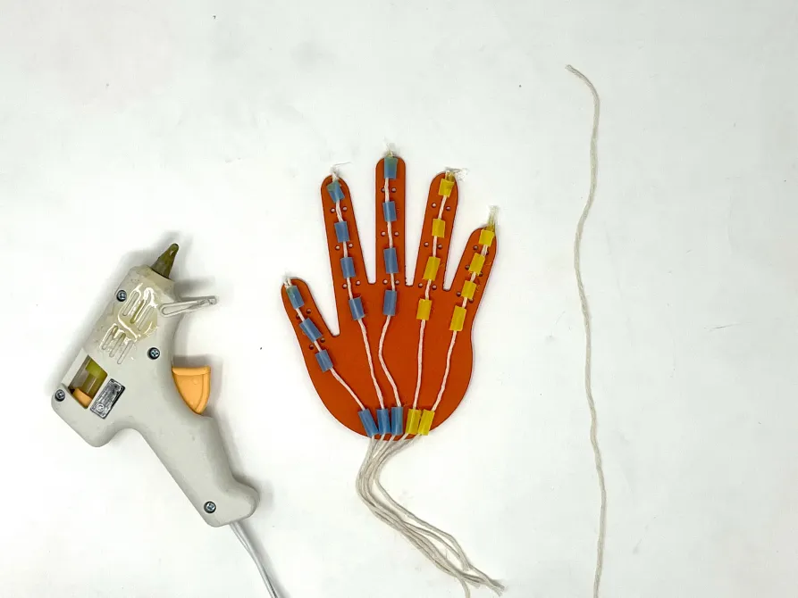
8.Set aside your hand a moment to let the glue dry. Take your servo motor out of its plastic baggy, and find the longest of the white plastic arms.
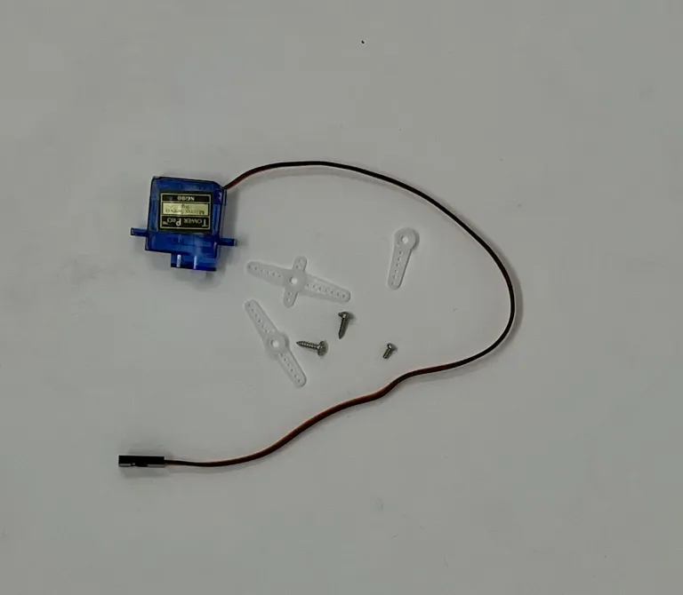
9.**This step is important for the Orientation of the motor**: with the wires of the servo motor coming in towards you, press the lever arm into place on the servo motor's gear so that the action arm makes a 90 degree angle (or close to it) with the rectangular body of the servo motor. If you have a small screwdriver, you can screw it into place, but the friction fit should be good enough too (especially once we get a bit of hot glue on it!)
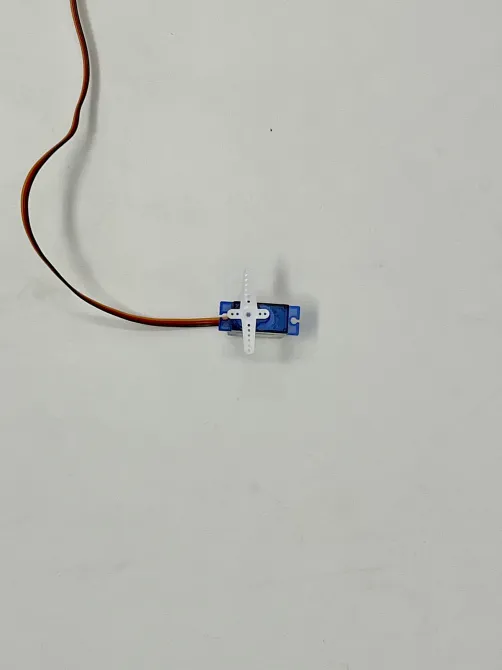
10.Next, we need to measure a slot on our sheet of balsa wood to fit the servo motor. With the included pencil, measure and mark from the bottom right hand corner of the balsa wood up as far as the long side of the servo motor with it oriented as you see in the picture.
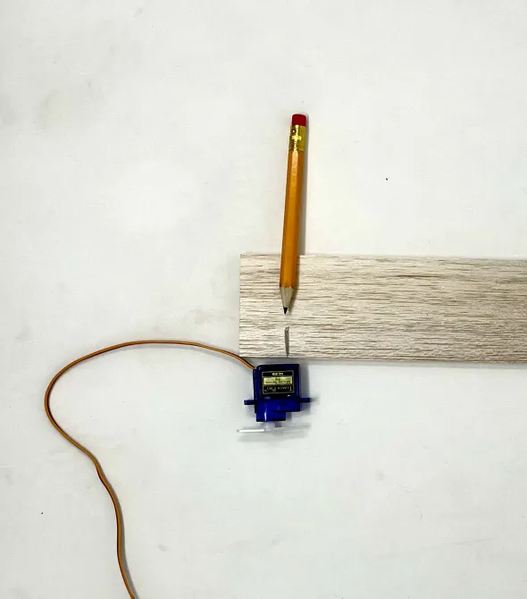
11.Similarly, mark the width of the servo motor. As you see, we are measuring out a slot in the bottom corner of the balsa wood to glue our servo motor in to.
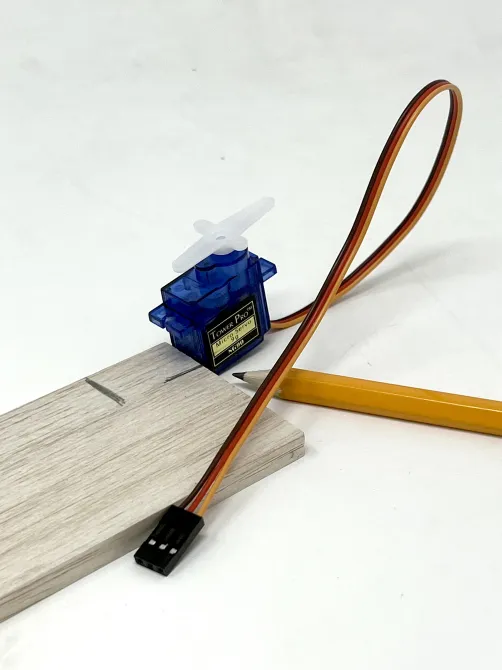
12.Balsa wood is soft, so you should be able to use your scissors to cut out this small chunk of the wood. Make the long cut first, the short cut will be a little harder. If you can't cut all the way through, weaken it with your scissors, then bend and break off this small piece with your hands.
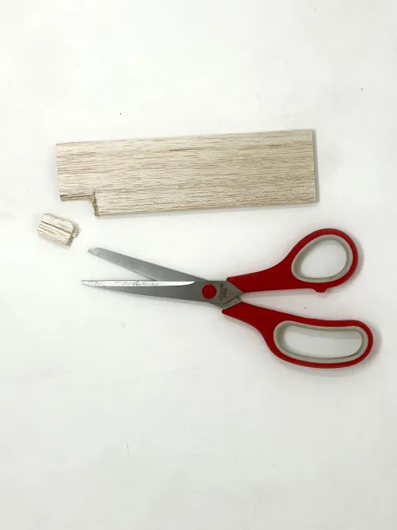
13.**This step is important for the Orientation of the motor**: Glue the servo motor into this slot, and **make sure the wires coming out of the servo motor come out the tail end.**
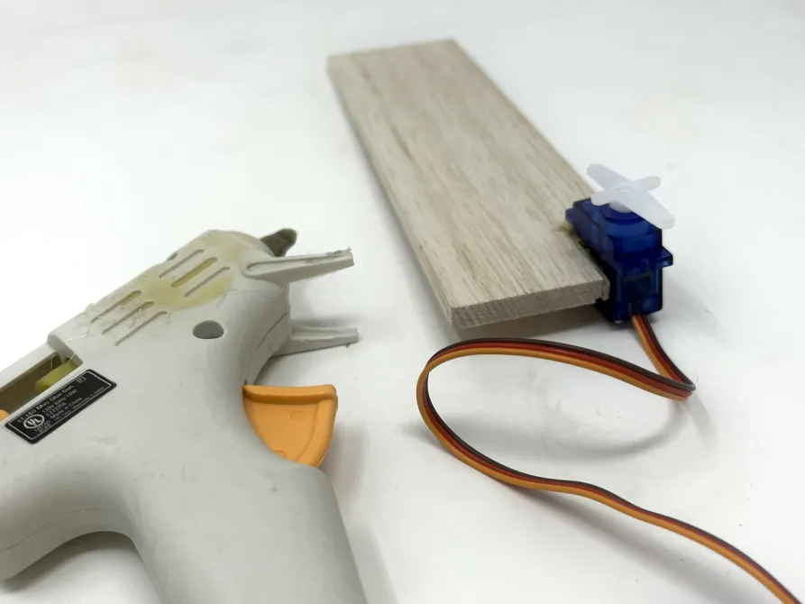
14.Next, glue the pencil on to the servo motor's action arm by applying a line of glue dow the servo motor's arm, then pressing your pencil into place. Careful not to let globs of glue get under the arm into the gears of the servo motor!
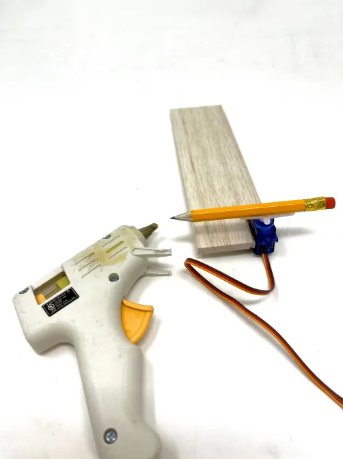
15.Next, apply glue to the top side of the balsa wood. This is where we will be gluing the hand you created earlier.

16.Press the hand down into the glue. We recommend that the base of the fingers extend just past the end of the balsa wood.
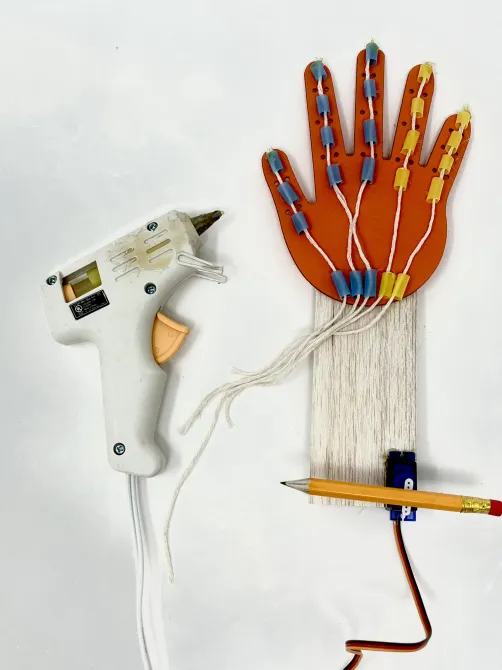
17.Trim the loose threads hanging from the hand, leaving plenty dangling, but evening out the lengths. We keep at least half the length of the thread, as you measure from the base of the balsa wood to the base of the foam hand.
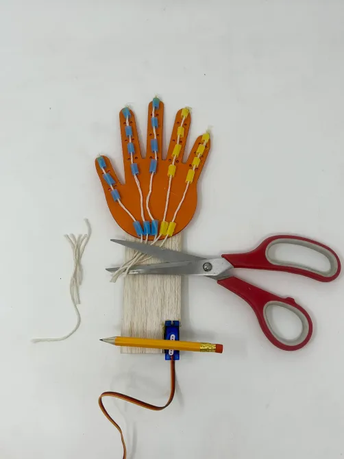
18.Use your last thread to tie a knot around the dangling threads.
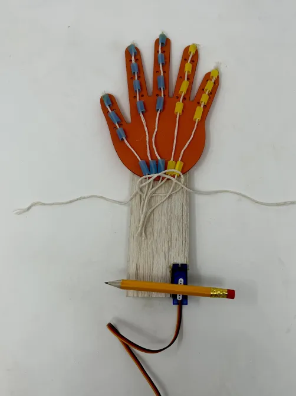
19.Pull the knot tight. Now, you can adjust the tension of the individual fingers by pulling on the thread past the knot until the fingers seem "taut".
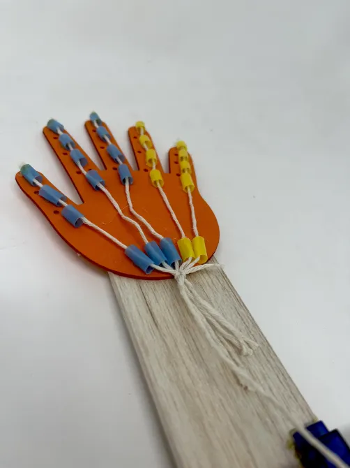
20.Wrap the thread you used to make the knot around the pencil close to the tip of the pencil and hotglue the thread into place. Once that glue dries, you are done! Plug the hand into the Muscle SpikerShield, plug in two batteries.
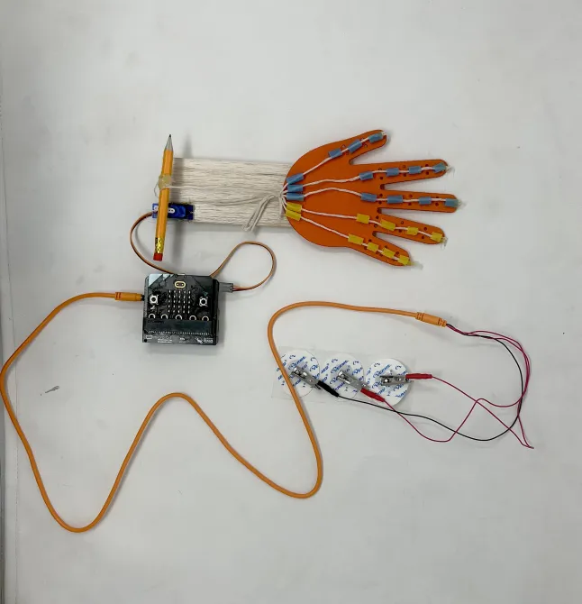
21.Test your hand by pressing the red button. It should change the resting state of the hand from open to closed! **Troubleshooting: If, when you plug it in, the servo motor and pencil immediately move the hand to the "closed" position, you can either adjust the starting position with the red button (needs to be done every time you plug it in), or pop the pencil off and reset it to the 90 degree position it was originally set to.**
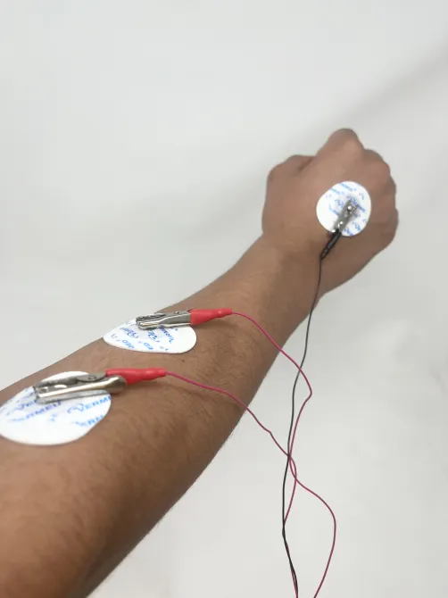
22.Plug in your orange cable and control it by flexing your own muscles!
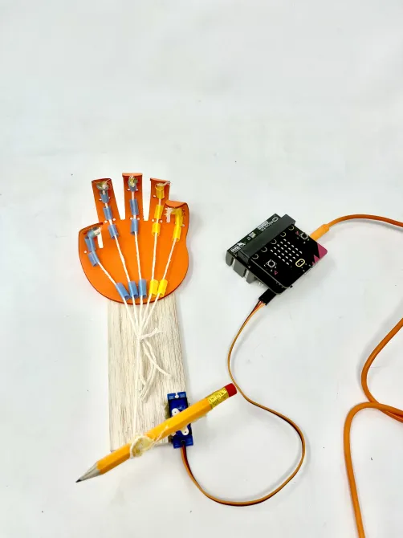

