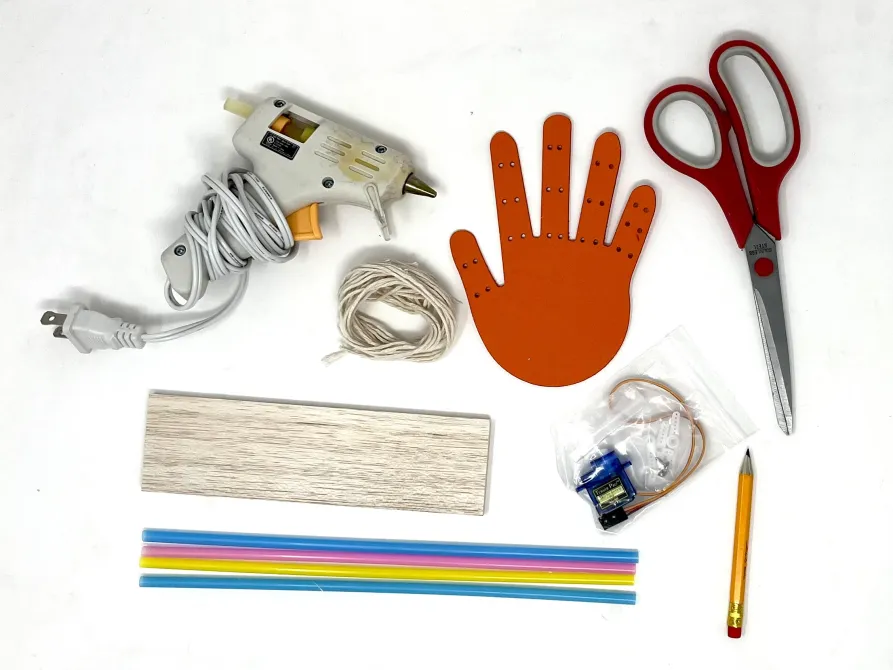
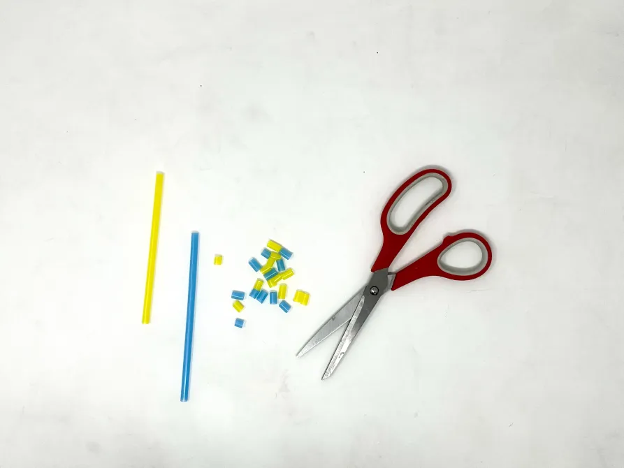
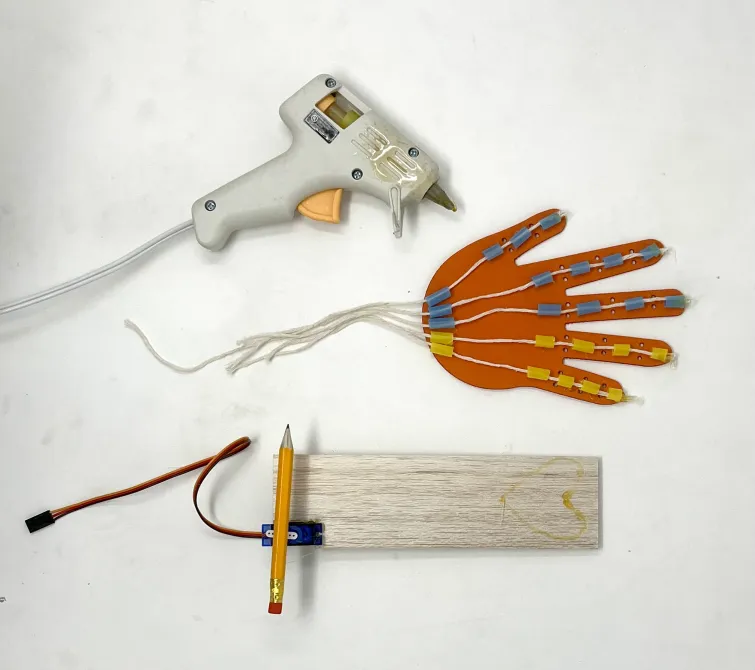

# Hand Neuroprosthetic #

# Background #
In previous experiments, we've learned how we can record the the electrical signals our brain sends to our muscles, and we have also learned how we can capture those electrical signals and use them to control musical sounds, robotic claws, and even other people! These are all examples of neuroprosthetics. Neuroprosthetics are assistive devices, which are used to help people who have suffered from neurological illness or physical injury. They can also be used to create new and exciting control systems to enhance human ability!

In this experiment, you will create your very own Cyborg Hand which you will then control with the electrical systems in your nervous system. But, don't stop there! These same principals can be applied to countless other projects. In fact, this is the exact way many very advanced neuroprosthetics work! What will you discover?

# Instructions
Begin by assembling your materials at your work station. Plug in your hot glue gun to get it warming up, but it will be a few minutes before you need to use it.

1.Pick out your favorite colored straws and cut them with your scissors until you have at least 25 short segments (approx the width of a fingernail). For our example, we are using two colors to identify the fingers stimulated by the Ulnar and Median nerves. If you would also like to include this anatomical element in your model, pick out two colors and cut at least 10 of one color (for the pinky and ring finger pulleys), and 15 of the other color (for thumb, index, and middle finger pulleys)

2.Ready your short straw segments, your hand, and your hotglue gun. Begin to apply dabs of hot glue to your digits (don't cover the holes)!

3.With every dab of hot glue, stick on one of your colored straw segments. As you can see in our picture, we are using the yellow straws on the pinky and ring finger, and red straws for the thumb, pointer, and middle fingers. You can do this too, or, if your creativity is speaking to you, pattern the colors however you'd like (Infinity Gauntlet Colors are also approved.)

4.Continue until you have straws glued to the digits of every finger (pulleys), and straws glue to the base of the hand (tendon sheath). Once the glue dries, pick off any of the hot glue "spiderwebs" and make sure that all the finger joints still bend and the fist can close.

5.Take your long string and fold it in half. Then, like in the shape of an S sandwiched flat, fold it in thirds. Then, with three cuts, one at each bend in the thread, you can cut the entire length of thread into 6 equally long pieces.

Thread one of the lengths of string from the bottom of the hand up through the finger pulleys. Once you have pulled the thread out the tip of the finger, use your hotglue gun to fill **ONLY** that final straw segment with glue - locking the thread in place. Give the glue a minute to dry, then give a tug on the string from the bottom of the hand. The finger should curl in!

Follow the above instruction for the rest of the fingers on your hand. You should have 1 length of thread left over at the end.

