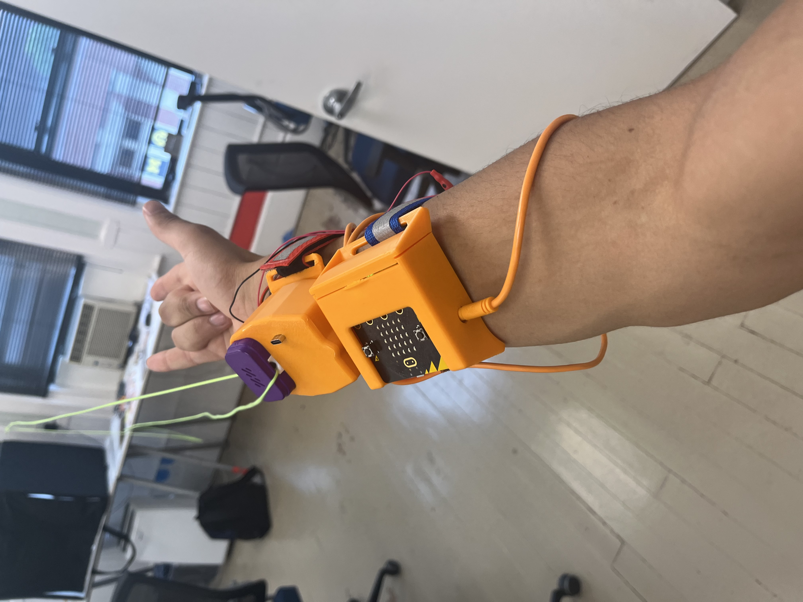

# Spiker-Man Web Slinger # 

 

*"Spiker-Man, Spiker-Man, does whatever a Spiker-Man can"*

Make your very own string shooting device that shares startling similarities to a certain Marvel / Sony superhero!

This guide is still being developed, but below is a general overview.

# Materials Needed ( Shown Left->Right, Top->Bottom ) #
- Loop Lasso / two wheels close to each other
- A loop of string with no knots
- Micro bit and Neurobit
- EMG Signal Cable
- 3 Electrodes

Optional
- 3D printer / Some casing
- Arm Bands
  
# Software #
This project is fairly simple from a software perspective: you'll simply pair the input from an EMG to a signal output. To make this work, we'll re-use code from the EMG lecture and pair it to a DigitalWrite command in an if-else statement. 

# Hardware #
This is were things get a bit more advanced. We'll first do a simple project to test that the code and relay work, and then get-into the full project. 

First, how does the relay work?
Soldering done to skip the switch ( not shown )

# Demos #
To be featured
