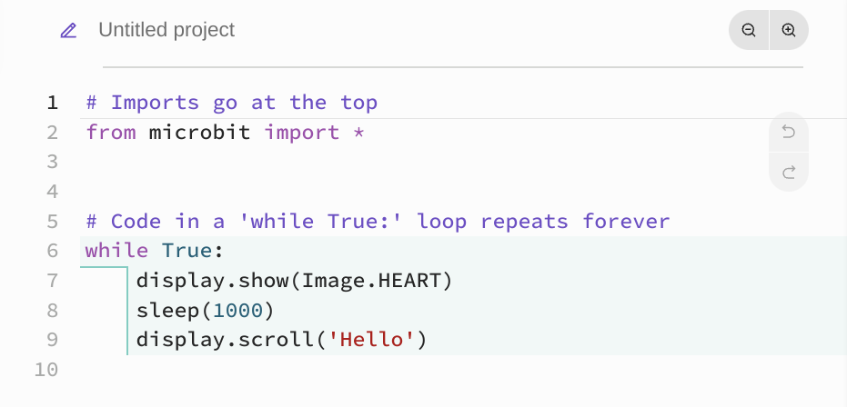
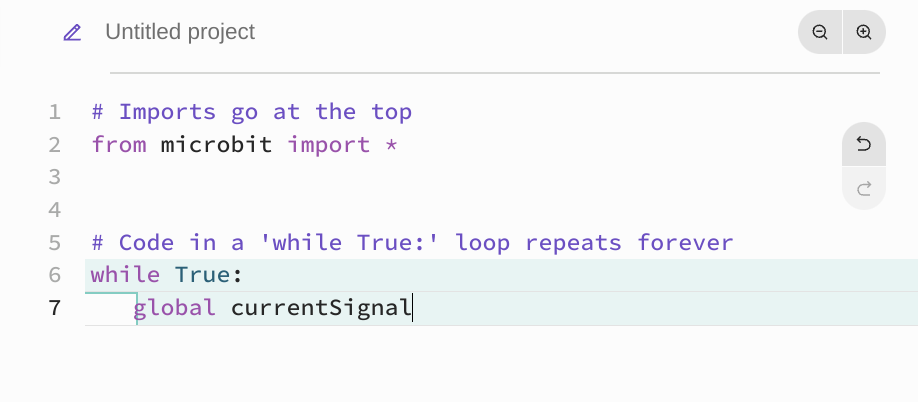
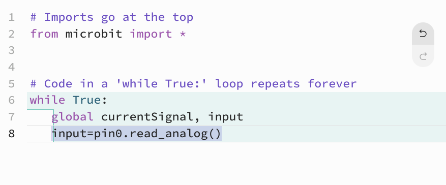
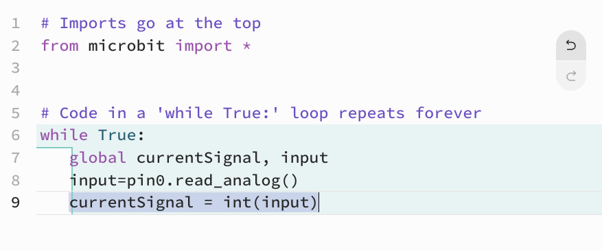
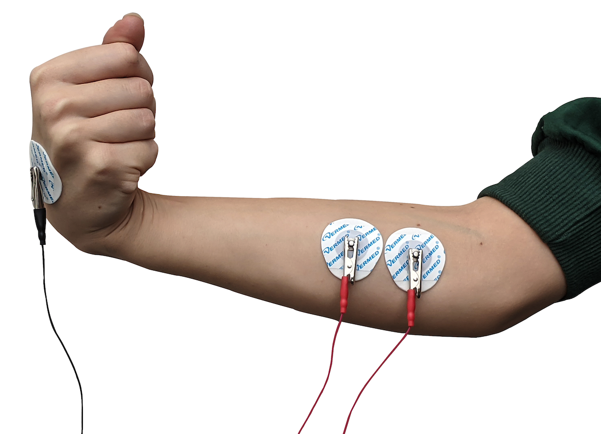

# Getting Started with Neuro:Bit Python Programming #

## Overview ##

Python is a programming language that can be used with the Neuro:Bit to easily develop Brain Machine Interfaces.  It is a powerful language, easy to learn, and a great way to get started with Neuro:Bit. [ Greg Stopped here ]

## Software Set-up ## 

To code your project, you will need to head to the [micro:bit Python Editor](https://python.microbit.org/v/3/ideas) This is the software Microsoft developed to code the micro:bit with. It will open with the micro:bit library already imported, and a loop in place. Delete the code inside the workspace and you can start.

## Read EMG Signal into a Variable ##

Variables store information in your code so you can easily access it.   We will need to create a variable to hold the values coming in from the EMG Signal.  This will be a "global" variable, because it is a variable that will change. So within your "while True" loop, indent and write "global currentSignal ". 

This variable will be storing the data, but it needs to be made equal to something. Micro:bit uses pins to send/receiev data, and the Neuro:bit has a certain pin for EMG. So you need a variable that is equal to that pins signal, while currentSignal will make that signal into a fixed number. 

Pin 0 takes in the EMG signal, so the "read_analog()" method uses that pin. But because that signal changes, "input" has to be global. Now, all you have to do is convert it into a number.

Congrats! This now reads: "Set the variable *currentSignal* to the value (input) of the EMg signal". 

## Placement of Electrodes ## 

Place 2 Large Motor Electrodes over the particular muscle you are recording from.  We tend to use the forearm as it is an easy movement to make while testing and performing your BMI. 

Place the stickers *along* the muscle you want to read and connect the 2 red alligator leads.  You can place the black ground clip on a sticker behind your hand (or any other spot that does not produce a lot of muscle activity.

