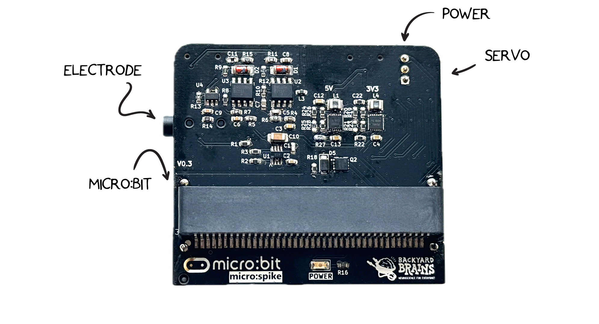

# The Neuro:Bit #

## What is the Neuro:Bit? ## 
The Neuro:Bit allows you to develop DIY Brain Machine Interfaces (BMI) or sometimes called Brain Computer Interfaces (BCI).  A BMI is a computers that interfaces directly with the electrical signals of your body. The Neuro:Bit has a port to connect to a Micro:Bit (computer), and a port to record from your body.  

## Technical Specifications ## 

| | |
|---|---|
| Power source | 2x AA Battery |
| Recording Modes| EMG, ECG |
|Outputs| 1x Servo, 1x Expansion Port|
|Inputs| 1x [ Orange Cable ] (https://backyardbrains.com/products/muscleElectrodeCable) |

[Download schematic PDF](./ )

## Hardware Overview ## 
The Neuro:Bit has a slot that accepts a V1 or V2 Micro:Bit.  The electrode required for recording is our orange cable with 3 leads (2 recording electrodes and a ground). 

You can select between EMG (Muscle) or EKG (Heart) on the Signal Select switch.  A Servo controller is provided on PIN 8. There is also an expansion port on the bottom to get clean access to additional pins for your project. 

## What does the Micro:Bit do? ## 

The NeuroBit needs a micro:bit to run. The micro:bit itself a kind of circuit board–often called a PCB or “printed circuit board”--that you insert in the terminal with all the pins at the front of the board. You code the micro:bit and it connects to your NeuroBit to take in data or send data. It has a speaker, motion sensors and a grid of small lights called LED’s that you can use the buttons or sensors to manipulate. 
The NeuroBit is able to take in EMG data, ECG data, and send data to anything with pin sockets. For context, flip the board upside down to find the section labelled "Servo".

These pins send signals to “sockets”. And those sockets send signals through wires to different electronics. 

### Whats EMG? ### 

Electromyography–or EMG–is a way to measure if your muscles have electricity in them. Your nerves send pulses of electricity through your muscles to make them move, like how wires make a motor move. An EMG signal is just a number that shows how much electricity is going to any muscle when you’re recording it. You use small devices called electrodes and stick them to your muscles to find this out.

### Whats ECG/EKG? ###

An ECG is a lot like an EMG in that it measures if your muscles are getting electricity. Instead, it focuses on a single muscle, your heart! If you didn’t know, your heart is a muscle, and that means that it is sent little pulses of electricity by your nerves. 
It also uses electrodes to determine the amount of electricity in your heart, but because your heart is always “running”, it tracks how active your heart is and what that could mean for your health. 

## Experiments and Tutorials ## 

Here are a few examples of how you can use a micro:bit and NeuroBit together. 

The top half are smaller, useful little projects to help understand concepts. The latter half are projects that actually utilize those concepts. Note that the tutorials are intended to be progressive, so concepts will build off one another and prior tutorials will be referenced. But, don't worry! You can just as easily drop into any tutorial and learn something. 

| | |
|---|---|
| | | |
| | | |
| | | |
| | | |

