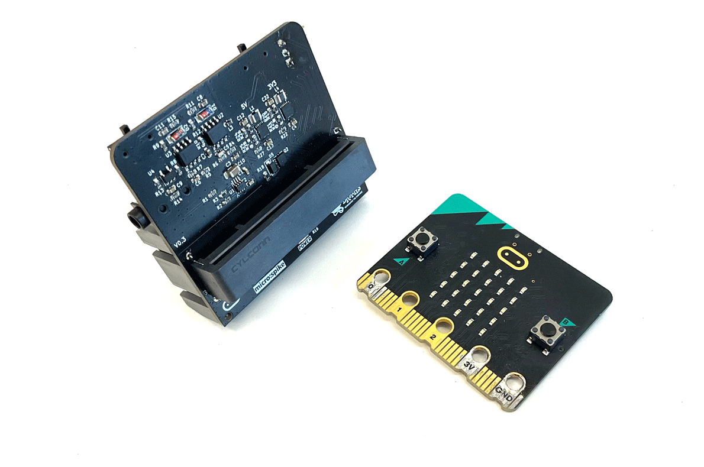
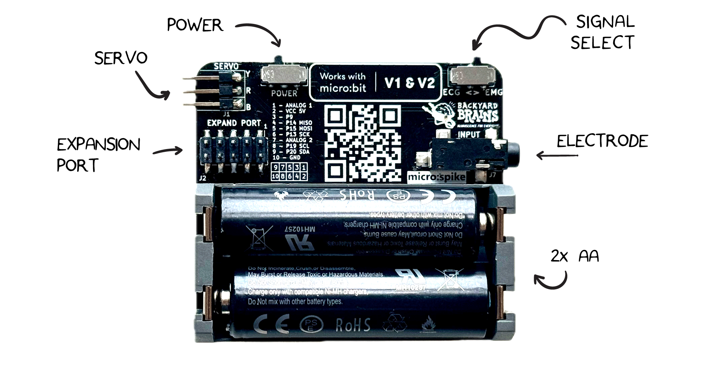

# The Neuro:Bit #

## What is the Neuro:Bit? ## 
The Neuro:Bit allows you to develop DIY Brain Machine Interfaces (BMI) or sometimes called Brain Computer Interfaces (BCI).  A BMI is a computers that interfaces directly with the electrical signals of your body. The Neuro:Bit has a port to connect to a Micro:Bit (computer), and a port to record from your body.  

## Technical Specifications ## 

| | |
|---|---|
| Power source | 2x AA Battery |
| Recording Modes| EMG, ECG |
|Outputs| 1x Servo, 1x Expansion Port|
|Inputs| 1x [Orange Electrode Cable](https://backyardbrains.com/products/muscleElectrodeCable)|

[Download schematic PDF](./ )
> Is there a PDF reader we can embed?  Shoudl we?  Dont want to make it too heavy.

## Hardware Overview ## 
The Neuro:Bit has a slot that accepts a V1 or V2 Micro:Bit.  The electrode required for recording is our orange cable with 3 leads (2 recording electrodes and a ground). 

You can select between EMG (Muscle) or EKG (Heart) on the Signal Select switch.  A Servo controller is provided on PIN 8. There is also an expansion port on the bottom to get clean access to additional pins for your project. 

## What Will You Need? ##

To get started, you will need:

* 3x BYB Large Muscle Electrodes
* 1x BYB Orange Electrode Cable
* 1x Neuro:Bit
* 1x Micro:Bit

Connect the Micro:Bit to the front slot on the Neuro:Bit.  Be sure that the LEDs are facing outwards. Connect the orange cable to the electrode on the Neuro:Bit side port.  

Connect the USB cable from your computer to the Micro:Bit. 

 You are now ready to start programming your Neuro:Bit.   The following tutorials will get you started.  We have tutorials for [Block Code](./Block), [Python](./Python).  The [Block Code](./Block) is the easiest way to get started.

## Experiments and Tutorials ## 

>To Do:  Add Table with Rows of EMG, EKG, EOG, and columns of Block, Python, and Javascript experiment here.

