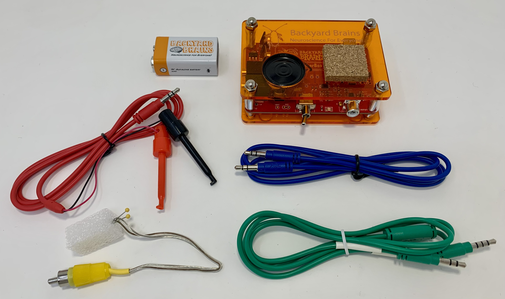

# Neuron SpikerBox Classic #

## Technical Specifications ##

|||
|---|---|
|Frequency range | 300Hz-1300Hz|
|Gain|880x|
|Output|Green Smartphone Cable, Blue Laptop Cable|
|Inputs|1x [Orange Cable](https://backyardbrains.com/products/muscleElectrodeCable)|

[Technical Schematic](https://backyardbrains.com/products/files/Neuron%20SpikerBox.v.1.42.pdf)

## Experiments ##

[Getting Started with Spikes](https://backyardbrains.com/experiments/spikerbox)

[Rate Coding](https://backyardbrains.com/experiments/ratecoding)

[Effect of Temperature on Neurons](https://backyardbrains.com/experiments/temperature)

[Microstimulation of Neurons and Muscles](https://backyardbrains.com/experiments/microstimulation)

[Referencing your Spikes](https://backyardbrains.com/experiments/referencing)

[Effect of Nicotine and MSG on Neurons](https://backyardbrains.com/experiments/neuropharmacology)

[NeuroProsthetics](https://backyardbrains.com/experiments/neuroProsthetics)

[Oxygen and Spiking](https://backyardbrains.com/experiments/oxygen)

## Troubleshooting ##

Check out the [General Troubleshooting steps](../../index.md#troubleshooting)

After connecting to spike recorder, let's ensure that we are picking up the signal from the board by quickly touching the electrode connector with your finger and afterward clap or snap near the device running Spike Recorder. You should see the graph change when touching the connector, but not when there is background audio.

The Neuron SpikerBoxes are especially sensitive to electrical noise, so taking steps to minimize it is a good idea. (Plug out any chargers from both the wall and device running spike recorder, make sure to stay away from flourecent lights are a few examples)