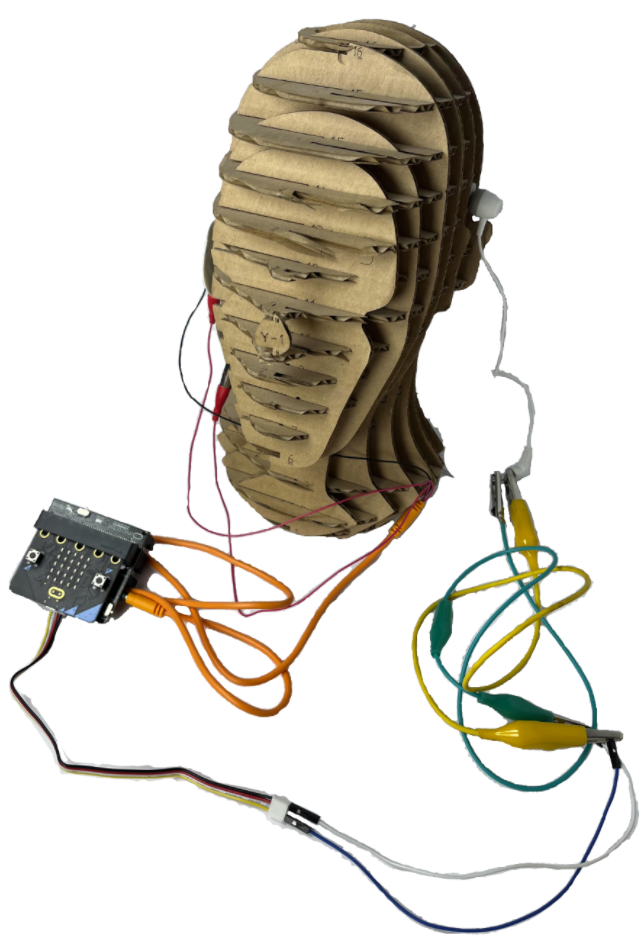
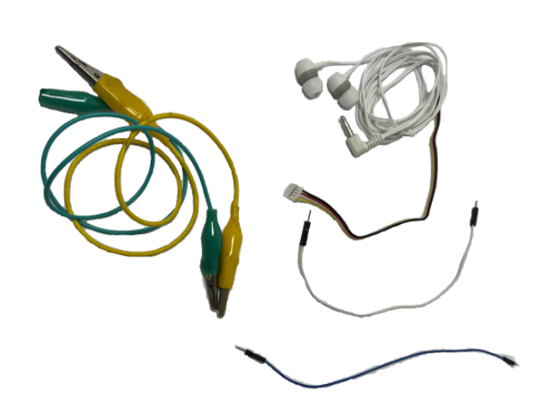

# BeatBite Control #
|     |       |
|--------------|--------------
| Inventors     | Ana Markovic, Kosta Dedakin
| micro:bit IDE     | Block Code
| Best Location     | Classroom  

## Project Overview
Have you ever been on a bus ride that seems to stretch forever? You reach for your earphones, eager to drown out the monotony with some tunes, only to find the first few songs falling flat. It’s frustrating, right? Each time you want to skip a track, it's a whole ordeal: fishing out your phone, unlocking it, navigating to the music app—it's enough to make you want to skip the skipping altogether. But what if there was a way to bypass those duds with just a clench of your jaw (something you're probably doing anyways)? Imagine this scenario: you settle into your seat, close your eyes, and with a subtle flex of your jaw muscles,  seamlessly transition from a lackluster tune to something that really hits the spot. No more reaching for your phone.

What if that could be a reality? Here is what we came up with:



## Materials Needed
Using simple block codes and imagination, we
turned our idea into reality.For this project, we need
- 1x micro:bit and Spiker:bit
- 1x audio jack with alligator clips- for measuring EMG in jaw muscles
- 2x Jumper wires - connecting pinhead with Spiker:bit and alligator clips
- 1x wired headphones
- 2x alligator clips
- 1x Grove connector
  
  
Optional
3D printer for printing plastic belt clips to store our micro:bit and wires

## ABOUT CODE

BeatBite uses a simple micro:bit setup and a few cables to bring this simple idea into reality!

The code first calibrates the strength of a jaw press based on the intervals at which the user bites down. This number is then used as a button to increment through an array ( by increadsing "IndexOfSongs" ). 
```
# defines a function that does the calibration for the strength of jaw press

def on_button_pressed_a():
    global maxSignal, Timer, val, length, SumOfList2, AverageMax
    # defines global variables
    music.stop_all_sounds()
    # safety protocol
    basic.show_icon(IconNames.SURPRISED)
    maxSignal = 0
    Timer = control.millis()
    # used to measure the 5 second mark forcalibration
    while control.millis() - Timer < 5000:
        basic.show_icon(IconNames.BUTTERFLY)
        val = pins.analog_read_pin(AnalogPin.P0)
        if val > maxSignal:
            maxSignal += val
            basic.show_icon(IconNames.TORTOISE)
        length += 1
        SumOfList2 = SumOfList2 + maxSignal
    AverageMax = SumOfList2 / length
    # output the average
    serial.write_number(AverageMax)
input.on_button_pressed(Button.A, on_button_pressed_a)

IndexOfSongs = 0
AverageMin = 0
AverageMax = 0
SumOfList2 = 0
length = 0
val = 0
Timer = 0
maxSignal = 0
music.set_built_in_speaker_enabled(False)
pins.set_audio_pin(AnalogPin.P2)
# defines the main function

def on_forever():
    global AverageMin, val, IndexOfSongs
    # defines variable globally
    while True:
        AverageMin = 0
        # reads the EMG signal and puts it in "val"
        val = pins.analog_read_pin(AnalogPin.P0)
        basic.show_icon(IconNames.NO)
        serial.write_value("EMG", val)
        # defines the range for skipping music
        if val > AverageMin and val < AverageMax:
            # using if else if to skip and play the music
            if IndexOfSongs == 1:
                basic.show_icon(IconNames.HEART)
                music.stop_all_sounds()
                music.play(music.string_playable("A A A A A A A A ", 45),
                    music.PlaybackMode.LOOPING_IN_BACKGROUND)
                IndexOfSongs += 1
            elif IndexOfSongs == 2:
                basic.show_icon(IconNames.SMALL_HEART)
                music.stop_all_sounds()
                music.play(music.string_playable("G G G G G G G G ", 15),
                    music.PlaybackMode.LOOPING_IN_BACKGROUND)
                IndexOfSongs += 1
            elif IndexOfSongs == 3:
                basic.show_icon(IconNames.YES)
                music.stop_all_sounds()
                music.play(music.string_playable("C5 A B D F - G B ", 35),
                    music.PlaybackMode.LOOPING_IN_BACKGROUND)
                IndexOfSongs += 1
            elif IndexOfSongs == 4:
                basic.show_icon(IconNames.NO)
                music.stop_all_sounds()
                music.play(music.string_playable("A E A B A F A B ", 45),
                    music.PlaybackMode.LOOPING_IN_BACKGROUND)
                IndexOfSongs += 1
            elif IndexOfSongs == 5:
                basic.show_icon(IconNames.HAPPY)
                music.stop_all_sounds()
                music.play(music.string_playable("C F B F C F C B ", 20),
                    music.PlaybackMode.LOOPING_IN_BACKGROUND)
                IndexOfSongs += 1
            elif IndexOfSongs == 6:
                basic.show_icon(IconNames.SAD)
                music.stop_all_sounds()
                music.play(music.string_playable("C C C C C C C C ", 27),
                    music.PlaybackMode.LOOPING_IN_BACKGROUND)
                IndexOfSongs += 1
            else:
                # if the Index reaches anything outside the range, put it back on track
                IndexOfSongs = 1
            # wait so that processor doesn't do unnecessary calculation
            control.wait_micros(50000)
basic.forever(on_forever)
```
