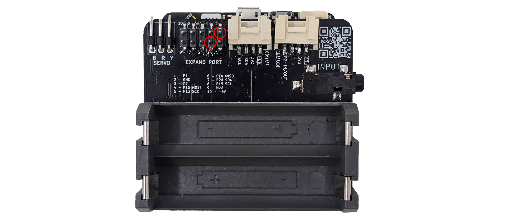

# BeatBite Control #


|     |       |
|--------------|--------------
| Inventors     | Ana Markovic, Kosta Dedakin
| micro:bit IDE     | MakeCode Editor
| Best Location     | Classroom  

#### Difficulty ####

|     |       |
|--------------|--------------
| Hardware     | Easy           
| Software     | Easy


#### Special Requirement ####
|     |       |
|--------------|--------------
| Wired headphone  | Required
| Two alligator clips | Required

## Project Overview ##
Have you ever been on a bus ride that seems to stretch forever? You reach for your earphones, eager to drown out the monotony with some tunes, only to find the first few songs falling flat. It’s frustrating, right? Each time you want to skip a track, it's a whole ordeal: fishing out your phone, unlocking it, navigating to the music app—it's enough to make you want to skip the skipping altogether. But what if there was a way to bypass those duds with just a clench of your jaw (something you're probably doing anyways)? Imagine this scenario: you settle into your seat, close your eyes, and with a subtle flex of your jaw muscles,  seamlessly transition from a lackluster tune to something that really hits the spot. No more reaching for your phone.

What if that could be a reality? Here is what we came up with:

## Build Instructions ##

### Materials Needed ###


- 1x spiker:bit kit (spiker:bit, 3x electrodes, and orange cables)
- 1x micro:bit
- 1x wired headphones
- 2x alligator clips
  
<!-- Optional
3D printer for printing plastic belt clips to store our micro:bit and wires -->

### 1. Connect spiker:bit and alligator clips ### ###



Flip spike:bit and find pin2 (ground) and pin3 (pin2) that is located in expand port of the spiker:bit. 
Choose one alligator clip and connect to pin2. Do same thing for the another clip to pin3. Color for each clips do not matter.

### 2. Connect alligator clips to headphone ###


Grab other end of alligator clips which was connected to pin2. Clip this to tip of the headphone jack. Grab other end of alligator clips connected to pin3 and clip to base of the headphone jack.

## Code ##

BeatBite uses a simple micro:bit setup and a few cables to bring this simple idea into reality!

The code measure the strength of a jaw press. This number is then used as a button to increment through an array (by increasing "IndexOfSongs"). 

import Tabs from '@theme/Tabs';
import TabItem from '@theme/TabItem';

<Tabs>
  <TabItem value="Block" label="Block Code">

  

  

  

  </TabItem>

  <TabItem value="Python" label="Python" default>

  ```py title="BeatBite"
  IndexOfSongs = 0
  val = 0
  spikerbit.start_muscle_recording()
  pins.set_audio_pin(DigitalPin.P2)
  THRESHOLD = 10
  basic.show_icon(IconNames.NO)
  # defines the main function

  def on_forever():
      global val, IndexOfSongs
      # reads the EMG signal and puts it in "val"
      val = spikerbit.muscle_power_signal()
      # defines the range for skipping music
      # using if else if to skip and play the music
      if val >= THRESHOLD:
          if IndexOfSongs == 1:
              basic.show_icon(IconNames.HEART)
              music.stop_all_sounds()
              music.play(music.string_playable("A A A A A A A A ", 500),
                  music.PlaybackMode.LOOPING_IN_BACKGROUND)
              IndexOfSongs += 1
          elif IndexOfSongs == 2:
              basic.show_icon(IconNames.SMALL_HEART)
              music.stop_all_sounds()
              music.play(music.string_playable("G G G G G G G G ", 500),
                  music.PlaybackMode.LOOPING_IN_BACKGROUND)
              IndexOfSongs += 1
          elif IndexOfSongs == 3:
              basic.show_icon(IconNames.YES)
              music.stop_all_sounds()
              music.play(music.string_playable("C5 A B D F - G B ", 500),
                  music.PlaybackMode.LOOPING_IN_BACKGROUND)
              IndexOfSongs += 1
          elif IndexOfSongs == 4:
              basic.show_icon(IconNames.NO)
              music.stop_all_sounds()
              music.play(music.string_playable("A E A B A F A B ", 500),
                  music.PlaybackMode.LOOPING_IN_BACKGROUND)
              IndexOfSongs += 1
          elif IndexOfSongs == 5:
              basic.show_icon(IconNames.HAPPY)
              music.stop_all_sounds()
              music.play(music.string_playable("C F B F C F C B ", 500),
                  music.PlaybackMode.LOOPING_IN_BACKGROUND)
              IndexOfSongs += 1
          elif IndexOfSongs == 6:
              basic.show_icon(IconNames.SAD)
              music.stop_all_sounds()
              music.play(music.string_playable("C C C C C C C C ", 500),
                  music.PlaybackMode.LOOPING_IN_BACKGROUND)
              IndexOfSongs += 1
          else:
              # if the Index reaches anything outside the range, put it back on track
              IndexOfSongs = 1
              basic.show_icon(IconNames.NO)
  basic.forever(on_forever)

  ```
  </TabItem>

  <TabItem value="Js" label="Js">

  ```py title="BeatBite"
  let IndexOfSongs = 0
  let val = 0
  spikerbit.startMuscleRecording()
  pins.setAudioPin(DigitalPin.P2)
  let THRESHOLD = 10
  basic.showIcon(IconNames.No)
  // defines the main function
  basic.forever(function () {
      // reads the EMG signal and puts it in "val"
      val = spikerbit.musclePowerSignal()
      // defines the range for skipping music
      // using if else if to skip and play the music
      if (val >= THRESHOLD) {
          if (IndexOfSongs == 1) {
              basic.showIcon(IconNames.Heart)
              music.stopAllSounds()
              music.play(music.stringPlayable("A A A A A A A A ", 500), music.PlaybackMode.LoopingInBackground)
              IndexOfSongs += 1
          } else if (IndexOfSongs == 2) {
              basic.showIcon(IconNames.SmallHeart)
              music.stopAllSounds()
              music.play(music.stringPlayable("G G G G G G G G ", 500), music.PlaybackMode.LoopingInBackground)
              IndexOfSongs += 1
          } else if (IndexOfSongs == 3) {
              basic.showIcon(IconNames.Yes)
              music.stopAllSounds()
              music.play(music.stringPlayable("C5 A B D F - G B ", 500), music.PlaybackMode.LoopingInBackground)
              IndexOfSongs += 1
          } else if (IndexOfSongs == 4) {
              basic.showIcon(IconNames.No)
              music.stopAllSounds()
              music.play(music.stringPlayable("A E A B A F A B ", 500), music.PlaybackMode.LoopingInBackground)
              IndexOfSongs += 1
          } else if (IndexOfSongs == 5) {
              basic.showIcon(IconNames.Happy)
              music.stopAllSounds()
              music.play(music.stringPlayable("C F B F C F C B ", 500), music.PlaybackMode.LoopingInBackground)
              IndexOfSongs += 1
          } else if (IndexOfSongs == 6) {
              basic.showIcon(IconNames.Sad)
              music.stopAllSounds()
              music.play(music.stringPlayable("C C C C C C C C ", 500), music.PlaybackMode.LoopingInBackground)
              IndexOfSongs += 1
          } else {
              // if the Index reaches anything outside the range, put it back on track
              IndexOfSongs = 1
              basic.showIcon(IconNames.No)
          }
      }
  })

  ```
  </TabItem>
</Tabs>

## Operating Instructions ##

To use, place ground electrode at mastoid and other two electrodes jaw muscle.

To play music, simply turn on the Spiker:Bit.

To change the music, try moving the jaw muscle up and down. Then, you should hear different sound effects.

:::tips
It is difficult to hear music from both ears. If this is happening to you, try moving alligator clips clipped to tip of headphone jack towards closest insulating rings (a "black line")

:::tips
If you struggle to build, check this [reference](https://microbit.org/projects/make-it-code-it/make-some-noise/) page from Makecode.
