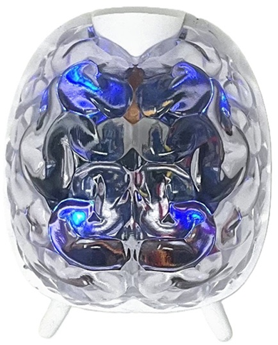

# SpikerBot #

SpikerBot is a neurorobot - a robot controlled by a computer model of a biological brain. It is equipped with a camera, a distance sensor, a speaker, four lights and two motors. It communicates via Wi-Fi with the [SpikerBot app](https://docs.backyardbrains.com/Software/Pre-Release/SpikerBot/), which runs its neural networks.

## Getting Started with SpikerBot ##

1. **Power on**: Flip the switch under the robot.
2. **Connect via Wi-Fi**: Find the network name (written on the robot).
3. **Wait for green LEDs**: Indicates successful connection.
4. **Press Play in the SpikerBot app** to run a brain.

## SpikerBot’s Sensors ##
SpikerBot is equipped with a camera and a distance sensor. The **camera** processes images in real-time, detecting red, blue, and green colors, along with 16 different objects. Detection can be localized to the left or right side of the visual field. The **distance sensor** identifies objects at varying proximities: ‘far’ (100-20 cm), ‘medium’ (20-5 cm), and ‘near’ (less than 5 cm) directly in front of the robot.

## SpikerBot’s Effectors ##
SpikerBot features two independently controlled motors, four LED lights, and a speaker. The **motors** allow precise control of direction and speed for each wheel. The **lights** can be set to different colors independently, enabling dynamic visual signals. Additionally, the **speaker** can generate tones ranging from 50 to 4950 Hz for auditory feedback.

## Technical Specifications ##

|||
|---|---|
|Processor | ESP32 |
|Power supply |	4xAA batteries |
|Control Switch | On/Off |
|||

## Troubleshooting ##

1. No Response from Robot: Check that it’s turned on and charged.
2. Wi-Fi Connection Issues: Ensure you’re connected to the correct robot’s Wi-Fi network, the robot’s LEDs should change from blue to green when the WiFi connection is established.
3. Movement Problems: Check wheels and tires, re-seat if necessary.
4. Camera Recognition Issues: Adjust lighting, use a clearer color sample and check the camera view to see what the robot “sees”.