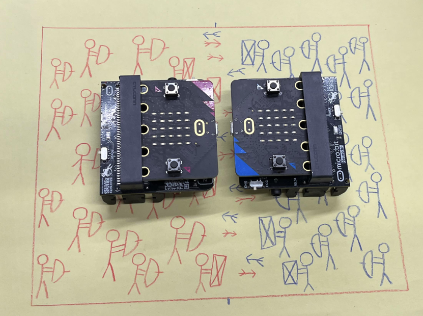
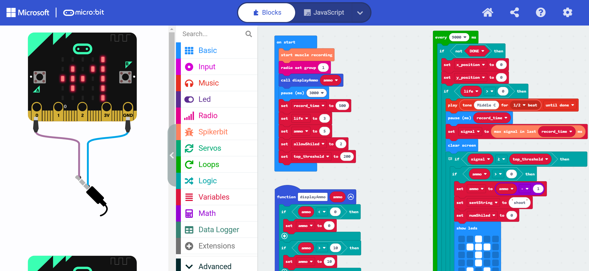
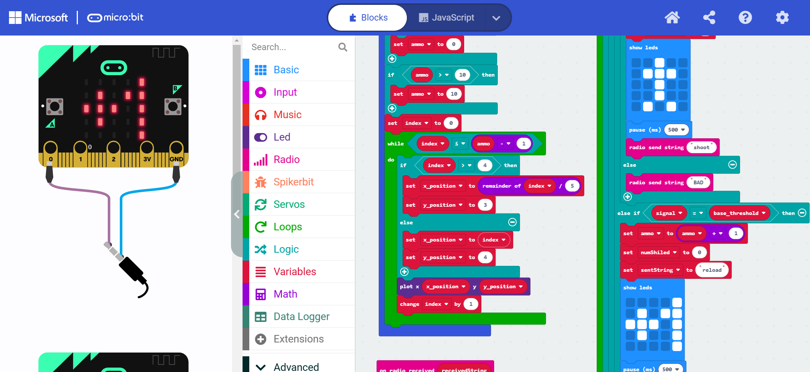
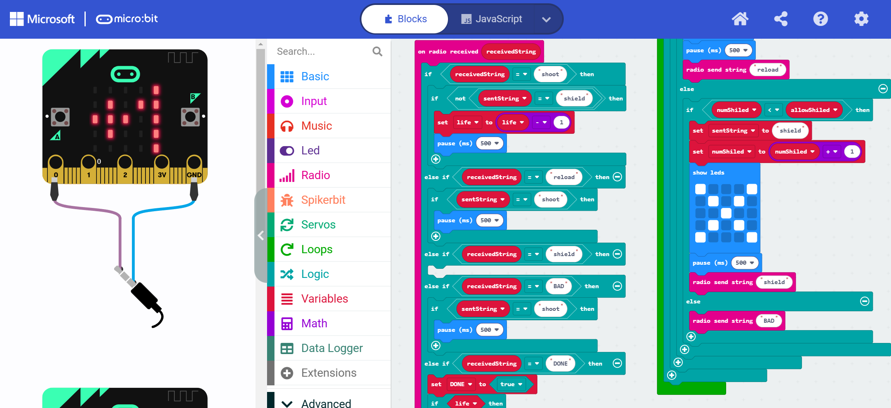
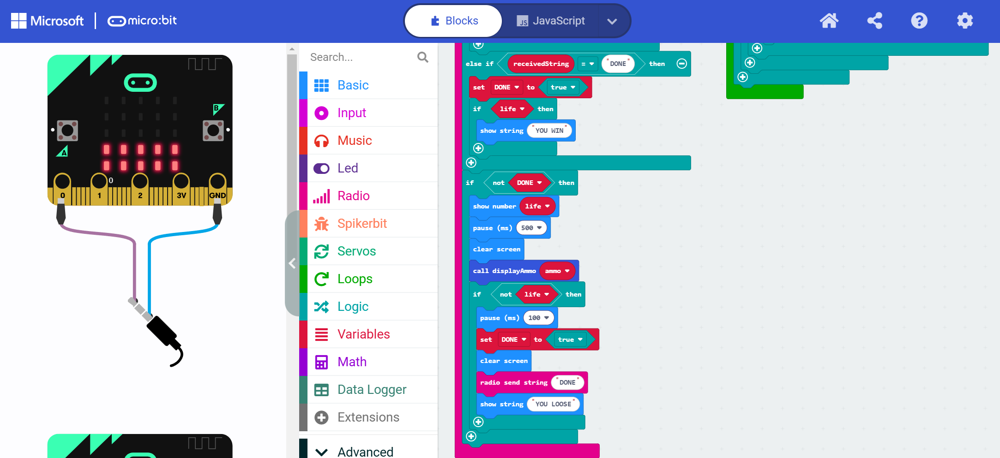

# The War Game #


|     |       |
|--------------|--------------
| Inventor     | Todor Šolajić and Mila Urošević            
| micro:bit IDE     | MakeCode Editor 
| Best Location     | Classroom

#### Difficulty ####

|     |       |
|--------------|--------------
| Hardware     | N/A           
| Software     | Medium


#### Special Requirement ####
|     |       |
|--------------|--------------
| None   | 

## Project Overview ##
Are you tired of the powerful red army always winning over your troops? Well, fear no more,
because we have a solution for you! The War Game is a fun 2-player game which tests your
logical skills and makes the time fly by.

With one grip of your hand you can choose which move you want to make, but be careful!
Each move makes you vulnerable in a different way and gives the opponent a chance to
make a move in their favour. So choose wisely and most importantly have fun!
We used two Spiker:bit kits with micro:bit, electrodes and cables combined with some
programming skills to bring this idea to life.


## Materials needed ##
- 2x spiker:bit kit (spiker:bit, 3x electrodes, and 1x orange cable)
- 2x micro:bit

## Build Instruction ##

There are no required hardware components to this project.

## Code ##
We need to make sure the players made their moves at the same time for the game
to work, which is why added the sound effects and time intervals:

A big part of the game is the communication between the two micro:bits. We wanted them to
register which moves the players chose, but also to react to the other player’s decision and
react based on that. With this communication we were able to program the micro:bits to
automatically count and display the amount of arrows each player has, as well as count their
lives and display the outcome in the end

import Tabs from '@theme/Tabs';
import TabItem from '@theme/TabItem';

<Tabs>
  <TabItem value="Block" label="Block Code">

  

  
  
  

  

  </TabItem>

  <TabItem value="Python" label="Python" default>

  ```py title="War Game"
  def displayAmmo(ammo: number):
      global index, x_position, y_position
      if ammo < 0:
          ammo = 0
      if ammo > 10:
          ammo = 10
      index = 0
      while index <= ammo - 1:
          if index > 4:
              x_position = index % 5
              y_position = 3
          else:
              x_position = index
              y_position = 4
          led.plot(x_position, y_position)
          index += 1

  def on_received_string(receivedString):
      global life, DONE
      if receivedString == "shoot":
          if not (sentString == "shield"):
              life = life - 1
              basic.pause(500)
      elif receivedString == "reload":
          if sentString == "shoot":
              basic.pause(500)
      elif receivedString == "shield":
          pass
      elif receivedString == "BAD":
          if sentString == "shoot":
              basic.pause(500)
      elif receivedString == "DONE":
          DONE = True
          if life:
              basic.show_string("YOU WIN")
      if not (DONE):
          basic.show_number(life)
          basic.pause(500)
          basic.clear_screen()
          displayAmmo(ammo2)
          if not (life):
              basic.pause(100)
              DONE = True
              basic.clear_screen()
              radio.send_string("DONE")
              basic.show_string("YOU LOOSE")
  radio.on_received_string(on_received_string)

  numShiled = 0
  signal = 0
  DONE = False
  sentString = ""
  y_position = 0
  x_position = 0
  index = 0
  life = 0
  ammo2 = 0
  spikerbit.start_muscle_recording()
  radio.set_group(1)
  displayAmmo(ammo2)
  basic.pause(3000)
  record_time = 500
  life = 3
  ammo2 = 5
  allowShiled = 2
  top_threshold = 200

  def on_every_interval():
      global x_position, y_position, signal, ammo2, sentString, numShiled
      if not (DONE):
          x_position = 0
          y_position = 0
          if life > 0:
              base_threshold = 0
              music.play(music.tone_playable(262, music.beat(BeatFraction.HALF)),
                  music.PlaybackMode.UNTIL_DONE)
              basic.pause(record_time)
              signal = spikerbit.max_signal_in_last(record_time)
              basic.clear_screen()
              # SHOOT
              # RELOAD
              # SHIELD
              if signal >= top_threshold:
                  if ammo2 > 0:
                      ammo2 = ammo2 - 1
                      sentString = "shoot"
                      numShiled = 0
                      basic.show_leds("""
                          . . # . .
                          . # # # .
                          . . # . .
                          . . # . .
                          . # . # .
                          """)
                      basic.pause(500)
                      radio.send_string("shoot")
                  else:
                      radio.send_string("BAD")
              elif signal == base_threshold:
                  ammo2 = ammo2 + 1
                  numShiled = 0
                  sentString = "reload"
                  basic.show_leds("""
                      . . . . #
                      . # . # #
                      # # # . #
                      . # . . #
                      . . . . #
                      """)
                  basic.pause(500)
                  radio.send_string("reload")
              else:
                  if numShiled < allowShiled:
                      sentString = "shield"
                      numShiled = numShiled + 1
                      basic.show_leds("""
                          # . . . #
                          . # . # .
                          . . # . .
                          . # . # .
                          # . . . #
                          """)
                      basic.pause(500)
                      radio.send_string("shield")
                  else:
                      radio.send_string("BAD")
  loops.every_interval(9000, on_every_interval)

  ```
  </TabItem>

  <TabItem value="Js" label="Js">

  ```py title="War Game"
  function displayAmmo (ammo: number) {
      if (ammo < 0) {
          ammo = 0
      }
      if (ammo > 10) {
          ammo = 10
      }
      index = 0
      while (index <= ammo - 1) {
          if (index > 4) {
              x_position = index % 5
              y_position = 3
          } else {
              x_position = index
              y_position = 4
          }
          led.plot(x_position, y_position)
          index += 1
      }
  }
  radio.onReceivedString(function (receivedString) {
      if (receivedString == "shoot") {
          if (!(sentString == "shield")) {
              life = life - 1
              basic.pause(500)
          }
      } else if (receivedString == "reload") {
          if (sentString == "shoot") {
              basic.pause(500)
          }
      } else if (receivedString == "shield") {
        
      } else if (receivedString == "BAD") {
          if (sentString == "shoot") {
              basic.pause(500)
          }
      } else if (receivedString == "DONE") {
          DONE = true
          if (life) {
              basic.showString("YOU WIN")
          }
      }
      if (!(DONE)) {
          basic.showNumber(life)
          basic.pause(500)
          basic.clearScreen()
          displayAmmo(ammo)
          if (!(life)) {
              basic.pause(100)
              DONE = true
              basic.clearScreen()
              radio.sendString("DONE")
              basic.showString("YOU LOOSE")
          }
      }
  })
  let numShiled = 0
  let signal = 0
  let DONE = false
  let sentString = ""
  let y_position = 0
  let x_position = 0
  let index = 0
  let life = 0
  let ammo = 0
  spikerbit.startMuscleRecording()
  radio.setGroup(1)
  displayAmmo(ammo)
  basic.pause(3000)
  let record_time = 500
  life = 3
  ammo = 5
  let allowShiled = 2
  let top_threshold = 200
  loops.everyInterval(9000, function () {
      if (!(DONE)) {
          x_position = 0
          y_position = 0
          if (life > 0) {
              let base_threshold = 0
              music.play(music.tonePlayable(262, music.beat(BeatFraction.Half)), music.PlaybackMode.UntilDone)
              basic.pause(record_time)
              signal = spikerbit.maxSignalInLast(record_time)
              basic.clearScreen()
              // SHOOT
              // RELOAD
              // SHIELD
              if (signal >= top_threshold) {
                  if (ammo > 0) {
                      ammo = ammo - 1
                      sentString = "shoot"
                      numShiled = 0
                      basic.showLeds(`
                          . . # . .
                          . # # # .
                          . . # . .
                          . . # . .
                          . # . # .
                          `)
                      basic.pause(500)
                      radio.sendString("shoot")
                  } else {
                      radio.sendString("BAD")
                  }
              } else if (signal == base_threshold) {
                  ammo = ammo + 1
                  numShiled = 0
                  sentString = "reload"
                  basic.showLeds(`
                      . . . . #
                      . # . # #
                      # # # . #
                      . # . . #
                      . . . . #
                      `)
                  basic.pause(500)
                  radio.sendString("reload")
              } else {
                  if (numShiled < allowShiled) {
                      sentString = "shield"
                      numShiled = numShiled + 1
                      basic.showLeds(`
                          # . . . #
                          . # . # .
                          . . # . .
                          . # . # .
                          # . . . #
                          `)
                      basic.pause(500)
                      radio.sendString("shield")
                  } else {
                      radio.sendString("BAD")
                  }
              }
          }
      }
  })

  ```
  </TabItem>
</Tabs>

## Operating Instructions ##

First, turn both micro:bits on at the same time.

Going forward, every 9 seconds, players have a designated time window to select an action, shoot (attack), shield (defend), or reload, based on their arm movement as detected by EMG signals:
- Shoot: Flex arm strong and quick
- Shield: Weakly and slowly flex arm
- Reload: Do nothing, hold arm still with no movement.

The game will continue until one player loses all life points.

:::tip
It takes a practice to get used the correct strength to perform each operation
Use above as reference and make sure to practice before you compete !!

### Additional Rules ###
Each player starts with 5 ammo and 3 life points.

Continuous shielding is limited to two consecutive uses; after two uses, the player must choose a different action (shoot or reload), or the shield action will be considered invalid.


