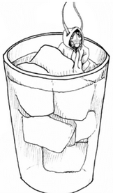
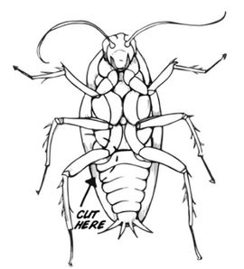
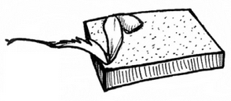
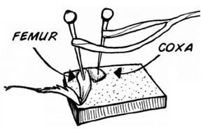
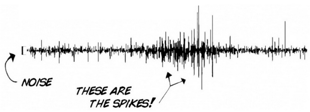
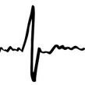

# Neuron SpikerBox Classic #

## Getting Started ##

Below are some basic setup steps for recording action potentials, for more advanced aplications, check out [our experiment pages](#experiments)

First anesthetize the Cockroach. Put it in a jar of ice water. Wait a few minutes until it stops moving.  

Neurosurgery! Remove the cockroach from ice, and cut off one of his legs near the body.

Place the leg on the cork of your SpikerBox, allowing a bit of the leg to overhang, like this.

And put the two electrodes in. It doesn’t matter which pins are where.

Turn your SpikerBox on! If you hear a popcorn sound, congratulations, you have just heard the spikes from your first neurons!  
Now let’s see what the electrical discharge looks like. Plug in the cable from the SpikerBox into your smartphone computer and connect to the [Spike Recorder app](../../Software/SpikeRecorder/)

Inside of Spike Recorder zoom into the spikes by using the scroll wheel on a computer, or by using a horizontal reverse pinch motion on a smartphone. You will see something like this:

This is due to ion channels opening and closing in the neurons, causing a spike, or Action Potential.

## Technical Specifications ##

|||
|---|---|
|Frequency range | 300Hz-1300Hz|
|Gain|880x|
|Output|Green Smartphone Cable, Blue Laptop Cable|
|Inputs|1x [Orange Cable](https://backyardbrains.com/products/muscleElectrodeCable)|

[Technical Schematic](https://backyardbrains.com/products/files/Neuron%20SpikerBox.v.1.42.pdf)

## Experiments ##

[Getting Started with Spikes](https://backyardbrains.com/experiments/spikerbox)

[Rate Coding](https://backyardbrains.com/experiments/ratecoding)

[Effect of Temperature on Neurons](https://backyardbrains.com/experiments/temperature)

[Microstimulation of Neurons and Muscles](https://backyardbrains.com/experiments/microstimulation)

[Referencing your Spikes](https://backyardbrains.com/experiments/referencing)

[Effect of Nicotine and MSG on Neurons](https://backyardbrains.com/experiments/neuropharmacology)

[NeuroProsthetics](https://backyardbrains.com/experiments/neuroProsthetics)

[Oxygen and Spiking](https://backyardbrains.com/experiments/oxygen)

## Troubleshooting ##

Check out the [General Troubleshooting steps](../../index.md#troubleshooting)

After connecting to spike recorder, let's ensure that we are picking up the signal from the board by quickly touching the electrode connector with your finger and afterward clap or snap near the device running Spike Recorder. You should see the graph change when touching the connector, but not when there is background audio.

The Neuron SpikerBoxes are especially sensitive to electrical noise, so taking steps to minimize it is a good idea. (Plug out any chargers from both the wall and device running spike recorder, make sure to stay away from flourecent lights are a few examples)
