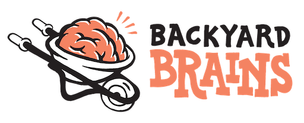

# Style Guide

## Logo Usage

Our full logo includes both the BYB Icon and the "Backyard Brains" text. Use this version when space permits and for formal applications.

Download sizes:
- [Small (150px)](./BYBLogoFull_150.png)
- [Medium (512px)](./BYBLogoFull_512.png)
- [Large (1024px)](./BYBLogoFull_1024.png)
- [Extra Large (3000px)](./BYBLogoFull_3000.png)

The Backyard Brains logo is our primary brand identifier. To maintain its visual impact and legibility:

- Always maintain clear space around the logo equal to the height of the "B" in "Brains"
- Never stretch, distort, or alter the logo's proportions
- Use only approved color variations
- Ensure the logo is clearly visible against its background

### Icon Only

The neuron icon can be used independently when space is limited or for social media avatars, favicons, and other compact applications.

Download sizes:
- [Small (150px)](./BYBLogo_150.png)
- [Large (1200px)](./BYBLogo_1200.png)

## Brand Colors

Our color palette is carefully chosen to represent different product categories while maintaining brand consistency.

### Primary Colors

| Color Name | Hex Code | Product Category | Usage |
| :--- | :---: | :---: | :--- |
| 
White
 | 
#FFFFFF
 | 
All
 | Backgrounds, illustrations |
| 
Black
 | 
#000000
 | 
All
 | Text, illustrations |
| 
Ambiguous Orange
 | 
#FD8164
 | 
All
 | Accent, color pops, Neuroscience callouts |
| 
Intracellular Magenta
 | 
#D01BA4
 | 
Neuron
 | Accent, color pops for Neuron product line/educational content |
| 
Simpsonish Yellow
 | 
#FEC52E
 | 
Human
 | Accent, color pops for Human product line/educational content |
| 
Growin' Green
 | 
#18A953
 | 
Plant
 | Accent, color pops for Plant product line/educational content |
| 
Book and Robot Blue
 | 
#1996FC
 | 
Neural Engineering
 | Accent, color pops for robot/code product line/educational content |

### Support Colors

| Color Name | Hex Code | Product Category | Usage |
| :--- | :---: | :---: | :--- |
| 
Tinted Support Orange 1
 | 
#FFCDBE
 | 
All
 | Used to support the main brand color when multiple tints are needed |

