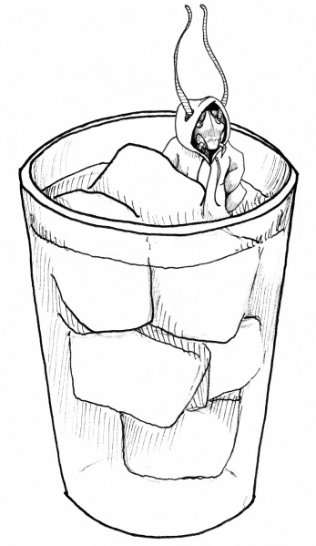
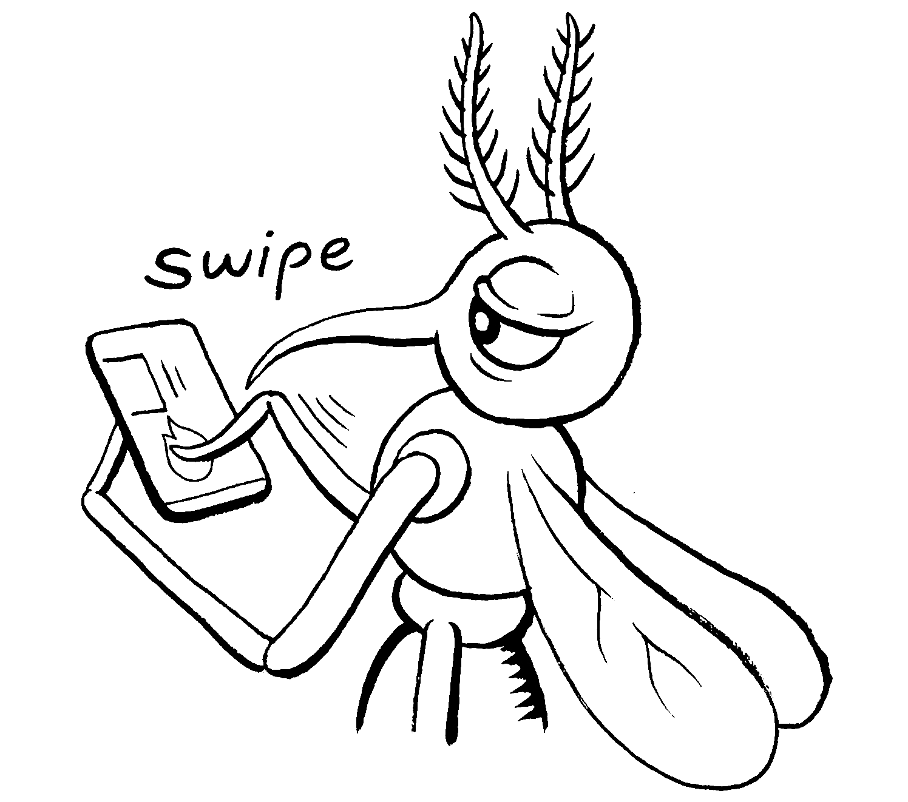

# Style Guide

## Logo Usage

Our full logo includes both the BYB Icon and the "Backyard Brains" text. Use this version when space permits and for formal applications.

Download sizes:
- [Small (150px)](./BYBLogoFull_150.png)
- [Medium (512px)](./BYBLogoFull_512.png)
- [Large (1024px)](./BYBLogoFull_1024.png)
- [Extra Large (3000px)](./BYBLogoFull_3000.png)

The Backyard Brains logo is our primary brand identifier. To maintain its visual impact and legibility:

- Always maintain clear space around the logo equal to the height of the "B" in "Brains"
- Never stretch, distort, or alter the logo's proportions
- Use only approved color variations
- Ensure the logo is clearly visible against its background

### Icon Only

The neuron icon can be used independently when space is limited or for social media avatars, favicons, and other compact applications.

Download sizes:
- [Small (150px)](./BYBLogo_150.png)
- [Large (1200px)](./BYBLogo_1200.png)

## Brand Colors

Our color palette is carefully chosen to represent different product categories while maintaining brand consistency.

### Primary Colors

| Color Name | Hex Code | Product Category | Usage |
|------------|----------|------------------|--------|
| 
White
 | #FFFFFF | 
All
 | Backgrounds, illustrations |
| 
Black
 | #000000 | 
All
 | Text, illustrations |
| 
Ambiguous Orange
 | #FD8164 | 
All
 | Accent, color pops, Neuroscience callouts |
| 
Intracellular Magenta
 | #D01BA4 | 
Neuron
 | Accent, color pops for Neuron product line/educational content |
| 
Simpsonish Yellow
 | #FEC52E | 
Human
 | Accent, color pops for Human product line/educational content |
| 
Growin' Green
 | #18A953 | 
Plant
 | Accent, color pops for Plant product line/educational content |
| 
Book and Robot Blue
 | #1996FC | 
Neural Engineering
 | Accent, color pops for robot/code product line/educational content |

### Support Colors

| Color Name | Hex Code | Product Category | Usage |
|------------|----------|------------------|--------|
| 
Tinted Support Orange 1
 | #FFCDBE | 
All
 | Used to support the main brand color when multiple tints are needed |

## Illustration Style

Our illustration style has a hand-drawn, sketch-like quality that blends scientific accuracy with a playful, surreal aesthetic. It maintains a balance between informative and expressive, making complex concepts more accessible and engaging.

We hire multiple illustrators to create a consistent style. Here are some examples from our most prolific illustrators:

| Cristina Mezuk | Matteo Farinella |
|-----------------|-------------------|
|  |  |

While each illustrator has their own unique style, they all follow the same guidelines.

### Look & Feel
- Minimalist & High-Contrast: The illustrations primarily use black linework on a white background, with minimal color accents. They rely on bold, clean strokes without excessive detail, ensuring clarity even in intricate concepts.
- Hand-Drawn & Organic: The linework feels intentional but loose, avoiding rigid precision. It has an intuitive, scientific notebook-meets-comic book quality.
- Hashes, No Fills: Never use fills in illustrations. Used hashed lines to indicate shading.
- Conceptually Driven: Many illustrations communicate abstract ideas visually, using metaphors, simplified forms, and symbolic elements rather than hyper-literal depictions.
- Slightly Surreal & Playful: While rooted in science, the illustrations introduce unexpected, often humorous twists—like insects using human technology or neural processes represented as physical interactions.
- Dynamic & Expressive: Subjects often have exaggerated gestures, directional lines, and movement cues, making even static images feel lively.
- Scientific Meets Whimsical: Whether it's a neuron with personality or an insect engaged in human-like behavior, the style maintains a balance between technical insight and creative storytelling.

### Common Motifs
- Anthropomorphized Insects & Creatures: Insects and animals often take on human-like traits or interact with technology, reinforcing neuroscience themes in a relatable, engaging way.
- Hand-Written Text: Never use computer-generated text in illustrations.
- Schematic & Geometric Elements: Some illustrations incorporate scientific diagram-like features without becoming rigid technical drawings.

