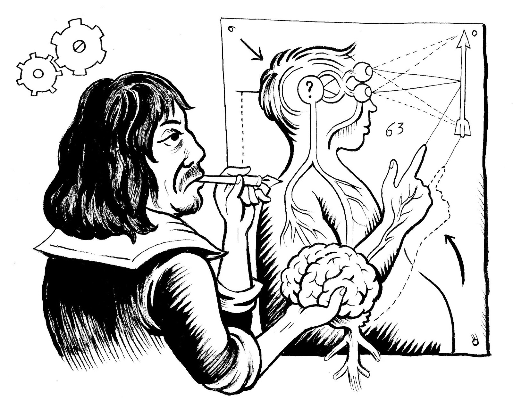
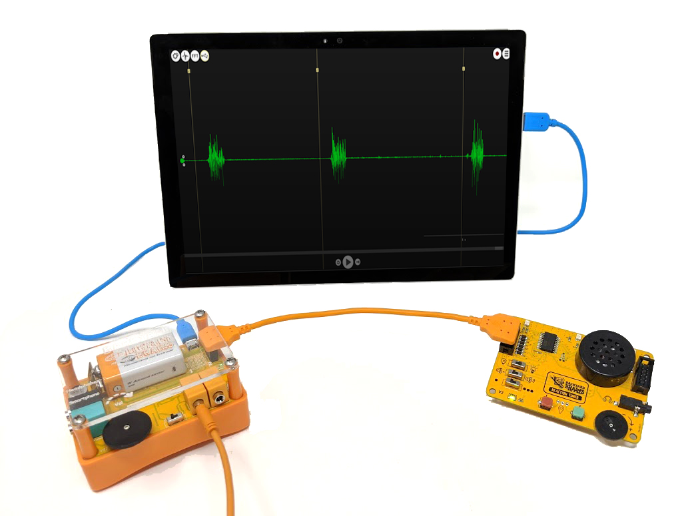
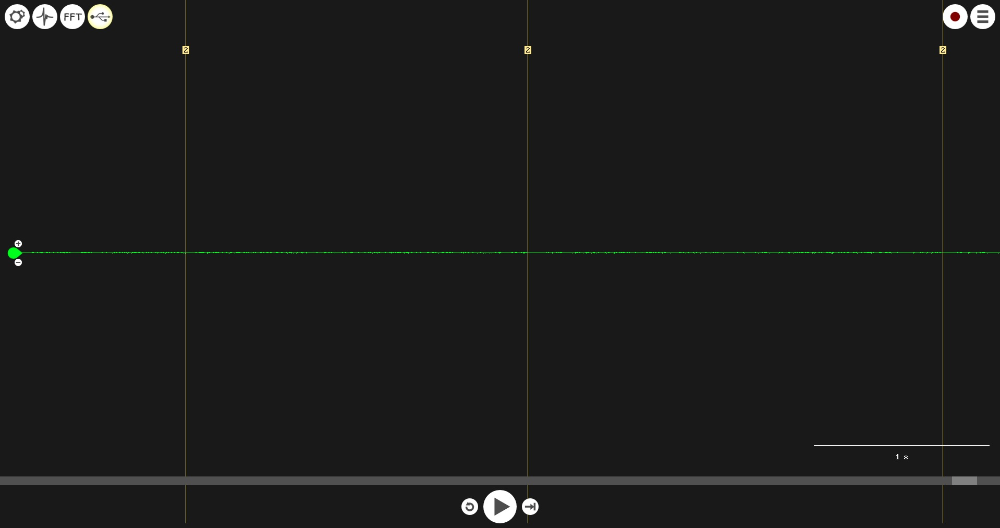
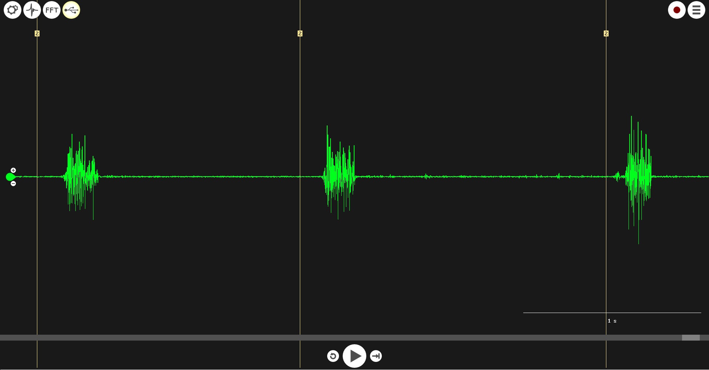
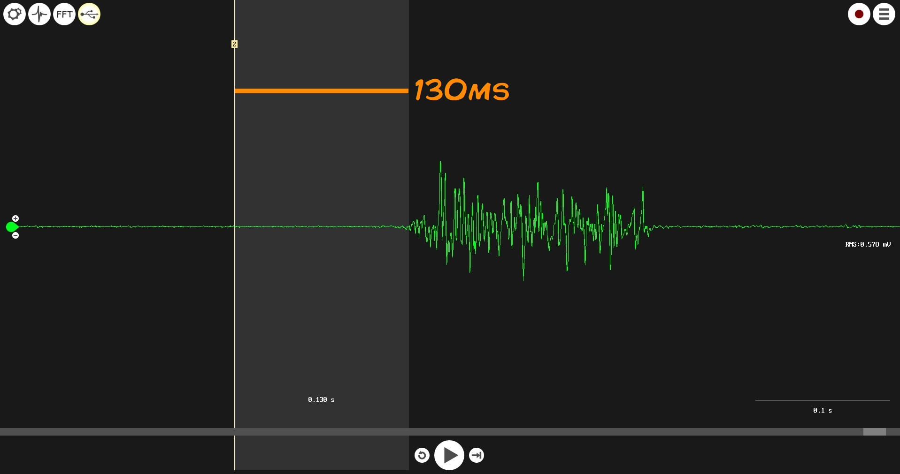
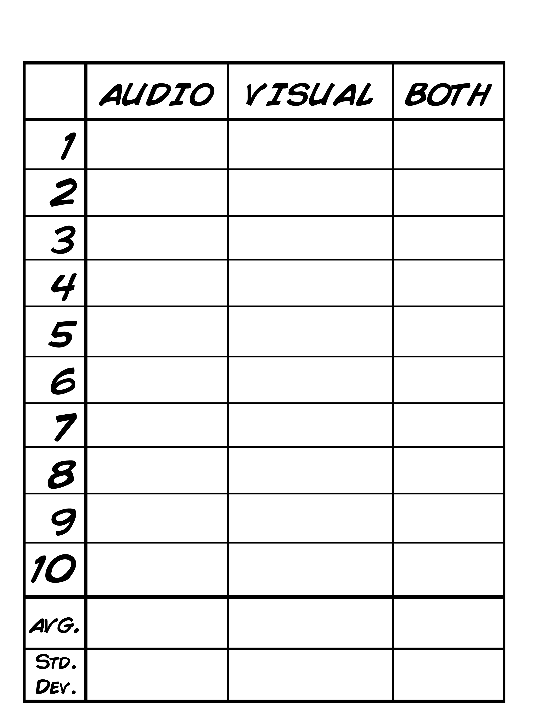
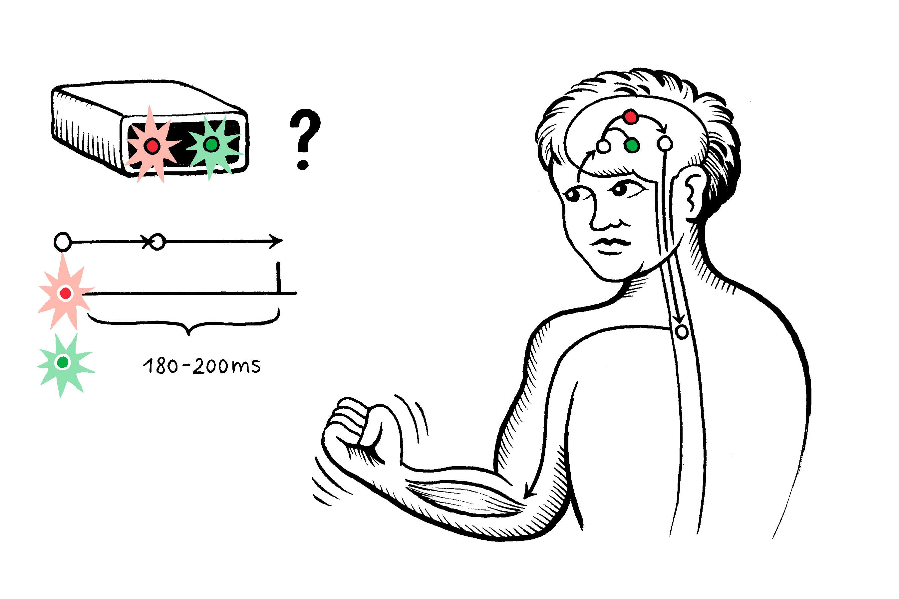

# Experiment: Clock the Inner Workings of the Brain

How fast do you think you are? Do you know what a reflex and a reaction are?
This experiments reveals the speed of your nervous system and the muscular
system, which the nervous system innervates, and uses the Muscle SpikerBox Pro
and Reaction Timer to help you calculate your own reaction speeds!

**Time:**  1 - 1.5 Hours

**Difficulty:**   Intermediate

#### What will you learn?

Now that you've been introduced to reactions and reflexes, it is time to plug
into our Reaction Timer and test your skills! In this experiment, you will
compare reaction times using different stimuli_ visual, auditory, and
combination!

##### Prerequisite Labs

  * [Intro to The Muscle SpikerBox Pro_ Agonist and Antagonist Pairs](https://backyardbrains.com/experiments/muscleSpikerBoxPro)
  * [How Fast Your Brain Reacts to Stimuli](reactiontime)

##### Equipment

* [Muscle SpikerBox Pro](https://backyardbrains.com/products/muscleSpikerBoxPro)
* [Reaction Timer](https://backyardbrains.com/products/reactiontimer)
* Mac / PC
* Android Smartphone / Tablet

### Updated Experiment:

Note: if your Reaction Timer looks different than what you see below, you may
have a previous version. Check out the [legacy instructions here!](./files/Legacy_Reaction_Timer.pdf)  

## Background

The story begins with René Descartes - as a young boy in France, René visited
the gardens of the French Royal Palace St. Germain. The French king was a bit
of a prankster_ He had set up lifelike mannequins that would jump out and
surprise garden flaneurs, along with other mechanical exhibits such as statues
that would retreat as art lovers attempted to get close enough to see the
details in the statues. René was surprised, literally, by these mannequins
which jumped out at him as he explored the garden. He was curious how the
system worked, and upon investigation, he found a hydraulic system of water
pipes whereby stepping on a pressure plate caused almost "life-like" action in
the mannequins.

Descartes writes of this experience in his 1633 essay "Treatise of Man" which
details his theory of "stimulus response."

Descartes suspected that, much like the automated, hydraulic exhibits in the
garden of St. Germain, the nervous system was controlled by "animal spirits"
which would flow through the nerves of animals and people giving rise to
automatic responses, or reflexes. Descartes' theory succeeded in describing
stimulus response and reflexes as mechanistic, but its proposed mechanisms are
false_ Nerves are not hollow, nor is there a flow of animal spirits through
our nervous system.

Had Descartes lived another 70 years (to the ripe old age of 124!), he would
have learned of Galvani and Volta's investigations into the role that
electricity plays in the nervous system. Then, in the mid-1800s, scientists
began studying reflexes and reactions with quantitative tests! Reaction time
tests, like you performed in the previous experiment with the ruler drop, help
us understand how long it takes information to travel through our nervous
system. However, as you likely experienced, the Ruler Drop experiment isn't
perfect... there are a lot of possible confounding variables. It is an
instructive lab which teaches us a lot about how to perform a rigorous,
scientific experiment, but its results would have a hard time standing up to
scrutiny. As a love letter to Descartes, we continue in this tradition of
studying stimulus response. But now, with the Backyard Brains Muscle SpikerBox
Pro and Reaction Timer we can use the electrical activity of our muscles to
determine exactly how fast our nervous system can receive and send
information!

#### Print Materials

> If you're looking for a PDF to print and scribble on, or a google doc to
> edit, [check out this repository of print resources
> here!](https://drive.google.com/drive/folders/1bE1B0DvsGNauhyj-z8YjzuBXmFYivfkR?usp=sharing)

## Procedure

#### Setting up the Reaction Timer

  1. Plug the Muscle SpikerBox Pro into your recording device via USB. This experiment only works on devices you can connect to via USB, so it excludes iPads, iPhones, and Chromebooks until those platforms offer 3rd party USB communication (we're patiently waiting, it is very frustrating.) 
  2. Connect the Reaction Timer to the Muscle SpikerBox Pro with the Orange Expansion Cable. Note_ if your Reaction Timer looks different, you may have a previous version. Check out the [legacy instructions here!](./files/Legacy_Reaction_Timer.pdf)
  3. Hook an arm up to the Muscle SpikerBox! The two red clips attach to the stickers on the user's forearm, and the one black clip attaches to the sticker on the back of the user's hand. 
  4. Turn on and test your devices! PC users open up the [SpikeRecorder app](https://backyardbrains.com/products/spikerecorder) and check to see that you are receiving input from your Muscle SpikerBox Pro when you flex your muscles. 
  5. Next, test the Reaction Timer. Make sure the Light and Tone switches are in the on position, and the random switch is in the off position, and then press the first button on your board! You should hear a sound, see an LED light up, and in SpikeRecorder you should see that a tick mark has been placed in your recording at the exact moment you pressed the button. 

> **Troubleshooting your set up_**
> * If you don't hear any sounds through the speaker, make sure your the tone
> switch is in the on position, the black volume wheel is turned up all the
> way and that nothing is plugged into the headphone jack located in between
> the LEDs at the front of your board.
> * If you are not seeing any activity on your recording device, your laptop
> or mobile device, make sure you are using the appropriate cables. Remember,
> for Mac and Mobile device users, you need to use a Smartphone Cable which
> has designated ends_ one end for your Muscle SpikerBox, one end for your
> recording device

#### Experiment 1_ Simple Reaction Time

For this step, you will need a partner! One of you will be the controller, the
other the subject. You will record a Simple Reaction Time - how fast can you
react with no distractions or instructions?

  1. Have the subject hook up to the Muscle SpikerBox and direct their attention to the Reaction Timer. Tell them their objective is to flex their muscle as fast as they can in response to hearing a sound or seeing an LED light up. For this experiment we will start with just the sound switched on and the controller will strictly use button 1 (leftmost of the two buttons). This is called a Simple Reaction Time test (SRT). 
  2. Start recording. 
  3. The controller will press the button 10 times at random intervals. The subject will flex in response to the stimulus as quickly as possible. 

  4. After the subject's reaction time has been tested 10 times with sound switched on, end and save the recording. 
  5. Repeat the above steps using light as the stimulus. Then repeat again using both sound and light turned on! You want to end up with three different recordings, each with 10 reactions.

#### Quantifying Your Data

  1. Open up your recording in the app. 
  2. Search for the tick marks. For each tick mark, click and drag from the tick mark to the beginning of the subject's muscle activity to measure the reaction time. For Smartphones, do this by long-pressing on the screen at the tick mark, then dragging to the beginning of the flex! 

  3. Record the reaction times and fill in the chart below! 

* Average your results! Calculate the [Standard Deviation](https://backyardbrains.com/experiments/p-value). Then perform again and again! Change the variables! Test light, sound, random, ... 

#### Experiment 2_ Recognition Reaction Time (Go/No Go)

For this experiment, you will add a "distraction." Instruct the subject to
flex in response to seeing the red LED light up, but now the experiment
controller will add a distraction, presenting the subject with both red and
green lights... what effect will this decision-making have on the reaction
time speed? Let's find out!

  1. Set up your subject just as you did before. 
  2. Tell your subject to flex only in response to the red light and not the green light. 
  3. Perform several trials, then quantify your data just as you did for the Simple Reaction Time experiment. Now, compare with the results of the Simple Reaction Time Test - what do you see? 

#### Experiment 3_ Choice Reaction Time

One last experiment! To further complicate this neural circuit, we can
continue to add instructions which the subject must follow.

  1. Hook up two sets of electrodes to record from both of your subjects arms. Tell your subject to flex their left arm in response to the green light and their right arm in response to the red light. 
  2. Perform several trials, then again, quantify your data and compare it to the other tests. 

#### Discussion

Talk about your results. Did your subject react quicker to the light, the
sound, or the combination of both? What happened when you changed the
instructions for your subject? When did your subject react the fastest and the
slowest? Why do you think you got the results you did? Find more test subjects
to create a larger sample size!

Do some web-searching and hunt for professional research that focuses on
reaction times! We like [this paper's
analysis](https://www.ncbi.nlm.nih.gov/pubmed/26097821) of the difference
between auditory and visual response times (spoiler alert in case you haven't
performed the experiment yourself yet!)

Come up with your own ideas! You can take advantage of the different tones and
lights in your own experiments. You can also see if different conditions make
the reaction times faster or slower. A sleepy subject may be slower than a
well-rested subject. Also, where you place your electrodes may make a
difference_ can you flex your right arm faster than your left? Can you clench
your jaw faster than you can flex your thigh? Conduct your own experiments and
share your results with us at
[hello@backyardbrains.com](mailto:hello@backyardbrains.com)!

#### Project Lead the Way Alignment

This kit is a great alternative to the reaction time experiment in Human Body
Systems' lesson "2.2.4 Reaction Time." This isn't just a computer game... Turn
your Reaction Time lab into a quantitative, muscle physiology lab! You are in
total control of the experimental variables. Compare Sight, Sound, Decision
Making, and even different muscles... does a muscle further away from the
brain take longer to react? Your students can find out! To see just how simple
it is to use, check out the [How Fast can your Body
React?](https://backyardbrains.com/experiments/EMGReactionTimer)Everything
comes pre-assembled, and it pairs with our free, user-friendly software_
[SpikeRecorder](products/SpikeRecorder) (which is available on any smart
device.)

#### Questions to Consider

  1. Why do you think touch and audio stimuli have a faster reaction time on average? 
  2. What do you think could explain differences in reaction time between different types of stimuli? 
  3. Would you expect a difference in the average reaction times between a male and female? What about a more athletic person compared to a more sedentary person? 
  4. Could you redesign the experimental setup to test tactile reaction times?