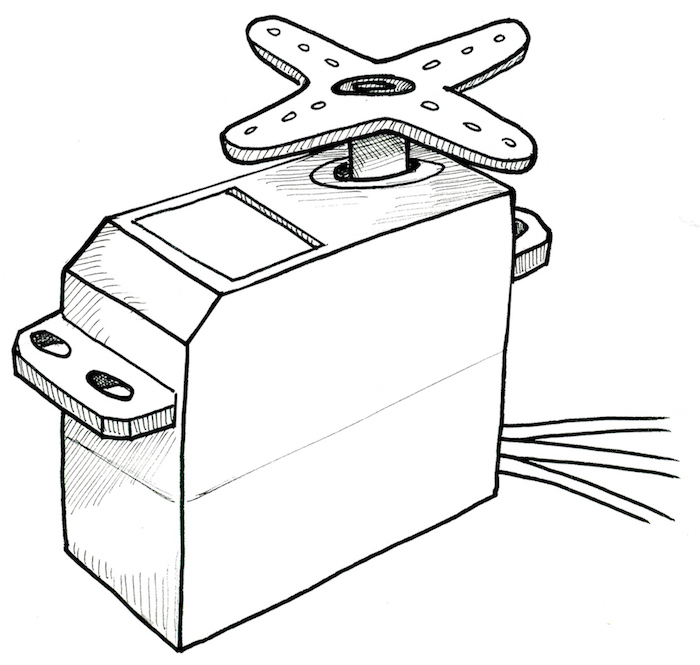
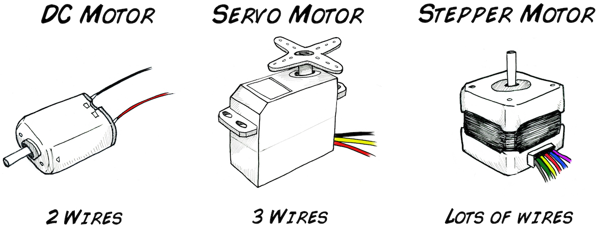
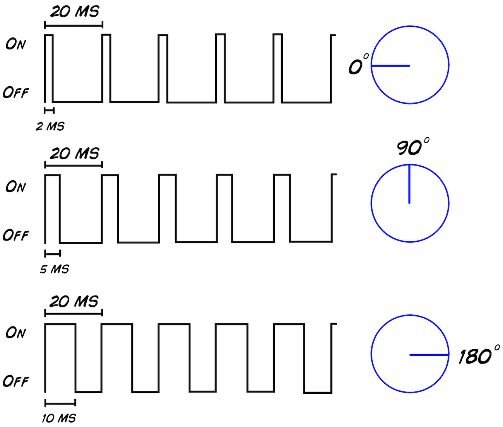
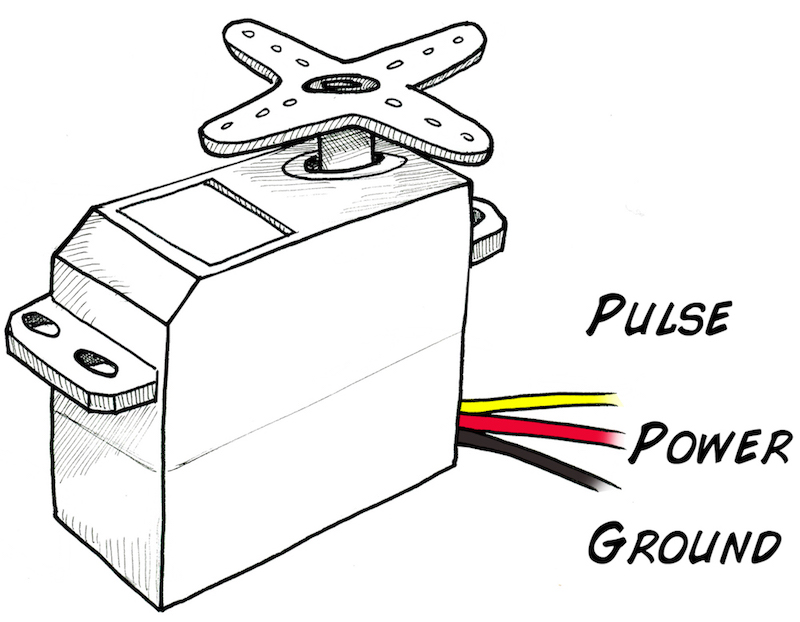
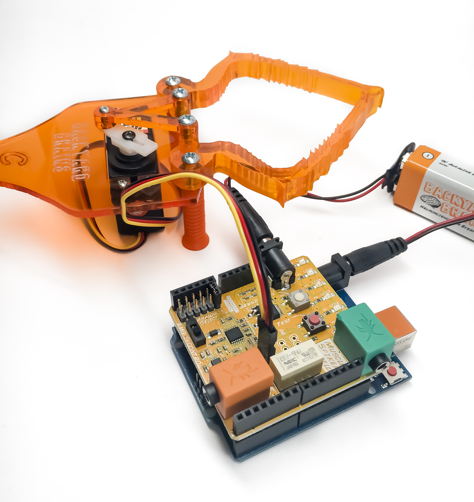
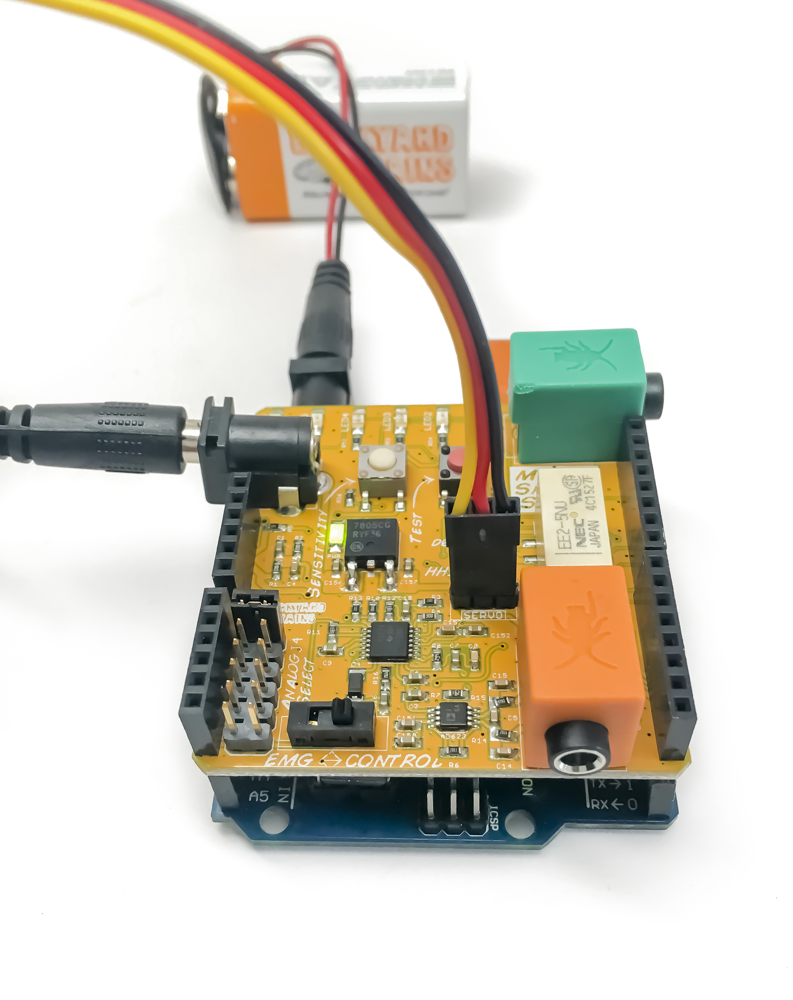

## Experiment: Controlling the Claw

---
id: "controlling_the_claw"
title: "Controlling the Claw"
slug: "/retired/experiments/MuscleSpikerShield_GripperHand"
---

Make your first anthropomorphic Neuroprosthetic, in which you control a
robotic claw with the signal of your muscles.

**Time**  2 hours

**Difficulty**  Advanced

#### What will you learn?

In the following experiment you will learn to control the Claw with the EMG
signal of your muscles. The Claw will open and close depending on the strength
of the signal you make when contracting the muscles of your hand; you can
perform this experiment to impress your friends, for a school science fair, or
just to dive into the study of Neuroprosthetics!

##### Prerequisite Labs

* [Getting to know the Muscle SpikerShield](https://backyardbrains.com/experiments/MuscleSpikerShield)

##### Equipment

* [Claw Bundle](https://backyardbrains.com/products/clawBundle)

## Background

_Based on a prototype written by José Enrique López Pérez, student of Electronic Engineering in Oaxaca, Mexico._

**Servomotor**

To make robots people often use servomotors. They are popularly called
"servos" and are useful for their small size, low power consumption, and high
accuracy. They can be found in the steering control of a toy car or at the
helm of a ship or aircraft, for example... A servo motor is made up of a small
DC motor, a gear transmission which reduces speed and increases strength, and
a small circuit control that makes it possible to move the motor accurately.

[ ](./img/ServoMotor_web.jpg)

**What is the difference between a stepper motor and a servo motor?**

Inside a [stepper motor](MuscleSpikerShield_StepperMotor) there are coils and it's necessary to apply a series of pulses to them for the motor to rotate a certain number of steps; This is why it has so many wires coming out of it (usually 5 to 6 wires). However, inside the servo motor there is one DC motor and a circuit control which enables precise positioning of this motor using only three wires, one for control and the other two for power and ground.
and ground.

Some significant differences between a servomotor and a stepper motor are:
speed, strength, and accuracy; the servomotor can move with a velocity greater
than a stepper motor, and with more strength and accuracy. A stepper motor is
normally not used in high speed applications because at these speeds it loses
strength. However, at low speeds the Stepper motor is more accurate and
stronger than the servo, that's why it's widely used in industrial robot arms.

[ ](./img/MotorTypes_web.jpg)

The PWM (Pulse Width Modulation) is the most commonly used system for servo
control. This system generates a square wave which changes the amount of time
the pulse is high, keeping the same period; a high level duration of the
signal indicates the position where we want to put the motor shaft. An
integrated potentiometer in the control circuitry monitors the current angle
of the servo: if the axis is at a right angle, then the motor is off. The
circuit checks that if the angle is not correct, the servo will correct the
direction until the angle is right. Normally, the axis of the servo is able to
reach around 180 degrees, but in some servos it reaches 210 degrees (you can
even find motors of 360�, these servos are ideal for installations where you
need a wide angle rotation), but this range varies by application and
manufacturer. The pulse duration indicates the rotation angle of the motor.

[ ](./img/Graphs_PWM_web.jpg)

It's important to emphasize that, to make a servo remain in the same position,
it is necessary to continuously send a pulse of constant width. This way, if
there's a force that tries to change this position, the motor will try to
resist. If the servo motor stops sending pulses, or the interval between
pulses is greater than the maximum allowed, then the servomotor lose strength
and stops trying to maintain its position, and any external force will be able
to move it.

**Servo control.** A servomotor traditionally has three wires: power, ground,
and signal. The power cable is usually red, and in this configuration is
connected to 5V. The ground wire is usually black or brown and must be
connected to....ground. The signal cable is usually white, yellow, or orange
and needs to be connected to the PWM (Pulse Width Modulation) signal. For
generating a PWM waveform a microcontroller is often used, because it has
specific hardware to perform this task and facilitates the process of
generating the signal. It can do this with just a few lines of code.

Terminal configuration

[ ](./img/ServoMotorColor_web.jpg)

In this experiment you will use only use power, ground, and digital out pin 2
of the SpikerShield to generate a PWM wave. Power will come from a second 9V
battery (if you use the Arduino's own power supply to power the motor,
amplification of your muscle activity becomes unstable due to the voltage
draws of the servo).

#### Downloads

> Take our (.ino) Claw Sketch and load it on your Arduino
>
> [Default Arduino Code for Muscle-Based Claw Control](https://raw.githubusercontent.com/BackyardBrains/SpikerShield/master/Muscle/Arduino%20Code/Gripper/MuscleSpikerShieldWithGripper_V1_0.ino)
>
> [Test Code that loops Claw between Open and Closed](https://raw.githubusercontent.com/BackyardBrains/SpikerShield/master/Muscle/Arduino%20Code/Gripper/MuscleSpikerShield_GripperLoop.ino)

## Video

## Procedure

1. Your Robotic Claw has a three wire servomotor cable that you plug into your Muscle SpikerShield. The Cable has a black, red, and a yellow wire. The yellow is the control wire, red is power (9V), and black is ground. 
  2. Plug the Servomotor cable into the three pin header on your Muscle SpikerShield. Order is important! The yellow side goes toward the center of the board. 

[ ](./img/claw_muscleSpikerShield2.jpg)

  3. Your Claw is power hungry and needs its own power supply. Plug the two 9V batteries into the barrel connectors on the Muscle SpikerShield Board and the Arduino. 
  4. Place three sticker electrodes on your own, two on your forearm and one on the back of your palm. 
  5. Taking your orange electrode cable, connect the two red alligator clips on the electrodes on your forearm (order does not matter) and the black alligator clip on the ground on the back of your hand. Plug the orange cable into the orange port on your Muscle SpikerShield. 
  6. Plug the additional battery into the barrel connector on the blue Arduino board to power up the system. 
  7. Now flex your arm! You should see the Claw move as well. You can push the white button to change between high and low threshold modes, and you can push the red button to switch between default open or default closing. 

[
](./img/claw_muscleSpikerShield_jumpwire.jpg)

**Code description:** This code makes the Arduino, with help of the Muscle
SpikerShield, capture EMG signals produced by contracting muscles of the
forearm and converts them to PWM pulses to give movement to the servo motor.
These pulses change according to the movement of the muscles: the more
strength you use to close your hand, the more the Claw closes. Using the
library included in this program you can control servo motors easily without
much code. Below you can see the code, but if you want to download it, just
click
[here](https://raw.githubusercontent.com/BackyardBrains/SpikerShield/master/Muscle/Arduino%20Code/Gripper/MuscleSpikerShieldWithGripper_V1_0.ino)
or in the links above.

**The Code**

```cpp    
        /*
    * --------------------------------------------------------------------------------------
    * Code monitors amplitude of EMG envelope, displays EMG strength on LED bar and controls
    * robotic gripper by controlling servo motor.
    * --------------------------------------------------------------------------------------
    */
    
    #include &ltServo.h>

#define GRIPPER_STATE_BUTTON_PIN 4          //pin for button that switches defult state

//of the gripper (opened/closed)
    #define SERVO_PIN 2                         //pin for servo motor

#define SENSITIVITY_BUTTON_PIN 7            //pin for button that selects sesitivity

#define NUM_LED 6                           //number of LEDs in LED bar

#define GRIPPER_MINIMUM_STEP 5              //5 degree dead zone (used to avoid

//aiming oscilation)
    #define OPEN_MODE 1                         //default gripper state is opened

#define CLOSED_MODE 2                       //default gripper state is closed

#define MINIMUM_SERVO_UPDATE_TIME 100       //update servo position every 100ms

Servo Gripper;                              //servo for gripper
    byte ledPins[] = {8, 9, 10, 11, 12, 13};    //pins for LEDs in LED bar
    
    //EMG saturation values (when EMG reaches this value
    //the gripper will be fully opened/closed)
    int sensitivities[] = {200, 350, 520, 680, 840, 1000};
    int lastSensitivitiesIndex = 2;             //set initial sensitivity index
    
    int emgSaturationValue = 0;                 //selected sensitivity/EMG saturation value
    int analogReadings;                         //measured value for EMG
    byte ledbarHeight = 0;                      //temporary variable for led bar height
    
    unsigned long oldTime = 0;                  //timestamp of last servo angle update (ms)
    int oldDegrees = 0;                         //old value of angle for servo
    int newDegree;                              //new value of angle for servo
    
    unsigned long debouncerTimer = 0;           //timer for button debouncer
    int gripperStateButtonValue = 0;            //variable that stores state of button
    int userReleasedButton = 1;                 //flag that is used to avoid multiple
                                                //button events when user holds button
    
    int currentFunctionality = OPEN_MODE;       //current default position of claw
    
    
    
    //-----------------------------------------------------------------------------------
    //   Setup servo, inputs and outputs
    // ----------------------------------------------------------------------------------
    void setup(){
    	//init servo
    	Gripper.attach(SERVO_PIN);
    
    	//init button pins to input
    	pinMode(GRIPPER_STATE_BUTTON_PIN, INPUT);
    	pinMode(SENSITIVITY_BUTTON_PIN, INPUT);
    
    	//initialize all LED pins to output
    	for(int i = 0; i < NUM_LED; i++){
    		pinMode(ledPins[i], OUTPUT);
    	}
    
    	//get current sensitivity
    	emgSaturationValue = sensitivities[lastSensitivitiesIndex];
    }
    
    
    
    //-----------------------------------------------------------------------------------
    //   Main loop
    //
    //   - Checks state of sesitivity button
    //   - Checks state of default-gripper-state button
    //   - Measure EMG
    //   - Shows EMG strength on LED bar
    //   - Sets angle of servo based on EMG strength and current mode (open/closed)
    // ----------------------------------------------------------------------------------
    void loop()
    {
    
    	//-----------------------  Switch sensitivity ------------------------------------
    
    	//check if button is pressed (HIGH)
    	if (digitalRead(SENSITIVITY_BUTTON_PIN))
    	{
    		//turn off all the LEDs in LED bar
    		for(int j = 0; j < NUM_LED; j++)
    		{
    			digitalWrite(ledPins[j], LOW);
    		}
    
    		//increment sensitivity index
    		lastSensitivitiesIndex++;
    		if(lastSensitivitiesIndex==NUM_LED)
    		{
    			lastSensitivitiesIndex = 0;
    		}
    
    		//get current sensitivity value
    		emgSaturationValue = sensitivities[lastSensitivitiesIndex];
    
    		//light up LED at lastSensitivitiesIndex position for visual feedback
    		digitalWrite(ledPins[lastSensitivitiesIndex], HIGH);
    
    		//wait user to release button
    		while (digitalRead(SENSITIVITY_BUTTON_PIN))
    		{
    			delay(10);
    		}
    		//whait a bit more so that LED light feedback is always visible
    		delay(100);
    	}
    
    
    	//----------------------------  Switch gripper default position open/close ---------
    
    	//check if enough time has passed for button contact to settle down
    	if((millis() - debouncerTimer) > 50)
    	{
    		gripperStateButtonValue = digitalRead(GRIPPER_STATE_BUTTON_PIN);
    		//if button is pressed
    		if(gripperStateButtonValue == HIGH)
    		{
    			//if last time we checked button was not pressed
    			if(userReleasedButton)
    			{
    				debouncerTimer = millis();
    				//block button events untill user releases it
    				userReleasedButton = 0;
    
    				//toggle operation mode
    				if(currentFunctionality == OPEN_MODE)
    				{
    					currentFunctionality = CLOSED_MODE;
    				}
    				else
    				{
    					currentFunctionality = OPEN_MODE;
    				}
    			}
    		 }
    		 else
    		 {
    			userReleasedButton = 1;
    		 }
    	}
    
    
    	//-----------------------------  Measure EMG ---------------------------------------
    
    	analogReadings = analogRead(A0);//read EMG value from analog input A0
    
    
    	//---------------------- Show EMG strength on LED ----------------------------------
    
    	//turn OFF all LEDs on LED bar
    	for(int j = 0; j < NUM_LED; j++)
    	{
    		digitalWrite(ledPins[j], LOW);
    	}
    
    	//calculate what LEDs should be turned ON on the LED bar
    	analogReadings= constrain(analogReadings, 30, emgSaturationValue);
    	ledbarHeight = map(analogReadings, 30, emgSaturationValue, 0, NUM_LED);
    
    	//turn ON LEDs on the LED bar
    	for(int k = 0; k < ledbarHeight; k++)
    	{
    		digitalWrite(ledPins[k], HIGH);
    	}
    
    
    	//-------------------- Drive Claw according to EMG strength -----------------------
    
    	//set new angle if enough time passed
    	if (millis() - oldTime > MINIMUM_SERVO_UPDATE_TIME)
    	{
    		//calculate new angle for servo
    		if(currentFunctionality == OPEN_MODE)
    		{
    			analogReadings = constrain(analogReadings, 40, emgSaturationValue);
    			newDegree = map(analogReadings, 40 ,emgSaturationValue, 190, 105);
    		}
    		else
    		{
    			analogReadings = constrain(analogReadings, 120, emgSaturationValue);
    			newDegree = map(analogReadings, 120 ,emgSaturationValue, 105, 190);
    		}
    
    		//check if we are in servo dead zone
    		if(abs(newDegree-oldDegrees) > GRIPPER_MINIMUM_STEP)
    		{
    			 //set new servo angle
    			 Gripper.write(newDegree);
    		}
    		oldTime = millis();
    		oldDegrees = newDegree;
    	}
    }
```

With this new experience, now you can make your own inventions. Tell us what
you are making [info@backyardbrains.com](mailto:info@backyardbrains.com) and
maybe we can start a friendship!

## Science Fair Project Ideas

* Try to design some reaction time experiments that could be done with your own body and with the Claw. How does the time differ? Does it depend on the sensory stimulus you're reacting to? 
     * Hook up people of differing levels of athleticism-does this affect the strength of the Claw? How about how long they can the grip? 
     * What are some other devices you could connect this to? What might be the limit to what or how many you could connect to? 

