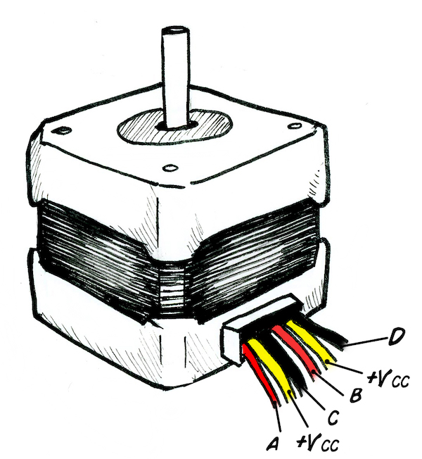
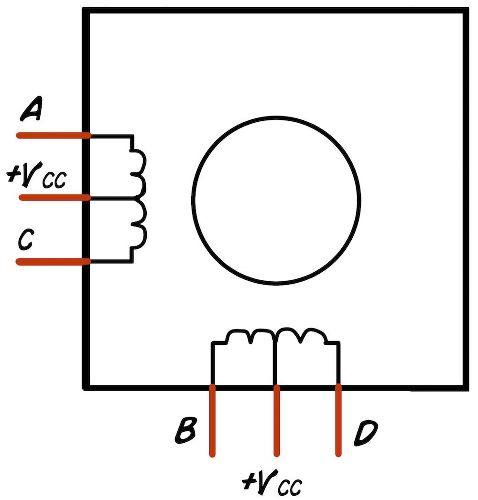
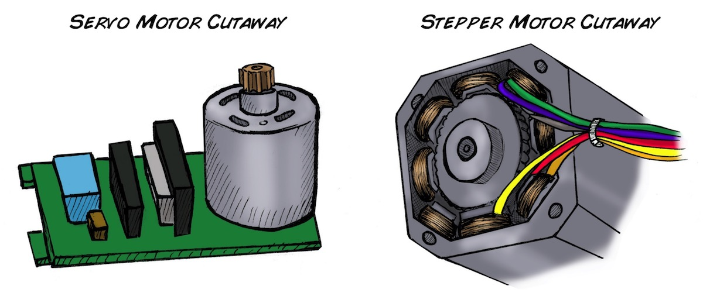

## Experiment:Controlling a Stepper Motor with Your Muscles

---
id: "experiment__controlling_a_stepper_motor_with_your_muscles"
title: "Experiment: Controlling a Stepper Motor with Your Muscles"
slug: "/retired/experiments/MuscleSpikerShield_StepperMotor"
---

What biology beyond flagella has never achieved_ Rotary Motion with Axles.
Here you will learn to make an interface with a Stepper Motor and enjoy making
precise circular movements.

**Time:**  1 hour

**Difficulty:**   Intermediate

#### What will you learn?

In this experiment, we will drive a stepper motor using EMG signals from the
Muscle SpikerShield. With this stepper motor, you can design your own
inventions that move things with your muscle signals.

##### Prerequisite Labs

* [Getting started with the Muscle SpikerShield](https://backyardbrains.com/experiments/MuscleSpikerShield)

##### Equipment

* [Muscle SpikerShield](https://backyardbrains.com/products/muscleSpikershieldBundle)
* [Stepper Motor](https://www.amazon.com/gp/product/B00PNEQKC0/ref=ppx_yo_dt_b_asin_title_o01_s00?ie=UTF8&psc=1)
* [Stepper Motor Driver](https://www.amazon.com/gp/product/B07JV835SW/ref=ppx_yo_dt_b_asin_title_o02_s00?ie=UTF8&psc=1) 
* [Breadboard](https://www.amazon.com/Pcs-MCIGICM-Points-Solderless-Breadboard/dp/B07PCJP9DY/ref=sr_1_6?dchild=1&keywords=breadboard&qid=1626130451&s=industrial&sr=1-6)
* [Jumper Wires](https://www.amazon.com/dp/B01EV47GI4/ref=redir_mobile_desktop?_encoding=UTF8&aaxitk=88cb0c9353a9a208eec99acacc715eb6&hsa_cr_id=4414025220401&pd_rd_plhdr=t&pd_rd_r=f63a3a8f-b5fb-43e0-ba94-21c0a81a1e51&pd_rd_w=8bwoc&pd_rd_wg=1ILZo&ref_=sbx_be_s_sparkle_mcd_asin_2_title)
* [9 Volt Connectors](https://www.amazon.com/Battery-Connector-I-Type-Plastic-Housing/dp/B07TRKYZCH/ref=sr_1_3?dchild=1&keywords=9+volt+connector&qid=1626130518&s=electronics&sr=1-3)

## Background

_Designed and written by José Enrique López Pérez, student of Electronic
Engineering in Oaxaca, Mexico._

Updated by Miguel Cornejo, high school student at Colegio Alberto Blest Gana
in Santiago, Chile.

**Where can we find a stepper motor?** Instead of buying one, you can also get
a stepper motor by opening up an old printer. These motors are generally used
in devices controlled by digital systems, like robotics, automation, and, of
course, our favorite, 3D printers!

[
](./img/StepperMotorConfiguration_web.jpg)

**What are advantages of Stepper motors?**() The axis of a stepper motor
rotates at regular intervals instead of doing it continuously like DC (direct
current) motors. A Stepper Motor is programmed by a micro controller and can
be used for precise positioning within a wide range of applications. Precise
positioning of a DC motor is not possible by simple methods.

**How does a stepper motor work?** The stepper motor is known for its ability
to convert a train of input pulses (typically square wave pulses) applied to
its coils, into a precisely defined increment of movement in the shaft's
position. Each pulse moves the shaft through a fixed angle. This is called a
step, hence the name stepper motor. The result of this movement is fixed and
repeatable, allowing accurate and reliable positioning.

**Why are there so many cables in a Stepper Motor?** Unipolar Stepper motors
can have 5, 6 or 8 terminals that connect to [magnetic
coils](https://en.wikipedia.org/wiki/Stepper_motor) that allow precise
positioning, in addition to other cables such as power and ground.

**Circuit of Stepper Motor**

[ ](./img/Stepper_Schematic_web.jpg)

**How is a Stepper Motor different from a DC Motor?**

A DC (direct current) motor moves continuously, without steps. It´s used when
its important to continually regulate the velocity of a motor. These are the
common motors you find in radiocontrol cars and other toys.

A DC motor has two terminals, (+) and (-). Electric current is generated
through this terminals making the motor spin in a determinate direction.

[ ](./img/DCMotor_web.jpg)

**How is a Stepper Motor different from a Servo Motor?**

A Stepper Motor consists of electromagnetic coils that can move a axle in
"steps." The more coils, the smaller the "steps" and the finer control. A
servo motor consists of a DC motor than is controlled by circuitry and a
geared transmission (transmission gears not shown below.) The chips are
monitoring the position of the axis and maintaining its position via feedback
control.

[ ](./img/Servo-Stepper_web.jpg)

#### Downloads

> Take our (.ino) Stepper Motor Sketch and load it on your Arduino / Muscle
> SpikerShield Board
>
> [StepperMotor SpikerShield
> Sketch.ino](./files/ControlStepperMotor_Arduino_SpikerShield.ino.zip)

## Video

## Procedures

1. First, upload the Stepper Motor sketch to your Arduino, as you have [previously learned how to do](https://backyardbrains.com/experiments/MuscleSpikerShield). 
  2. Now, we will have to add a library from ---
id: experiment__controlling_a_stepper_motor_with_your_muscles
title: "Experiment: Controlling a Stepper Motor with Your Muscles"
slug: /retired/experiments/MuscleSpikerShield_StepperMotor
---

## Experiment: Controlling a Stepper Motor with Your Muscles

What biology beyond flagella has never achieved: **Rotary Motion with Axles**.  
Here you will learn to make an interface with a Stepper Motor and enjoy making precise circular movements.

**Time:** 1 hour  
**Difficulty:** Intermediate

---

#### What will you learn?

In this experiment, we will drive a stepper motor using EMG signals from the Muscle SpikerShield. With this stepper motor, you can design your own inventions that move things with your muscle signals.

---

##### Prerequisite Labs

- [Getting started with the Muscle SpikerShield](https://backyardbrains.com/experiments/MuscleSpikerShield)

---

##### Equipment

- [Muscle SpikerShield](https://backyardbrains.com/products/muscleSpikershieldBundle)
- [Stepper Motor](https://www.amazon.com/gp/product/B00PNEQKC0/ref=ppx_yo_dt_b_asin_title_o01_s00?ie=UTF8&psc=1)
- [Stepper Motor Driver](https://www.amazon.com/gp/product/B07JV835SW/ref=ppx_yo_dt_b_asin_title_o02_s00?ie=UTF8&psc=1)
- [Breadboard](https://www.amazon.com/Pcs-MCIGICM-Points-Solderless-Breadboard/dp/B07PCJP9DY)
- [Jumper Wires](https://www.amazon.com/dp/B01EV47GI4)
- [9 Volt Connectors](https://www.amazon.com/Battery-Connector-I-Type-Plastic-Housing/dp/B07TRKYZCH)

---

## Background

_Designed and written by José Enrique López Pérez, student of Electronic Engineering in Oaxaca, Mexico._

Updated by Miguel Cornejo, high school student at Colegio Alberto Blest Gana in Santiago, Chile.

**Where can we find a stepper motor?**  
Instead of buying one, you can also get a stepper motor by opening up an old printer. These motors are generally used in devices controlled by digital systems, like robotics, automation, and, of course, our favorite, 3D printers!


**What are advantages of Stepper motors?**  
The axis of a stepper motor rotates at regular intervals instead of continuously (like a DC motor). A Stepper Motor is programmed by a microcontroller and can be used for precise positioning. Precise positioning of a DC motor is not possible by simple methods.

**How does a stepper motor work?**  
A stepper motor converts a train of input pulses (square waves) into precisely defined increments of movement in the shaft’s position. Each pulse moves the shaft through a fixed angle (“step”). This movement is repeatable and reliable.

**Why are there so many cables in a Stepper Motor?**  
Unipolar Stepper motors can have 5, 6, or 8 terminals that connect to [magnetic coils](https://en.wikipedia.org/wiki/Stepper_motor) for positioning. Power and ground wires may also be present.

### Circuit of Stepper Motor


---

### How is a Stepper Motor different from a DC Motor?

A DC motor moves continuously without steps. It’s used where you must regulate the velocity of a motor. DC motors have two terminals (+ and –), and the motor spins in one direction depending on polarity.


---

### How is a Stepper Motor different from a Servo Motor?

A Stepper Motor has coils that move the axle in discrete “steps.”  
A Servo Motor is a DC motor with internal feedback circuitry and gears. The servo’s chip monitors axle position and maintains it with feedback.


---

#### Downloads

> Take our (.ino) Stepper Motor Sketch and load it on your Arduino / Muscle SpikerShield Board  
> [StepperMotor SpikerShield Sketch.ino](./files/ControlStepperMotor_Arduino_SpikerShield.ino.zip)

## Video

---

## Procedures

1. **Upload the Stepper Motor sketch** to your Arduino, as you have [previously learned](https://backyardbrains.com/experiments/MuscleSpikerShield).  
2. **Add the AccelStepper library** from the library manager (Tools → Manage Libraries → “AccelStepper”).  
3. **Find the circuit diagram** of your stepper motor driver by searching its part number or checking the board.  
4. **Put the Stepper Motor Driver** on a breadboard, attach the heat sink, and connect a 9V battery to VMOT (+) and GND (–).  
5. **Connect the stepper motor wires** (black/green → “1” pair, red/blue → “2” pair) on the driver board.  
6. **Add connections** to the Arduino/Muscle SpikerShield. Vdd → 5V, GND → ground.  
7. **Connect control signals**: DIR → digital pin 7, STEP → digital pin 4, tie SLEEP and RESET together.  
8. **Set up electrodes** on your forearms/hand with the orange cable.  
9. **Power everything** (Arduino from USB, stepper from 9V battery).  
10. **Flex and see the motor turn!** Tweak speed/direction. If you build something cool, [let us know](mailto:info@backyardbrains.com).

---

### Code description

This code converts your EMG signal into pulses that drive the motor. More muscle activity means more pulses, so the motor spins further.

```cpp
/**
  Experiment: Controlling A Stepper Motor With Your Muscles
  Link: https://backyardbrains.com/experiments/MuscleSpikerShield_StepperMotor

  Edited by: Miguel Cornejo
  Date: March 4th, 2021
**/

#include <AccelStepper.h>  // Include AccelStepper library

#define DIR 7                   // DIR pin from A4988 to pin 7

#define STEP 4                  // STEP pin from A4988 to pin 4

#define MOTOR_INTERFACE_TYPE 1  // How many motors are connected (max = 4)

AccelStepper stepper(MOTOR_INTERFACE_TYPE, STEP, DIR);

#define MAX 60

#define MAX_STEPS 10

int readings[10];
int finalReading;
byte multiplier = 1;
byte numSteps = 0;
int currentSteps = 0;

void setup() {
  Serial.begin(9600);
  stepper.setMaxSpeed(500);
}

void loop() {
  // Take 10 readings
  for (int i = 0; i < 10; i++) {
    readings[i] = analogRead(A0) * multiplier;
    delay(2);
  }

  // Average the 10 readings
  finalReading = 0;
  for (int i = 0; i < 10; i++) {
    finalReading += readings[i];
  }
  finalReading /= 10;

  finalReading = constrain(finalReading, 0, MAX);
  numSteps = map(finalReading, 0, MAX, 0, MAX_STEPS);

  // If there's enough activity
  if (numSteps >= 10) {
    stepper.setSpeed(1000);
    stepper.runSpeed();
  } else {
    for (currentSteps = 0; currentSteps <= numSteps; currentSteps++) {
      Serial.print("Current Steps: ");
      Serial.print(currentSteps);
      Serial.print("   Final Reading: ");
      Serial.print(finalReading);
      Serial.print("   Steps Advanced: ");
      Serial.println(numSteps);
      stepper.stop();
      delay(50);
    }
  }
  delay(10);
}
```

## Science Fair Project Ideas

* Try to design some reaction time experiments that could be done with your own body and with the motor. How does the time differ with other kinds of reaction time tests? Does it depend on the sensory stimulus you're reacting to? 
     * Hook up people of differing levels of athleticism-does this affect the strength or speed of the motor? How about how long they can move the motor for? 
     * What are some other devices you could connect this to? What might be the limit to what or how many you could connect to?