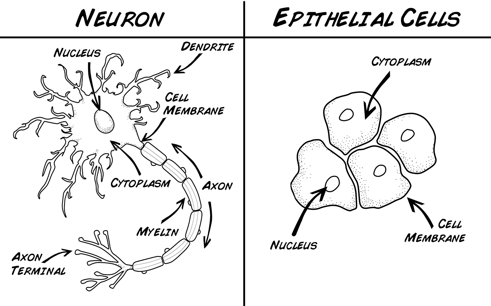
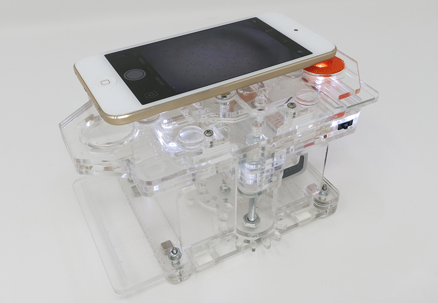
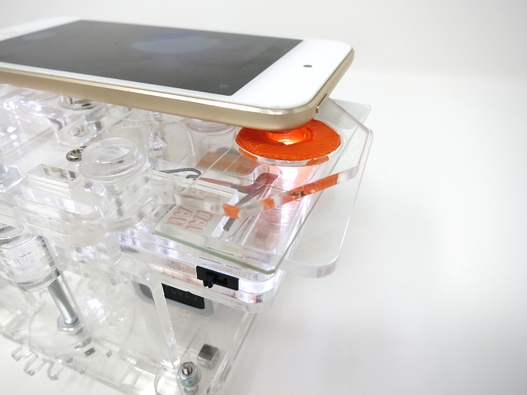
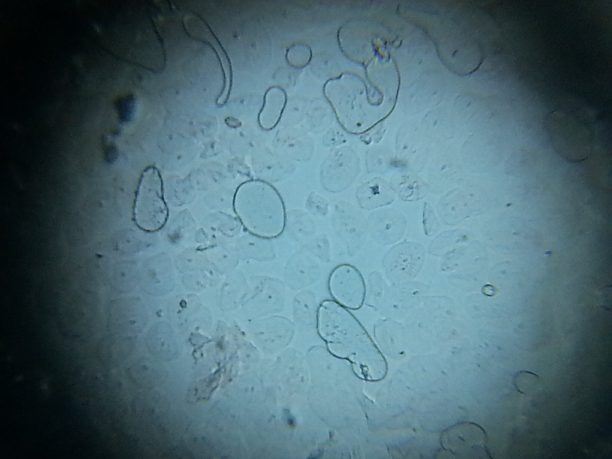
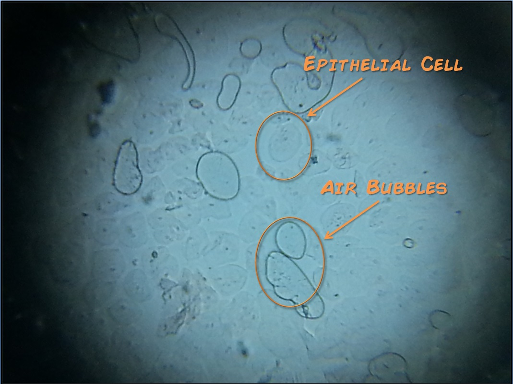
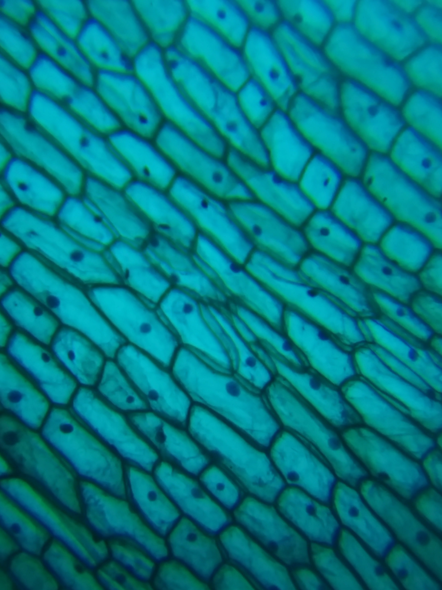

# Experiment:Turn your Cell Phone into a Powerful Microscope

With the High Power RoachScope we can get a closer look at the cells that
compose us.

**Time:**  45 Minutes

**Difficulty:**   Beginner

#### What will you learn?

You will learn about cells and how to prepare a slide for high powered
magnification using two biology preps!

##### Prerequisite Labs

  * None

##### Equipment

* [RoachScope](https://backyardbrains.com/products/RoachScope)
* Glass Slides
* [Slide Covers](https://www.amazon.com/Blank-Microscope-Slides-Square-Cover/dp/B002OS6D9I)
* [Toothpick](https://www.amazon.com/Farberware-5080422-Classic-Toothpicks-300-Count/dp/B005D6G7U8/ref=sr_1_6?ie=UTF8&qid=1397592626&sr=8-6&keywords=toothpick)

## Background

All living plants and animals are made up of some combination of cells! There
are various kinds of, such as connective, epithelial, muscle, and nervous
cells, which grow together as tissue! Nervous tissue, connective tissue, and
muscle tissue are, unfortunately, hard to examine up close without an invasive
procedure. Fortunately, epithelial cells are available in abundance from your
very own mouth for external examination! The epithelial cells we'll be
examining in this experiment are from the inside of your cheek and are
specifically classified as "Stratified Squamous Nonkeratinized Epithelium."
That's a _mouthful_ of biological jargon, so let's break it down_

**Stratified_** This describes how the cells join together. Stratified cells
stack together in multiple layers. This is different from other forms of
Epithelium which sit one cell thick, called simple epithelium.

**Squamous_** Is a descriptive word for the individual cells. Squamous cells
are flat, scale-like, and fit together like building blocks to create
protective layers of tissue. The other kinds of epithelial cells are Columnar
(which function with secretion, found in tracts in your body), which build up
in such a way that their heights are greater than their widths, and Cuboidal
epithelia (function as protective tissue found in glands), which are shaped
like boxes.

**Nonkeratinized_** Put simply, these cells make up soft tissue that live in
moist parts of our bodies, such as the mouth, esophagus, stomach, intestines,
etc. Keratinized cells are our external skin cells and also make up our hair
and finger nails.

**Epithelium_** The basic type of animal tissue that we're focusing on
learning about right now!

Many of our other experiments focus on neurons, which are the cells that make
up our nervous system. Epithelium shares some similarities, but also
differences with neurons! Let's check it out below_

Neurons and Epithelial cells do share some things in common. They both have a
cell membrane, cytoplasm, and nuclei - which contain the cell's DNA and
machinery to make proteins and energy. They also have many apparent
differences. What do you think the differences in the two cells say about
their different functions? Neurons are very active cells, they are constantly
sending information throughout your body. Epithelial cells, however, seem much
simpler, but they are just as important as neurons! You can think of neurons
as your body's "wiring" and of epithelial cells as the "scaffolding" which
holds everything together! Not only that, but these are cells that, partially
thanks to their simplicity, can divide and grow rapidly; neurons, however,
have extremely limited regenerative capabilities (this is a subject that is
being researched by many scientists currently, stay tuned for updates!).
That's why if you accidentally bite off a chunk of epithelial cells from the
inside of your cheek while chewing bubblegum it will heal, but if you damage
your spinal cord or any of your other nerves, you could suffer permanent
damage.

Fortunately, in this experiment we are not going to be damaging or removing
neurons from our bodies! First, we are going to get a good look at living
epithelial cells! All it takes is a cheek swab, microscope slides, and the BYB
High Powered Scope!

## Procedures

### Prep 1: Human Cheek

  1. Prepare your glass slide and slide cover by cleaning them with glass cleaning solution and a special glass cleaning cloth. If you have a camera or wear glasses, you can use the glass cleaning cloth that came with those. Otherwise, you can order special, disposable cleaning paper online - [here is an inexpensive option](https://www.amazon.com/OMAX-Sheets-Microscope-Camera-Cleaning/dp/B00A84NJ1U/ref=sr_1_3?ie=UTF8&qid=1399309334&sr=8-3&keywords=microscope+cleaning+kit)! 
  2. Place a drop of water on the slide. 
  3. Take your toothpick and rub it against the inside of your cheek. Then take the toothpick and roll it through the drop of water. 
  4. Angle your slide cover over it, with one edge of the square touching the slide, then let the cover fall onto the drop of water. Run the flat side of your fingernail across the cover to remove any air from beneath it. Use a tissue paper to blot up water that escapes from beneath the slide cover. 
  5. Place the slide under the High-Power magnifying lense on the RoachScope and turn on the backlight. 
  6. Set your cellphone's camera lens on top of the RoachScope's magnifying lens, centering the view of the microscope in the center of your screen. It should look something like this_ 

  7. Zoom in on your phone! 
  8. If you can't see them already, search for some cells! To help find cells, carefully adjust the glass slide to hunt down your epithelial cells. To help focus you can tap on your screen (most smartphones have this feature) and make slight adjustments to the height of the RoachScope's magnifying platform. (we like to loosen the set screw, then make fine adjustments with the platform's height adjusting knob to find the focus, tightening the set screw once you like your image) 

Also, be sure not to mistake air bubbles for your cells!

### Prep 2: Onion

Now that you've learned to prepare a slide, your future microscopic
observations will be a breeze! Let's practice preparing a slide again to look
at some more epithelial cells - but this time we're going to examine an onion!

  1. First, prepare a new glass slide (or clean the one you used in the previous prep) and place a drop of water in the middle of the slide. 
  2. With the razor blade, cut a single onion layer free. Try to obtain a small piece of moist and not very thick single "leaflet" (about 1/2 inch square). Don't bother with the dry papery outside layers of the onion. Green or purple onions add color; otherwise the cells are transparent but still visible. 
  3. With the razor blade, carefully nick across the meat of the onion leaf in the middle so that one face is almost completely cut through, but the other face is still intact. 
  4. Carefully bend the two meaty halves of the leaflet and separate them from each other without tearing the VERY THIN skin on the uncut face of the leaflet. The remaining very thin skin (almost transparent, about as thick as Saran wrap) is what to observe. Tweezers may be helpful. 
  5. Obtain as large a piece of the thin skin as possible and carefully separate it from the rest of the onion piece with fingernails, tweezers or toothpick. You only need a piece that is 2-3 mm on a side, but larger is better. 
  6. Before the thin skin dries out, use the toothpick to place it onto the water drop on the slide and flatten out any folds. Try to submerge the piece so that water is both underneath and on top. 
  7. If the water has dried or spilled, add another small drop on top. 
  8. Position the cover slip on one edge, to the side of the onion tissue and water drop. Carefully allow the cover slip to fall over and cover the water drop and onion tissue. Tamp the cover slip softly with a finger to reduce excess water or bubbles (blot the edge with a tissue or paper). 
  9. Position and focus on the onion skin with the objective lens closest to the cover-slip side. There should be obvious large brick-shaped cells about 0.1 mm long. Search for cells that do not look empty or dried up. If the cells are roundish and not rectangular, you have obtained tissue from the "meat" of the onion layer and not from the outer skin. 
  10. Move the light source to one side so that the onion cells are near the edge of the shadow. This may allow the cell nucleus to be seen (slightly darker than the rest of the cell, about 0.01 mm diameter, quite round). The nucleus houses all of the DNA needed for the entire onion plant. 
  11. With patience, good edge illumination, and a high-power view, some very active cells may have tiny dark vesicles (packages of stuff) moving or vibrating within the cell, usually near the nucleus, but sometimes quite a distance away. These vesicles can be found in areas of the onion that are actively growing. 

Think about what you've seen and talk about it with your peers! Compare your
Human and Onion cell pictures. Try to draw from one of the pictures you took
and label the elements of the cells you can recognize (keep in mind, the
negative space is important too)! Now that you know how to prepare a slide for
observation, think about other kinds of cells you could examine! What other
cells can you retrieve from your own body safely? Also, all living things are
made of cells, so you don't have to limit your research to human and onion
cells! What will you find in the microscopic world? Email us your findings at
[info@backyardbrains.com](mailto:info@backyardbrains.com)!

Also, a big thank you to Dr. Charlie Taylor of our Education team for his work
in helping develop these preps and write ups!
