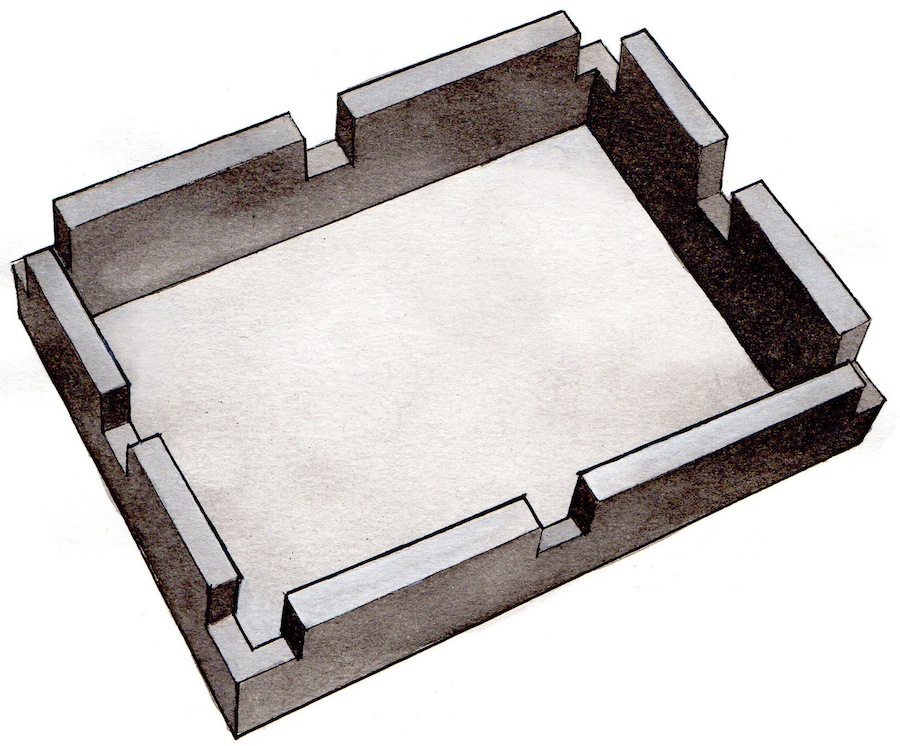
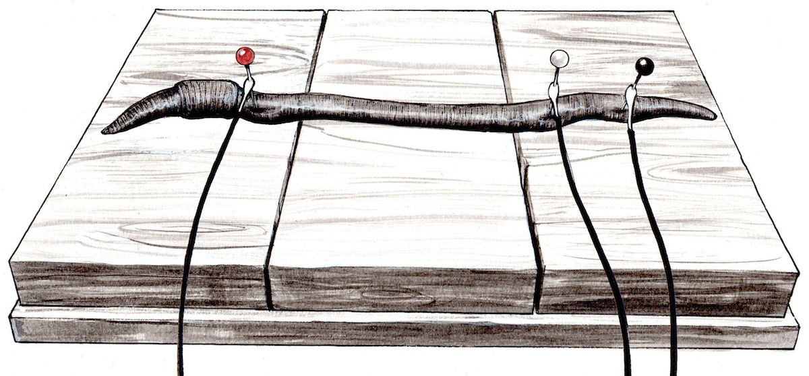
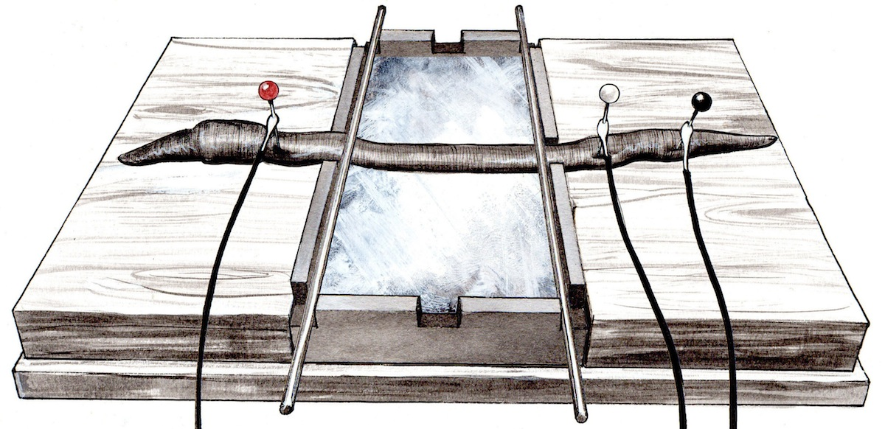
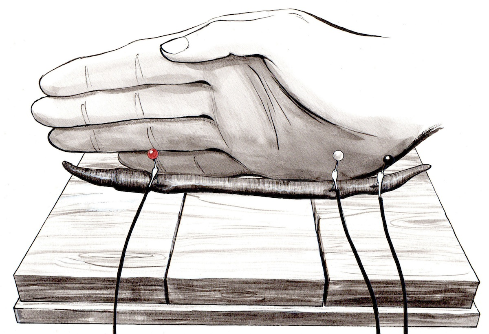

# Experiment:Effect of Temperature on Nerve Conduction Velocity

Can you slow down the speed of action potential propagation? Here you will use
temperature to do just that.

**Time:**  1 Hour

**Difficulty:**   Advanced

#### What will you learn?

You will learn how the conduction velocity of a nerve is dependent on
temperature, and you will directly measure conduction velocity under two
different temperature conditions

##### Prerequisite Labs

  * [Introduction to Conduction Velocity](./speed) \- We recommend completing this experiment first, as it will teach you how to set up earthworm experiments and use your 2-Channel SpikerBox with Audacity.
  * [Comparing Speed of Two Nerves](comparingNerveSpeed) \- This experiment will help to explain how to record from both the Lateral and Medial Giant Nerves of the earthworm.

##### Equipment

* [2-Channel SpikerBox](https://backyardbrains.com/products/twochannelspikerbox)
* [Faraday Cage](https://backyardbrains.com/products/faradaycage)
* [Laptop Cable](https://backyardbrains.com/products/laptopcable)
* [USB 2-Channel Adaptor](https://www.amazon.com/Griffin-Technology-iMic-Audio-Device/dp/B000BVV2IC)

## Background

We have previously shown in the cockroach leg that action potential [firing
rates are very sensitive to temperature](temperature), but did you know that
action potential conduction velocity is affected by temperature as well? Since
the ion channels take time to open to allow the ions to travel across the
membrane, cooling a neuron causes the ion channels to open more slowly,
causing a reduction in the speed of the action potential as it travels down
the axon (a reduction in conduction velocity). Earthworms are actually quite
cold tolerant (this is why they can be stored alive in the refrigerator for
months at a time), so, to see an effect of temperature on the worm's
conduction velocity, you need to place the worm on a block of solid ice. To
make this easy, we introduce our finest invention yet_

The WormTray! You can [download the .stl
file](./files/WormTray.stl) to 3D print this yourself or,
alternatively, design your own easy way to place the worm over ice.

## Materials

The materials required for this lab are exactly the same as the experiment
["Introduction to Conduction
Velocity"](https://backyardbrains.com/experiments/speed#Materials), save for a
couple extra items_

  1. The WormTray with solid ice inside, or an alternative icy arrangement 
  2. Three Balsa wood "Islands" 2 inch wide by 3 inch long by 0.6 inch high 

## Procedure

  1. Take a worm tray, add water, and let it freeze overnight. 
  2. Once you are ready, prepare your worm for an experiment as [you previously have by anesthetizing it](speed#sleep) in either 10% ethanol solution or carbonated water. 
  3. Place the worm on the three wooden islands, with the red (channel 1) on the left island and the white (channel 2) and ground electrode on the right island, as indicated below_ 

  4. Record the worm's Medial Giant Nerve (MGN) conduction velocity in response to a light head tap, [as you have done before.](comparingNerveSpeed)
  5. Now, place the worm over the frozen worm tray so that its middle length is resting directly on top of the ice. Try your best to not disturb the electrode position, as you want the distance between the electrodes to be the same as your room temperature measurement. Small cut wooden Kabob sticks can help keep the worm firmly on the ice. 

  6. Wait two minutes for the worm to cool down, and take another reading of the MGN conduction velocity in response to a head tap. 
  7. Remove the worm from the ice, and place it back on the middle wooden island, and wait four minutes. To speed up the warming up of the worm (it will be very cold due to the ice), you can give a "worm hug" by placing your fingers alongside the worm. 

  8. Take another conduction velocity reading at room temperature. 

## Discussion

You should find the conduction velocity of the MGN to be initially ~20 m/s,
but then drops by 50% (down to ~10 m/s) while on the ice, and returns to
normal (~20 m/s) when back at room temperature. If you do an LGN recording as
well (see below), the conduction velocity will be ~10 m/s at room temperature,
and ~5 m/s on ice.

## Questions to Consider

  1. We hypothesize that using warm water of approximately 98° F / 37° C should increase the conduction velocity from the room temperature measurement. Using a thermometer, you can heat up some water and test this by filling an empty worm tray with the heated solution. We leave it to you to do this experiment. Be careful the water does not go above 98° F / 37° or you can overheat and damage the worm. 
  2. You can measure the effect of temperature on the speed of both the MGN and LGN nerves in the same worm, [similar to our previous experiments](comparingNerveSpeed), but you will have to be expeditious with your time management, as this temperature experiment takes ~15 minutes if you measure both nerves. The worm may start moving at the end of the experiment, causing EMG's (electromyograms, or muscle electrical activity) to swamp out the small neural action potentials. 

## Troubleshooting

Our initial experiments using ice water did not slow down the conduction
velocity enough for us to detect. Thus, it's important the worm lay directly
on the ice to sufficiently cool it down.

_Note_ _ Gracias to [Italo Ahumada Morasky](Italo Ahumada Morasky), a Chilean
artist who drew these pictures for us.