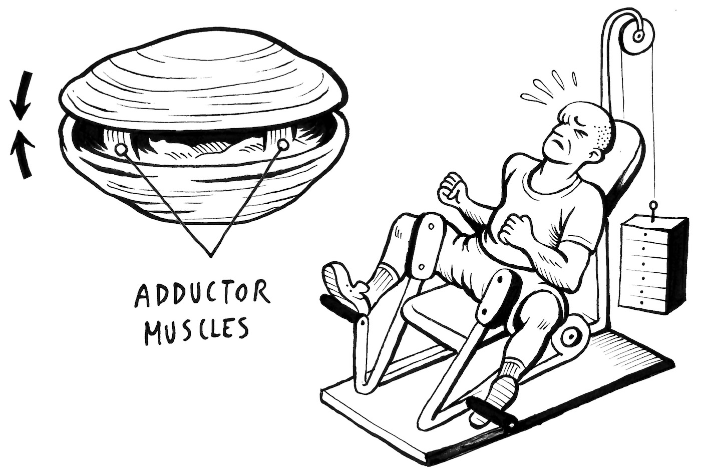
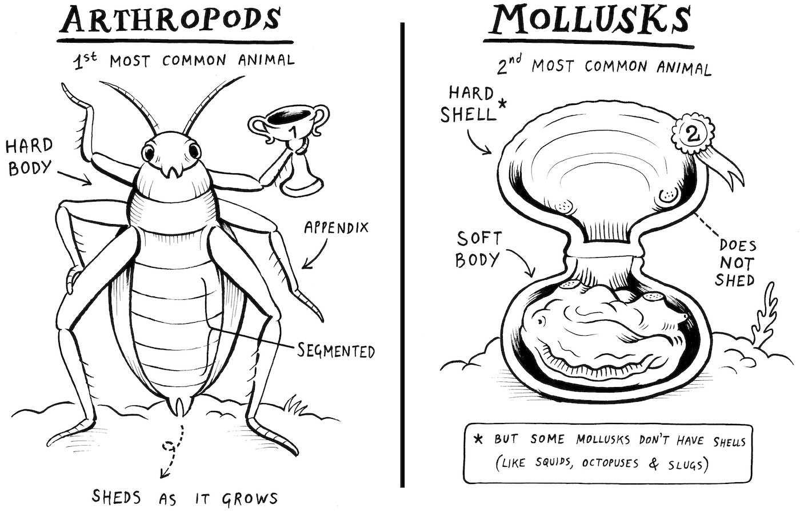
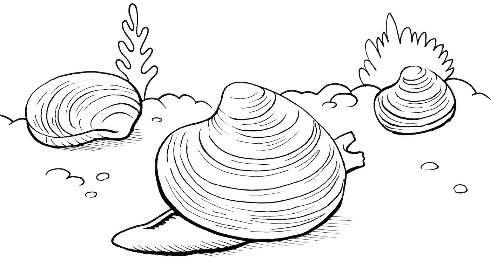
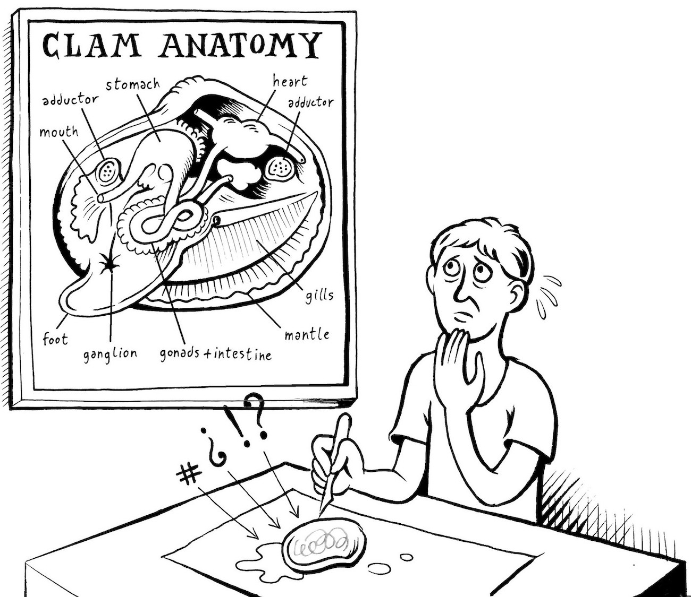
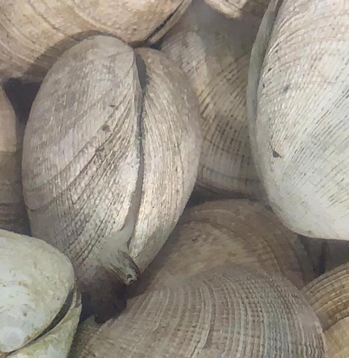
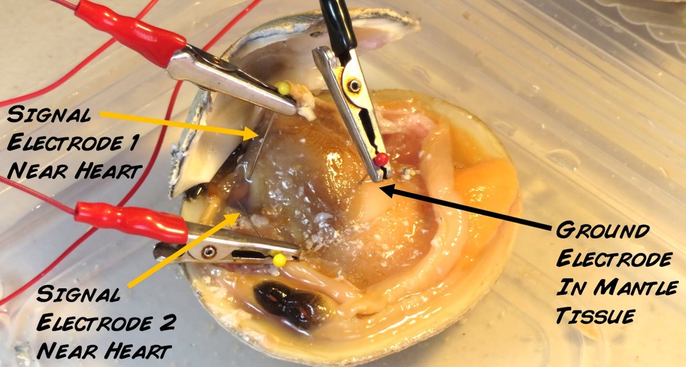

## Experiment:Recording the Muscles of Clams

---
id: "experiment__recording_the_muscles_of_clams"
title: "Experiment: Recording the Muscles of Clams"
slug: "/retired/experiments/clams"
---

Clams have strong muscles to keep their shells closed when they want to avoid
predators. You can measure this muscle activity and see just how responsive
and strong the clam is!

**Time**  1 hour

**Difficulty**  Intermediate

#### What will you learn?

In this experiment, we will learn about the anatomy of the clam and how to
record the electromyograms of its lateral muscles.

##### Prerequisite Labs

* [Experiment:Record Electricity from your Muscles](https://backyardbrains.com/experiments/muscleSpikerBox) - This will introduce you to the concept of electromyography.

##### Equipment

*[Muscle SpikerBox](https://backyardbrains.com/products/muscleSpikerboxBundle)

## Background

_A student intern project by Eduardo Isla, biochemistry student at the University of Santiago_

Have you ever tried to open a clam by hand? It's very difficult because the
clam has two powerful lateral muscles called "adductor muscles" that allow the
clam to close shut. We can actually record the electromyograms of these
muscles. They are huge! What does "adductor" mean? It means to bring towards
the center of the body. You have adductors too; they are the muscles that pull
your legs together towards your vertical midline. The opposite of adductor is
abductor, or, muscles that pull the sides alway from the midline. Not
confusing to remember at all.

Let's talk about clams a little bit first. They are invertebrates, like our
friend the cockroach. Cockroaches are in the arthropod phylum, whereas clams
are in the mollusk phylum (phylum is a division of the kingdom of types of
animals). The clams are bivalve mollusks, as are oysters and mussels, with two
shells that close to protect the soft tissue of the animal. Some types of
bivalves, like scallops, can even "flap" their shells to [swim through the ocean water for brief periods](https://www.youtube.com/watch?v=NBH3UvlZo90).
Note that not all mollusks have shells though, like squids, octopuses, and
slugs.

The clam shells are symmetrical and joined by a ligament. Inside of the shell
is a lining of soft tissue called the mantle. This is the real "meat" of the
animal and the part that one would eat if eating a bivalve such as a clam. The
mantle secretes the layers of the shell, including the inner nacreous, or
pearly, layer. Sometimes a pearl is formed as a reaction to irritation by the
depositing of nacreous layers around a foreign particle.

Clams have a muscular extendable mass called the foot that is used for
burrowing, and many bivalves have two tubes, or siphons, extending from
outside its shell when not fully closed_ one for the inflow of oxygenated
water and food and one for the outflow of deoxygenated water and waste
products.

The gills, suspended within a mantle cavity, are usually very large and
function in food gathering (filter feeding) as well as in respiration. As
water passes over the gills, tiny organic particles are strained out and are
carried to the mouth.

Bivalves have a complete digestive tract; a reduced nervous system; a
complete, open circulatory system with a chambered heart, arteries, veins, and
blood sinuses; and excretory and reproductive organs. In most species the
sexes are separate, and the eggs and sperm are shed into the water, where
fertilization occurs. Of course, this being the world of invertebrates, some
clams are hermaphroditic and can reproduce asexually. The anatomy of a clam is
notoriously difficult to figure out just by looking at it.

At the front and rear of the animal are anterior and posterior adductor
muscles, The muscle fibers run transversely, across the clam, from shell to
shell, and their action is to close shut. Some bivalves have two adductor
muscles, like the common clam we use here. Other bivalves, like the oyster and
the scallop, have only one adductor muscle. Have you ever wondered what it is
you are actually eating when you eat scallops? You are eating their adductor
muscle! Let's try to record the EMG of the adductors now!

## Video

## Experimental Procedure

1. Find clams - this is the fun part. The ideal would be to find a local supermarket that keeps the clams in saltwater aquariums. Try to choose those clams that are completely closed or those that are slightly open with the filters outside. This tells us that the clams are healthy and alive. A clam with its filters outside looks like this. 

  2. If you do not find a supermarket that keeps the clams in aquariums and instead keeps them on ice, we recommend you first ask what day they arrive in order to buy them fresh. Then you must choose only those clams that are completely closed, or those that are slightly open and when tapped lightly they close. If the clam does not close when tapped or is completely open, do not choose it, as this is indicative that the clam is dead and cannot be used for experiments. You also shouldn't eat it either. 
  3. If you live near the ocean, you can collect clams yourself. The method involves walking in the sand at low tide, up to your knees or waist in the water, feeling the shells with the soles and toes of your feet, and placing the clams in your collection bucket. One of us did this when we were 12 years old off the coast of New Jersey, gathering up enough clams for a large family dinner of fettuccine clams for 15 people. 

## Recording the Electromyogram

1. Keep the clams (_Venus antiqua_ , Chilean clam, or _Venus mercenaria_ , USA Northeast clam) in fake sea solution between 4-8 degrees Celsius before being used. You can buy sea salt for preparing fake sea water from aquarium stores. if you cannot prepare this solution, keep the clams refrigerated in a cold and damp cloth (fake beach). 
    2. With a hobby hammer, lightly crack open the shell. See video above for reference. 
    3. Clean up the shards with forceps. 
    4. Take the Muscle SpikerBox Electrode cables with alligator clips, and attach map pins to them. It's best to match colors and have red map pins in the red alligator clips and black map pins in the black alligator clip. You will bend one red map pin into a hook that you will wrap around the adductor muscle. 
    5. Insert one red hook electrode around one of the lateral adductor muscles. 
    6. Insert the other red map pin electrode nearby. 
    7. Insert the black map pin ground electrode in the general mantle tissue. 
    8. Plug the orange electrode cable into your Muscle SpikerBox. 
    9. If using a Muscle SpikerBox, plug the Muscle SpikerBox into a table or smartphone using the green smartphone cable. If using the Muscle SpikerBox Pro, connect it to your computer using the USB cable and open our [SpikeRecorder Software](https://backyardbrains.com/products/spikerecorder). Turn the Muscle SpikerPro on, and a USB icon will appear in the upper left screen. Click the USB icon to connect to your Muscle SpikerBox Pro. 
    10. Now lightly tap lightly on different parts of the remaining shell. You should see the EMG spikes of the adductor muscles responding to the tap. Tap various parts of the shell. Do you notice if some parts are more sensitive than others? 
    11. After you are done with the recording, you can dispose of the clam. We recommend steaming it and eating it. 

## Discussion

1. Another favorite animal of ours, the [mantis shrimp](https://blog.backyardbrains.com/2018/06/mantis-shrimp-do-me-a-favor/), is a [predator of clams](https://www.youtube.com/watch?v=i-ahuZEvWH8). 
    2. Working with mollusk electrophysiology is new to us. Our only other experiments on the mollusk animal phylum were an exploratory [demonstration in squid](https://blog.backyardbrains.com/2012/08/insane-in-the-chromatophores/) and and two intern projects on [squid hatchling phototaxis](https://blog.backyardbrains.com/?s=Squid+Hatchlings) and [octopus adult aggression](https://backyardbrains.com/experiments/OctopusFighting) behavior. Do you have a request or a suggestion? E-mail us to [let us know](mailto:tim@backyardbrains.com)! It would also be interesting to work on experiments from [echinoderms](https://en.wikipedia.org/wiki/Echinoderm), another animal phylum distinct from mollusks and arthropods. 
    3. Using [adhesive patch electrodes](https://backyardbrains.com/products/emglargeelectrodes), you can also record your own adductor muscles. In humans, these muscles bring your legs together. Gym patrons exercise them to shape their thighs.
    4. Try to record the EMG of the adductor muscles in clams of various sizes. One would suspect that the larger the clam, the larger the EMG amplitude, due to the muscle being larger. 
    5. Unlike the common clam, the scallop only has one muscle instead of two muscles. In a scallop of similar size to a clam, try to record the the comparative EMG amplitude from its one muscle. What would you expect to see? 

We also leave you with some of our notes on clam anesthesia, which we used in
some exploratory experiments to avoid using a hammer to open the clam. Clams
can be sedated with different solutions, and some options are_

    1. 5-10% ethanol solution in distilled water. For example, for one liter of 10% ethanol solution, you would add 10.5 mL Ethanol 95% (which you can buy at a drugstore) to 989.5 mL water. In our experiments with _Venus antiqua_ , this solution has no visible effect, but you should try it since it is the easiest solution to make. 
    2. 10-40 g/L MgCl2 solution. We added 19 g MgCl2 for 500 mL of fake sea solution. After 15 minutes in this solution you may notice the clam relaxing and opening its shell. 
    3. The following solution was not tested by us, but it has been used in some experiments. 1.12% MgCl2 + 1% Ethanol prepared in fake sea water. 

If the solutions work and the clams open, try to attach the recording
electrodes to one of the adductor muscles and the ground electrode in the
visceral mass of the mantle. Even with the clams sedated or partially sedated,
it is somewhat complex to connect the electrodes since these muscles are deep
inside the clam.

Do not leave the clams for more than 20 minutes in these solutions as there
are studies that say that after this time there is an increase in mortality in
the treated animals. Also, you shouldn't eat the anesthesia-treated animals
when you are done with the experiments.

## Abandoned Project_ the Clam Electrocardiogram

Hi friends, Eduardo here. Astute followers of Backyard Brains, who [read our blog](https://blog.backyardbrains.com/2019/02/backyard-brains-
welcomes-2019-university-of-santiago-interns/), may remember_ "Hey wasn't
there some electrocardiogram (EKG) project that was trying to replicate [Henry Dale's famous acetylcholine experiment](https://www.ncbi.nlm.nih.gov/pmc/articles/PMC2591841/pdf/yjbm00162-0034.pdf),
but using clam hearts instead of frog hearts?" You are correct, for 6 weeks of
my 8 week internship, I tried to record the EKG of the clam. The results,
however, were confusing. Sometimes we would see what looked like an EKG (see
video below), but it wasn't correlated with visible heart contraction. Hand
scoring of impulse generation with visible heartbeat contraction did not
reveal obvious one-to-one matchups. So, ultimately, we decided to pivot and
work on the EMG of the adductor muscles instead, given that it has an
interesting behavioral component. Below are my anatomical videos showing the
heart beating and one of our first putative recordings. Try for yourself and
see what you observe!

