## Experiment: Comparing Speeds of Two Nerve Fiber Sizes

Are you curious how the telephone pole lines in your neighborhood are similar
to neurons in your own body? Find out in this lesson plan and learn about
electrical cable theory while measuring the different speeds of the
earthworm's nerve fiber system.

**Time:**  1-2 Hours

**Difficulty:**   Advanced

#### What will you learn?

You will learn how the earthworm's Lateral and Medial Giant Nerve Fibers
transmit sensory information, and you will learn about Cable Theory and how
neuroscientists have been applying it to explain the physical properties of
axons.

##### Prerequisite Labs

* [Introduction to Conduction Velocity](speed) - We recommend completing this experiment first, as it will teach you how to set up earthworm experiments and use your Neuron SpikerBox Pro.
  * [Faraday Cage](faraday) - Noise can sometimes be a problem when recording, and a Faraday Cage helps you eliminate it. You may need to use one for this experiment.

##### Equipment

* [Neuron SpikerBox Pro](https://backyardbrains.com/products/neuronspikerboxpro)
* [Faraday Cage (Included with Pro)](https://backyardbrains.com/products/faradaycage)

## Background

_Note_ This experiment was peer-reviewed and published by the American
Physiological Society in the journal "Advances in Physiology Education" -[Read
the paper, intrepid scientists,](https://advan.physiology.org/content/38/1/62)
for a more in-depth treatment of the experiment described below_.

Previously, you learned how to measure conduction velocity from the
earthworm's nerve fiber system. You remember that the worm has three large
neurons that run the length of its body, the medial giant nerve (MGN) and the
two fused lateral giant nerve (LGN).

[ 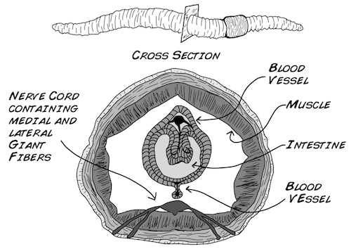](./img/Byb_mgnlgn_pic1.png)

Let's take a closer look at the ventral, or "bottom," nerve cord containing
these medial and lateral giant nerves. One of the differences between
invertebrates (insects, worms, and so on) and vertebrates (dogs, lizards, us)
is that invertebrates have a ventral nerve cord (running along their "belly")
whereas we have a dorsal nerve cord (our spinal cord runs along our backside).

[ 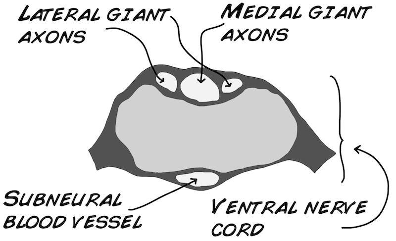](./img/Byb_mgnlgn_pic2.png)

Both the MGN and LGN play an important role in ensuring the worm's senses
communicate with its muscles (Drewes et al. 1978). The MGN transmits sensory
information about the anterior or front of the worm (the end closest to the
clitellum). In contrast, the LGN transmits sensory information about the
posterior, or back of the worm (the end farthest from the clitellum). There is
a physical size difference between these two systems as well. The medial giant
nerve, at 0.07 mm in diameter, is slightly wider than the lateral giant nerve
(0.05 mm in diameter) (Kladt et. al 2010).

In the previous earthworm experiment, you recorded from the rear, or posterior
end of the worm, and determined the conduction velocity for the LGN. For this
experiment, you will record from both the posterior (LGN) and anterior ends of
the worm (MGN). We want to find out if there is any difference in conduction
velocity between the two nerves. Do you think there will be any difference?
Let's consider some.....

When thinking about how an action potential travels down a neuron's axon, it
is useful to think about an analogy of a television's volume. Think about
turning on your TV and then slowly walking away from it. As you walk further
and further away what happens?

[ 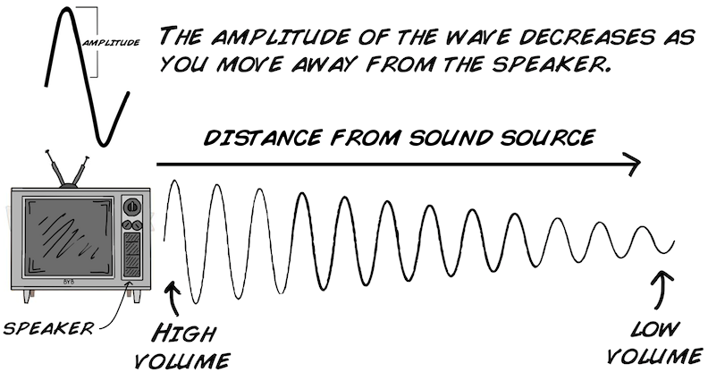](./img/Byb_mgnlgn_pic4_v2.png)

The sound coming from the speaker gets quieter and quieter the further you are
away from the source. This example is analogous to a voltage change (basis of
an action potential) flowing down a neuron's axon. In a hypothetical neuron
with the active ion channels removed, let's change the voltage in the cell
body and take three measurements along the axon. What do you think the
measurements will look like?

[ 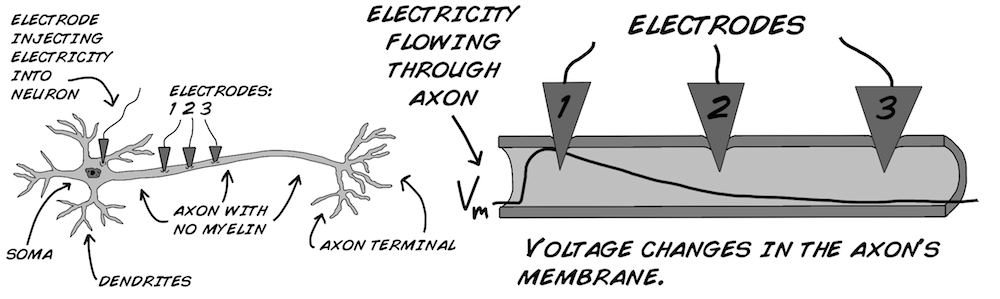](./img/Byb_mgnlgn_pic5.png)

Notice that the signal decays. The strength of this decay is determined by two
things, the time constant and length constant. Time for some math and
electronics, our favorite subjects (besides neurons of course).

[ 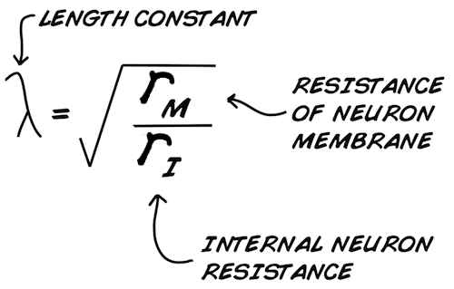](./img/Byb_mgnlgn_pic6a_v2.png) [
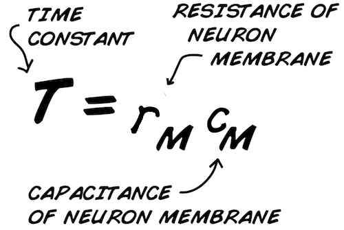](./img/Byb_mgnlgn_pic6b_v2.png)

What do the r's and c's mean? r is "Resistance" to current flow, and c is
"Capacitance," a measure of the storage of charge across an insulating
barrier.

First, let's talk about the length constant (this is sometimes also called the
"space constant"). The length constant (λ, or lambda) is a measure of how far
the voltage travels down the axon before it decays to zero. If you have a
length constant of 1 mm, that means at 1 mm away from the cell body in an
axon, 37% of the voltage magnitude remains. At 2 mm away from the cell body in
an axon, 14% of the magnitude remains, and at 3 mm away, 5% remains. This is
representative of an [ "exponential decay"](
https://en.wikipedia.org/wiki/Exponential_decay) function.

The length constant is calculated from rm and ri. rm is the electrical
resistance of the neuron's membrane, or how "electrically leaky" it is. The
larger rm ("less leaky") is, the larger the length constant will be. ri is the
resistance of the intracellular fluid (called axoplasm) inside the axon.
Conversely, the lower ri is, the larger the length constant will be.

The time constant (Τ, or tau) is similar to the length constant, but applies
to time. If a voltage change is applied inside a neuron, it takes time for the
neuron to fully "charge" to a stable voltage. In the time constant equation,
cm is the capacitance of the neural membrane, which is a measure of the
membrane's ability to store charge. The higher the capacitance, the more time
it takes for the capacitor to fully charge (or discharge), acting as a
"buffer" to any sudden voltage change.

Thus, the smaller both rm and cm become, the smaller the time constant is and
the less amount of time is needed to change an axon's voltage.

An "ideal neuron" would have an infinitely high length constant and an
infinitely low time constant. Thus, any voltage change anywhere in the neuron
would instantly change the voltage everywhere else in the neuron.

Both the time constant and length constant are "passive" properties of the
neurons. So, how do your neurons stop electrical signals from decaying to
zero? By becoming "active" and using Ion Channels! Your neurons use sodium and
potassium channels to regenerate the action potential flowing down the axon to
"fight the decay" that occurs due to the length and time constants. As an
action potential fires down your axon, sodium and potassium channels
continually open and close to recharge the action potential and "propagate it"
down the axon.

[ 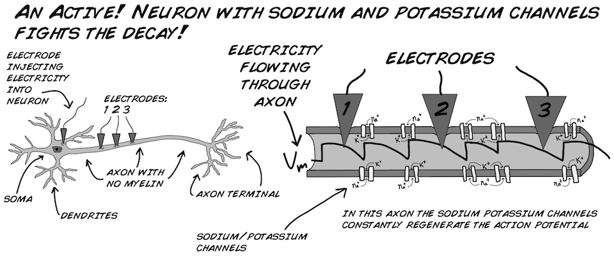](./img/Byb_mgnlgn_pic7.png)

As you know from the previous earthworm experiment, this action potential
propagation down a neuron has a finite speed. Each time an ion channel needs
to open to recharge the action potential, this delays the propagation of the
action potential by ~1 ms. And the smaller your length constant is, the more
you have to regenerate the action potential by having ion channels open along
the length of the axon. How can we increase the length constant? We can do
this by increasing rm. Is there a way we can do this?

Yes! We can increase rm by wrapping the neuron in....

Myelin is a fatty covering produced by special cells called Schwann Cells and
Oligodendrocytes. This covering is what makes the axons look similar to hot
dog rolls, and why the brain is sometimes called a "lump of fat." This fatty
covering makes the neural membrane less leaky and increases rm substantially.

But what do you think would happen if you covered the whole axon in myelin?
Unfortunately, the length constant is not increased enough for you to get away
with this. The action potential still needs to be regenerated along the axon,
though not as many times as an unmyelinated axon.

This is why the myelin sheath is discontinuous, with periodic exposed bits of
neural membrane called "Nodes of Ranvier." In these nodes no myelin covers the
membrane, and plenty of active ion channels reside there. The discrete
regeneration of action potentials between lengths of myelin at the Nodes of
Ranvier is called "saltatory conduction."

* Related Fact_ Saltar is Spanish for "to jump." A grasshopper that lives in the Andes Mountains, for instance, is called "Saltamontes" or "mountain jumper." 

[ 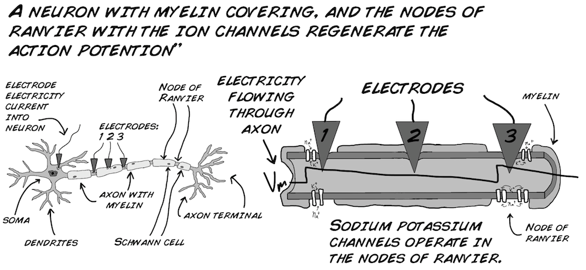](./img/Byb_mgnlgn_pic9.png)

But wait! Covering the neurons with myelin makes the inside and outside of the
neural membrane farther apart from each other. As capacitance is affected by
the distance of separation between the charged bodies (see your Haliday and
Resnick), myelin will decrease cm. Does this cause a decrease in time constant
as well then? Well, perhaps not, since, as we said earlier, the myelin also
substantially increases rm.

The result of this simultaneous reduction in cm and increase in rm is
hypothesized to cause no net change in the time constant, although direct
experimental evidence in the literature is lacking. If you have two equal
diameter axons and one has a myelin sheath of 1 mm thickness, and the other
has a myelin sheath of 2 mm thickness, how much faster will the second axon
be? Unfortunately, again, this answer appears to be experimentally unknown, as
neurons with increased myelin thickness also simultaneously have increased
axon diameter. What has been generally borne out with computer simulations is
that a myelinated neuron twice as thick as another myelinated neuron will have
a conduction velocity twice as fast.

There is another way to increase the conduction velocity without bothering
with all these special cells that coat the neurons with fat. This method is
also what many invertebrates use...

The larger the radius of the axon, the smaller both ri and rm will be.
Remember our length constant equation states that _

If both the top and bottom vary with the radius... it seems like the size of
the axon wouldn't make a difference at all! But let's take a careful look at
how these two values vary with the size of the axon. The membrane resistance
(rm) changes with the circumference of the axon (where the membrane is) like
so_

[ 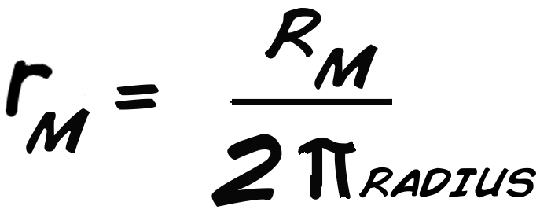](./img/Byb_mgnlgn_pic13.png)

while the internal resistance changes with area of the axon.

[ 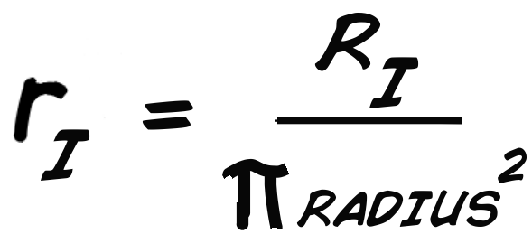](./img/Byb_mgnlgn_pic14.png)

Both Ri and Rm are constants that can be measured from the neuron regardless
of it's size, (whereas ri and rm DO take size into account), π is 3.14, and
radius is the radius of the axon. So now let's look at that equation again_

[ 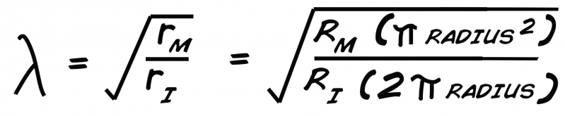](./img/Byb_mgnlgn_pic15.png)

We are interested in seeing what changes when we change the size of the axon
(radius), so we want to remove things that are constants and see what is left
that changes. Both Rm and Ri are constants, so are 2 and π, and one radius
cancels out. We are left with simply that_

Thus, the length constant, and conduction velocity, scales with the square
root of the radius.

Note that the benefits of myelin substantially outweigh the benefits of axon
diameter size. Tripling the myelin thickness increases the conduction velocity
3x, whereas tripling the axon diameter only increases the conduction velocity
by the square root of 3, or 1.7 times. There is a metabolic cost, however, to
making myelin (you need to keep the special cells alive that coat the neurons
in fat), so it's not the perfect solution for all animals. But...even the
largest axons without myelin in the animal kingdom, such as the 1 mm diameter
squid giant axon, only has a conduction velocity of 20-25 m/s second! You have
myelinated axons in your body (the [ A alpha fibers](
https://en.wikipedia.org/wiki/Nerve_fiber)) that are only 13-20 μm in diameter
(1/100 of the size of the squid axon), yet have conduction velocities that are
80-120 m/s! Myelin is a wonderful biological invention, allowing neurons to
get both small and fast, but it is expensive.

Sound confusing? Don't worry, it was confusing for us too during our
education. Welcome to "Cable Theory", which was originally developed in the
1800's when engineers were trying to understand signal transmission across
long distance telegraph lines. Neuroscientists then applied this theory to
neurons in the early 20th century.

[ 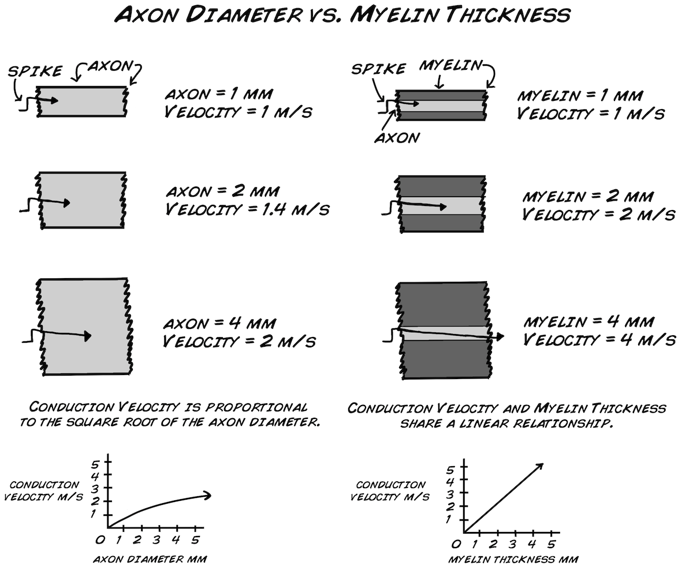](./img/Byb_mgnlgn_pic17.png)

But what does all this cable theory mean with regard to the two nerve types in
the earthworm? Since the MGN is 1.4 times greater in size than the LGN, we
should expect it to be 1.18 times faster. We previously measured the LGN to be
~10-14 m/s, so thus we would expect the MGN to be 12 - 17 m/s. That's a small
difference for our equipment to detect, but let's try the experiment to see if
our results match the theory!

#### Downloads

> [Spike Recorder Software](https://backyardbrains.com/products/spikerecorder)
>
> [Experiment in Editable Word .docx
> Format](./files/Experiment-Comparing-
> Nerve-Speed.docx)

## Video

Note_ The video below is a more recent July 2015 video on our [worm
stretch](https://backyardbrains.com/experiments/wormstretch) experiment, but
serves as a tutorial to use our new software, and the procedure is very
similar. You can view the original [December 2012 video
here](https://www.youtube.com/watch?feature=player_embedded&v=qZFTuOxUVok).

## Video

## Procedure

##### The Materials Required For This Lab Are Exactly The Same As The

Experiment:[Introduction to Conduction Velocity (Neural
Speed)](https://backyardbrains.com/experiments/speed#Materials)

1. Anesthetize and take a recording of the posterior end of the worm as you did in the previous experiment. 

[ 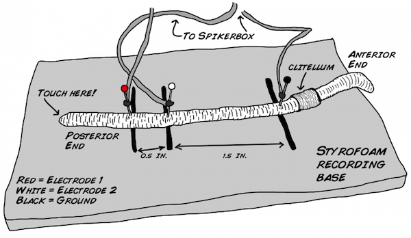](./img/Byb_mgnlgn_pic18.png)

  2. Once you get several spikes, rotate the worm 180 degrees and reposition the electrodes. You will be measuring from the anterior end of the worm this time. 

[ 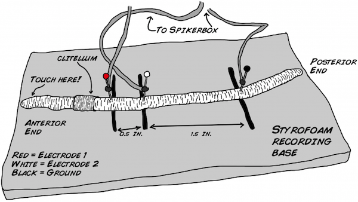](./img/Byb_mgnlgn_pic19.png)

  3. Now record several spikes from the anterior end by touching the head of the worm with a wooden probe. Once you have several spikes, you can stop recording and return the worm to its soil. The earthworm is quite resilient and recovers well from this experiment. 
  4. Now you are ready to look at your data. You should see a flat line or excessive noise when you flipped the electrodes around. This serves as your time marker of when you flipped the worm, and now you know which spikes belong to the posterior end and which spikes belongs to the anterior end. The figure below shows a recording of electrode 1 on the bottom and electrode 2 on the top. 

[ 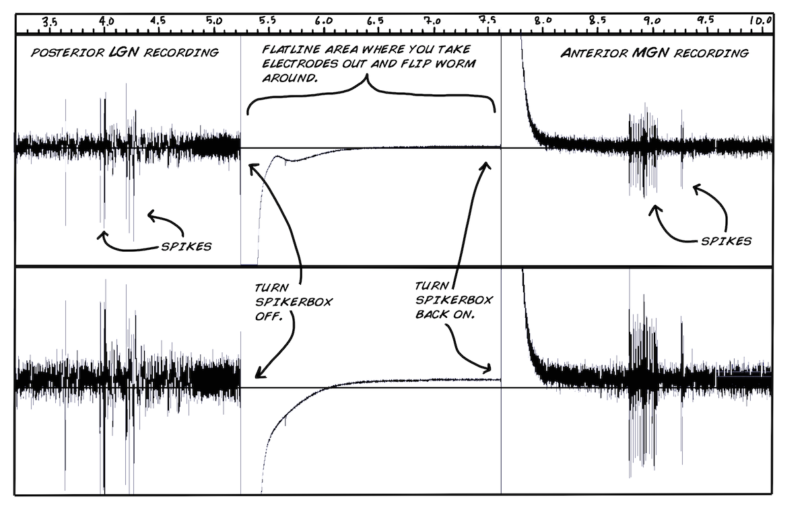](./img/Byb_mgnlgn_pic20.png)

  5. You can now zoom in on your spikes and measure the conduction velocity. Take readings of 5-6 spikes. 

  6. Repeat the experiment several times with some worms. This will give you a good data set to work with. Don't forget to clean your electrodes with some alcohol or water and a paper towel after each worm. 

  7. You now need to run a statistical test, namely the T-test, to examine whether the conduction velocities are different for the two nerves. If you do not yet know how to do this you can take your data set and follow along in our statistics lesson plan. If you have done this lesson plan or have some experience in statistics then you can go ahead and perform the calculations below. 
  8. Take the average and standard deviation of your MGN and LGN recordings. 

  9. Finally, let's calculate our t-statistic and p-value. 

What did you find? Are the two conduction velocities different from each
other?

## Discussion

If your experiment was successful, you should have found that the MGN
(anterior end) conduction velocity was indeed significantly faster, but not
1.2x faster, but more like 2-4x faster! Why is this? You may recall that the
earthworm neurons are actually myelinated! Some invertebrates, such as some
shrimp and some worms, actually do have
[myelin](https://en.wikipedia.org/wiki/Myelin ).

Typically, as axon increases its diameter, its myelin thickness also
increases. Perhaps the MGN has a thicker myelin sheath as well. This would
make for an excellent histology project to find out. Let us know if you are up
to the challenge, and let us know what you find!

If you have an idea about what causes this unexpectedly large difference, we
would love to hear about it. Maybe your professor knows? Welcome to biology
and unexpected findings! Also, if you understand why having a longer time
constant increases conduction velocity, let us know that as well.

## Questions to Consider

1. Does the anesthetic have an effect on the conduction velocities of the MGN and LGN? 
  2. Does a worm's general size have an effect on conduction velocity? 
  3. You can also anesthetize the worm in a 40% - 60% carbonated water solution for 5-9 minutes as an alternative anesthetic. Will this change the conduction velocity measurements. 
  4. The worm _Lumbriculus variegatus_ (California Blackworm) actually has a larger LGN than MGN, so we would expect our results to be the opposite of what we observed here with our _Lumbricus terrestris_ nightcrawlers. Do this experiment and [let us know](mailto:info@backyardbrains.com) what you find! 
  5. How thick is the myelin? We don't have access to extensive histology resources, but you may. Why not take some slices of the earthworm, measure the axon diameter and myelin thickness on both nerves, and report back to us?

## Troubleshooting

This can sometimes be a difficult experiment, because the worm may not produce
spikes depending on the amount and time of anesthetic used as well as the
general health of the worm. If you stick to the 10% alcohol solution for about
3-6 minutes, the worm should produce spikes most of the time as soon as you
start (don't forget to wash the worm in water after you anesthetize it).

You may also want to try touching the worm with more or less pressure.
Sometimes a very small tap will work, other times a stronger press might be
needed. Some worms respond better to a stimulus at the very end of their
bodies, while other respond better to a stimulus a few centimeters inwards.

Finally, sometimes you will cause an artifact when you touch the worm. Looking
closely on the artifact waveforms, the artifacts will appear at exactly the
same on both channels. This is a fake spike and not physiological! Sometimes,
drying your probe periodically helps; also do not rehydrate the worm in water
too much (though also be careful not to dry the worm out). It is a careful
balance, and you will develop your own style and technique as you gain
experience.

You can also use an air stimulus from an air can _in lieu_ of a plastic,
wooden, or glass tip if you are getting too many fake spikes. You may also
want to flip the worm over so the ventral or bottom side is facing up. Doing
this means when you touch the worm with your probe the touch will be closer to
the nerve.
