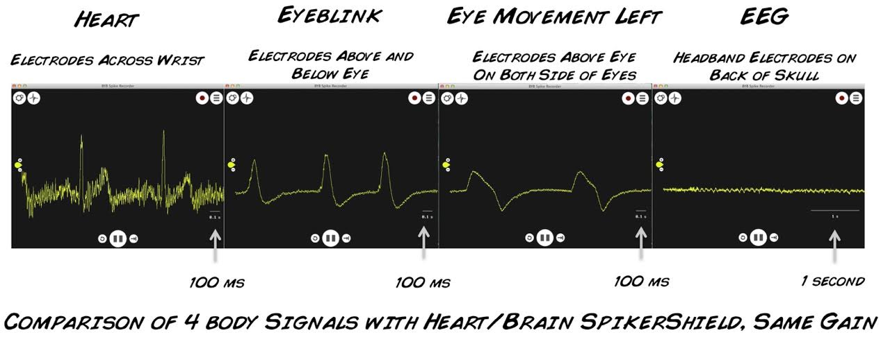

## Experiment:  EEG-Record from the Human Brain

You've seen spikes from individual neurons, your heart, your muscles, and even
plants. Here, finally, we tackle the much sought after, often misunderstood,
signal of neuroscience: the Electroencephalogram (eeg). See the electrical
rhythms of your own brain! Try to Exploit them!

**Time**  1 hours

**Difficulty**  Advanced

#### What will you learn?

With this experiment, you will learn about the "broad communication" among
hundreds of millions of neurons, and you will observe this through the alpha
rhythm of your visual cortex in the presence or absence of light. You will
glimpse the electrical activity of your brain.

##### Prerequisite Labs

* [Heart Action Potentials](heartrate) - You should have a basic understanding of the arduino platform and how to use the Heart & Brain SpikerBox to record your heartbeat before moving on to this more challenging experiment of recording your own EEG brain rhythms.

##### Equipment

* [Heart & Brain SpikerBox](https://backyardbrains.com/products/heartAndBrainSpikerBox)

## Background

Your skull and skin in your head protect the valuable, wonderful brain of
yours, but they are excellent electrical insulators, making it difficult to
record from individual neurons in the human brain. To do so, you need to drill
holes in the skull and insert electrodes directly into the brain, something
only done during brain surgery when it is absolutely necessary in cases of
intractable epilepsy or tumors. To record individual neurons, your electrodes
have to _be in direct contact_ with the neural tissue. For this reason we use
the nerves of cockroach legs when demonstrating neural electrical activity. If
instead you wanted to record the response of a human visual cortex neuron
(located in the back of your head) in response to light...

However, when broad collections of neurons are all doing the same thing at the
same time, we can see this "synchronous" activity with electrodes placed on
the surface of the scalp on the back of your head. When you close your eyes,
your visual cortex is not receiving complex information from your eyes (only
darkness), and the visual cortex enters an idling mode of synchrony, called
"alpha," which is strong enough that we can detect it non-invasively.

The relationship between synchrony and data processing in the brain can be
hard to understand, and relates to information theory (you can dive into our
hero [Claude Shannon's](http://en.wikipedia.org/wiki/Information_entropy) work
to learn more), but, in general, the more synchronous the neurons in your
brain are, the less data processing is occurring. This leads to the paradox
that the stronger the electrical signal we can record on the surface of your
scalp, the less interesting things your brain is doing (like deep sleep) or we
have a dangerous situation (like epilepsy---when all the neurons in an area
are firing rapidly and at the same time, leading to convulsions and more
dangerous consequences).

Often, when you are intensely concentrating, many neurons in your brain are
calculating many different things. The "information capacity" of your brain is
high, with many different conversations occurring between neurons. This shows
up in the EEG as a very weak signal, difficult to extract meaning from.
Imagine a stadium during half-time where everyone is having conversations
between themselves. If you are outside the stadium, all you hear is a formless
hum of noise. There are many interesting things being said (probably), but you
can't detect it outside the stadium.

However, imagine when all the participants in the stadium are doing the same
thing, such as the singing of a national anthem.* We can certainly hear the
song, though distorted, outside the stadium. This is analogous to the slow
waves your brain generates while in deep sleep or the alpha waves the visual
cortex generates when your eyes are closed.

The loudest event we can detect outside the stadium is when a "goal" occurs,
as a huge population inside the stadium all scream very loudly at exactly same
time. When large populations of neurons in your brain do this (all firing
action potentials at the same time), it is called epilepsy, and it is very
dangerous.

With both the national anthem and the goal events, we can say people in the
stadium are very "synchronized" with "low information." We can observe similar
synchrony in the brain, but we do not need to go to sleep (that's for another
experiment...stay tuned) or experience an epileptic event. We can place
electrodes over the back of your head, and observe the electrical activity of
the visual cortex when you open or close your eyes. When you close your eyes,
there is low information being sent to your visual cortex (it's dark). What
results is that the visual cortex enters a state of synchrony, called "alpha
rhythms," which we can observe using our new [Heart & Brain SpikerBox](https://www.backyardbrains.com/products/heartAndBrainSpikerBox).
These "alpha waves" were first observed by the German scientist Hans Berger in
1924 ([published in 1929](files/Berger-1929-FirstEEG.pdf)).

_The Theory_.

So what are we actually recording in the electroencephalogram (eeg)? We are
observing the "oscillating slow fields" of neurons in the upper layers of the
cerebral cortex: specifically, the ["excitatory post-synaptic potentials."](http://en.wikipedia.org/wiki/Excitatory_postsynaptic_potential)
These post-synaptic potentials are the small changes in electrical potential
caused by neurotransmitter binding in the neuron's synapses. These changes in
electrical potential lead a neuron to be more likely or less likely to fire
action potentials, and are important in encoding information in the brain. If
you would like to go down the rabbit hole, the core reference is the exquisite
and challenging "[Mitzdorf 1985](files/Mitzdorf-1985.pdf)."

If many EPSP's are occurring at the same time and in the same area of your
brain, such as when your eyes are closed and the visual cortex neurons are all
in the same "idling" state, we can observe the adding up of these EPSP's in
the EEG.

Interestingly, the eminent Lord Edgar Adrian, who was the first person to
connect a neuron's spiking activity to a speaker and ["hear" the
spikes](files/1928-Adrian-Bronk-FirstHearing.pdf) in 1926, and is the
forefather or our work, also would commonly [show EEGs of visual
cortex](files/AdrianMathews-1934-EEG-recordings.pdf) while lecturing in
Cambridge in the early 1930's. We follow your example, our Lord, and replicate
you as best our poor ability enables.

#### Downloads

> Before you begin, make sure you have the [Backyard Brains Spike Recorder](https://backyardbrains.com/products/spikerecorder) and
> [Arduino](http://arduino.cc/en/main/software#.Uxd6XYWhZMk) Programs installed on your computer. The Arduino "Sketch" is what you install on your

> Arduino circuit board using the Arduino laptop software (your board comes
> preinstalled if you bought the Arduino from us), and Backyard Brains Spike
> Recorder program allows you to visualize and save the data on your computer
> when doing experiments. We [made a video](https://www.youtube.com/watch?v=L23Aeo6WXjA) for you to explain this!
>
> [Spike Recorder Software for Displaying and Saving Data on Computer](https://backyardbrains.com/products/spikerecorder)
>
> [Arduino Sketch for Sending Data to Computer](./files/SpikeRecorderArduino.zip)

## Tutorial Video of Experiment

#### Print Materials

> If you're looking for a PDF to print and scribble on, or a google doc to edit, [check out this repository of print resources here!](https://drive.google.com/drive/folders/1bE1B0DvsGNauhyj-z8YjzuBXmFYivfkR?usp=sharing)

## Procedure

In this "Introduction to the EEG" experiment, we are going to monitor our visual cortex electrical signals in response to eyes open and closed in a normal lighted room.
normal lighted room.

  1. You first need to put the EEG headband on. Place the fashionable item on your head, with the two electrodes centered on the top back of your head (over the visual cortex). The smooth side of the electrodes should be in contact with your scalp. This experiment works even if you have hair, but moving your hair "out of the way" of the electrodes will be helpful. 
  2. Add globs of electrode gel underneath the metal patches in the headband. 
  3. Now, add an electrode sticker on the bony protrusion behind your ear (the [mastoid process](http://en.wikipedia.org/wiki/Mastoid_process)). Adding some conductive gel to this electrode before applying to the ear bone will improve the stability of your signal.
  4. Now it's time to connect your electrodes! In Summer 2015 our kits began shipping with a simpler orange cable that has two red alligator clips and a black metal ground clip instead of one red, black, and bare metal ground clip. If you're using the newer kit, place the red alligator clips on the back of your head, and the black alligator clip on ground behind your ear. Which red is in which location does not matter. If you're using the older kit, however, place the bare metal clip behind your ear, and the red and black (again, which is where doesn't matter) alligator clips on the back of your head. 
  5. Plug your orange interface cable in the orange port on your Heart and Brain SpikerBox. 
  6. Plug one end of the USB cable to the Heart and Brain SpikerBox and the other end into the computer. 
  7. Open the SpikeRecorder software, and connect to the USB port in the settings menu. Again, since this amplifier's filter settings are right in the sweet spot of house electrical systems, you will have to be very vigilant of noise in this experiment. Have your laptop and SpikerBox far from any electrical outlets, away from any fluorescent lights, etc. Also have your laptop running on battery power alone. If the signal seems excessively noisy and unstable, add more conductive gel between the headband electrodes and your scalp, and more gel to the electrode placed behind the end. Use the video above as a guide. 
  8. Hold still and relax while you are attempting to record EEGs - muscle movements can also be picked up, which causes interference with your EEG reading (yes, we know, getting a stable signal can be difficult, this is why EEG is the last major body electrical signal we tackled!). 
  9. Now, open and close your eyes, alternating every 10 seconds. A few seconds after you close your eyes, the alpha waves will appear. Obviously, doing this experiment with a friend will be easier and more fun, given the paradox of the signal appearing when your eyes are closed.
  10. To record the data, you can press the red record button on the Spike Recorder software.
  11. Each event (i.e. eye opening) can be recorded with an event marker, placed by pressing a number during the recording. Event marker names can be changed by going into the BYB folder where data files are stored 

and opening the event file associated with the recording. The numbers can be
replaced by whatever you would like the event marker to show (i.e. Open). Save
the changes you make.

  12. And you are done! Now explore other rhythms of the brain. Stay tuned to us at Backyard Brains as well as we dive further into the EEG and attempt to extract meaning. 

## Discussion / Further Work

1. Problems isolating your EEG alpha rhythm. See our [troubleshooting guide](https://backyardbrains.com/products/files/EEG_Troubleshooting_Guide.pdf) for tips. 
  2. Here is a [reference recording](./files/EEG_Alpha_SampleData.zip) we made of eyes closed versus eyes open while recording EEG over visual cortex, to help you learn what eyes closed versus eyes open looks like. In the .zip file is a .wav file containing the recording and a .txt file containing the eyes open and eyes closed times. Place both files in your SpikeRecorder recordings folder and open the .wav file within SpikeRecorder to examine this data with embedded markers. 
  3. Try this experiment without opening and closing your eyes, but turning the lights on and off in your room. Also, when the lights are off, try to actively "look" for something in the darkness. Do the alpha rhythms appear, disappear, etc? You can look at our second [sample recording](./files/EEG_Alpha_ActiveSearching_SampleData.zip) where we do this, but perhaps your data will be different. 
  4. Is this alpha really generated in the visual cortex? Try moving the headband around your head to see where the rhythm is the strongest. 
  5. Like Adrian in 1934, can you try to generate this rhythm with flicker stimuli? See the paper link above. 
  6. There are other rhythms you can record, such as the motor rhythm, but they are noisy. Can you isolate them? We shall try as well. 
  7. Try relaxing as much as possible vs. thinking about complex visual imagery when your eyes are closed, does complex mental imagery vs. relaxation affect the strength of the alpha signal when your eyes are closed? This experiment is ripe with observational problems. Why do you think this is so, and why is this problem interesting? How do we report internal states (our thoughts) that only we ourselves are sure of? 
  8. What does this rhythm look like during sleep? Try the experiment! 
  9. Our SpikeRecorder Software is designed to be easy to use, but if you want to hack an interface, you can modify our legacy processing sketch that also saves and displays the data. [Download it here](files/BYB_Heart_Rate_Monitor_Processing_SaveData.pde.zip). To do this, you need to use a different Arduino Sketch, [that you can find in this link](files/BYB_Heart_Monitor_Arduino_Sketch_timer.ino.zip). 
  10. Finally, EEG is wonderful to measure, but novices may find the low signal strength surprising. EEG is one of the weaker electrophysiological signals, and it is important to remain still (don't move any muscle of the head) and reduce noise as much as possible. See figure below that illustrates the EEG signal strength compared to other signals we can measure with the heart and brain SpikerBox. 

##  Notes

*The exception to this rule is the earthworm, where it is possible to record spikes outside the body of the worm by laying the worm flat on electrode wires, due to its porous, moist skin. This was [first discovered in 1945](http://www.nature.com/nature/journal/v152/n3864/pdf/152597b0.pdf), and has since been replicated many times, [by us as well!](http://advan.physiology.org/content/38/1/62.long) (see Fig. 5 in our publication). This is the only example in the literature we have found of recording single neuron activity outside the body. [Let us know](mailto:tim@backyardbrains.com) if we are missing a key reference. 

We must state that we didn't think this would ever work, but we decided to
give it a shot on the urging of friends at the [Santiago
MakerSpace](http://www.stgomakerspace.com/) in Chile. Thanks for challenging
us Oscar, Valentina, Gabriela, y Flo! Gracias as well goes to [Italo Ahumada
Morasky](http://www.italoahumada.cl/about/), a Chilean artist who worked
closely with us on illustrating this challenging write-up.

*Chilean National Anthem lyric 

## Science Fair Project Ideas

* We say here that the alpha rhythms really don't reflect what someone is thinking, but is that really true? Try recording alpha rhythms from a person while they're thinking different thoughts. Does it have any effect? Why or why not? 
  * What effect do certain conditions have on aspects of the alpha wave? For example, age, male vs female, how much sleep they've had, whether they've had caffeine recently. Why do you think these do/don't have an effect? 
  * Try recording from different parts of someone's occipital region. Is there an optimal placement for seeing alpha rhythms? How far from this placement do you still see them? 
  * Try recording from different parts of someone's scalp. Do you see any other kinds of waves? Are there changes in activity in other parts of the brain during the eyes open or eyes closed conditions? 
  * If you're recording from someone and are able to consistently get alpha rhythms, try seeing how long after they close their eyes the rhythms appear, and how long after they open their eyes, the rhythms disappear. Why might the time for each be what it is? 
